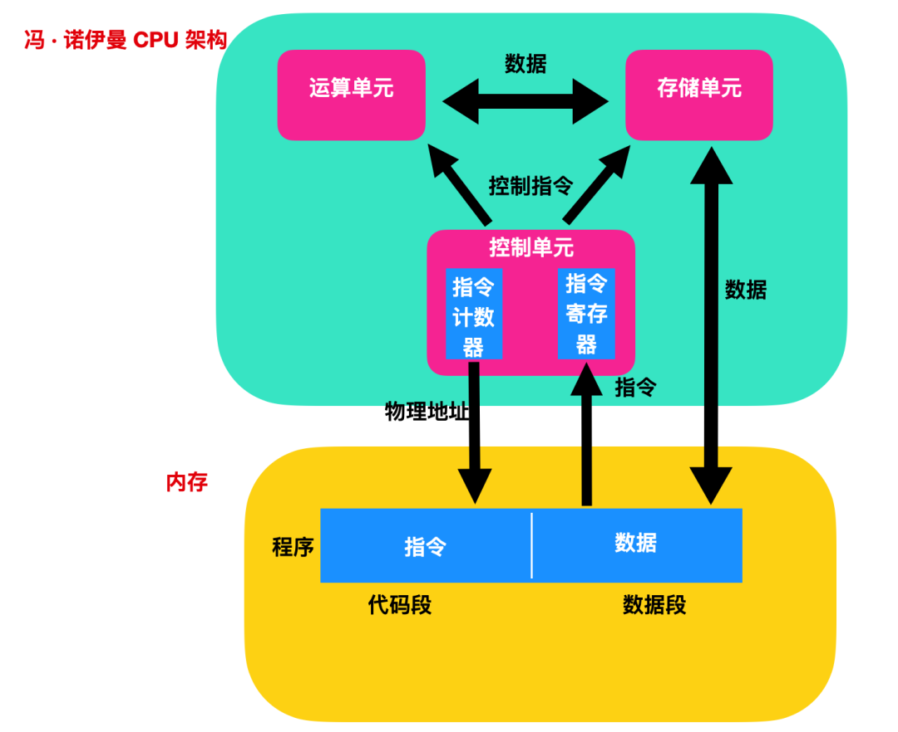
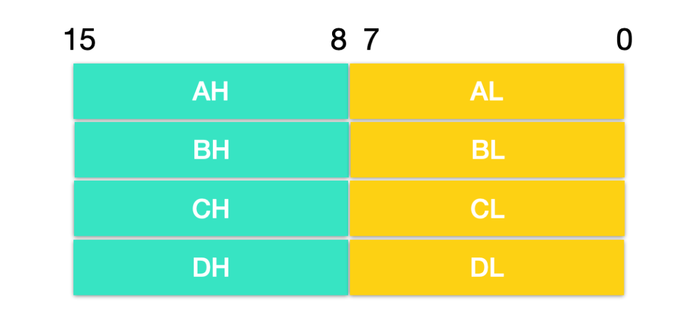
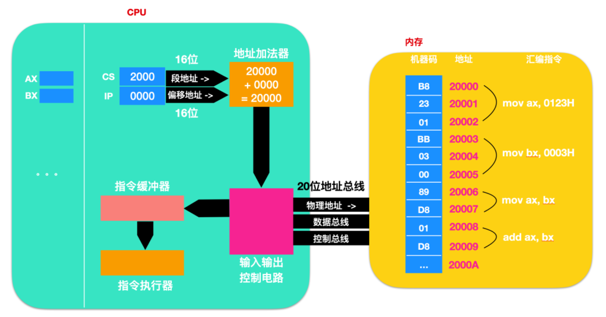

# 1.CPU架构


上图为冯·诺伊曼 CPU 结构，CPU 从逻辑上（并不是物理结构）可以分为 3 个模块，分别是**控制单元、运算单元和存储单元**，这三部分由 CPU 内部总线连接起来。

几乎所有的冯·诺伊曼型计算机的 CPU，其工作都可以分为5个阶段：「取指令、指令译码、执行指令、访存取数、结果写回」。

* 取指令阶段是将内存中的指令读取到 CPU 中寄存器的过程，程序寄存器用于存储下一条指令所在的地址；
* 指令译码阶段，在取指令完成后，立马进入指令译码阶段，在指令译码阶段，指令译码器按照预定的指令格式，对取回的指令进行拆分和解释，识别区分出不同的指令类别以及各种获取操作数的方法；
* 执行指令阶段，译码完成后，就需要执行这一条指令了，此阶段的任务是完成指令所规定的各种操作，具体实现指令的功能；
* 访问取数阶段，根据指令的需要，有可能需要从内存中提取数据，此阶段的任务是：根据指令地址码，得到操作数在主存中的地址，并从主存中读取该操作数用于运算；
* 结果写回阶段，作为最后一个阶段，结果写回（Write Back，WB）阶段把执行指令阶段的运行结果数据写回到 CPU 的内部寄存器中，以便被后续的指令快速地存取；

# 2 寄存器

寄存器属于 CPU 架构中的存储单元，以 intel 8086 处理器为例来进行探讨，8086 处理器是 x86 架构的前身。在 8086 后面又衍生出来了 8088 。

在 8086 CPU 中，地址总线达到 20 根，因此最大寻址能力是 2^20 次幂也就是 1MB 的寻址能力，8088 也是如此。

在 8086 架构中，所有的内部寄存器、内部以及外部总线都是 16 位宽，可以存储两个字节，因为是完全的 16 位微处理器。8086 处理器有 14 个寄存器，每个寄存器都有一个特有的名称，即

「AX，BX，CX，DX，SP，BP，SI，DI，IP，FLAG，CS，DS，SS，ES」

这 14 个寄存器又可以进行具体的划分，按照功能可以分为三种

* 通用寄存器
* 控制寄存器
* 段寄存器

下面我们分别介绍一下这几种寄存器

## 2.1 通用寄存器

**通用寄存器**主要有四种，即 「AX、BX、CX、DX」。 同样的，这四个寄存器也是 16 位的，能存放两个字节。AX、BX、CX、DX 这四个寄存器一般用来存放数据，也被称为**数据寄存器**。

8086 CPU 的上一代处理器是 8080 ，它是一类 8 位的 CPU，为了保证兼容性，8086 在 8080 上做了很小的修改，8086 中的通用寄存器 AX、BX、CX、DX 都可以独立使用两个 8 位寄存器来使用。

在细节方面，AX、BX、CX、DX 可以再向下进行划分

* AX(Accumulator Register) ：累加寄存器，它主要用于输入/输出和大规模的指令运算。
* BX(Base Register)：基址寄存器，用来存储基础访问地址
* CX(Count Register)：计数寄存器，CX 寄存器在迭代的操作中会循环计数
* DX(data Register)：数据寄存器，它也用于输入/输出操作。它还与 AX 寄存器以及 DX 一起使用，用于涉及大数值的乘法和除法运算。
  
这四种寄存器可以分为上半部分和下半部分，用作八个 8 位数据寄存器

*「AX 寄存器可以分为两个独立的 8 位的 AH 和 AL 寄存器；」
*「BX 寄存器可以分为两个独立的 8 位的 BH 和 BL 寄存器；」
*「CX 寄存器可以分为两个独立的 8 位的 CH 和 CL 寄存器；」
*「DX 寄存器可以分为两个独立的 8 位的 DH 和 DL 寄存器；」

除了上面 AX、BX、CX、DX 寄存器以外，其他寄存器均不可以分为两个独立的 8 位寄存器。



AX 的低位（0 - 7）位构成了 AL 寄存器，高 8 位（8 - 15）位构成了 AH 寄存器。AH 和 AL 寄存器是可以使用的 8 位寄存器，其他同理。

寄存器的存储方式是先存储低位，如果低位满足不了就存储高位，如果低位能够满足，高位用 0 补全，在其他低位能满足的情况下，其余位也用 0 补全。

8086 CPU 可以一次存储 16 位的数据

* 字(word)：字是由指令集或处理器硬件一次能够处理的数据大小，对于 8086 来说，一个字长就是两个字节，即16位。字是计算机一个非常重要的特征，针对不同的指令集架构来说，计算机一次处理的数据也是不同的。也就是说，针对不同指令集的机器，一次能处理不用的字长，有 16 位、32位、64位等。

### 2.1.1 AX 寄存器

AX 的另外一个名字叫做累加寄存器或者简称为累加器，其可以分为 2 个独立的 8 位寄存器 AH 和 AL；在编写汇编程序中，AX 寄存器是使用频率最高的寄存器。

下面是几段汇编代码

```javascript
mov ax,20   /* 将 20 送入寄存器 AX*/
mov ah,80   /* 将 80 送入寄存器 AH*/
add ax,10   /* 将寄存器 AX 中的数值加上 8 */
```
这里注意下：上面代码中出现的是 ax、ah ，而注释中确是 AX、AH ，其实含义是一样的，不区分大小写。

AX 相比于其他通用寄存器来说，有一点比较特殊，AX 具有一种特殊功能的使用，那就是使用 DIV 和 MUL 指令式使用。

* DIV 是 8086 CPU 中的除法指令。
* MUL 是 8086 CPU 中的乘法指令。

### 2.1.2 BX 寄存器

BX 被称为**数据寄存器**，表明其能够暂存一般数据。同样为了适应以前的 8 位 CPU ，而可以将 BX 当做两个独立的 8 位寄存器使用，即有 BH 和 BL。BX 除了具有暂存数据的功能外，还用于**寻址**，即寻找物理内存地址。BX 寄存器中存放的数据一般是用来作为**偏移地址**使用的，偏移地址是在基址地址上的偏移。基址地址是在段寄存器中存储的，关于段寄存器的介绍，我们后面再说。

### 2.1.3 CX 寄存器

CX 也是数据寄存器，能够暂存一般性数据。同样为了适应以前的 8 位 CPU ，而可以将 CX 当做两个独立的 8 位寄存器使用，即有 CH 和 CL。除此之外，CX 也是有其专门的用途的，CX 中的 C 被翻译为 Counting 也就是计数器的功能。当在汇编指令中使用循环 LOOP 指令时，可以通过 CX 来指定需要循环的次数，每次执行循环 LOOP 时候，CPU 会做两件事

* 一件事是 CX 中的值自动减 1
* 然后就是判断 CX 中的值，如果 CX 中的值为 0 则会跳出循环，而继续执行循环下面的指令，当然如果 CX 中的值不为 0 ，则会继续执行循环中所指定的指令 。

### 2.1.4 DX 寄存器

DX 也是数据寄存器，能够暂存一般性数据。同样为了适应以前的 8 位 CPU ，DX 的用途其实在前面介绍 AX 寄存器时便已经有所介绍了，那就是支持 MUL 和 DIV 指令。同时也支持数值溢出等。

## 2.2 段寄存器和索引寄存器

CPU 包含四个段寄存器，用作程序指令，数据或栈的基础位置。实际上，对 IBM PC 上所有内存的引用都包含一个段寄存器作为基本位置。

段寄存器主要包含

* CS(Code Segment) ：代码寄存器，程序代码的基础位置
* DS(Data Segment)：数据寄存器，变量的基本位置
* SS(Stack Segment)：栈寄存器，栈的基础位置
* ES(Extra Segment)：其他寄存器，内存中变量的其他基本位置。

索引寄存器主要包含段地址的偏移量，索引寄存器主要分为

* BP(Base Pointer)：基础指针，它是栈寄存器上的偏移量，用来定位栈上变量
* SP(Stack Pointer): 栈指针，它是栈寄存器上的偏移量，用来定位栈顶
* SI(Source Index): 变址寄存器，用来拷贝源字符串
* DI(Destination Index): 目标变址寄存器，用来复制到目标字符串

### 2.2.1 DS 寄存器

CPU 在读写一个内存单元的时候，需要知道这个内存单元的地址。 DS 寄存器通常用来存放访问数据的段地址。如果想要读取一个 10000H 的数据，需要下面这段代码

```javascript
mov bx,10000H
mov ds,bx
mov a1,[0]
```
上面这三条指令就把 10000H 读取到了 a1 中。

在上面汇编代码中，mov 指令有两种传送方式

* 一种是把数据直接送入寄存器
* 一种是将一个寄存器的内容送入另一个寄存器

### 2.2.2 SS 和 SP 寄存器

8086 CPU 有一组关于栈的寄存器 SS 和 SP。SS 是段寄存器，它存储的是栈的基础位置，也就是栈底的位置，而 SP 是栈指针，它存储的是偏移地址。在任意时刻，SS:SP 都指向栈顶元素。push 和 pop 指令执行时，CPU 从 SS 和 SP 中得到栈顶的地址。

需要注意的是，8086 CPU 不会保证栈顶越界问题，也就是说 8086 CPU 只会告诉你栈顶在哪，并不会知道栈空间有多大，所以需要程序员自己手动去保证。。。。


## 2.3 状态和控制寄存器

就剩下两种寄存器还没聊了，这两种寄存器是指令指针寄存器和标志寄存器：

* IP(Instruction Pointer)：指令指针寄存器，它是从 Code Segment 代码寄存器处的偏移来存储执行的下一条指令
* FLAG : Flag 寄存器用于存储当前进程的状态，这些状态有
  * 位置 (Direction)：用于数据块的传输方向，是向上传输还是向下传输
  * 中断标志位 (Interrupt) ：1 - 允许；0 - 禁止
  * 陷入位 (Trap) ：确定每条指令执行完成后，CPU 是否应该停止。1 - 开启，0 - 关闭
  * 进位 (Carry) : 设置最后一个无符号算术运算是否带有进位
  * 溢出 (Overflow) : 设置最后一个有符号运算是否溢出
  * 符号 (Sign) : 如果最后一次算术运算为负，则设置  1 = 负，0 = 正
  * 零位 (Zero) : 如果最后一次算术运算结果为零，1 = 零
  * 辅助进位 (Aux Carry) ：用于第三位到第四位的进位
  * 奇偶校验 (Parity) : 用于奇偶校验

在 8086 CPU 中，由 CS:IP 指向的内容当作指令执行。如下图所示，下面这幅图的段地址和偏移地址分别是 2000 和 0000，当这两个地址进入地址加法器后，会由地址加法器负责将这两个地址转换为物理地址



然后地址加法器负责将指令输送到输入输出控制电路中，输入输出控制电路将 20 位的地址总线送到内存中，然后取出对应的数据，也就是 「B8、23、01」。控制输入/输出电路会将 B8 23 01 送入指令缓存器中。此时这个指令就已经具备执行条件，此时 IP 也就是指令指针会自动增加。我们上面说到 IP 其实就是从 CS 处偏移的地址，也就是偏移地址。它会知道下一个需要读取指令的地址。在这之后，指令执行执行取出的 B8 23 01 这条指令。然后下面再把 2000 和 0003 送到地址加法器中再进行后续指令的读取。

* B8 操作码：在 8086 CPU 中，操作码 B8 是 MOV 指令的一种形式，用于将一个 16 位的立即数（也可以看成是一个操作数）传送到 AX 寄存器中。B8操作码后面紧跟着的是一个2个字节的立即数，表示要传送的值。上述中的「B8、23、01」就是将值 0x0123 传送到 AX 寄存器中。一般来说上述的操作需要两次取值，第一次取 B8 指令，CPU 读取 B8 指令后再去内存中读取另外的 16 位数据进行操作。在执行完上述操作后，IP 寄存器的值便会跳转到 +16 的位置。

通过对上面的描述，我们能总结一下 8086 CPU 的工作过程

* 段寄存器提供段地址和偏移地址给地址加法器
* 由地址加法器计算出物理地址通过输入输出控制电路将物理地址送到内存中
* 提取物理地址对应的指令，经由控制电路取回并送到指令缓存器中
* IP 继续指向下一条指令的地址，同时指令执行器执行指令缓冲器中的指令


参考：
1. https://cloud.tencent.com/developer/article/1758806