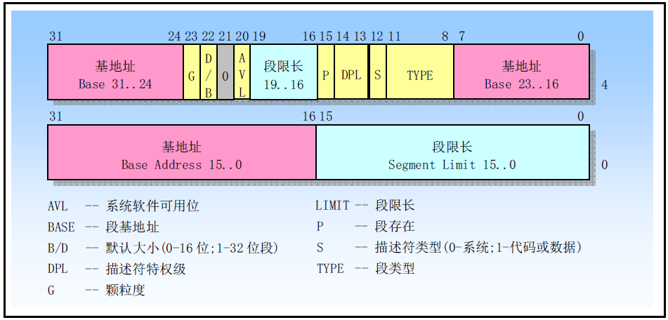

# 1.分段机制

80386虚拟地址空间中的虚拟地址（逻辑地址）由一个段部分和一个偏移部分组成。**段**是虚拟地址到线性地址转换机制的基础。每个段由三个参数定义：

* 段基地址（Base Address），指定段在线型地址空间中的开始地址。基地址是线性地址，对应于段中偏移0处；
* 段限长（limit），是虚拟地址空间中段内最大可用偏移位置。它定义了段的长度。
* 段属性（Attributes），指定段的特性。例如该段是否可读、可写或者可以作为一个程序执行，还有段的特权级等。

## 1.1 段描述符

**段描述符**（Segment Descriptor）是x86架构中用来描述段的数据结构。段描述符包含了该段的基地址、段限长、段属性等信息，操作系统利用这些信息来管理和保护内存，以及提供多任务支持。每个段描述符的长度是8字节（64位），在逻辑地址到线性地址的转换映射过程中会使用这个段描述符。

段描述符也称为全局描述符表项（Global Descriptor Table Entry，GDT Entry），存储在全局描述符表（Global Descriptor Table，GDT）或局部描述符表（Local Descriptor Table，LDT）中。在保护模式下，CPU可以通过段选择符（Segment Selector）在GDT或者LDT中选择相应的描述符。

为了把逻辑地址转换成一个线性地址，处理器会执行以下操作：

* 使用段选择符中的偏移值（段索引）在GDT或者LDT表中定位相应的段描述符（仅当一个新的段选择符加载到段寄存器中时才需要这一步）。
* 利用段描述符检验段的访问权限和范围，以确保该段是可访问的并且偏移量位于段界限内。
* 把段描述符中取得的段基地址加到偏移量上，最后形成一个线性地址。

## 1.2 段描述符表

段描述符表是段描述符的一个数组，描述符表的长度可变，最多可以包含8192个8字节描述符。有两种描述符表：全局描述符表GDT（Global Descriptor Table）和局部描述符表LDT（Local Descriptor Table）。

段描述符表（Segment Descriptor Table）是x86架构中用来存储和管理段描述符的数据结构。在保护模式下，CPU需要使用段描述符来访问内存中的代码和数据段，并根据段描述符中的各种属性进行内存保护。由于系统中有多个进程或线程，每个进程或线程都有自己的代码和数据段，因此需要使用不同的段描述符表来区分它们。

在x86架构中，存在全局描述符表（Global Descriptor Table，GDT）和局部描述符表（Local Descriptor Table，LDT）两种段描述符表。GDT是系统级别的描述符表，用于存储整个系统中所有进程或线程共享的描述符。而LDT是进程级别的描述符表，用于存储每个进程或线程独有的描述符。

处理器并不使用GDT中的第一个描述符，把这个“空描述符”的段选择符（即0b0000000000000000）加载进一个数据段寄存器（DS、ES、FS或GS）并不会产生一个异常，但是若使用这些加载了空描述符的段选择符访问内存时就会产生一般保护性异常。通过使用这个段选择符初始化段寄存器，那么意外引用未使用的段寄存器肯定会产生一个异常。

LDT表存放在LDT类型的系统段中，此时GDT必须含有LDT的段描述符。如果系统支持多LDT的话，那么每个LDT都必须在GDT中有一个段描述符和段选择符。一个LDT的段描述符可以存放在GDT表的任何地方。

## 1.3 段选择符

段选择符（Segment Selector）是x86架构中用于选择段描述符的一种机制。在保护模式下，每个段选择符都由一个13位的索引和3个特权级标志位组成，共16+3=19位。其中，索引用于在全局描述符表（Global Descriptor Table，GDT）或局部描述符表（Local Descriptor Table，LDT）中定位相应的段描述符，而特权级标志位则用于限制对该段的访问权限。

段选择符的组成：

* INDEX：在GDT数组或LDT数组的索引号
* TI：Table Indicator，这个值为0表示查找GDT，1则查找LDT
* RPL：请求特权级。以什么样的权限去访问段。

为减少地址转换时间和编程复杂性，处理器提供可存放最多6个段选择符的寄存器，即段寄存器。每个段寄存器支持特定类型的内存引用（代码、数据或堆栈）。原则上执行每个程序都起码需要把有效的段选择符加载到代码段（CS）、数据段（DS）和堆栈段（SS）寄存器中。处理器还另外提供三个辅助的数据段寄存器（ES、FS和GS），可被用于让当前执行程序能够访问其他几个数据段。

对于访问某个段的程序，必须已经把段选择符加载到一个段寄存器中。因此，尽管一个系统可以定义很多的段，但同时只有6个段可供立即访问，若要访问其他段就需要加载这些段的选择符。

另外，为了避免每次访问内存时都去引用描述符表，去读和解码一个段描述符，每个段寄存器都有一个“可见”部分和一个“隐藏”部分（隐藏部分也被称为描述符缓冲或者影子寄存器）。当一个段选择符被加载到一个段寄存器可见部分中时，处理器也同时把段选择符指向的段描述符中的段地址、段限长以及访问控制信息加载到段寄存器中的隐藏部分。缓冲在段寄存器中的信息使得处理器可以在进行地址转换时不再需要花费时间从段描述符中读取基地址和限长值。

由于影子寄存器含有描述符信息的一个拷贝，因此操作系统必须确保对描述符表的改动应反映在影子寄存器中，否则描述符表中一个段的基地址或者限长被修改过，但改动却没有反映到影子寄存器中。处理这种问题最简洁的方法是在对描述符表中描述符做过任何改动之后就立刻重新加载6个段寄存器，这将把描述符表中的相应段信息重新加载到影子寄存器中。

