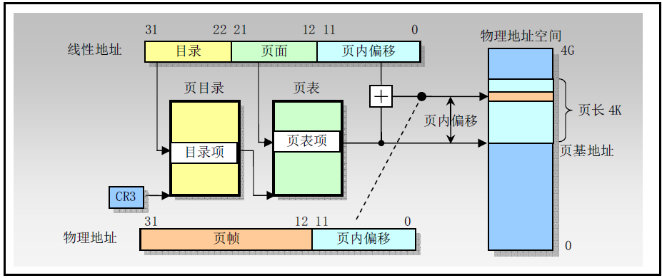
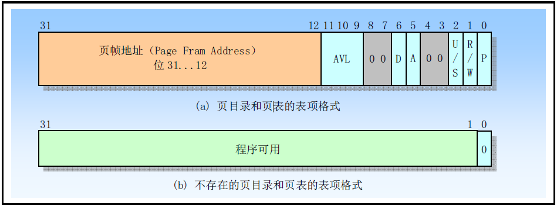

# 1.分页机制

80X86使用4K字节固定大小的页面，每个页面是4KB，并且对齐于4K地址边界处，这表示分页机制把4GB的线性地址空间划分为2^20个页面。由于4K大小的页面作为一个单元进行映射，并且对齐于4K边界，因此线性地址的低12比特位可作为页内偏移量直接作为物理地址的低12位。分页机制的重定位功能可以看作是把线性地址的高20位转换到对应物理地址的高20位。

处理器用于把线性地址转换成物理地址和可用于产生页错误异常的信息包含在存储于内存中的页目录和页表中。为了减少地址转换所要求的总线周期数量，最近访问的页目录和页表会被存放在处理器的缓冲器件中，该缓冲器件被称为转换查找缓冲器TLB（Translation Lookaside Buffer）。TLB可以满足大多数读页目录和页表的请求而无需使用总线周期，只有当TLB中不包含要求的页表项时才会使用额外的总线周期从内存中读取页表项，这通常在一个页表项很长时间没有访问过时才会出现这种情况。

