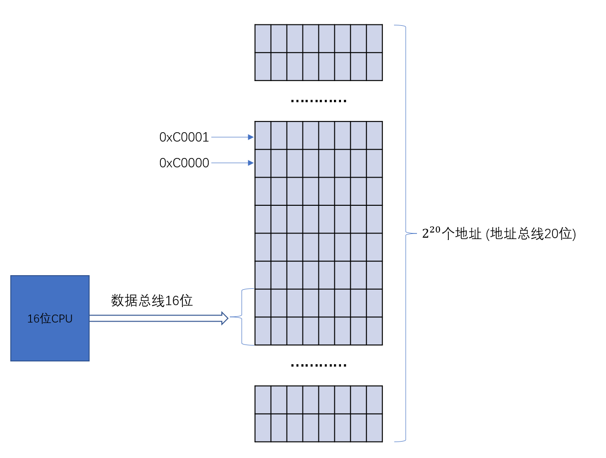

>mit6.828的系统启动分为两个部分，分别是BIOS和Boot Loader的启动。主机通电时，首先启动BIOS，BIOS将带领CPU识别并加载主板上的重要硬件和集成元件，如硬盘、显卡、声卡以及各种接口，然后按照预设顺序读取存储器上操作系统的引导文件Boot Loader。在我们的实验中，Boot Loader程序会在编译成可执行文件后被放在模拟硬盘的第一个扇区。

# 1.BIOS启动流程

BIOS(Basic Input Output System)"基本输入输出系统"，它是一组固化到主板上一个ROM芯片上的程序，使用汇编语言编写。PC通电后，CPU马上就从地址0xFFFF0处开始执行指令，这个地址在系统BIOS的地址范围内，将BIOS程序加载到内存中执行，BIOS接下来的作用包括机器自检，对系统进行初始化，识别并加载主板上的重要硬件和集成元件，如硬盘、显卡、声卡以及各种接口，然后按照**预设顺序**读取存储器上操作系统的引导文件Boot Loader，储存Boot Loader的存储器可以是软盘、硬盘、CD-ROM甚至是网络输入，可以在BIOS的设置页面更改读取Boot Loader的搜索顺序。

那么在这其中就有一个问题，那就是，BIOS程序是固化到自己的ROM芯片中的，那CPU是如何在刚通电的情况下就能读取到BIOS程序并且运行的？再者，上段的说法也有些问题，“CPU马上就从地址0xFFFF0处开始执行指令，这个地址在系统BIOS的地址范围内”，那地址0xFFFF0指的是什么地址？是外加内存条RAM的内存地址还是储存BIOS程序的ROM地址？这又涉及到现代PC的内存地址是如何编排的。我也是查了很多资料才摸到一些门道，下面的说法糅合了我从网上搜索的资料和自己的整合以及猜测，**不保证正确**，仅为缕清自己的思路：

在计算机通电完成之后，CPU会自动将其CS寄存器设定为0xFFFF，IP寄存器设定为0x0000。关于CS寄存器和IP寄存器的介绍可以看文末的链接6，简单来说CS是代码段寄存器，IP是指令指针寄存器(相当于偏移地址)，而CPU在访问内存的时候访问的是物理内存地址，而这个物理地址就是由CS和IP这两个寄存器中的值合成的(物理地址=段地址X16+偏移地址)。所以如果将CS寄存器设定为0xFFFF，IP寄存器设定为0x0000，那么这时的物理地址就=0xFFFF*16+0x0000=0xFFFF0，而在0xFFFF0存放的是什么呢？其实是一条无条件转移指令JMP，这个JMP会将程序跳转到BIOS真正的入口点。至于跳转到哪里，那么不同的BIOS会有不同的跳转地址。

* 20230505更新：在计算机系统中，每个存储设备都被赋予一段地址空间（也称为地址范围）。BIOS芯片和内存条都有自己的地址范围，在本实验中以及早期的计算机系统中，BIOS芯片的地址范围是 0xF0000 到 0xFFFFF。当计算机的内存大小突破 1M（即0XFFFFF上）之后，BIOS 的地址范围一直处于 CPU 能寻址的内存最高位置。例如在内存为 4G 的系统中，BIOS 的地址范围为 0xFFFFF0000 到 0xFFFFFFFF。在BIOS芯片和内存条之间有一个地址解码器，它可以根据地址指针将访问路由到正确的存储器位置。

* 值得注意的是，为了与初代机保存兼容，同时为了提高访问速度，现代计算机的 0xF0000 到 0xFFFFF 同样被保留为 BIOS 的空间区域，虽然在物理上它属于系统 RAM 空间，这段空间被称为 BIOS 的**影子区域**。而由于目前计算机中 BIOS 的容量大多已经超过了 64KB，所以在现代计算机启动时，首先在内存顶端的位置执行一部分 BIOS 程序（即不属于低端 64KB 位置的 BIOS 程序，使用 32 位大模式技术突破实模式），然后再将与初代机兼容的 64KB BIOS 代码和数据复制到内存低端 1M 末端的 64K 处，然后跳转到这个地方并且让 CPU 以实模式启动。


上图为8086的内存架构，我们来详细讨论一下：早期基于16位英特尔8086处理器的个人电脑，只能寻址1MB的物理内存。因此，早期计算机的物理地址空间将从0x00000000开始，以0x000FFFFF结束。用户能够使用的内存地址只有标记为“低内存”的640KB区域(Low Memory)，而之后从0x000A0000到0x00100000的384KB空间则被预留为硬件以及ROM的地址，用户不可用。具体可以看下图:


从上图可以看到，0xF0000到0x100000的地址范围便进入到了真正的BIOS的区域，而在这个区域中，BIOS又是以何种方式存在的呢？我们上面说到，计算机通电后，CPU会到0xFFFF0的位置执行，而0xFFFF0这个位置处在BIOS地址范围中，它只占0xFFFF0到0x100000短短的16B。这个地址处存放的只是一个跳转指令，它会将CPU跳转至真正的BIOS程序开始的位置，这个位置在不同的BIOS中是不同的。这里引用一个比较清晰的描述：

8086是16位的CPU，但是却有20根地址线。也就是说它可以寻址1MB内存空间。这段内存空间由RAM、ROM组成。ROM是随机只读存储器，里面的程序是在计算机出厂的时候直接烧录在里面的，完成一些主机自检等操作，并提供一些访问磁盘等基本输入输出服务，因而这段程序常被称为BIOS(Basic Input/Ouput Service)。由于不同的计算机厂商生产的计算机所带的外设不一样，因此，这段程序大小也限机型的不同而不一样，有可能A厂出产的计算机所带的这段程序的大小为1K，而B厂出产的这段程序的大小为2K。如果将这段程序放在0x0000处，那么用户写的程序就可能从0x0400处开始也可能从0x0800处开始，非常不统一。故而，将此段程序放在1M内存的顶部，那么用户写的程序就都可以从0x0000处开始了。

但将BIOS这段程序放在1M内存的顶部，如果这段程序大小为1K，那么应当从0xFFC00开始放。如果这段程序的大小为2K，那应当从0xFF800开始放，对于CPU而言，到底是应当从0xFFC00开始执行还是应当从0xFF800开始执行呢？为了解决这个问题，8086规定，CPU均从0xFFFF0处开始执行，而在0xFFFF0处，放一条无条件转移指令JMP。如果A厂的BIOS是从0xFFC00开始放的，那么这条转移指令就跳转到0xFFC00处开始执行。如果B厂的BIOS是从0xFF800开始放的，那么这条转移指令就跳转到0xFF800处开始执行，各个厂家可以根据自己所生产的BIOS程序的大小，来决定此转移指令具体跳转到的位置。

这里有一点需要清楚的是，通常认为，内存编址是连续的，不会出现空洞，其实完全不是这样。比如，假设BIOS的编址是从 0xF0000开始，而RAM，即通常讲的内存编址是从0x00000开始，那么，如果用户只安装了32K内存，那么内存的编址范围就是0x00000~0x07FFF，那么从0x08000至0xEFFFF处就没有安装内存，这就是一个内存空洞。


原文在[这里](https://www.cnblogs.com/wsw-seu/p/10475956.html)

>## 位数，地址总线以及寻址范围
>这里还需要解释一下处理器的位数，地址总线以及寻址范围的关系：处理器的位数指的是处理器能够一次性处理的数据大小，比如早期的16位Intel 8086处理器，它能够一次性处理的最大数据为$2^{16} = 65536$以内的数，而超过这个大小的数则需要分高低位来进行处理。还比如后来的32位Intel Pentium 4处理器，它能够一次性处理的最大数据为$2^{32}$以内的数，而现在大多数处理器已经是64位的了，这意味这它们能处理的最大数更大，运行速度更快；而地址总线便决定了寻址范围，比如8086是20位地址总线，则它的最大寻址地址便是$2^{20}B = 1MB$，目前大多数个人电脑的地址总线都是32位的，这意味着它们的最大寻址范围达到了$2^{32}B = 4GB$，下表是这三者之间的关系：

|           | Intel 8086  | Intel Pentium 4     | 新兴64位处理器  |
| :---:     |    :----:   |      :----:         |     :----:     |
| 字长      |      16     |         32          |        64      |
|数据总线    |      16     |         32          |        64      |
|地址总线    |      20     |         32          |        32      |
|寻址范围    |     1MB     |        4GB          |       4GB      |
>需要清楚的是，不管是8、16、32、64CPU，RAM存储器的地址分配永远是以字节为单位，也就是给每一个字节的存储单元分配一个地址。如果MCU有32条地址线，则最多有$2^{32} = 4G$个地址编码，给存储器中的每个字节单元一个地址编码，则最多可以支持$2^{32}Byte=4GB$。如果MCU的数据线是32位，则一次读写操作可以同时传送4个字节(一个字，32位机一个字是32位，也就是4个字节)，也就是4个连续地址的存储器空间(对齐，4倍数开始的连续的4个地址)。



# 2.Boot Loader
个人电脑的软盘和硬盘被分为一个个512B的区域，称为扇区。扇区是磁盘的最小传输粒度：每个读写操作必须是一个或多个扇区，并在扇区边界上对齐。Boot Loader程序代码所在的磁盘称为引导磁盘，它的第一个扇区称为引导扇区，因为这是引导加载程序代码所在的位置。而存放在第一个扇区的Boot Loader加载程序的大小不能超过510个字节，由于磁盘的一个扇区的大小为512字节，这样便保证了bootloader仅仅只占据磁盘的第一个扇区。

在经过BIOS对系统进行初始化之后，它会按照**预设顺序**读取存储器上操作系统的引导文件Boot Loader，将其加载到内存中进行读取。那么BIOS是如何寻找并且判断Boot Loader的位置呢？BIOS按顺序检查磁盘的第一个扇区，如果该扇区的最后两个字节是"55 aa"，那么这就是一个引导扇区，这个磁盘也就是一块可引导盘。通常这个大小为512B的程序就称为引导程序(Boot Loader)。如果最后两个字节不是"55 aa"，那么BIOS就检查下一个磁盘驱动器，这个检查顺序也是可以在BIOS中设置的。当BIOS找到可引导软盘或硬盘时，它将512字节的引导扇区加载到物理地址0x7c00到0x7dff的内存中，然后使用jmp指令将CS：IP设置为0000：7c00，将控制传递给引导加载程序。

至于为什么要将Boot Loader放到0x7c00处，是出于历史原因，IBM最早的个人电脑IBM PC 5150用的是Intel最早的个人电脑芯片8088，当时，搭配的操作系统是86-DOS。这个操作系统需要的内存最少是32KB。内存地址从0x0000开始编号，32KB的内存就是0x0000～0x7FFF。8088芯片本身预留了地址空间0x0000～0x03FF用来保存各种中断向量的储存位置。所以，内存只剩下0x0400～0x7FFF可以使用。为了把尽量多的连续内存留给操作系统，Boot Loader就被放到了内存地址的尾部。由于Boot Loader所在的这个扇区是512字节，另外Boot Loader数据和栈需要预留512字节。所以，Boot Loader加载位置是0x7FFF - 512 - 512 + 1 = 0x7c00，而且因为操作系统加载完成后Boot Loader不需要再使用，这部分内存之后操作系统是可以重复利用的。

在6.282实验中，我们所用的Boot Loader由一个程序集语言源文件boot/boot.S，和一个C源文件boot/main.c组成。实验中编译好的Boot Loader位于obj/boot/boot，我们可以使用vim打开它然后转换到16进制视图进行查看。

```JavaScript
00000000: fafc 31c0 8ed8 8ec0 8ed0 e464 a802 75fa  
00000010: b0d1 e664 e464 a802 75fa b0df e660 0f01 
........
000001e0: 0000 0000 0000 0000 0000 0000 0000 0000
000001f0: 0000 0000 0000 0000 0000 0000 0000 55aa 
```
可以看到，boot文件确实是以"55 aa"结尾的。

boot.S主要是将处理器从实模式转换到32位的保护模式，因为只有在保护模式中我们才能访问到物理内存高于1MB的空间。main.c的主要作用是将内核的可执行代码从硬盘镜像中读入到内存中，具体的方式是运用x86专门的I/O指令读取。

>## 实模式和保护模式
>
> 实模式采用 16 位寻址模式，在该模式中，最大寻址空间为 1MB 。由于处理器的设计需要考虑到兼容问题，8086处理器地址总线扩展到 20 位，但 CPU 的数据总线却只有 16 位，也就是说直接参与运算的数值都是16位的。但用16位的地址寻址1MB空间是不可能的。所以就要把内存分段，也就是把1MB空间分为2^4，即16个段，每段不超过64KB（2^16,16位数据线就可以寻址）。在8086中设置4个16位的段寄存器，用于管理4种段：CS是代码段，DS是数据段，SS是堆栈段，ES是附加段。把内存分段后，每一个段就有一个段基址，段寄存器保存的就是这个段基址的高16位，这个16位的地址左移四位（后面加上4个0）就可构成20位的段基址。
> 
> 例如，我想寻址 0xfe05b 的内存地址，但是我的 16 位 CPU 最大只能接受 0xffff 的数值，于是在寻址时我向地址总线的高 16 位输出段基址 0xf000，然后再向地址总线的低 16 位输出段偏移 0xe05b ，这样我就可以寻址到 16 * 0xf000 + 0xe05b = 0xfe05b 的内存地址。
```
实际物理地址 = (段寄存器 << 4) + 偏移地址 
```
> 
> 在保护模式下，段寄存器里面放的不再是**段基址**，而是**段选择子**。保护模式下段式寻址可用 xxxx:yyyyyyyy 表示。其中xxxx表示索引，也就是段选择子，是 16 位的。 yyyyyyyy 是偏移量，是 32 位的。
> 
> 分段机制是利用段选择子到全局描述符表（GDT）中找到需要的**段描述符**，而这个段描述符中就存放着真正的**段基址**（除了段基址外段描述符中还存放着其他信息，比如描述符优先级等），然后再加上偏移地址量便得到了最后的物理地址。
>
> 在查询 GDT 期间可能还会有特权级检查等等，因为增加了段描述符这一层，所以安全，是为保护模式。
> 
> 需要指出的是，在 32 位平台上，段物理首地址和偏移址都是 32 位的，实际物理地址的计算不再需要将段首地址左移 4 位了，直接相加即可，如果发生溢出的情况，则将溢出位舍弃。
>
> 现在我们可以来还原一下内存寻址的过程：当我们在程序中制定一个指针时，通常指针的地址形式为 yyyyyyyy，是 32 位的，这个地址就是上述的**段内偏移**，然后再根据段寄存器中存放的**段选择子**在 GDT 中找到相应的**段基址**，段基址加上段内偏移形成的地址称作**线型地址**，而 xxxx:yyyyyyyy 形式的段选择子：段内偏移称作**逻辑地址**，再将线性地址交由 mmu 进行翻译，我们就得到了真正的**物理地址**。


*boot/Makefrag* 这个文件包含几个命令，作用是生成 *obj/boot/* 目录下面的几个文件，该目录下 *boot.out* 是由 *boot/boot.S* 和 *boot/main.c*编译链接后生成的 ELF 可执行文件，而 *boot.asm* 是从可执行文件 *boot.out* 反编译的包含源码的汇编文件，而最后通过 objcopy 拷贝 *boot.out*中的 *.text* 代码节生成最终的二进制引导文件 *boot* (380个字节)，最后通过 sign.pl这个perl脚本填充 *boot* 文件到512字节（最后两个字节设置为 55 aa，代表这是一个引导扇区）。编译好的内核位于 obj/kern/kernel，最终生成的镜像文件在 *obj/kern/kernel.img*，它大小为5120000字节，即10000个扇区大小。第一个扇区写入的是 *obj/boot/boot*，第二个扇区开始写入的是 *obj/kern/kernel*。

关于ELF文件我们这里做一个简单介绍，当编译和链接一个C程序时，编译器将每个 *.c* 文件转换成一个 *.o* 对象文件，该文件包含以硬件期望的二进制格式编码的汇编语言指令。然后，链接器将所有 *.o* 对象文件合并成一个二进制映像，如*obj/kern/kernel*，这就是ELF文件，意思是“可执行和可链接格式”("Executable and Linkable Format")。

ELF可执行文件是由 ELF文件头、程序头表(program header table)、节头表(section header table)和文件内容四部分组成的。而文件内容部分又由.text 节、.rodata 节、.stab 节、.stabstr 节、.data 节、.bss 节、.comment 节等部分组成。在这里我们只对以下几个部分感兴趣：

```javascript
.text: 程序的可执行指令
.rodata: 只读数据，例如由C编译器生成的ASCII码。
.data: 包含程序的初始化数据，例如使用 int x = 5 声明的全局变量；
```

当链接器计算程序的内存布局时，它会在.bss节中为未初始化的全局变量保留空间，如 `int x;`，c程序默认未初始化的全局变量值为零。因此，不需要在ELF二进制文件中存储.bss的内容，只是记录了.bss部分的地址和大小。

可以使用 objdump 命令查看 ELF 文件的节信息：
```javascript
$ objdump -h obj/boot/boot.out

obj/boot/boot.out:     file format elf32-i386

Sections:
Idx Name          Size      VMA       LMA       File off  Algn
  0 .text         0000019c  00007c00  00007c00  00000074  2**2
                  CONTENTS, ALLOC, LOAD, CODE
  1 .eh_frame     0000009c  00007d9c  00007d9c  00000210  2**2
                  CONTENTS, ALLOC, LOAD, READONLY, DATA
  2 .stab         00000870  00000000  00000000  000002ac  2**2
                  CONTENTS, READONLY, DEBUGGING
  3 .stabstr      00000940  00000000  00000000  00000b1c  2**0
                  CONTENTS, READONLY, DEBUGGING
  4 .comment      0000002a  00000000  00000000  0000145c  2**0
                  CONTENTS, READONLY

$ objdump -h obj/kern/kernel

obj/kern/kernel:     file format elf32-i386

Sections:
Idx Name          Size      VMA       LMA       File off  Algn
  0 .text         00001acd  f0100000  00100000  00001000  2**4
                  CONTENTS, ALLOC, LOAD, READONLY, CODE
  1 .rodata       000006bc  f0101ae0  00101ae0  00002ae0  2**5
                  CONTENTS, ALLOC, LOAD, READONLY, DATA
  2 .stab         00004291  f010219c  0010219c  0000319c  2**2
                  CONTENTS, ALLOC, LOAD, READONLY, DATA
  3 .stabstr      0000197f  f010642d  0010642d  0000742d  2**0
                  CONTENTS, ALLOC, LOAD, READONLY, DATA
  4 .data         00009300  f0108000  00108000  00009000  2**12
                  CONTENTS, ALLOC, LOAD, DATA
  5 .got          00000008  f0111300  00111300  00012300  2**2
                  CONTENTS, ALLOC, LOAD, DATA
  6 .got.plt      0000000c  f0111308  00111308  00012308  2**2
                  CONTENTS, ALLOC, LOAD, DATA
  7 .data.rel.local 00001000  f0112000  00112000  00013000  2**12
                  CONTENTS, ALLOC, LOAD, DATA
  8 .data.rel.ro.local 00000044  f0113000  00113000  00014000  2**2
                  CONTENTS, ALLOC, LOAD, DATA
  9 .bss          00000648  f0113060  00113060  00014060  2**5
                  CONTENTS, ALLOC, LOAD, DATA
 10 .comment      0000002a  00000000  00000000  000146a8  2**0
                  CONTENTS, READONLY
```

上面列出的*Size、VMA、LMA、File off*分别表示节的大小，虚拟地址(Virtual Memory Address)、装载地址(Load Memory Address)以及节的偏移量。VMA是指编译器指定代码和数据所需要放置的内存地址，由链接器配置；而LMA是指程序被实际加载到内存的位置。在上图中可以看到，Boot Loader的VMA和LMA都是 0x7c00，而kernel的VMA和LMA却不相同。

> ## LMA和VMA
> LMA: 加载地址，如加载到RAM中等，在嵌入式中，有可能是在ROM中（这时LMA!=VMA）
> 
> VMA: 虚拟地址，就是程序运行时的地址，一般就是内存地址，如要把ROM中的数据加载到RAM中运行
> 
> 可执行目标文件都有两个地址，就是LMA和VMA。
> LMA就是程序期望的运行地址，把可执行目标文件从硬盘里面，搬到内存里去，然后才能运行。而这里的装载，就是对应这个意思。而VMA简单说就是，程序运行时候的所对应的地址。此处虚拟，一般来说，指的是启用了MMU之后，才有了虚拟地址和实地址。此处，我们可以简单的理解为内存的实际地址。程序运行前，要把程序的内容，拷贝到对应的内存地址处，然后才能运行的。因此，一句话总结就是：代码要运行的时候，此时对应的地址，就是VMA。在多数情况下，LMA和VMA是相等的。如果发现VMA!=LMA, 即 程序运行时候的地址，和刚刚把程序内容拷贝到的地址LMA，两者不一样，那么就要把对应的内容，此处主要是data，数据段的内容，从刚刚装载到的位置，LMA处，拷贝到VMA处，这样，程序运行的时候，才能够在执行的时候，找到对应的VMA处的变量，才能找到对应的值，程序才能正常运行。更详细的解释可以看[这里](https://blog.csdn.net/suz_cheney/article/details/24586745)。

Boot Loader的VMA和LMA是一样的，都是0x7c00。而Kernel的VMA和LMA却是不一样的。VMA是 0xf0100000，LMA地址是0x00100000，也就是说Kernel加载到了内存中的 0x00100000 这个低地址处，但是却期望在一个高地址 0xf0100000 执行，为什么要这么做呢？这是因为我们的内核通常期望运行在一个高的虚拟地址，以便把低位的虚拟地址空间让给用户程序使用。但是，以前的机器通常没有 0xF0100000 这么大的物理内存，这时候就需要通过处理器的内存管理硬件来将 0xf0100000 映射到 0x00100000，我们将在后面详细讨论。

在JOS中，Boot Loader的VMA是在 *boot/Makefrag*里面定义的，为 0x7c00，这是Boot Loader期望执行的地址。而BIOS也正是把Boot Loader装载到 0x7c00 地址处的，所以Boot Loader的VMA和LMA是一致的。如果我们在 *boot/Makefrag*文件中更改 0x7c00 为其它地址，Boot Loader在执行的过程中便会出错。

此外在ELF文件头中还有一个重要的字段，名为e_entry，此字段包含程序的入口地址(VMA)：程序期望开始执行的内存地址。例如，可以使用以下命令查看Kernel的入口地址：

```JavaScript
$ objdump -f obj/kern/kernel

obj/kern/kernel:     file format elf32-i386
architecture: i386, flags 0x00000112:
EXEC_P, HAS_SYMS, D_PAGED
start address 0x0010000c
```
注意，入口地址不等于程序在内存中开始的地址，只是程序开始执行的地址。入口地址之前还有一段地址存储了程序的其他内容。


# 3.Kernel

上一节我们说到过，Boot Loader的VMA和LMA都是 0x7c00，而Kernel的VMA和LMA却是不一样的，VMA是 0xf0100000，LMA地址是0x00100000，也就是说Kernel加载到了内存中的 0x00100000 这个低地址处，但是却期望在一个高地址 0xf0100000 执行，高地址和底地址的转换是由处理器的内存管理硬件来实现的。

物理地址 0xf0100000 要求至少3.75GB的内存，这在早期时候的PC上是达不到的。所以，我们将使用处理器的内存管理硬件将虚拟地址0xf0100000（内核代码希望运行的地址）映射到物理地址 0x00100000 处(Boot Loader将内核实际加载到的地址)。0x00100000 地址对应的内存大小是1MB，看看上面8086的内存分布图，所以内核实际上是被加载到了BIOS的上方。

在下一个实验中，我们将整个电脑底部256MB的物理地址空间，即从物理地址0x000000000到0x0fffffff，映射到虚拟地址0xf0000000到0xffffffff。现在，我们只需映射4MB的物理内存，这将足以让我们启动和运行内核。我们使用在 *kern/entrypgdir.c* 中一个手写的、静态初始化的页目录和页表项来实现这个映射。我们不需要知道实现细节，只需要知道，在*kernel/entry.S* 设置cr3寄存器的值为页目录的物理地址后，虚拟地址映射(分页)就开启了。在这之前，所有的内存引用都指的是真正的物理地址，而在开启分页之后，内存引用是由虚拟内存，这个虚拟地址可以由内存管理硬件转换为真正的物理地址。而 *kern/entrypgdir.c* 这个文件中的页目录和页表项便将 0xf0000000:0xf0400000 这个虚拟地址范围映射至物理地址 0x00000000:0x00400000，而虚拟地址 0x00000000:0x00400000 也映射到了物理地址 0x00000000:0x00400000。任何不在这两个范围中的虚拟地址都将导致硬件异常，由于我们尚未设置中断处理，这将导致QEMU转储机器状态并退出。

> 临时页表只创建了两项，将虚拟地址的[0,4M)和[0xF0000000,0xF0000000+4M)映射到物理地址[0,4M)，这个临时页表是手写的，在 kern/entrypgdir.c 中。具体实现跟正常分页机制相似，不同的是一级页表（相当于 pgdir）只实现了两项，每一项是 4MB，核心代码如下：

```javascript
pde_t entry_pgdir[NPDENTRIES] = {
	// Map VA's [0, 4MB) to PA's [0, 4MB)
	[0]
		= ((uintptr_t)entry_pgtable - KERNBASE) + PTE_P,
	// Map VA's [KERNBASE, KERNBASE+4MB) to PA's [0, 4MB)   PDXSHIFT=22
	[KERNBASE>>PDXSHIFT]
		= ((uintptr_t)entry_pgtable - KERNBASE) + PTE_P + PTE_W
};
```
> [0xF0000000,0xF0000000+4M)也就是[0xF0000000,0xF0400000)，其中前 10 位都是相同的，所以在[0xF0000000,0xF0400000)范围内寻址时，一级页表都会来到 [KERNBASE>>PDXSHIFT] 项，而两个一级页表项都指向同一个二级页表，所以实现了虚拟地址的[0,4M)和[0xF0000000,0xF0000000+4M)映射到物理地址[0,4M)。

## 3.1 在控制台显示输出
这里我们要完成cprintf函数，与printf函数不同，cprintf函数用于向当前窗口输出数据，printf是标准输出，就是指可以完全不知道你输出的对象，只是以标准的文本流方式输出，cprintf是与终端相关的，要用到一些系统平台，硬件设备相关的特性，所以可以有颜色和格式等很多选项可供选择，但同时也削弱了移植性。前者无可移植性，而后者是标准的。

这里我们来看一下几个跟cprintf函数相关的文件，*kern/console.c* 这个文件实现了cputchar，getchar等函数，而cputchar函数最终调用了cga_putc函数来完成显示功能。*lib/printfmt.c* 这个文件实现了vprintfmt函数，vprintfmt函数是一个最精简的原始printf函数，它会被printf, sprintf, fprintf等函数调用，是一个既被内核使用也被用户使用的函数。而cprintf是在 *kern/printf.c* 中实现的，它调用了vprintfmt函数，而vprintfmt函数调用了putch函数作为参数，putch函数最终调用了console.c中的cputchar。即 cprintf --> vprintfmt --> putch --> cputchar --> cga_putc。

查看 *kern/init.c* 文件，里面有一行：
```JavaScript
cprintf("6828 decimal is %o octal!\n", 6828);
```
这段代码是将十进制6828以八进制的形式打印出来，由于八进制的输出是lab1的一个作业，这部分需要我们自己去实现，所以在初始情况下会产生如下输出：
```JavaScript
6828 decimal is XXX octal!
```
而当我们完成了8进制的输出后，上面那句输出会变成：
```JavaScript
6828 decimal is 15254 octal!
```

打开 *kern/monitor.c* 文件，在monitor函数内插入以下内容：
```JavaScript
int x = 1, y = 3, z = 4;
cprintf("x %d, y %x, z %d\n", x, y, z);
```
在系统执行到上述语句的时候，在cprintf, cons_putc, va_arg, 和 vcprintf 这几个函数处打上断点：
```JavaScript
(gdb) b cprintf
(gdb) b cons_putc
(gdb) b va_arg
(gdb) b vcprintf
```

观察接下来的输出：

```JavaScript
cprintf (fmt=0xf0101e2e "x %d, y %x, z %d\n")
vcprintf (fmt=0xf0101e2e "x %d, y %x, z %d\n", ap=0xf010ff54 "\001") 
cons_putc (c=-267321572)
cons_putc (c=-267321572) 
cons_putc (c=-267384258) 
cons_putc (c=-267321572)
cons_putc (c=-267321572) 
cons_putc (c=-267321572) 
cons_putc (c=-267321572) 
cons_putc (c=-267384258) 
cons_putc (c=-267321572) 
cons_putc (c=-267321572) 
cons_putc (c=-267321572) 
cons_putc (c=-267321572) 
cons_putc (c=-267384258) 
cons_putc (c=-267321572) 
cprintf (fmt=0xf0102017 "%s") 
vcprintf (fmt=0xf0102017 "%s", ap=0xf010ff24)
cons_putc (c=-267321620) 
cons_putc (c=-267321620) 
cons_putc (c=-267321620) 
```

## 3.2 函数调用堆栈

要搞清楚函数调用堆栈的原理，首先需要知道 esp 和 ebp 这两个寄存器，esp 指向栈顶，ebp 指向栈底，还有一个eip指向的是执行函数调用的入口地址，具体可参阅[这里](https://www.jianshu.com/p/8ec9063a37bd)。现在让我们来看看在JOS中是怎么对栈定义的。

在 *kern/entry.S* 文件中，77行处将一个宏变量 `bootstacktop` 的值赋值给了寄存器esp。而bootstacktop出现在bootstack下，bootstack出现在.data段下，这是数据段。可以肯定，这就是栈了。通过93行.space指令，在bootstack位置处初始化了KSTKSIZE这么多的空间。KSTKSIZE在inc/memlayout.h里面定义，是8*PGSIZE，而PGSIZE在inc/mmu.h中定义，值为4096。

接下来查看反汇编代码*obj/kern/kernel.asm*，58行处向 esp 中写入0xf011f000。这就是栈顶的位置，栈将向地址值更小的方向生长。

```JavaScript
	# Set the stack pointer
	movl	$(bootstacktop),%esp
f0100034:	bc 00 00 11 f0       	mov    $0xf0110000,%esp
```

1. https://pdos.csail.mit.edu/6.828/2018/labs/lab1/
2. https://www.jianshu.com/p/af9d7eee635e
3. https://blog.csdn.net/rongwenbin/article/details/18962057
4. https://baike.baidu.com/item/BIOS%E5%BD%B1%E5%AD%90%E5%86%85%E5%AD%98
5. https://blog.csdn.net/hwxlovezy/article/details/53454305
6. https://www.cnblogs.com/wsw-seu/p/10475956.html
7. https://blog.csdn.net/weixin_37924880/article/details/78644659
8. https://www.zhihu.com/question/311449926
9.  https://www.cnblogs.com/chanchan/p/7648490.html
10. https://blog.csdn.net/suz_cheney/article/details/24586745
11. https://blog.csdn.net/a1023182899/article/details/78162573
12. https://www.jianshu.com/p/8ec9063a37bd
13. https://www.jianshu.com/p/015f8e904a71