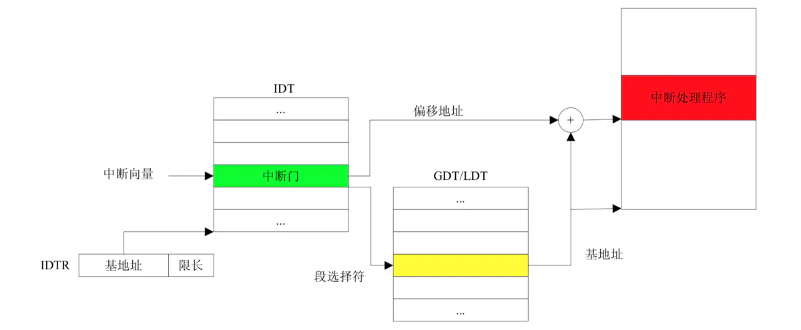
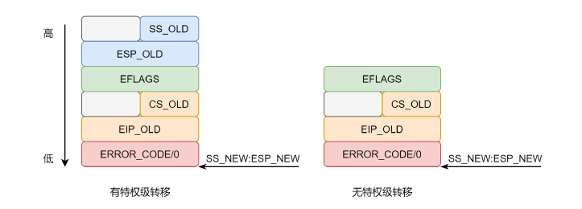
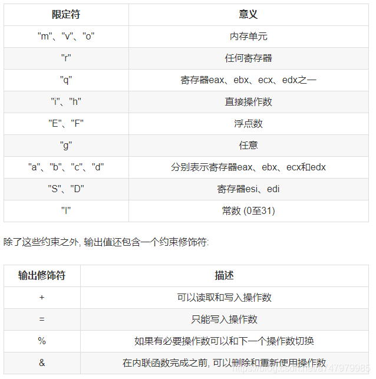

# 0.前言
在将lab2的代码merge到lab3的时候，发生了一点小插曲，导致lab2完成的代码在lab3中失效了，所幸最后解决了这个bug，所以这里专门开一个小节用来记录一下。
在应用git命令
```JavaScript
git merge lab2
```
合并分支之后，在之前lab2中完成的代码便被合并到了lab3中，但我在进行测试时，发现lab2的测试无法通过，会报以下错误：
```JavaScript
6828 decimal is 15254 octal!
Physical memory: 131072K available, base = 640K, extended = 130432K
end = :f0190000
kernel panic at kern/pmap.c:164: PADDR called with invalid kva 00000000
Welcome to the JOS kernel monitor!
Type 'help' for a list of commands.
```

重点是`kernel panic at kern/pmap.c:164: PADDR called with invalid kva 00000000`这一句，这句话的意思是说宏函数`PADDR`中传入的是一个零值，它对应于`pmap.c`中给`kern_pgdir`赋值的那行代码(下面第三行)：
```JavaScript
kern_pgdir = (pde_t *) boot_alloc(PGSIZE);
memset(kern_pgdir, 0, PGSIZE);
kern_pgdir[PDX(UVPT)] = PADDR(kern_pgdir) | PTE_U | PTE_P;
```
从上面的代码中可以看到，`PADDR`中传入的是页目录表指针`kern_pgdir`，我们通过`boot_alloc`给这个指针分配了一个页的空间，但是为何这个指针值为0，我们将指针值和地址打印出来：
```JavaScript
kern_pgdir = (pde_t *) boot_alloc(PGSIZE);
cprintf("kern_pgdir = %x\n", kern_pgdir);
cprintf("kern_pgdir address = %x\n", &kern_pgdir);
memset(kern_pgdir, 0, PGSIZE);
kern_pgdir[PDX(UVPT)] = PADDR(kern_pgdir) | PTE_U | PTE_P;

********************************************output***********************************

kern_pgdir = f0190000
kern_pgdir address = f019000c
```
可以看到，`kern_pgdir`自己的地址在指向地址的高位，所以后面再用`memset`初始化空间时便将`kern_pgdir`的值也一并初始化了。所以在`boot_alloc`中将初始输出值往高位拉个偏移，使`kern_pgdir`自己的地址在指向地址的低位，这样问题便能解决。

```JavaScript
kern_pgdir = f0191000
kern_pgdir address = f019000c
```

问题是解决了，可引发了一个问题，`boot_alloc`初始的输出值应该是kernel代码所占空间的后面(下图)，而`kern_pgdir`是在kernel代码中定义的，所以它的地址不应该超出kernel代码空间的范围。按照上面的输出结果来看，kernel代码空间应该是在地址0xf0190000处终止，而`kern_pgdir`的地址是在
0xf019000c处，这显然超过了0xf0190000。内核中定义的指针竟然超出了内核空间！这显然是不可思议的，但是本人目前的知识储备不足以支持我解决这个疑惑，所以暂记在此处，待日后再来填这个坑。


# 1.函数回顾

在lab1和lab2中，我们实现了很多函数，在进行lab3之前，我们先对这些函数进行一下总结。

```JavaScript
宏
KERNBASE 0xF0000000 //被映射的基准地址，即物理地址+KERNBASE=虚拟地址
KADDR(pa)           //宏函数，将物理地址pa转换为虚拟地址，即pa+KERNBASE
PADDR(kva)          //宏函数，将虚拟地址kva转换为物理地址，即kva-KERNBASE
PTE_ADDR(pte)       //取出page table entry或者page directory entry中的地址
PDX(la)             //取出虚拟地址la中包含的page directory index

函数
//将pp转换为物理地址
static inline phtsaddr_t page2pa(struct PageInfo *pp)
//将pp转换为虚拟地址
static inline phtsaddr_t page2kva(struct PageInfo *pp)
//将物理地址pa转换为页指针
static inline struct PageInfo* pa2page(physaddr_t pa)
//初始的内存分配器，返回n字节的虚拟内存地址，不初始化内存；n为0时，返回下一可用页的地址
static void* boot_alloc(uint32_t n)   
//正式的页分配器，分配一页的内存，如果(alloc_flags & ALLOC_ZERO)，则初始化分配的空间
struct PageInfo* page_alloc(int alloc_flags)
//释放pp指向的页
void page_free(struct PageInfo *pp)
//给定虚拟地址va和page directory pgdir，返回虚拟地址在这个pgdir下的page table entry
//若page table不存在且create == true，则新建page table
pte_t* pgdir_walk(pde_t *pgdir, const void *va, int create)
//将虚拟地址[va, va + size] 映射至物理地址[pa, pa + size]上，pgdir为使用的page directory
static void boot_map_region(pde_t *pgdir, uintptr_t va, size_t size, physaddr_t pa, int perm)
//返回虚拟地址va所对应的页指针
//若pte_store不为0，将va对应的page table entry储存至其中
struct PageInfo* page_lookup(pde_t *pgdir, void *va, pte_t **pte_store)
//删除虚拟地址va的映射
void page_remove(pde_t *pgdir, void *va)
//将虚拟地址va映射至物理页地址pp
int page_insert(pde_t *pgdir, struct PageInfo *pp, void *va, int perm)
```
以上这些函数会贯穿lab3的始终，所以可以时不时的回顾一下。

在lab3中，我们将实现操作系统的一些基本功能，来实现用户环境下的进程的正常运行。你将会加强JOS内核的功能，为它增添一些重要的数据结构，用来记录用户进程环境的一些信息；创建一个单一的用户环境，并且加载一个程序运行它。你也需要让JOS内核能够完成用户环境所作出的任何系统调用，以及处理用户环境产生的各种异常。

# 2.用户环境

新添加的文件`inc/env.h`里面包含了JOS内核的有关用户环境(User Environment)的一些基本定义。用户环境指的就是一个应用程序运行在系统中所需要的一个上下文环境，操作系统内核使用数据结构 `Env` 来记录每一个用户环境的信息。在这个实验中，我们将会先创建一个用户环境，但是之后我们会把它设计成能够支持多用户环境，即多个用户程序并发执行的系统。

在 `kern/env.c` 文件中我们看到，操作系统一共维护了三个重要的和用户环境相关的全局变量：

```JavaScript
struct Env *envs = NULL;		// All environments
struct Env *curenv = NULL;		// The current env
static struct Env *env_free_list;	// Free environment list
```

JOS内核使用 Env结构体来追踪用户进程。其中 `envs`变量是指向所有进程的链表的指针，其操作方式跟lab2的`pages`类似，`env_free_list`是空闲的进程结构链表。注意下，在早起的JOS实验中，`pages`和`envs`都是用的双向链表，现在的版本用的单向链表操作起来更加简单和清晰。

JOS系统启动之后，`envs`指针便指向了一个 `Env` 结构体链表，表示系统中所有的用户环境。在我们的设计中，JOS内核将支持同一时刻最多 `NENV`(1024) 个活跃的用户环境，尽管这个数字要比真实情况下任意给定时刻的活跃用户环境数要多很多。系统会为每一个活跃的用户环境在`envs`链表中维护一个 `Env` 结构体。

JOS内核也把所有未执行的`Env`结构体，用`env_free_list`连接起来。这种设计方式非常方便进行用户环境`env`的分配和回收。

内核也会把 `curenv` 指针指向在任意时刻正在执行的用户环境的 `Env` 结构体。在内核启动时，并且还没有任何用户环境运行时，`curenv`的值为NULL。

接下来看一下`Env`结构体的定义：

```JavaScript
struct Env {
	struct Trapframe env_tf;	// Saved registers
	struct Env *env_link;		// Next free Env
	envid_t env_id;				// Unique environment identifier
	envid_t env_parent_id;		// env_id of this env's parent
	enum EnvType env_type;		// Indicates special system environments
	unsigned env_status;		// Status of the environment
	uint32_t env_runs;			// Number of times environment has run

	// Address space
	pde_t *env_pgdir;			// Kernel virtual address of page dir
};
```

进程结构体 Env 各字段定义如下：

* env_tf： 当进程停止运行时用于保存寄存器的值，比如当发生中断切换到内核环境运行了或者切换到另一个进程运行的时候需要保存当前进程的寄存器的值以便后续该进程继续执行。
* env_link：指向空闲进程链表 env_free_list 中的下一个 Env 结构。
* env_id： 进程ID。因为进程ID是正数，所以符号位是0，而中间的21位是标识符，标识在不同的时间创建但是却共享同一个进程索引号的进程，最后10位是进程的索引号，要用envs索引进程管理结构 Env 就要用 ENVX(env_id)。
* env_parent_id： 进程的父进程ID。
* env_type：进程类型，通常是 ENV_TYPE_USER，后面实验中可能会用到其他类型。
* env_status：进程状态，进程可能处于下面几种状态
  * ENV_FREE：标识该进程结构处于不活跃状态，存在于 env_free_list 链表。
  * ENV_RUNNABLE: 标识该进程处于等待运行的状态。
  * ENV_RUNNING: 标识该进程是当前正在运行的进程。
  * ENV_NOT_RUNNABLE: 标识该进程是当前运行的进程，但是处于不活跃的状态，比如在等待另一个进程的IPC。
  * ENV_DYING: 该状态用于标识僵尸进程。在实验4才会用到这个状态，实验3不用。
* env_pgdir：用于保存进程页目录的虚拟地址。

接下来我们需要对管理用户环境的结构进行初始化，进程管理结构`envs`对应的1024个Env结构体在物理内存中紧接着pages存储。如下图`nextfree`指向的位置：


用户进程运行路径如下所示：

```JavaScript
start (kern/entry.S)
i386_init (kern/init.c)
    cons_init
    mem_init
    env_init
    trap_init (still incomplete at this point)
    env_create
        env_alloc
            env_setup_vm
        load_icode
            region_alloc
    env_run
        env_pop_tf
};
```

进程初始化流程主要包括：

* 给`NENV`个Env结构体在内存中分配空间，并将 envs 结构体的物理地址映射到 从 `UENV` 所指向的线性地址空间，该线性地址空间允许用户访问且只读，所以页面权限被标记为`PTE_U`。

* 调用`env_init`函数初始化envs，将 `NENV` 个进程管理结构Env通过`env_link`串联起来，注意，`env_free_list`要指向第一个 Env，所以这里要用倒序的方式。在`env_init`函数中调用了`env_init_percpu`函数，加载新的全局描述符表。
  
* 初始化好了`envs`和`env_free_list`后，接着调用 `ENV_CREATE(user_hello, ENV_TYPE_USER)` 创建用户进程。`ENV_CREATE`是`kern/env.h`中的宏定义，展开就是调用的 `env_create`,只是参数设置成了 `env_create(_binary_obj_user_hello_start, ENV_TYPE_USER)`。`env_create`也是我们要实现的函数，它的功能就是先调用`env_alloc`函数分配好Env结构，初始化Env的各个字段值(如`env_id`，`env_type`，`env_status`以及`env_tf`的用于存储寄存器值的字段，运行用户程序时会将 `env_tf` 的字段值加载到对应的寄存器中)，为该用户进程分配页目录表并调用`load_icode`函数加载程序代码到内存中。
  
  * `env_alloc`调用`env_setup_vm`函数分配好页目录的页表，并设置页目录项和`env_pgdir`字段)。
  * `load_icode`函数则是先设置cr3寄存器切换到该进程的页目录`env_pgdir`，然后通过`region_alloc`分配每个程序段的内存并按segment将代码加载到对应内存中，加载完成后设置 `env_tf->tf_eip`为Elf的`e_entry`，即程序的初始执行位置。
  
* 加载完程序代码后，万事俱备，调用 `env_run(e)` 函数开始运行程序。如果当前有进程正在运行，则设置当前进程状态为`ENV_RUNNABLE`，并将需要运行的进程e的状态设置为`ENV_RUNNING`，然后加载e的页目录表地址 `env_pgdir` 到cr3寄存器中，调用 `env_pop_tf(struct Trapframe *tf)` 开始执行程序e。
  
* `env_pop_tf`其实就是将栈指针esp指向该进程的`env_tf`，然后将 `env_tf` 中存储的寄存器的值弹出到对应寄存器中，最后通过 `iret` 指令弹出栈中的元素分别到 EIP, CS, EFLAGS 到对应寄存器并跳转到 CS:EIP 存储的地址执行(当使用`iret`指令返回到一个不同特权级运行时，还会弹出堆栈段选择子及堆栈指针分别到SS与SP寄存器)，这样，相关寄存器都从内核设置成了用户程序对应的值，EIP存储的是程序入口地址。
  
* `env_id`的生成规则很有意思，注意一下在`env_free`中并没有重置`env_id`的值，这就是为了用来下一次使用这个env结构体时生成一个新的`env_id`，区分之前用过的`env_id`，从generation的生成方式就能明白了。

## 关于ELF文件

在`load_icode()`函数中，我们要对ELF文件进行解析，之前在lab1中我们讲过了ELF文件的结构，这里再简单介绍一下。

在`load_icode()`函数中我们没有加载真的可执行文件，因为还没有文件系统。这个Lab使用的ELF文件是通过连接器嵌入到内核这个可执行文件中的。ELF文件有多个ProgHdr，对应多个区块，每个区块都有指定好的虚拟地址和长度，我们只需要从ELF中读取出这些信息，把数据拷贝到相应位置就可以。

有内存空间才能执行指令，在拷贝ELF文件中的各个部分到指定位置之前，需要通过已有的分配器给进程足够多的page，用于存放ELF文件镜像。光是ELF文件中的内容还不够，进程执行还需要栈，我们也要给进程栈分配空间，并映射到指定虚拟地址。

**ELF文件结构**

```JavaScript
struct Elf {
	uint32_t e_magic;	// must equal ELF_MAGIC
	uint8_t e_elf[12];
	uint16_t e_type;
	uint16_t e_machine;
	uint32_t e_version;
	uint32_t e_entry;
	uint32_t e_phoff;
	uint32_t e_shoff;
	uint32_t e_flags;
	uint16_t e_ehsize;
	uint16_t e_phentsize;
	uint16_t e_phnum;
	uint16_t e_shentsize;
	uint16_t e_shnum;
	uint16_t e_shstrndx;
};
```

# 2.中断和异常处理

## 2.1 中断/异常概述

中断和异常都是“保护控制转移（protected control transfers PCT）”机制，它们将处理器从用户模式转换到内核模式。在英特尔的术语中，中断是指处理器之外的异步事件导致的 PCT，比如外部的 IO 设备活动。而异常则是当前运行代码同步触发的 PCT ，如除 0 或者非法内存访问等。根据异常被报告的方式以及导致异常的指令是否能重新执行，异常还可以细分为故障（Fault），陷阱（Trap）和中止（Abort）。

* Fault 通常指可以被纠正的异常，纠正后可以继续运行。出现 Fault 时，处理器会把机器状态恢复到产生 Fault 指令之前的状态，此时异常处理程序返回地址会指向产生 Fault 的指令，而不是后一条指令，产生 Fault 的指令在中断处理程序返回后会重新执行，如 Page Fault。

* Trap 处理程序返回后执行的指令是引起陷阱指令的后一条指令。

* Abort 则不允许异常指令继续执行。

x86 使用 0-31 号中断向量作为处理器内部的同步的异常类型，比如除零和缺页异常。而 32 号之上的中断向量用于软件中断(Software_Generated INterrupts)或者外部设备产生的异步的硬件中断，其中外部中断可以被屏蔽。lab3 我们会用到 0-31 号以及 48 号(用于系统调用)中断向量，在后面实验中还会处理外部的时钟中断。

中断：硬件/软件中断；

异常：故障、陷阱、终止。

**硬件中断**会经历 3 个阶段：设备产生中断，中断控制器接受和发送中断，CPU&OS 来实际处理中断。而**内部异常**和**软件中断**由于是 CPU 内部产生的，所以并不涉及硬件中断的前两步。这个 lab 中我们主要讨论内部异常和软件中断，硬件中断会放在下一个 lab 中讲。

> 关于可屏蔽中断与不可屏蔽中断
> 
> 可屏蔽中断和不可屏蔽中断都属于外部中断，是由外部中断源引起的；但它们也有区别：可屏蔽中断是通过 CPU 的 INTR 引脚引入，当中断标志 IF＝1 时允许中断，当 IF=0 时禁止中断，不可屏蔽中断是由 NMI 引脚引入，不受 IF 标志的影响。 不可屏蔽中断源一旦提出请求，CPU 必须无条件响应，而对可屏蔽中断源的请求，CPU 可以响应，也可以不响应。

## 2.2 内部异常（和软件中断）处理流程

### 2.2.1 中断描述符表

中断描述符表（interrupt descriptor table IDT）里面存放的是门描述符，有三种门描述符，任务门，中断门，陷阱门，长度都是 64 位：

* 任务门和任务状态段是 intel 最开始提供的一种任务切换机制，可以使用任务门来切换任务，但因效率低下，现已经不使用；
* 中断门和陷阱门的格式与 GDT 中的段描述符很相像，段描述符描述符了一个段的位置和属性，同样的门描述符也描述了一个段的位置和属性。段的意思很灵活，就是指内存的一段数据信息，不是说只有代码段数据段才叫段，这里门描述符指向的段就是中断服务程序。中断门和陷阱门的**唯一区别**就是通过中断门触发的中断不允许被其它中断打扰当前中断的执行。
  
中断描述符表将每个中断向量（interrupt vector）和一个门描述符对应起来，中断门描述符里面存储中断或异常的处理程序的入口地址以及 DPL。x86 允许 256 个中断和异常入口，每个对应一个唯一的整数值，称为中断向量。中断描述符表的起始地址存储在 IDTR 寄存器中，当发生中断/异常时，CPU 使用中断向量作为中断描述符表的索引，通过中断门描述符中存储的段选择子和偏移量，可以到 GDT 中找到中断处理程序的地址。

> ## 关于CPL, RPL, DPL
> 
> CPL 是当前正在执行的代码所在的段的特权级，存在于 CS 寄存器的低两位。RPL 指的是进程对段访问的请求权限，是针对段选择子而言的，不是固定的。DPL 则是在段描述符中存储的，规定了段的访问级别，是固定的。为什么需要 RPL 呢？因为同一时刻只能有一个 CPL，而低权限的用户程序去调用内核的功能来访问一个目标段时，进入内核代码段时 CPL 变成了内核的 CPL，如果没有 RPL，那么权限检查的时候就会用 CPL，而这个 CPL 权限比用户程序权限高，也就可能去访问需要高权限才能访问的数据，导致安全问题。所以引入 RPL，让它去代表访问权限，因此在检查 CPL 的同时，也会检查 RPL。一般来说如果 RPL 的数字比 CPL 大(权限比 CPL 的低)，那么 RPL 会起决定性作用，这个权限检查是 CPU 硬件层面做的。

> ```javascript
>     用户进程                         内核         
>   
>     用户代码
>	  CPL = 3                       
>     系统调用     ------------->     内核代码
>	 					             CPL = 0
>						   引起系统的调用的用户进程 RPL = 3   ------------->   系统调用函数
>						                                                     DPL = 3(对比RPL，允许调用)
> ```


## 2.2.2 处理流程

CPU 处理中断主要分为三步：保存上下文、执行中断处理程序、恢复上下文。

在用户程序内发生异常时，CPU 会自动将控制器转移到中断处理程序处。前面提到，中断门描述符存储了中断处理程序的信息，包括其所在的段选择子、代码地址等。CPU 通过 IDTR 寄存器找到中断描述符表的起始地址，然后通过中断向量（即中断号）找到对应的中断门描述符，接着通过中断门描述符中存储的段选择子到 GDT 中找到段基址，加上偏移地址即可得到中断处理程序的虚拟地址。当然后面还要经过 MMU 的转换才能得到中断处理程序的物理地址。具体流程如下图所示：



在索引门描述符时处理器还会进行特权级检查，保证 DPL >= CPL && DPL >= RPL，并且还要判断是否有特权级转移，我们一般就是用两种特权级，内核态 0，用户态 3。所以这里就是判断发生中断的前一刻处于哪个特权级，如果处于用户态那么就要从用户态进入内核态，否则就不需要。

保存上下文是保存在栈里面，如果没有特权级转移，发生中断前本身就在内核，那么就使用当前的内核栈保存上下文。如果有特权级转移，发生中断前处于用户态，那么就要进入内核态，将当前栈换成内核栈。换栈就是要将当前 SS 和 ESP 寄存器的值换成内核栈所在的位置，那么内核栈的位置信息存放在哪里呢？就存放在 TSS 里，尽管 TSS 非常大，并且还有很多其他的功能，但是JOS仅仅使用它来定义处理器从用户态转向内核态所采用的内核堆栈，由于JOS中的内核态指的就是特权级0，所以处理器用TSS中的ESP0，SS0字段来指明这个内核堆栈的位置和大小。JOS不使用任何其它TSS字段。

我们可以使用TSS指定任意内核地址作为系统调用的栈，在这里我们使用了内核的栈`KSTACKTOP`当做中断栈。

好了现在栈已经换成中断要使用的栈了，CPU 需要在里面保存上下文，有哪些呢？如下图所示：



所以，当一个 x86 处理器要处理一个中断或异常并且使运行特权级从用户态转为内核态时，它也会同时切换到内核空间中 TSS 指定的栈里。处理器会把 SS，ESP，EFLAGS，CS，EIP 以及一个可选错误码等等这些值压入到这个栈上。然后加载中断处理程序的 CS，EIP 值，并且设置 ESP，SS 寄存器指向中断处理程序所在的堆栈。


## 2.3 中断/异常处理实例

假设处理器正在用户状态下运行代码，但是遇到了一个除法指令，并且除数为0。

* 处理器会首先切换自己的堆栈，切换到由TSS的SS0，ESP0字段所指定的内核堆栈区，这两个字段分别存放着GD_KD和KSTACKTOP的值。
* 处理器把异常参数压入到内核堆栈中，起始于地址KSTACKTOP：

```javascript
     +--------------------+ KSTACKTOP             
     | 0x00000 | old SS   |     " - 4 
     |      old ESP       |     " - 8 
     |     old EFLAGS     |     " - 12 
     | 0x00000 | old CS   |     " - 16 
     |      old EIP       |     " - 20 <---- ESP 
     +--------------------+             
```

* 因为我们要处理的是除零异常，它的中断向量是0，处理器会读取IDT表中的0号表项，并且把CS:EIP的值设置为0号中断处理函数的地址值。
* 中断处理函数开始执行，并且处理中断。
  
对于某些特定的异常，除了上面图中要保存的五个值之外，还要再压入一个字，叫做错误码(error code)。比如缺页异常。当压入错误码之后，内核堆栈的状态如下：

```javascript
     +--------------------+ KSTACKTOP             
     | 0x00000 | old SS   |     " - 4 
     |      old ESP       |     " - 8 
     |     old EFLAGS     |     " - 12 
     | 0x00000 | old CS   |     " - 16 
     |      old EIP       |     " - 20 
	 |    error code      |     " - 24 <---- ESP 
     +--------------------+             
```

以上几步都是由硬件自动完成的。

处理器在用户态下和内核态下都可以处理异常或中断。只有当处理器从用户态切换到内核态时，才会自动地切换堆栈，并且把一些寄存器中的原来的值压入到堆栈上，并且触发相应的中断处理函数。但如果处理器已经由于正在处理中断而处在内核态下时，此时CPU只会向内核堆栈压入更多的值。通过这种方式，内核就可处理嵌套中断。
　
如果处理器已经在内核态下并且遇到嵌套中断，因为它不需要切换堆栈，所以它不需要存储SS，ESP寄存器的值。此时内核堆栈的就像下面这个样子：

```javascript
     +--------------------+ <---- old ESP
     |     old EFLAGS     |     " - 4 
     | 0x00000 | old CS   |     " - 8 
     |      old EIP       |     " - 12 
     +--------------------+             
```

除此之外，如果处理器在内核态下接受一个异常，而且由于一些原因，比如堆栈空间不足，不能把当前的状态信息（寄存器的值）压入到内核堆栈中时，那么处理器是无法恢复到原来的状态了，它会自动重启。


## 2.4 JOS中的中断/异常处理

`kern/init.c`中调用了宏函数`ENV_CREATE`，从而指定了在之后的`env_run`中要执行的进程。可以执行的进程在`user`目录下的一系列C文件中写好了，都非常简单。给`ENV_CREATE`传`user_*`，*处填写对应在`user`目录下的文件名就可以了。一开始使用的是`user_hello`，就是对应`user/hello.c`。函数`env_run`里调用了`env_pop_tf`函数，`env_pop_tf`函数上面已经讲过了，我们这里来深入一下：

函数`env_pop_tf`接受一个指针，包含了和进程有关的信息。函数做了这些事情：

```javascript
void env_pop_tf(struct Trapframe *tf)
{
	asm volatile(
		"\tmovl %0,%%esp\n"  // 将%esp指向tf地址处
		"\tpopal\n"			 // 弹出Trapframe结构中的tf_regs值到通用寄存器
		"\tpopl %%es\n"		 // 弹出Trapframe结构中的tf_es值到%es寄存器
		"\tpopl %%ds\n"		 // 弹出Trapframe结构中的tf_ds值到%ds寄存器
		"\taddl $0x8,%%esp\n" 
		"\tiret\n"           //中断返回指令，具体动作如下：从Trapframe结构中依次弹出tf_eip,tf_cs,tf_eflags,tf_esp,tf_ss到相应寄存器
		: : "g" (tf) : "memory"); //g是一个通用约束，可以表示使用通用寄存器、内存、立即数等任何一种处理方式
	panic("iret failed");  
}

// trapframe结构
struct Trapframe {
	struct PushRegs tf_regs;
	uint16_t tf_es;
	uint16_t tf_padding1;
	uint16_t tf_ds;
	uint16_t tf_padding2;
	uint32_t tf_trapno;
	/* below here defined by x86 hardware */
	uint32_t tf_err;
	uintptr_t tf_eip;
	uint16_t tf_cs;
	uint16_t tf_padding3;
	uint32_t tf_eflags;
	/* below here only when crossing rings, such as from user to kernel */
	uintptr_t tf_esp;
	uint16_t tf_ss;
	uint16_t tf_padding4;
} __attribute__((packed));
```
关于这段程序我目前是这么理解的，在`env_create`函数中我们已经将所执行ELF文件的内容加载到了相应的内存空间中，同时装填好了该程序运行所需的`Trapframe`结构(`e->env_tf`)，所以在`env_pop_tf`函数中我们就将这个`trapframe`里面所存储的寄存器值按顺序装填到相应寄存器中，`iret`指令之后正式进入`user mode`，按照eip找到用户程序的第一条指令开始执行（EIP存储的是程序入口地址）。

然后cpu开始执行`hello.c`程序，在`hello.c`程序中调用了系统函数`cprintf`，这个函数需要陷入到内核态执行，所以在`cprintf`中经过层层调用，最后调用到`syscall`，在`syscall`中`int $T_SYSCALL`后产生中断，陷入到内核态。

```javascript
// hello, world
#include <inc/lib.h>

void
umain(int argc, char **argv)
{
	cprintf("hello, world\n");
	cprintf("i am environment %08x\n", thisenv->env_id);
}
```

> ### int指令（软件中断指令）
> INT（软件中断指令）是CALL指令的一种特殊形式。call指令调用调用的子程序是用户程序的一部分，而INT指令调用的操作系统提供的子程序或者其他特殊的子程序。
> int指令后面一般接中断号。上面中的`int $T_SYSCALL`就是调用了`inc/trap.h`中的`T_SYSCALL`，这个中断号是48。

在`int $T_SYSCALL`后开始执行`trapentry.S`下的代码。应该首先跳转到`TRAPHANDLER_NOEC(handler48, T_SYSCALL)`处，再经过`_alltraps`，进入`trap`函数。

在上面我们已经讲过，中断产生时，处理器已经自动压了一部分信息到栈上。

```javascript
     +--------------------+ KSTACKTOP             
     | 0x00000 | old SS   |     " - 4 
     |      old ESP       |     " - 8 
     |     old EFLAGS     |     " - 12 
     | 0x00000 | old CS   |     " - 16 
     |      old EIP       |     " - 20 
	 |    error code      |     " - 24 <---- ESP 
     +--------------------+             
```

联系`struct TrapFrame`的声明，可以看到，从最后一个元素，寄存器ss的值，到结构体的第8个声明的属性`uintptr_t tf_eip`，处理器都已经压好了。在进入`_alltraps`之前，前面的代码还处理好了`error code`和`trap number`，现在在`_alltraps`中仅剩`tf_ds`, `tf_es`, `tf_regs`需要处理。

现在我们看看`_alltraps`到底做了些什么：

```javascript
/*
 * Lab 3: Your code here for _alltraps
 */
_alltraps:
	pushl %ds
	pushl %es
	pushal
	movw $GD_KD, %ax
	movw %ax, %ds
	movw %ax, %es
	pushl %esp
	call trap /*never return*/

1:jmp 1b 
```

首先是将ds和es压栈，而`struct PushRegs`结构体可以直接通过`popa`指令构造。`pusha`指令意为`push all registers`，将所有寄存器的值压栈，顺序正好对应`struct PushRegs`的声明顺序。

再接着将`GD_KD`的值赋值给寄存器ds, es，接着就可以调用`trap`函数了。`call`指令的前一个指令，就是将当前栈指针压栈了，就是在给`trap`函数传参。在文件`kern/trap.c`中的`trap`函数中，函数接受的参数`tf`，就是这样传进来的。

再仔细看看`trap`函数及其调用的函数的行为。

进入`trap`函数后，先判断是否由用户态进入内核态，若是，则必须保存进程状态。也就是将刚刚得到的`TrapFrame`存到对应进程结构体的属性中，之后要恢复进程运行，就是从这个`TrapFrame`进行恢复。

若中断令处理器从内核态切换到内核态，则不做特殊处理。

接着调用分配函数`trap_dispatch`，这个函数根据中断序号，调用相应的处理函数，并返回。故函数`trap_dispatch`返回之后，对中断的处理应当是已经完成了，该切换回触发中断的进程。修改函数`trap_dispatch`的代码时应注意，函数后部分不应该执行，否则会销毁当前进程`curenv`。中断处理函数返回后，`trap_dispatch`应及时返回。

切换回到旧进程，调用的是`env_run`，根据当前进程结构体`curenv`中包含和运行有关的信息，恢复进程执行。

# 3.系统调用

在 JOS 中，使用 `int $0x30` 指令引起处理器中断完成系统调用。用户进程通过系统调用让内核为其完成一些功能，如打印输出cprintf，当内核执行完系统调用后，返回用户进程继续执行。

注意系统调用的中断门描述符的DPL必须设置为3，允许用户调用。在int n这类软中断调用时会检查 CPL 和 DPL，只有当前的 CPL 比要调用的中断的 DPL值小或者相等才可以调用，否则就会产生`General Protection`。用户程序通过 `lib/syscall.c`触发系统调用，最终由`kern/trap.c`中的`trap_dispatch()`统一分发，并调用`kern/syscall.c`中的`syscall()`处理。其参数必须设置到寄存器中，其中系统调用号存储在%eax，其他参数依次存放到 %edx, %ecx, %ebx, %edi, 和%esi，返回值通过 %eax 来传递。


关于上述系统调用的路径如下：

```javascript
start (kern/entry.S)
i386_init (kern/init.c)
    cons_init
    mem_init
    env_init
    trap_init
    env_create
        env_alloc
            env_setup_vm
        load_icode
            region_alloc
    env_run
        env_pop_tf (以上是part A的部分)
		entry.S                                             lib/entry.S
			libmain                                         lib/libmain.c
				umain                                       hello.c
					cprintf
						syscall                             lib/syscall.c
						_alltraps                           kern/trapentry.S
							trap        				    kern/trap.c	
								trap_dispatch
									syscall         		kern/syscall.c
```

`lib/syscall.c`中的`syscall`函数里是一段汇编代码，结合下图我们具体来看一下：


```javascript
	asm volatile("int %1\n"
		     : "=a" (ret)
		     : "i" (T_SYSCALL),
		       "a" (num),
		       "d" (a1),
		       "c" (a2),
		       "b" (a3),
		       "D" (a4),
		       "S" (a5)
		     : "cc", "memory");
```

上述代码的意思是将函数的参数设置到寄存器中(最多5个)，其中系统调用号存储在%eax，其他参数依次存放到 %edx, %ecx, %ebx, %edi, 和%esi，返回值通过 %eax 来传递。在`kern/trap.c` 中对`syscall()`的返回值要保存在Trapframe的`tf_regs.reg_eax`字段中，这样在返回用户程序执行时， `env_pop_tf`将reg_eax值弹出到 %eax寄存器中，从而实现了返回值传递。

# 4.用户进程

用户程序的入口在 `lib/entry.S`，在其中设置了 envs，pages，uvpt等全局变量以及`_start`符号。`_start`是整个程序的入口，链接器在链接时会查找目标文件中的`_start`符号代表的地址，把它设置为整个程序的入口地址，所以每个汇编程序都要提供一个`_start`符号并且用`.globl`声明。`entry.S`中会判断 USTACKTOP 和 寄存器esp的值是否相等，若相等，则表示没有参数，则会默认在用户栈中压入两个0，然后调用`libmain`函数。当然lab 3中的用户程序代码都没有传参数的。

而`libmain()`则需要设置 `thisenv` 变量(因为测试的用户程序里面会引用`thisenv`的一些字段)，然后调用`umain`函数，而`umain`函数就是我们在 user/hello.c这些文件中定义的主函数。最后，执行完`umain`，会调用 `exit`退出。`exit`就是调用了系统调用 `sys_env_destroy`，最终内核通过 `env_destroy()`销毁用户进程并回到`monitor()`。

内存保护可以确保用户进程中的bug不能破坏其他进程或者内核。当用户进程试图访问一个无效的或者没有权限的地址时，处理器就会中断进程并陷入到内核，若错误可修复，则内核就修复它并让用户进程继续执行；如果无法修复，那么用户进程就不能继续执行。许多系统调用接口运行把指针传给 kernel，这些指针指向用户buffer，为防止恶意用户程序破坏内核，内核需要对用户传递的指针进行权限检查。内存保护由 `user_mem_check()`和 `user_mem_assert()`实现。检查用户进程访存权限，并检查是否越界。


1. https://www.jianshu.com/p/3d3d79abd5d1
2. https://blog.csdn.net/bysui/article/details/51533792
3. https://github.com/Anarion-zuo/AnBlogs/blob/master/6.828/lab3A-elf.md
4. https://github.com/shishujuan/mit6.828-2017/blob/lab3/kern/env.c
5. https://blog.csdn.net/a747979985/article/details/96435919
6. https://blog.csdn.net/a747979985/article/details/96964676
7. https://github.com/shishujuan/mit6.828-2017/blob/master/docs/lab3-exercize.md