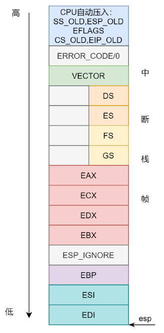

# 0.前言
在将lab2的代码merge到lab3的时候，发生了一点小插曲，导致lab2完成的代码在lab3中失效了，所幸最后解决了这个bug，所以这里专门开一个小节用来记录一下。
在应用git命令
```JavaScript
git merge lab2
```
合并分支之后，在之前lab2中完成的代码便被合并到了lab3中，但我在进行测试时，发现lab2的测试无法通过，会报以下错误：
```JavaScript
6828 decimal is 15254 octal!
Physical memory: 131072K available, base = 640K, extended = 130432K
end = :f0190000
kernel panic at kern/pmap.c:164: PADDR called with invalid kva 00000000
Welcome to the JOS kernel monitor!
Type 'help' for a list of commands.
```

重点是`kernel panic at kern/pmap.c:164: PADDR called with invalid kva 00000000`这一句，这句话的意思是说宏函数`PADDR`中传入的是一个零值，它对应于`pmap.c`中给`kern_pgdir`赋值的那行代码(下面第三行)：
```JavaScript
kern_pgdir = (pde_t *) boot_alloc(PGSIZE);
memset(kern_pgdir, 0, PGSIZE);
kern_pgdir[PDX(UVPT)] = PADDR(kern_pgdir) | PTE_U | PTE_P;
```
从上面的代码中可以看到，`PADDR`中传入的是页目录表指针`kern_pgdir`，我们通过`boot_alloc`给这个指针分配了一个页的空间，但是为何这个指针值为0，我们将指针值和地址打印出来：
```JavaScript
kern_pgdir = (pde_t *) boot_alloc(PGSIZE);
cprintf("kern_pgdir = %x\n", kern_pgdir);
cprintf("kern_pgdir address = %x\n", &kern_pgdir);
memset(kern_pgdir, 0, PGSIZE);
kern_pgdir[PDX(UVPT)] = PADDR(kern_pgdir) | PTE_U | PTE_P;

********************************************output***********************************

kern_pgdir = f0190000
kern_pgdir address = f019000c
```
可以看到，`kern_pgdir`自己的地址在指向地址的高位，所以后面再用`memset`初始化空间时便将`kern_pgdir`的值也一并初始化了。所以在`boot_alloc`中将初始输出值往高位拉个偏移，使`kern_pgdir`自己的地址在指向地址的低位，这样问题便能解决。

```JavaScript
kern_pgdir = f0191000
kern_pgdir address = f019000c
```

问题是解决了，可引发了一个问题，`boot_alloc`初始的输出值应该是kernel代码所占空间的后面(下图)，而`kern_pgdir`是在kernel代码中定义的，所以它的地址不应该超出kernel代码空间的范围。按照上面的输出结果来看，kernel代码空间应该是在地址0xf0190000处终止，而`kern_pgdir`的地址是在
0xf019000c处，这显然超过了0xf0190000。内核中定义的指针竟然超出了内核空间！这显然是不可思议的，但是本人目前的知识储备不足以支持我解决这个疑惑，所以暂记在此处，待日后再来填这个坑。


# 1.函数回顾

在lab1和lab2中，我们实现了很多函数，在进行lab3之前，我们先对这些函数进行一下总结。

```JavaScript
宏
KERNBASE 0xF0000000 //被映射的基准地址，即物理地址+KERNBASE=虚拟地址
KADDR(pa)           //宏函数，将物理地址pa转换为虚拟地址，即pa+KERNBASE
PADDR(kva)          //宏函数，将虚拟地址kva转换为物理地址，即kva-KERNBASE
PTE_ADDR(pte)       //取出page table entry或者page directory entry中的地址
PDX(la)             //取出虚拟地址la中包含的page directory index

函数
//将pp转换为物理地址
static inline phtsaddr_t page2pa(struct PageInfo *pp)
//将pp转换为虚拟地址
static inline phtsaddr_t page2kva(struct PageInfo *pp)
//将物理地址pa转换为页指针
static inline struct PageInfo* pa2page(physaddr_t pa)
//初始的内存分配器，返回n字节的虚拟内存地址，不初始化内存；n为0时，返回下一可用页的地址
static void* boot_alloc(uint32_t n)   
//正式的页分配器，分配一页的内存，如果(alloc_flags & ALLOC_ZERO)，则初始化分配的空间
struct PageInfo* page_alloc(int alloc_flags)
//释放pp指向的页
void page_free(struct PageInfo *pp)
//给定虚拟地址va和page directory pgdir，返回虚拟地址在这个pgdir下的page table entry
//若page table不存在且create == true，则新建page table
pte_t* pgdir_walk(pde_t *pgdir, const void *va, int create)
//将虚拟地址[va, va + size] 映射至物理地址[pa, pa + size]上，pgdir为使用的page directory
static void boot_map_region(pde_t *pgdir, uintptr_t va, size_t size, physaddr_t pa, int perm)
//返回虚拟地址va所对应的页指针
//若pte_store不为0，将va对应的page table entry储存至其中
struct PageInfo* page_lookup(pde_t *pgdir, void *va, pte_t **pte_store)
//删除虚拟地址va的映射
void page_remove(pde_t *pgdir, void *va)
//将虚拟地址va映射至物理页地址pp
int page_insert(pde_t *pgdir, struct PageInfo *pp, void *va, int perm)
```
以上这些函数会贯穿lab3的始终，所以可以时不时的回顾一下。

在lab3中，我们将实现操作系统的一些基本功能，来实现用户环境下的进程的正常运行。你将会加强JOS内核的功能，为它增添一些重要的数据结构，用来记录用户进程环境的一些信息；创建一个单一的用户环境，并且加载一个程序运行它。你也需要让JOS内核能够完成用户环境所作出的任何系统调用，以及处理用户环境产生的各种异常。

# 2.用户环境

新添加的文件 `inc/env.h` 里面包含了JOS内核的有关用户环境（User Environment）的一些基本定义。用户环境指的就是一个应用程序运行在系统中所需要的一个上下文环境，操作系统内核使用数据结构 `Env` 来记录每一个用户环境的信息。在这个实验中，我们将会先创建一个用户环境，但是之后我们会把它设计成能够支持多用户环境，即多个用户程序并发执行的系统。

当可执行文件被加载到内存当作进程执行后，会有一个数据结构来记录管理进程的执行情况，这个数据结构就是 PCB（Process Control Block），进程控制块。在 xv6 中充当进程控制块的就是 `Env` 结构体。

在 `kern/env.c` 文件中我们看到，操作系统一共维护了三个重要的和用户环境相关的全局变量：

```JavaScript
struct Env *envs = NULL;		// All environments
struct Env *curenv = NULL;		// The current env
static struct Env *env_free_list;	// Free environment list
```

JOS内核使用 Env结构体来追踪用户进程。其中 `envs` 变量是指向所有进程的链表的指针，其操作方式跟 lab2 的 `pages` 类似，`env_free_list` 是空闲的进程结构链表。注意下，在早先的JOS实验中，`pages` 和 `envs` 都是用的双向链表，现在的版本用的单向链表操作起来更加简单和清晰。

JOS系统启动之后，`envs` 指针便指向了一个 `Env` 结构体链表，表示系统中所有的用户环境。在我们的设计中，JOS内核将支持同一时刻最多 `NENV = 1024` 个活跃的用户环境，尽管这个数字要比真实情况下任意给定时刻的活跃用户环境数要多很多。系统会为每一个活跃的用户环境在 `envs` 链表中维护一个 `Env` 结构体。

JOS内核也把所有未执行的 `Env` 结构体，用 `env_free_list` 连接起来。这种设计方式非常方便进行用户环境 `env` 的分配和回收。

内核也会把 `curenv` 指针指向在任意时刻正在执行的用户环境的 `Env` 结构体。在内核启动时，并且还没有任何用户环境运行时，`curenv` 的值为NULL。

接下来看一下 `Env` 结构体的定义：

```JavaScript
struct Env {
	struct Trapframe env_tf;	// Saved registers
	struct Env *env_link;		// Next free Env
	envid_t env_id;				// Unique environment identifier
	envid_t env_parent_id;		// env_id of this env's parent
	enum EnvType env_type;		// Indicates special system environments
	unsigned env_status;		// Status of the environment
	uint32_t env_runs;			// Number of times environment has run

	// Address space
	pde_t *env_pgdir;			// Kernel virtual address of page dir
};
```

进程结构体 Env 各字段定义如下：

* env_tf：当进程停止运行时用于保存寄存器的值，比如当发生中断切换到内核环境运行或者切换到另一个进程运行的时候需要保存当前进程的寄存器的值以便后续该进程继续执行；
* env_link：指向空闲进程链表 env_free_list 中的下一个 Env 结构；
* env_id：进程 ID。因为进程 ID 是正数，所以符号位是 0，而中间的21位是标识符，标识在不同的时间创建但是却共享同一个进程索引号的进程，最后 10 位是进程的索引号，要用 envs 索引进程管理结构 Env 就要用 ENVX(env_id)；
* env_parent_id：进程的父进程ID；
* env_type：进程类型，通常是 ENV_TYPE_USER，后面实验中可能会用到其他类型；
* env_status：进程状态，进程可能处于下面几种状态
  * ENV_FREE：标识该进程结构处于不活跃状态，存在于 env_free_list 链表；
  * ENV_RUNNABLE: 标识该进程处于等待运行的状态；
  * ENV_RUNNING: 标识该进程是当前正在运行的进程；
  * ENV_NOT_RUNNABLE: 标识该进程是阻塞状态，比如在等待另一个进程的 IPC；
  * ENV_DYING: 该状态用于标识僵尸进程。在 lab4 才会用到这个状态，lab3 不用。
* env_runs：标志该进程已经运行了几次；
* env_pgdir：用于保存进程页目录的虚拟地址。

接下来我们需要对管理用户环境的结构进行初始化，进程管理结构 `envs` 对应的1024个 Env 结构体在物理内存中紧接着 pages 存储。如下图 `nextfree` 指向的位置：


用户进程运行路径如下所示：

```JavaScript
start (kern/entry.S)
i386_init (kern/init.c)
    cons_init
    mem_init
    env_init
    trap_init (still incomplete at this point)
    env_create
        env_alloc
            env_setup_vm
        load_icode
            region_alloc
    env_run
        env_pop_tf
};
```

进程初始化流程主要包括：

* 给 `NENV` 个 Env 结构体在内存中分配空间，并将 envs 结构体的物理地址映射到 从 `UENV` 所指向的线性地址空间，该线性地址空间允许用户访问且只读，所以页面权限被标记为 `PTE_U`。

* 调用 `env_init` 函数初始化envs，将 `NENV` 个进程管理结构 Env 通过 `env_link` 串联起来，注意，`env_free_list` 要指向第一个 Env，所以这里要用倒序的方式。在 `env_init` 函数中调用了 `env_init_percpu` 函数，加载新的 GDT。
  
* 初始化好了 `envs` 和 `env_free_list` 后，接着调用 `ENV_CREATE(user_hello, ENV_TYPE_USER)` 创建第一个用户进程。`ENV_CREATE` 是 `kern/env.h` 中的宏定义，展开就是调用的 `env_create`，只是参数设置成了 `env_create(_binary_obj_user_hello_start, ENV_TYPE_USER)`。`env_create` 也是我们要实现的函数，它的功能就是先调用 `env_alloc` 函数分配好 Env 结构，初始化 Env 的各个字段值（如 `env_id`，`env_type`，`env_status` 以及 `env_tf` 的用于存储寄存器值的字段，运行用户程序时会将 `env_tf` 的字段值加载到对应的寄存器中），为该用户进程分配页目录表并调用 `load_icode` 函数加载程序代码到内存中。
  
  * `env_alloc` 调用 `env_setup_vm` 函数分配好页目录的页表，并设置页目录项和 `env_pgdir` 字段；
  * `load_icode` 函数则是先设置 cr3 寄存器切换到该进程的页目录 `env_pgdir`，然后通过 `region_alloc` 分配每个程序段的内存并按 segment 将代码加载到对应内存中，加载完成后设置 `env_tf->tf_eip` 为 Elf 的 `e_entry`，即程序的初始执行位置；
  
* 加载完程序代码后，万事俱备，调用 `env_run(e)` 函数开始运行进程。如果当前有进程 curenv 正在运行，则设置当前进程状态为 `ENV_RUNNABLE`，并将需要运行的进程 e 的状态设置为 `ENV_RUNNING`，然后加载 e 的页目录表地址 `env_pgdir` 到cr3寄存器中，调用 `env_pop_tf(struct Trapframe *tf)` 开始执行程序 e。由于当前运行的是第一个用户进程，所以不需要切换。
  
* `env_pop_tf` 其实就是将栈指针 esp 指向该进程的 `env_tf`，然后将 `env_tf` 中存储的寄存器的值弹出到对应寄存器中，最后通过 `iret` 指令跳转到 CS:EIP 存储的地址执行。这样，相关寄存器都从内核设置成了用户程序对应的值，EIP 存储的是程序入口地址。

`kern/init.c` 中调用了宏函数 `ENV_CREATE`，从而指定了在之后的 `env_run` 中要执行的进程。可以执行的进程在 `user` 目录下的一系列 C 文件中写好了，都非常简单。给 `ENV_CREATE` 传 `user_*`，* 处填写对应在 `user` 目录下的文件名就可以了。一开始使用的是 `user_hello`，就是对应 `user/hello.c`。函数 `env_run` 里调用了 `env_pop_tf` 函数，`env_pop_tf` 函数上面已经讲过了，我们这里来深入一下：

函数 `env_pop_tf` 接受一个指针，包含了和进程有关的信息。函数做了这些事情：

```javascript
void env_pop_tf(struct Trapframe *tf)
{
	asm volatile(
		"\tmovl %0,%%esp\n"  // 将 %esp 指向 tf 地址处
		"\tpopal\n"			 // 弹出 Trapframe 结构中的 tf_regs 值到通用寄存器
		"\tpopl %%es\n"		 // 弹出 Trapframe 结构中的 tf_es 值到 %es 寄存器
		"\tpopl %%ds\n"		 // 弹出 Trapframe 结构中的 tf_ds 值到 %ds 寄存器
		"\taddl $0x8,%%esp\n" 
		"\tiret\n"           //中断返回指令，具体动作如下：从 Trapframe 结构中依次弹出 tf_eip,tf_cs,tf_eflags,tf_esp,tf_ss 到相应寄存器
		: : "g" (tf) : "memory"); // g 是一个通用约束，可以表示使用通用寄存器、内存、立即数等任何一种处理方式
	panic("iret failed");  
}

// trapframe结构
struct Trapframe {
	struct PushRegs tf_regs;
	uint16_t tf_es;
	uint16_t tf_padding1;
	uint16_t tf_ds;
	uint16_t tf_padding2;
	uint32_t tf_trapno;
	/* below here defined by x86 hardware */
	uint32_t tf_err;
	uintptr_t tf_eip;
	uint16_t tf_cs;
	uint16_t tf_padding3;
	uint32_t tf_eflags;
	/* below here only when crossing rings, such as from user to kernel */
	uintptr_t tf_esp;
	uint16_t tf_ss;
	uint16_t tf_padding4;
} __attribute__((packed));
```
关于这段程序我目前是这么理解的，在 `env_create` 函数中我们已经将所执行 ELF 文件的内容加载到了相应的内存空间中，同时装填好了该程序运行所需的 `Trapframe` 结构（`e->env_tf`），所以在 `env_pop_tf` 函数中我们就将这个 `trapframe` 里面所存储的寄存器值按顺序装填到相应寄存器中，`iret` 指令之后正式进入 `user mode`，按照 eip 找到用户程序的第一条指令开始执行（EIP 存储的是程序入口地址）。
  
在这里需要提一下，在 xv6 里除了第一个进程需要内核使用 `env_create` 来创建之外，其他的所有进程都是使用 `fock` 来创建。到这里我们已经成功创建了 xv6 中的第一个用户进程，多个用户进程的并行会在下个 lab 中涉及。下面我们需要先完成多个进程并行调度的基础-中断。

# 3.中断和异常处理

## 3.1 中断/异常概述

中断和异常都是“保护控制转移（protected control transfers PCT）”机制，它们将处理器从用户模式转换到内核模式。在英特尔的术语中，中断是指处理器之外的异步事件导致的 PCT，比如外部的 IO 设备活动。而异常则是当前运行代码同步触发的 PCT ，如除 0 或者非法内存访问等。根据异常被报告的方式以及导致异常的指令是否能重新执行，异常还可以细分为故障（Fault），陷阱（Trap）和中止（Abort）。

* Fault 通常指可以被纠正的异常，纠正后可以继续运行。出现 Fault 时，处理器会把机器状态恢复到产生 Fault 指令之前的状态，此时异常处理程序返回地址会指向产生 Fault 的指令，而不是后一条指令，产生 Fault 的指令在中断处理程序返回后会重新执行，如 Page Fault。

* Trap 处理程序返回后执行的指令是引起陷阱指令的后一条指令。

* Abort 则不允许异常指令继续执行。

x86 使用 0-31 号中断向量作为处理器内部的同步的异常类型，比如除零和缺页异常。而 32 号之上的中断向量用于软件中断（Software_Generated Interrupts）或者外部设备产生的异步的硬件中断，其中外部中断可以被屏蔽。lab3 我们会用到 0-31 号以及 48 号(用于系统调用)中断向量，在后面实验中还会处理外部的时钟中断。

中断：硬件/软件中断；

异常：故障、陷阱、终止。

**硬件中断**会经历 3 个阶段：设备产生中断，中断控制器接受和发送中断，CPU&OS 来实际处理中断。而**内部异常**和**软件中断**由于是 CPU 内部产生的，所以并不涉及硬件中断的前两步。这个 lab 中我们主要讨论内部异常和软件中断，硬件中断会放在下一个 lab 中讲。

> 关于软件中断
> 
> 软件中断（Software_Generated Interrupts）和 Linux 里面上下半部分中的软中断机制是不同的概念。软件中断指的是用 INT n 指令来模拟一个 n 号中断。以前 Linux 中的系统调用就是使用 int 0x80 来实现的。软件中断来源与内部，所以它的处理流程没有中断控制器这个部分。

> 关于可屏蔽中断与不可屏蔽中断
> 
> 可屏蔽中断和不可屏蔽中断都属于外部中断，是由外部中断源引起的；但它们也有区别：可屏蔽中断是通过 CPU 的 INTR 引脚引入，当中断标志 IF＝1 时允许中断，当 IF=0 时禁止中断，不可屏蔽中断是由 NMI 引脚引入，不受 IF 标志的影响。 不可屏蔽中断源一旦提出请求，CPU 必须无条件响应，而对可屏蔽中断源的请求，CPU 可以响应，也可以不响应。

## 3.2 内部异常（和软件中断）处理流程

### 3.2.1 中断描述符表

中断描述符表（interrupt descriptor table IDT）里面存放的是门描述符，有三种门描述符，任务门，中断门，陷阱门，长度都是 64 位：

* 任务门和任务状态段是 intel 最开始提供的一种任务切换机制，可以使用任务门来切换任务，但因效率低下，现已经不使用；
* 中断门和陷阱门的格式与 GDT 中的段描述符很相像，段描述符描述符了一个段的位置和属性，同样的门描述符也描述了一个段的位置和属性。段的意思很灵活，就是指内存的一段数据信息，不是说只有代码段数据段才叫段，这里门描述符指向的段就是中断服务程序。中断门和陷阱门的**唯一区别**就是通过中断门触发的中断不允许被其它中断打扰当前中断的执行。
  
中断描述符表将每个中断向量（interrupt vector）和一个门描述符对应起来，中断门描述符里面存储中断或异常的处理程序的入口地址以及 DPL。x86 允许 256 个中断和异常入口，每个对应一个唯一的整数值，称为中断向量。中断描述符表的起始地址存储在 IDTR 寄存器中，当发生中断/异常时，CPU 使用中断向量作为中断描述符表的索引，通过中断门描述符中存储的段选择子和偏移量，可以到 GDT 中找到中断处理程序的地址。

> ## 关于CPL, RPL, DPL
> 
> CPL 是当前正在执行的代码所在的段的特权级，存在于 CS 寄存器的低两位。RPL 指的是进程对段访问的请求权限，是针对段选择子而言的，不是固定的。DPL 则是在段描述符中存储的，规定了段的访问级别，是固定的。为什么需要 RPL 呢？因为同一时刻只能有一个 CPL，而低权限的用户程序去调用内核的功能来访问一个目标段时，进入内核代码段时 CPL 变成了内核的 CPL，如果没有 RPL，那么权限检查的时候就会用 CPL，而这个 CPL 权限比用户程序权限高，也就可能去访问需要高权限才能访问的数据，导致安全问题。所以引入 RPL，让它去代表访问权限，因此在检查 CPL 的同时，也会检查 RPL。一般来说如果 RPL 的数字比 CPL 大(权限比 CPL 的低)，那么 RPL 会起决定性作用，这个权限检查是 CPU 硬件层面做的。

> ```javascript
>     用户进程                         内核         
>   
>     用户代码
>	  CPL = 3                       
>     系统调用     ------------->     内核代码
>	 					             CPL = 0
>						   引起系统的调用的用户进程 RPL = 3   ------------->   系统调用函数
>						                                                     DPL = 3(对比RPL，允许调用)
> ```


## 3.2.2 处理流程

CPU 处理中断主要分为三步：保存上下文、执行中断处理程序、恢复上下文。

在用户程序内发生异常时，CPU 会自动将控制器转移到中断处理程序处。前面提到，中断门描述符存储了中断处理程序的信息，包括其所在的段选择子、代码地址等。CPU 通过 IDTR 寄存器找到中断描述符表的起始地址，然后通过中断向量（即中断号）找到对应的中断门描述符，接着通过中断门描述符中存储的段选择子到 GDT 中找到段基址，加上偏移地址即可得到中断处理程序的虚拟地址。当然后面还要经过 MMU 的转换才能得到中断处理程序的物理地址。具体流程如下图所示：


在索引门描述符时处理器还会进行特权级检查，保证 DPL >= CPL && DPL >= RPL，并且还要判断是否有特权级转移，我们一般就是用两种特权级，内核态 0，用户态 3。所以这里就是判断发生中断的前一刻处于哪个特权级，如果处于用户态那么就要从用户态进入内核态，否则就不需要。

保存上下文是保存在栈里面，如果没有特权级转移，发生中断前本身就在内核，那么就使用当前的内核栈保存上下文。如果有特权级转移，发生中断前处于用户态，那么就要进入内核态，将当前栈换成内核栈。换栈就是要将当前 SS 和 ESP 寄存器的值换成内核栈所在的位置，那么内核栈的位置信息存放在哪里呢？就存放在 TSS 里，尽管 TSS 非常大，并且还有很多其他的功能，但是JOS仅仅使用它来定义处理器从用户态转向内核态所采用的内核堆栈，由于JOS中的内核态指的就是特权级0，所以处理器用TSS中的ESP0，SS0字段来指明这个内核堆栈的位置和大小。JOS不使用任何其它TSS字段。

我们可以使用TSS指定任意内核地址作为系统调用的栈，在这里我们使用了内核的栈`KSTACKTOP`当做中断栈。

好了现在栈已经换成中断要使用的栈了，CPU 需要在里面保存上下文，有哪些呢？如下图所示：


所以，当一个 x86 处理器要处理一个中断或异常并且使运行特权级从用户态转为内核态时，它也会同时切换到内核空间中 TSS 指定的栈里。处理器会把 SS，ESP，EFLAGS，CS，EIP 以及一个可选错误码等等这些值压入到这个栈上。然后加载中断处理程序的 CS，EIP 值，并且设置 ESP，SS 寄存器指向中断处理程序所在的堆栈。如果没有发生特权级转移，那么直接用当前栈就可以。

eflags 表示中断前的一些标志信息，其中的 IF 标志控制了是否允许中断，cs_old，eip_old 表示中断点，中断处理完成后任务会从这继续执行。error_code 表示错误码，有些中断会有错误码，用来指明中断发生在哪个段上。为了统一标准，对于没有错误码的中断，我们会统一压入一个值 0。

接下来就要开始执行中断服务程序了，中断服务程序分为三部分，中断入口程序，中断处理程序，中断退出程序。

中断入口程序主要就是用来保存上下文的，这里所谓的上下文就是各类寄存器的值，通常要高效的话，可以选择性的保存，但是省事简单的话直接一股脑儿地全保存了也没什么问题。另外通常这部分也把向量号 vector 也压进去。

所以保存上下文其实是分为两部分的，一部分是上面说的 （ss_old, esp_old。有特权级转移的情况下）eflags，cs_old，eip_old 和 error_code，这部分内容是 CPU 自动压栈的，我们不用管。而上图中其他寄存器的值是需要 OS 来压栈的。

比如 xv6 里保存完上下文后就是这样（下图有错误，其中 FS 和 GS 不应该存在，因为 xv6 没有使用这两个寄存器）：




接着就是开始执行中断处理程序，最后恢复上下文。恢复上下文就是保存上下文的逆操作，同样分为两部分，先是 OS 软件部分，执行中断退出程序，弹出通用寄存器，段寄存器等上下文。接着就是硬件 CPU 部分，执行 iret 弹出 cs_old，eip_old，eflags，（ss_old，esp_old，有特权级转移的情况下）.

## 3.2.3 总结

1. 根据 vector 去 IDT 中索引相应的门描述符;
2. 判断特权级是否发生变化，如果中断发生在用户态，则需要换成内核栈，切换到内核态;
3. 若发生特权级变化，需要保存用户态的 ss_old，esp_old 到内核栈，否则不需要保存，然后再保存 eflags，cs_old，ip_old 到内核栈中，如果有错误码，还要将错误码压进栈中；
4. 根据门描述符中的段选择子再去 GDT 中索引相应的段描述符得到段基址，与中断描述符里的段偏移量结合起来找到中断服务程序;
5. 中断入口程序保存上下文，中断处理程序实际处理中断，中断退出程序恢复一部分上下文;
6. 最后执行 iret 恢复 CPU 保存的上下文，如果有特权级转移，则换到用户栈回到用户态；
7. 中断完成，接着原任务执行。

## 3.3 中断/异常处理实例

假设处理器正在用户状态下运行代码，但是遇到了一个除法指令，并且除数为0。

* 处理器会首先切换自己的堆栈，切换到由 TSS 的 SS0，ESP0 字段所指定的内核堆栈区；
* 处理器把异常参数压入到内核堆栈中，起始于地址 KSTACKTOP：

```javascript
     +--------------------+ KSTACKTOP             
     | 0x00000 | old SS   |     " - 4 
     |      old ESP       |     " - 8 
     |     old EFLAGS     |     " - 12 
     | 0x00000 | old CS   |     " - 16 
     |      old EIP       |     " - 20 <---- ESP 
     +--------------------+             
```

* 因为我们要处理的是除零异常，它的中断向量是 0，处理器会读取 IDT 表中的 0 号表项，并且把 CS:EIP 的值设置为 0 号中断处理函数的地址值。
* 中断处理函数开始执行，并且处理中断。
  
对于某些特定的异常，除了上面图中要保存的五个值之外，还要再压入一个字，叫做错误码。比如缺页异常。当压入错误码之后，内核堆栈的状态如下：

```javascript
     +--------------------+ KSTACKTOP             
     | 0x00000 | old SS   |     " - 4 
     |      old ESP       |     " - 8 
     |     old EFLAGS     |     " - 12 
     | 0x00000 | old CS   |     " - 16 
     |      old EIP       |     " - 20 
	 |    error code      |     " - 24 <---- ESP 
     +--------------------+             
```

以上几步都是由硬件自动完成的。

处理器在用户态下和内核态下都可以处理异常或中断。只有当处理器从用户态切换到内核态时，才会自动地切换堆栈，并且把一些寄存器中的原来的值压入到堆栈上，并且触发相应的中断处理函数。但如果处理器已经由于正在处理中断而处在内核态下时，此时 CPU 只会向内核堆栈压入更多的值。通过这种方式，内核就可处理嵌套中断。
　
如果处理器已经在内核态下并且遇到嵌套中断，因为它不需要切换堆栈，所以它不需要存储 SS，ESP 寄存器的值。此时内核堆栈的就像下面这个样子：

```javascript
     +--------------------+ <---- old ESP
     |     old EFLAGS     |     " - 4 
     | 0x00000 | old CS   |     " - 8 
     |      old EIP       |     " - 12 
     +--------------------+             
```

除此之外，如果处理器在内核态下接受一个异常，而且由于一些原因，比如堆栈空间不足，不能把当前的状态信息（寄存器的值）压入到内核堆栈中时，那么处理器是无法恢复到原来的状态了，它会自动重启。


## 3.4 xv6 中的中断/异常处理

### 3.4.1 中断部分的初始化

首先来说环境准备 OS 部分，主要就是构建中断描述符表 IDT 和注册中断服务程序。构建 IDT 就是构建一个个门描述符，它们集合起来就是 IDT。而所谓的注册中断服务程序其实就是在门描述符里面填写程序地址。

注册中断服务程序，首先得有中断服务程序是吧，我将 xv6 里的中断服务程序分为三部分：

* 中断入口程序
* 中断处理程序
* 中断退出程序

中断处理程序每个中断是不同的，但是中断入口和中断的出口(退出)是基本是相同的，在描述符里面填写的地址就是中断入口程序的地址。中断入口程序就是保存上下文，然后跳到真正的中断处理程序执行中断，之后再跳转到中断退出程序。

这里涉及到两个跳，第一个从中断入口程序跳到中断处理程序，一个相同的入口点是如何跳到不同的中断处理程序的呢？中断入口程序会压入向量号，可以根据向量号来调用不同的中断处理程序。第二跳从中断处理跳到中断退出程序，这其实没什么特殊的处理，中断入口程序和中断退出程序在一个汇编文件里面，中断入口程序调用中断处理程序，中断处理程序执行完成之后自然会回到中断退出程序。

首先来看中断入口程序的构造，xv6 在刚启动的时候会调用 `trap_init` 函数来初始化中断部分。 

首先是中断入口程序，在 `trap_init` 中首先会声明一系列中断入口程序：

```javascript
void
trap_init(void)
{
	extern struct Segdesc gdt[];

	void handler0();
	void handler1();
	void handler2();
	void handler3();
	void handler4();
	void handler5();
	void handler6();
	void handler7();
	void handler8();
	void handler10();
	void handler11();
	void handler12();
	void handler13();
	void handler14();
	void handler15();
	void handler16();
	void handler48();

	SETGATE(idt[T_DIVIDE], 1, GD_KT, handler0, 0);
	SETGATE(idt[T_DEBUG], 1, GD_KT, handler1, 0);
	SETGATE(idt[T_NMI], 0, GD_KT, handler2, 0);

	SETGATE(idt[T_BRKPT], 1, GD_KT, handler3, 3);

	SETGATE(idt[T_OFLOW], 1, GD_KT, handler4, 0);
	SETGATE(idt[T_BOUND], 1, GD_KT, handler5, 0);
	SETGATE(idt[T_ILLOP], 1, GD_KT, handler6, 0);
	SETGATE(idt[T_DEVICE], 1, GD_KT, handler7, 0);
	SETGATE(idt[T_DBLFLT], 1, GD_KT, handler8, 0);
	SETGATE(idt[T_TSS], 1, GD_KT, handler10, 0);
	SETGATE(idt[T_SEGNP], 1, GD_KT, handler11, 0);
	SETGATE(idt[T_STACK], 1, GD_KT, handler12, 0);
	SETGATE(idt[T_GPFLT], 1, GD_KT, handler13, 0);
	SETGATE(idt[T_PGFLT], 1, GD_KT, handler14, 0);
	SETGATE(idt[T_FPERR], 1, GD_KT, handler16, 0);

	SETGATE(idt[T_SYSCALL], 0, GD_KT, handler48, 3);
	// Per-CPU setup 
	trap_init_percpu();
}
```

这些中断入口程序定义在 `kern/trapentry.S` 中，每个中断都有一个自己的中断入口程序，这些程序的作用只有一个，在堆栈中压入错误码或 0，接着压入向量号，最后跳入 `alltraps` 函数，`alltraps` 函数会接管流程，根据不同的向量号执行不同的中断处理程序，这些都不属于初始化部分，所以这里不展开，下面会以一个具体的例子走一下中断处理的流程。`SETGATE` 的作用是创建 IDT，将中断入口函数的地址写入到对应的门中，同时设置特权级。

到这里，中断的初始化部分就已经讲好了。

### 3.4.2 xv6 中的中断/异常处理实例

假设我们执行 `user/divzero.c` 程序，这个程序会执行一条除 0 指令。在执行到这条指令时，中断发生，CPU 会自动压入（ss_old, esp_old。有特权级转移的情况下）eflags，cs_old，eip_old 的值，然后跳转到 `handler0()` 函数：

```javascript

#define TRAPHANDLER_NOEC(name, num)					\
	.globl name;							\
	.type name, @function;						\
	.align 2;							\
	name:								\
	pushl $0;							\
	pushl $(num);							\
	jmp _alltraps

.text

TRAPHANDLER_NOEC(handler0, T_DIVIDE)
```

`handler0()` 函数会将 0 （错误码，由于除 0 异常没有错误码，所以我们压入一个 0）和中断向量号 0，然后跳转到 `_alltraps` 函数，现在我们看看`_alltraps`到底做了些什么：

```javascript
_alltraps:
	pushl %ds
	pushl %es
	pushal
	movw $GD_KD, %ax
	movw %ax, %ds
	movw %ax, %es
	pushl %esp
	call trap /*never return*/

1:jmp 1b
```

首先是将 ds 和 es 压栈。`pushal` 指令意为 `push all registers` ，将所有寄存器的值压栈，顺序正好对应 `struct PushRegs` 的声明顺序。

```javascript
struct PushRegs {
	/* registers as pushed by pusha */
	uint32_t reg_edi;
	uint32_t reg_esi;
	uint32_t reg_ebp;
	uint32_t reg_oesp;		/* Useless */
	uint32_t reg_ebx;
	uint32_t reg_edx;
	uint32_t reg_ecx;
	uint32_t reg_eax;
} __attribute__((packed));
```

再接着将 `GD_KD` 的值赋值给寄存器 ds, es，接着就可以调用 `trap` 函数了。`call`指令的前一个指令，就是将当前栈指针压栈了，就是在给`trap`函数传参。在文件 `kern/trap.c` 中的 `trap` 函数中，函数接受的参数 `tf` ，就是这样传进来的。

```javascript
struct Trapframe {
	struct PushRegs tf_regs;
	uint16_t tf_es;
	uint16_t tf_padding1;
	uint16_t tf_ds;
	uint16_t tf_padding2;
	uint32_t tf_trapno;
	/* below here defined by x86 hardware */
	uint32_t tf_err;
	uintptr_t tf_eip;
	uint16_t tf_cs;
	uint16_t tf_padding3;
	uint32_t tf_eflags;
	/* below here only when crossing rings, such as from user to kernel */
	uintptr_t tf_esp;
	uint16_t tf_ss;
	uint16_t tf_padding4;
} __attribute__((packed));
```

`tf` 中的内容就与我们刚才压进栈里的寄存器值一一对应。再仔细看看`trap`函数及其调用的函数的行为：

```javascript
void
trap(struct Trapframe *tf)
{
	asm volatile("cld" ::: "cc");
	// Check that interrupts are disabled.  If this assertion
	// fails, DO NOT be tempted to fix it by inserting a "cli" in
	// the interrupt path.
	assert(!(read_eflags() & FL_IF));

	if ((tf->tf_cs & 3) == 3) {
		// Trapped from user mode.
		assert(curenv);

		// Copy trap frame (which is currently on the stack)
		// into 'curenv->env_tf', so that running the environment
		// will restart at the trap point.
		curenv->env_tf = *tf;
		
		// The trapframe on the stack should be ignored from here on.
		tf = &curenv->env_tf;
	}

	// Record that tf is the last real trapframe so
	// print_trapframe can print some additional information.
	last_tf = tf;
	
	// Dispatch based on what type of trap occurred
	trap_dispatch(tf);

	// Return to the current environment, which should be running.
	assert(curenv && curenv->env_status == ENV_RUNNING);
	env_run(curenv);
}

```

进入 `trap` 函数后，先判断是否由用户态进入内核态，若是，则必须保存进程状态。也就是将刚刚得到的 `TrapFrame` 存到对应进程结构体的属性中，之后要恢复进程运行，就是从这个 `TrapFrame` 进行恢复。

若中断令处理器从内核态切换到内核态，则不做特殊处理。

接着调用分配函数 `trap_dispatch`，这个函数根据中断序号，调用相应的处理函数，并返回。

```javascript
static void
trap_dispatch(struct Trapframe *tf)
{
	// Handle processor exceptions.
	// LAB 3: Your code here.
	if (tf->tf_trapno == T_PGFLT) {
		return page_fault_handler(tf);
	}

	if (tf->tf_trapno == T_BRKPT) {
		return monitor(tf);
	}

	if (tf->tf_trapno == T_SYSCALL) {
		tf->tf_regs.reg_eax = syscall(
			tf->tf_regs.reg_eax,
			tf->tf_regs.reg_edx,
			tf->tf_regs.reg_ecx,
			tf->tf_regs.reg_ebx,
			tf->tf_regs.reg_edi,
			tf->tf_regs.reg_esi
		);
		return;
	}

	// Unexpected trap: The user process or the kernel has a bug.
	print_trapframe(tf);
	if (tf->tf_cs == GD_KT)
		panic("unhandled trap in kernel");
	else {
		env_destroy(curenv);
		return;
	}
	
}
```

从上面可以看出，除 0 异常会直接终止该进程 `env_destroy(curenv)`。

### 3.4.3 xv6 中的系统调用

如果我们执行执行 `kern/hello.c` 程序，在 `hello.c` 程序中调用了系统函数 `cprintf`，这个函数需要陷入到内核态执行，所以在 `cprintf` 中经过层层调用，路径是 `kern/hello.c -> lib/printf.c/cprintf -> lib/printf.c/vcprintf -> lib/syscall.c/sys_cputs -> lib/syscall.c/syscall`， 最后调用到 `syscall`，在 `syscall` 中 `int $T_SYSCALL` 后产生中断，陷入到内核态。

`lib/syscall.c`中的`syscall`函数里是一段汇编代码，结合下图我们具体来看一下：


```javascript
static inline int32_t
syscall(int num, int check, uint32_t a1, uint32_t a2, uint32_t a3, uint32_t a4, uint32_t a5)
{
	int32_t ret;

	asm volatile("int %1\n"
		     : "=a" (ret)
		     : "i" (T_SYSCALL),
		       "a" (num),
		       "d" (a1),
		       "c" (a2),
		       "b" (a3),
		       "D" (a4),
		       "S" (a5)
		     : "cc", "memory");

	if(check && ret > 0)
		panic("syscall %d returned %d (> 0)", num, ret);

	return ret;
}
```

上述代码的意思是将函数的参数设置到寄存器中（最多5个，a1-a5），系统调用号 num 存储在 %eax，参数 check 忽略，其他参数依次存放到 %edx, %ecx, %ebx, %edi, 和 %esi，返回值通过 %eax 来传递。这里怎么理解？从用户态向内核态传输参数，还记得在 `_alltraps` 里会把很多寄存器压栈嘛，所以这里就是在进入内核态之前先把要传递的函数值放到寄存器里，等进到内核态的时候再把它们取出来。`int $T_SYSCALL` 就相当于产生了一个中断，这时候切换堆栈，内核接管 CPU。

接下来的流程就跟上面的除 0 异常一致，从 `handler48()` 函数一直到 `trap_dispatch` 函数，从这里进入系统调用函数 `kern/syscall.c/syscall`，在这里系统把寄存器中的值当做参数传递给了 `syscall` 函数，同时把返回值放在了 %eax 里。

```javascript
int32_t
syscall(uint32_t syscallno, uint32_t a1, uint32_t a2, uint32_t a3, uint32_t a4, uint32_t a5)
{
	// Call the function corresponding to the 'syscallno' parameter.
	// Return any appropriate return value.

	switch (syscallno) {
		case SYS_cputs : 
			sys_cputs((const char*)a1, a2);
			return 0;
		case SYS_cgetc : 
			return sys_cgetc();
		case SYS_getenvid : 
			return sys_getenvid();
		case SYS_env_destroy : 
			return sys_env_destroy(a1);
		default:
			return -E_INVAL;
	}
}
```

`syscall` 函数会根据系统调用号 syscallno 调用不同的系统函数，执行完后返回。然后切换回到旧进程，调用的是 `env_run`，根据当前进程结构体 `curenv` 中包含和运行有关的信息，恢复进程执行。

这里总结一下：

1. 用户环境下执行系统调用，最终调用到 `lib/syscall.c` 函数，函数参数压进寄存器，执行 `int $T_SYSCALL` 产生中断；
2. 调用中断入口程序 `handler**` 和 `_alltraps`，所有寄存器值压栈；
3. 进入 `kern/trap.c` 中的 `trap` 函数，根据不同的中断号执行不同的中断处理程序；


# 4.用户进程

用户程序的入口在 `lib/entry.S`，在其中设置了 envs，pages，uvpt等全局变量以及`_start`符号。`_start`是整个程序的入口，链接器在链接时会查找目标文件中的`_start`符号代表的地址，把它设置为整个程序的入口地址，所以每个汇编程序都要提供一个`_start`符号并且用`.globl`声明。`entry.S`中会判断 USTACKTOP 和 寄存器esp的值是否相等，若相等，则表示没有参数，则会默认在用户栈中压入两个0，然后调用`libmain`函数。当然lab 3中的用户程序代码都没有传参数的。

而`libmain()`则需要设置 `thisenv` 变量(因为测试的用户程序里面会引用`thisenv`的一些字段)，然后调用`umain`函数，而`umain`函数就是我们在 user/hello.c这些文件中定义的主函数。最后，执行完`umain`，会调用 `exit`退出。`exit`就是调用了系统调用 `sys_env_destroy`，最终内核通过 `env_destroy()`销毁用户进程并回到`monitor()`。

内存保护可以确保用户进程中的bug不能破坏其他进程或者内核。当用户进程试图访问一个无效的或者没有权限的地址时，处理器就会中断进程并陷入到内核，若错误可修复，则内核就修复它并让用户进程继续执行；如果无法修复，那么用户进程就不能继续执行。许多系统调用接口运行把指针传给 kernel，这些指针指向用户buffer，为防止恶意用户程序破坏内核，内核需要对用户传递的指针进行权限检查。内存保护由 `user_mem_check()`和 `user_mem_assert()`实现。检查用户进程访存权限，并检查是否越界。


1. https://www.jianshu.com/p/3d3d79abd5d1
2. https://blog.csdn.net/bysui/article/details/51533792
3. https://github.com/Anarion-zuo/AnBlogs/blob/master/6.828/lab3A-elf.md
4. https://github.com/shishujuan/mit6.828-2017/blob/lab3/kern/env.c
5. https://blog.csdn.net/a747979985/article/details/96435919
6. https://blog.csdn.net/a747979985/article/details/96964676
7. https://github.com/shishujuan/mit6.828-2017/blob/master/docs/lab3-exercize.md