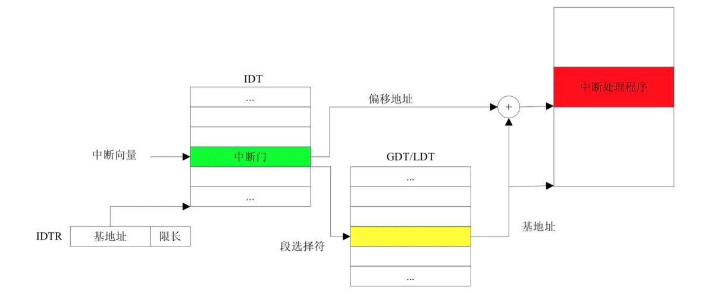

在这个lab中，我们将会在多个同时运行的用户环境中实现抢占式多任务调度。

在Part A部分，我们将为JOS增加多处理器特性，实现轮转(RR)调度，增加用户环境管理的系统调用(创建和销毁环境，分配和映射内存)。

在Part B，我们将会实现一个像Unix里一样的fork()函数，它会允许用户模式环境创建自身的副本。

最后在Part C中，我们将为进程间通信 (inter-process communication IPC)添加支持，允许不同的用户环境显式地彼此进行交流与同步。我们也将为硬件时钟中断和抢占添加支持。

由于这个lab会涉及到内存分配，所以首先来看下这个lab要实现的内存图：


# 1.多处理器

## 1.1 多处理器支持

我们将使JOS支持“对称多处理器”(symmetric multiprocessing, SMP)，这是一种多处理器模型，其中所有cpu都具有对系统资源(如内存和I/O总线)的等效访问权。虽然SMP中的所有cpu在功能上都是相同的，但是在引导过程中它们可以分为两种类型:引导处理器(bootstrap processor, BSP)负责初始化系统和引导启动操作系统;只有在操作系统启动并运行之后，BSP才会激活应用程序处理器(the application processors, APs)。哪个处理器是BSP由硬件和BIOS决定。到目前为止，所有现有的JOS代码都在BSP上运行。

在SMP系统中，每个CPU都有一个相应的本地高级中断控制器单元 (local APIC LAPIC)。LAPIC单元负责在整个系统中传输中断。LAPIC还为其连接的CPU提供唯一的标识符。在本实验室中，我们利用了LAPIC单元的以下基本功能(`kern/lapic.c`):

* 读取LAPIC标识符(APIC ID)来判断我们的代码当前运行在哪个CPU上(参见`cpunum()`)。
* 将`STARTUP`中断信号( interprocessor interrupt, IPI)从BSP发送到APs，以打开其他cpu(参见`lapic_startap()`)。
* 在Part C，我们编写LAPIC的内置计时器来触发时钟中断，以支持抢占式的多任务处理(参见`lapic_init()`)。

> ### APIC
> APIC（Advanced Programmable Interrupt Controller）基于分布式结构，分为两个单元，一个是处理器内部的Local APIC单元(LAPIC)，另一个是IO APIC单元，它们两个通过Interrupt Controller Communications (ICC) 总线连接。APIC作用一是减轻了内存总线中关于中断相关流量，二是可以在多处理器里面分担中断处理的负载。
>
> LAPIC提供了 interprocessor interrupts (IPIs),它允许任意处理器中断其他处理器或者设置其他处理器，有好几种类型的IPIs，如INIT IPIs和STARTUP IPIs。每个LAPIC都有一个本地ID寄存器，每个IO APIC都有一个 IO ID寄存器，这个ID是每个APIC单元的物理名称，它可以用于指定IO中断和interprocess中断的目的地址。因为APIC的分布式结构，LAPIC和IO APIC可以是独立的芯片，也可以将LAPIC和CPU集成在一个芯片，如英特尔奔腾处理器（735\90, 815\100），而IO APIC集成在IO芯片，如英特尔82430 PCI-EISA网桥芯片。集成式APIC和分离式APIC编程接口大体是一样的，不同之处是集成式APIC多了一个STARTUP的IPI。

处理器访问它的LAPIC使用的是 MMIO，在MMIO里，一部分内存硬连线到了IO设备的寄存器，因此用于访问内存的load/store指令可以用于访问IO设备的寄存器。比如我们在实验1中用到 0xA0000开始的一段内存作为VGA显示缓存。LAPIC所在物理地址开始于0xFE000000(从Intel的文档和测试看这个地址应该是0xFEE00000)，在JOS里面内核的虚拟地址映射从`KERNBASE`(0xf00000000)来说，这个地址太高了，于是在JOS里面在`MMIOBASE`(0xef800000）地址处留了4MB空间用于MMIO，后面实验会用到更多的MMIO区域，为此我们要映射好设备内存到`MMIOBASE`这块区域，这个过程有点像boot_alloc，注意映射范围判断。

## 1.2 AP启动流程

在启动AP之前，BSP应该首先收集关于多处理器系统的信息，例如cpu的总数、它们的APIC IDs和LAPIC单元的MMIO地址。`kern/mpconfig.c`中的`mp_init()`函数通过读取驻留在BIOS内存区域中的MP配置表来检索此信息。

`boot_aps()`函数(在`kern/init.c`中)驱动AP引导进程。APs以实模式启动，非常类似于bootloader在`boot/boot.S`中启动的方式。因此，`boot_aps()`将AP entry代码(`kern/mpentry.S`)复制到在实模式中可寻址(addressable)的内存位置。与bootloader不同，我们可以控制AP将从何处开始执行代码;我们将AP entry代码复制到0x7000 (`MPENTRY_PADDR`)，但是任何未使用的、页面对齐的低于640KB(0xA0000以下)的物理地址都可以。

`boot_aps()`通过向AP的LAPIC发送`STARTUP IPIs`依次激活AP，并带上AP要执行的初始入口地址CS:IP（`MPENTRY_PADDR`)。入口代码在 `kern/mpentry.S`，跟`boot/boot.S`非常相似。在简单的设置后，它将AP设置为保护模式，并开启分页，然后调用 `mp_main()`里面的C设置代码。`boot_aps()`会等待AP在其CpuInfo中的`cpu_status`字段发出`CPU_STARTED` 标志，然后继续唤醒下一个AP。为此需要将 `MPENTRY_PADDR` 这一页内存空出来。

```JavaScript
void
i386_init(void)
{
	cons_init();

	cprintf("6828 decimal is %o octal!\n", 6828);
	mem_init();

	env_init();
	trap_init();

	mp_init();
	lapic_init();
	pic_init();
	lock_kernel();
	boot_aps();

#if defined(TEST)
	// Don't touch -- used by grading script!
	ENV_CREATE(TEST, ENV_TYPE_USER);
#else
	// Touch all you want.
	ENV_CREATE(user_dumbfork, ENV_TYPE_USER);
#endif // TEST*
	sched_yield();
}
```

`lapic_init()`主要对LAPIC的一些寄存器进行设置，包括设置ID，version，以及禁止所有CPU的NMI(LINT1)，BSP的LAPIC要以Virtual Wire Mode运行，开启BSP的LINT0，以用于接收8259A芯片的中断等。

`pic_init()`用于初始化8259A芯片的中断控制器。8259A芯片是一个中断管理芯片，中断来源除了来自硬件本身的NMI中断以及软件的INT n指令造成的软件中断外，还有来自外部硬件设备的中断(INTR)，这些外部中断时可以屏蔽的。

## 1.3 cpu初始化

在一个多处理器的os中，区分每个处理器私有的CPU状态和整个系统共享的全局状态是很重要的。`kern/cpu.h`定义了大部分per-CPU状态，包括struct CpuInfo，里面存着per-CPU变量。`cpunum()`总是返回调用它的CPU的ID，可以被用作数组(如cpus[])的索引值。或者，宏`thiscpu`是当前CPU的struct CpuInfo的简写。

这里是你应该熟悉的per-CPU状态：

* 内核栈
	
	因为多个CPU可以同时陷入到内核，每个处理器需要一个单独的内核堆栈，以防止它们干扰各自的执行。数组`percpu_kstack [NCPU][KSTKSIZE]`为N个CPU的内核堆栈保留空间。

	在Lab2中，我们将`bootstack`指向的地址映射为BSP内核堆栈的物理内存，该内核堆栈位于`KSTACKTOP`之下。相似的，在这个lab中，你会映射每个CPU的内核栈到这个区域，并使用保护页面(guard pages)作为它们之间的缓冲区(buffer)。CPU0的堆栈仍然会从`KSTACKTOP`向下增长;CPU1的堆栈将在距离CPU0的堆栈底部KSTKGAP个字节的位置开始，以此类推。inc/memlayout.h显示了映射布局。

* TSS和TSS描述符

	任务状态段(task state segment, TSS)用来指定每个CPU的内核栈位于何处。CPUi的TSS存在`cpus[i].cpu_ts`中，相应的TSS描述符定义在GDT条目的`gdt[(GD_TSS0 >> 3) + i]`中。定义在`kern/trap.c`中的全局ts变量将不再使用。

* 当前进程指针

	因为每个CPU可以同时运行不同用户程序，我们重新定义符号`curenv`为`cpus[cpunum()].cpu_env` (或者 `thiscpu->cpu_env`)，它将指向当前CPU上正在执行的进程。

* 系统寄存器
	
	所有寄存器，包括系统寄存器，都是CPU私有的。因此，初始化这些寄存器的指令，例如`lcr3()`, `ltr()`, `lgdt()`, `lidt()`等都必须在每个CPU上执行一次。函数`env_init_percpu()`和`trap_init_percpu()`就是为这个定义的。

## 1.4 内核锁

当前代码在`mp_main()`中初始化AP后会自旋(spin)。在让AP更进一步操作前，我们需要首先处理当多个CPU同时运行内核代码时的竞争条件(race conditions)。最简单的方法是用一个内核锁。内核锁是一个单一的全局锁，一个进程进入内核态时将持有这个锁，在这个进程返回用户态时被释放。在这种模式下，用户模式中进程可以在任何可用CPU上并发运行，但是只能有一个进程运行在内核态。任何其他想进入内核态的进程都必须等待。

`kern/spinlock.h`中声明了内核锁`kernel_lock`。它也提供了`lock_kernel()` 和 `unlock_kernel()`函数获取或释放该锁。你应该在这四个位置应用内核锁：

* 在 `i386_init()`中，在BSP唤醒其他CPU前获取内核锁
* 在`mp_main()`中，在初始化AP后获取锁，然后调用`sched_yield()`去在该AP上启动运行用户进程
* 在`trap()`中，当从用户态陷入内核态时获取锁。可以检查`tf_cs`去确定是从用户态陷入的还是在内核态陷入的。
* 在`env_run()`中，在切换到用户模式前释放锁。

这样，在BSP启动AP前，先加了锁。AP经过`mp_main()`初始化后，因为此时BSP持有锁，所以AP的`sched_yield()`需要等待，而当BSP执行调度运行进程后，会释放锁，此时等待锁的AP便会获取到锁并执行其他进程。

## 1.5 轮转调度

JOS中的轮转调度的工作原理如下：

* `kern/sched.c`中的函数`sched_yield()`负责选择要运行的新环境。它在当前运行的环境之后开始循环搜索`envs[]`数组（如果当前没有正在运行的环境，那么将在数组的开始搜索），选择它找到的第一个ENV_RUNNABLE状态的环境(见`inc/env.h`)，并调用`env_run()`运行该环境。如果在列表中找不到ENV_RUNNABLE的进程，而之前运行的进程又处于ENV_RUNNING状态，则可以继续运行之前的进程。
  
* `sched_yield()`永远不能同时在两个cpu上运行相同的环境。它可以通过差啊看该环境的状态是否是ENV_RUNNING来判断该环境当前是否在某个CPU(可能是当前的CPU)上运行。

* 用户环境可以通过`sys_yield()`函数来调用内核的`sched_yield()`函数，从而自愿放弃CPU并切换到一个不同的环境。

## 1.6 创建进程的系统调用

虽然JOS内核现在能够在多个用户级环境之间运行和切换，但它仍然仅限于内核最初设置的运行环境。现在将实现必要的JOS系统调用，以允许用户环境创建和启动其他新用户环境。

Unix提供了`fork()`系统调用作为其进程创建函数。`fork()`复制调用进程（父进程）的整个地址空间，以创建一个新的进程（子进程）。从用户空间中可以观察到的两个进程之间的唯一区别是它们的进程ID和父进程id(由getpid和getppid返回)。在父节点中，`fork()`返回子节点的进程ID，而在子节点中，`fork()`返回0。默认情况下，每个进程都有自己的私有地址空间，而且两个进程对内存的修改都不会对对方可见。

在JOS中我们要提供几个不同的系统调用用于创建进程，这也是Unix早期实现fork()的方式：

* `sys_exofork`
	
	这个系统调用创建了一个几乎是空白的新环境：在其地址空间的用户部分没有任何映射，而且它无法运行。新环境将在`sys_exofork`调用时与父环境具有相同的寄存器状态。在父环境中，`sys_exofork`将返回新创建的环境的envid_t（如果环境分配失败，则返回一个负错误代码）。但是，在子元素中，它将返回0。由于`sys_exofork`初始化将子进程标记为ENV_NOT_RUNNABLE，因此`sys_exofork`不会返回到子进程，只有父进程用`sys_env_set_status`将其状态设置 ENV_RUNNABLE 后，子进程才能运行。

* `sys_env_set_status`

	将指定环境的状态设置为ENV_RUNNABLE或ENV_NOT_RUNNABLE。此系统调用通常是在完全初始化其地址空间和注册器状态后，用于标记准备运行的新环境。

* `sys_page_alloc`

	分配一页物理内存，并将其映射到给定环境地址空间中的给定虚拟地址上。

* `sys_page_map`

	从一个进程的地址空间拷贝一个页面映射(注意，不是拷贝页的内容）到另一个进程的地址空间。其实就是用于将父进程的某个临时地址空间如UTEMP映射到子进程的新分配的物理页，方便父进程访问子进程新分配的内存以拷贝数据。

* `sys_page_unmap`

	取消指定进程的指定虚拟地址处的页面映射以下次重复使用。

所有上面的系统调用都接收进程ID参数，如果传0表示指当前进程。通过进程ID得到进程env对象可以通过函数 `kern/env.c` 中的 `envidenv()` 实现。

在 `user/dumbfork.c`中有一个类似unix的`fork()`的实现，它使用了上面这几个系统调用运行了子进程，子进程拷贝了父进程的地址空间。父子进程交替切换，最后父进程在循环10次后退出，而子进程则是循环20次后退出。

# 2.写时复制(Copy-on-Write Fork)

如之前提到的，Unix提供了`fork()`系统调用作为其主要的进程创建原语。`fork()`系统调用将调用者进程(父进程)的地址空间复制到一个新创建的进程(子进程)。

xv6 Unix 通过复制父进程物理页所有数据到分配给子进程的物理页。`dumbfork()`也是这么做的。将父地址空间复制到子地址空间是`fork()`操作中开销最大的部分。

然而，很多时候我们fork一个子进程，接着是直接exec替换子进程的内存直接执行另一个程序，子进程在exec之前用到父进程的内存数据很少。这样的话，花在复制父进程地址空间的时间就是极大的浪费。

出于这个原因，Unix的后续版本利用虚拟内存硬件，允许父进程和子进程共享映射到各自地址空间的内存，直到其中一个进程实际修改它。这种技术称为“copy-on-write”(写时复制)。为此，内核将在`fork()`上将地址空间映射从父节点复制到子节点，而不是将映射页面的内容复制到子节点，同时将当前共享的页面标记为read-only。当两个进程中的一个试图写入其中一个共享页面时，该进程将接受一个page fault。此时，Unix内核意识到页面实际上是一个“virtual”或“copy-on-write”副本，因此它为故障处理过程创建了一个新的、私有的、可写的页面副本。这样，单个页面的内容在实际写入之前不会被复制。这种优化使得`fork()`后面紧跟的子进程的`exec()`花销减少:子进程在调用`exec()`之前可能只需要复制一个页面(the current page of its stack)。

```JavaScript
```
```JavaScript
```
* 
* 
  * 


```JavaScript
```
## 关于ELF文件

**ELF文件结构**

# 2.中断和异常处理

## 2.1 中断/异常概述

```JavaScript
```

## 2.2 中断/异常处理流程



## 2.3 中断/异常处理实例

```javascript        
```
```javascript 
```
```javascript        
```
## 2.4 JOS中的中断/异常处理

```javascript
```
```javascript
```

> ### int指令（软件中断指令）
> 


```javascript
```


# 3.系统调用


> ## 关于CPL, RPL, DPL
> 

> ```javascript
>     用户进程                         内核         
>   
>     用户代码
>	  CPL = 3                       
>     系统调用     ------------->     内核代码
>	 					             CPL = 0
>						   引起系统的调用的用户进程 RPL = 3   ------------->   系统调用函数
>						                                                     DPL = 3(对比RPL，允许调用)
> ```

关于上述系统调用的路径如下：

```javascript
```


```javascript
```

# 4.用户进程


1. https://pdos.csail.mit.edu/6.828/2018/labs/lab4/
2. https://www.jianshu.com/p/fc9a8572a830
3. https://blog.csdn.net/bysui/article/details/51567733
4. https://github.com/Anarion-zuo/AnBlogs/blob/master/6.828/lab4B-page-fault.md
5. https://blog.csdn.net/a747979985/article/details/97513907
6. https://blog.csdn.net/a747979985/article/details/97523753
7. https://github.com/shishujuan/mit6.828-2017/blob/master/docs/lab4-exercize.md
8. https://blog.csdn.net/a747979985/article/details/98308858
9. https://blog.csdn.net/bysui/article/details/51842817