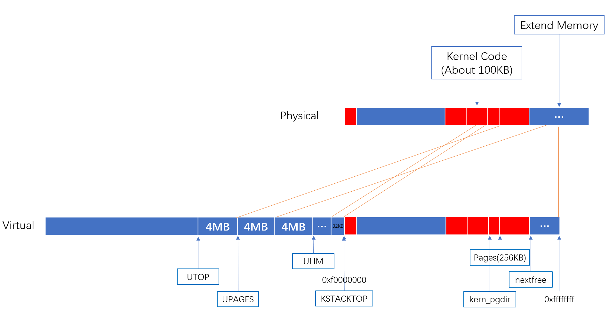

在这个lab中，我们将会在多个同时运行的用户环境中实现抢占式多任务调度。

在Part A部分，我们将为JOS增加多处理器特性，实现轮转(RR)调度，增加用户环境管理的系统调用(创建和销毁环境，分配和映射内存)。

在Part B，我们将会实现一个像Unix里一样的fork()函数，它会允许用户模式环境创建自身的副本。

最后在Part C中，我们将为进程间通信 (inter-process communication IPC)添加支持，允许不同的用户环境显式地彼此进行交流与同步。我们也将为硬件时钟中断和抢占添加支持。

由于这个lab会涉及到内存分配，所以首先来看下这个lab要实现的内存图：


# 1.多处理器

我们将使JOS支持“对称多处理器”(symmetric multiprocessing, SMP)，这是一种多处理器模型，其中所有cpu都具有对系统资源(如内存和I/O总线)的等效访问权。虽然SMP中的所有cpu在功能上都是相同的，但是在引导过程中它们可以分为两种类型:引导处理器(bootstrap processor, BSP)负责初始化系统和引导启动操作系统;只有在操作系统启动并运行之后，BSP才会激活应用程序处理器(the application processors, APs)。哪个处理器是BSP由硬件和BIOS决定。到目前为止，所有现有的JOS代码都在BSP上运行。

在SMP系统中，每个CPU都有一个相应的本地高级中断控制器单元 (local APIC LAPIC)。LAPIC单元负责在整个系统中传输中断。LAPIC还为其连接的CPU提供唯一的标识符。在本实验室中，我们利用了LAPIC单元的以下基本功能(`kern/lapic.c`):

* 读取LAPIC标识符(APIC ID)来判断我们的代码当前运行在哪个CPU上(参见`cpunum()`)。
* 将`STARTUP`中断信号( interprocessor interrupt, IPI)从BSP发送到APs，以打开其他cpu(参见`lapic_startap()`)。
* 在Part C，我们编写LAPIC的内置计时器来触发时钟中断，以支持抢占式的多任务处理(参见`lapic_init()`)。

> ### APIC
> APIC（Advanced Programmable Interrupt Controller）基于分布式结构，分为两个单元，一个是处理器内部的Local APIC单元(LAPIC)，另一个是IO APIC单元，它们两个通过Interrupt Controller Communications (ICC) 总线连接。APIC作用一是减轻了内存总线中关于中断相关流量，二是可以在多处理器里面分担中断处理的负载。
>
> LAPIC提供了 interprocessor interrupts (IPIs),它允许任意处理器中断其他处理器或者设置其他处理器，有好几种类型的IPIs，如INIT IPIs和STARTUP IPIs。每个LAPIC都有一个本地ID寄存器，每个IO APIC都有一个 IO ID寄存器，这个ID是每个APIC单元的物理名称，它可以用于指定IO中断和interprocess中断的目的地址。因为APIC的分布式结构，LAPIC和IO APIC可以是独立的芯片，也可以将LAPIC和CPU集成在一个芯片，如英特尔奔腾处理器（735\90, 815\100），而IO APIC集成在IO芯片，如英特尔82430 PCI-EISA网桥芯片。集成式APIC和分离式APIC编程接口大体是一样的，不同之处是集成式APIC多了一个STARTUP的IPI。

处理器访问它的LAPIC使用的是 MMIO，在MMIO里，一部分内存硬连线到了IO设备的寄存器，因此用于访问内存的load/store指令可以用于访问IO设备的寄存器。比如我们在实验1中用到 0xA0000开始的一段内存作为VGA显示缓存。LAPIC所在物理地址开始于0xFE000000(从Intel的文档和测试看这个地址应该是0xFEE00000)，在JOS里面内核的虚拟地址映射从`KERNBASE`(0xf00000000)来说，这个地址太高了，于是在JOS里面在`MMIOBASE`(0xef800000）地址处留了4MB空间用于MMIO，后面实验会用到更多的MMIO区域，为此我们要映射好设备内存到`MMIOBASE`这块区域，这个过程有点像boot_alloc，注意映射范围判断。


```JavaScript
```
# 2.用户环境

```JavaScript
```
```JavaScript
```
* 
* 
  * 



```JavaScript
```
## 关于ELF文件

**ELF文件结构**

# 2.中断和异常处理

## 2.1 中断/异常概述

```JavaScript
```

## 2.2 中断/异常处理流程


## 2.3 中断/异常处理实例

```javascript        
```
```javascript 
```
```javascript        
```
## 2.4 JOS中的中断/异常处理

```javascript
```
```javascript
```

> ### int指令（软件中断指令）
> 


```javascript
```


# 3.系统调用


> ## 关于CPL, RPL, DPL
> 

> ```javascript
>     用户进程                         内核         
>   
>     用户代码
>	  CPL = 3                       
>     系统调用     ------------->     内核代码
>	 					             CPL = 0
>						   引起系统的调用的用户进程 RPL = 3   ------------->   系统调用函数
>						                                                     DPL = 3(对比RPL，允许调用)
> ```

关于上述系统调用的路径如下：

```javascript
```


```javascript
```

# 4.用户进程


1. https://pdos.csail.mit.edu/6.828/2018/labs/lab4/
2. https://www.jianshu.com/p/fc9a8572a830
3. https://blog.csdn.net/bysui/article/details/51567733
4. https://github.com/Anarion-zuo/AnBlogs/blob/master/6.828/lab4B-page-fault.md
5. https://blog.csdn.net/a747979985/article/details/97513907
6. https://blog.csdn.net/a747979985/article/details/97523753