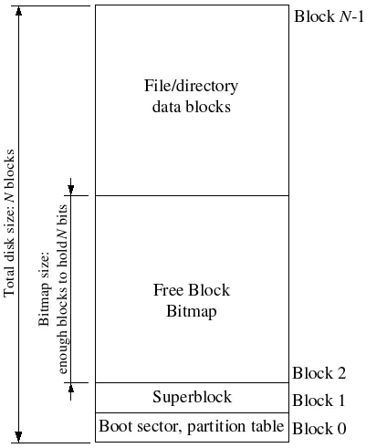
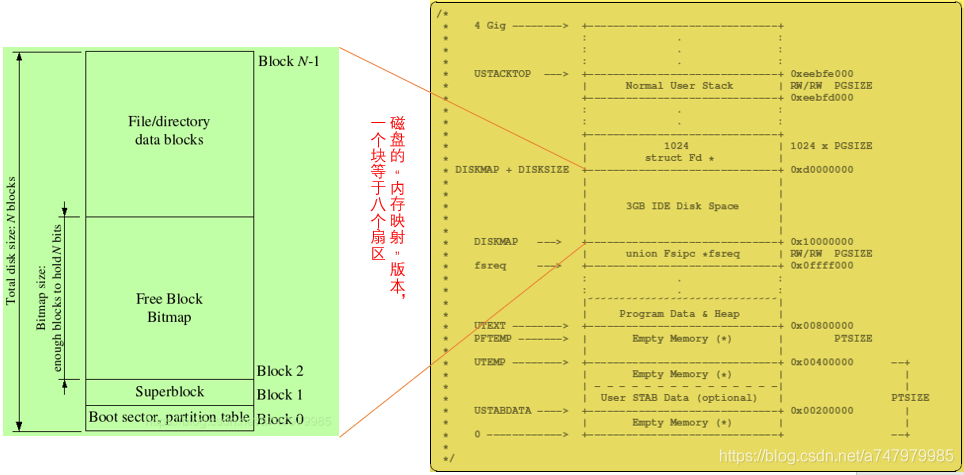
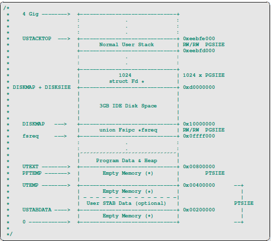

# 1.文件系统

我们将实现的文件系统比大多数“实际”文件系统(包括xv6 UNIX)要简单得多，但是它的功能足够强大，可以提供基本特性:创建、读取、写入和删除按层次目录结构组织的文件。

我们(至少目前)只开发一个单用户操作系统，它提供了足够的保护来捕获bug，但不能保护多个相互怀疑的用户。因此，我们的文件系统不支持UNIX文件所有权或权限的概念。我们的文件系统目前也不像大多数UNIX文件系统那样支持硬链接、符号链接、时间戳或特殊设备文件。

## 1.1 磁盘文件系统结构

大多数UNIX文件系统将可用磁盘空间划分为两种主要区域类型:inode 区域 和 data 区域。UNIX文件系统为文件系统中的每个文件分配一个inode;文件的inode包含关于文件的关键元数据(meta-data)，比如文件类型(常规、目录、符号链接等），权限，文件大小，创建/修改/访问时间，文件数据块信息等，我们运行的ls -l看到的内容，都是存储在inode而不是数据块中的。数据部分通常分为很多数据块，数据块用于存储文件的数据信息以及目录的元数据(目录元数据包括目录下文件的inode，文件名，文件类型等)；如果文件系统中的多个目录条目引用该文件的inode，则该文件被称为硬链接的。由于我们的文件系统不支持硬链接，所以我们不需要这种间接级别，因此可以方便地简化：我们的文件系统根本不使用inode，而只是在描述该文件的(唯一的)目录条目中存储文件(或子目录)的所有元数据。

文件和目录在逻辑上都由一系列数据块组成。它可以分散在磁盘上，就像environment的虚拟地址空间的页面可以分散在物理内存中一样。文件系统环境隐藏了块布局的细节，显示了在文件中任意偏移量处读取和写入字节序列的接口。文件系统环境在内部处理对目录的所有修改，作为执行文件创建和删除等操作的一部分。我们的文件系统允许用户环境直接读取目录元数据(例如，使用read)，这意味着用户环境可以自己执行目录扫描操作(例如，实现ls程序)，而不必依赖于对文件系统的额外特殊调用。这种目录扫描方法的缺点(也是大多数现代UNIX变体不支持这种方法的原因)是，它使应用程序依赖于目录元数据的格式，使得在不更改或至少重新编译应用程序的情况下更改文件系统的内部布局非常困难。

## 1.2 磁盘扇区、数据块、超级块

扇区是磁盘的物理属性，通常一个扇区大小为512字节，而数据块则是操作系统使用磁盘的一个逻辑属性，一个块大小通常是扇区的整数倍。UNIX xv6文件系统使用512字节的块大小，与底层磁盘的扇区大小相同。然而，大多数现代文件系统使用更大的块，因为存储空间变得更便宜，而且在更大粒度上管理存储更有效。我们的JOS文件系统将使用4096字节的块大小，方便地匹配处理器的页面大小。

文件系统通常将某些磁盘块保留在磁盘上某个"容易找到"的地方(例如最开始或者最末端)去保存描述整个文件系统属性的元数据，比如block size、disk size、查找root directory所需的任何元数据、最后一次挂载文件系统的时间、最后一次检查文件系统是否出错的时间等等。这些特殊的块就是superblocks。

我们的文件系统将只有一个超级块，它总是在磁盘上的block 1(第二块)。它的布局是由struct Super在`inc/fs.h`中定义的。block 0通常保留用于保存boot loaders和partition tables(分区表)，因此文件系统通常不使用第一个磁盘块。许多常用的文件系统有多个超级块，这些超级块复制到磁盘的多个widely-space(宽间距)区域，因此，如果其中一个超级块损坏了，或者磁盘在该区域出现了错误，仍然可以找到其他超级块，并使用它们访问文件系统。



## 1.3 文件元数据

文件系统中描述文件的元数据的布局由`inc/fs.h`中的struct file描述。这个元数据包括文件的名称、大小、类型(常规文件或目录)和指向组成文件的块的指针。如上所述，我们没有inode，所以这个元数据存储在磁盘上的目录条目中。与大多数文件系统不同，为了简单起见，我们将使用这个File structure来表示文件元数据，因为它同时出现在磁盘和内存中。

```javascript
struct File {
	char f_name[MAXNAMELEN];	// filename
	off_t f_size;			// file size in bytes
	uint32_t f_type;		// file type

	// Block pointers.
	// A block is allocated iff its value is != 0.
	uint32_t f_direct[NDIRECT];	// direct blocks
	uint32_t f_indirect;		// indirect block

	// Pad out to 256 bytes; must do arithmetic in case we're compiling
	// fsformat on a 64-bit machine.
	uint8_t f_pad[256 - MAXNAMELEN - 8 - 4*NDIRECT - 4];
} __attribute__((packed));	// required only on some 64-bit machines
```

struct File中的f_direct数组包含存储文件前10个(NDIRECT)块的块号的空间，我们称之为文件的直接块。对于大小高达10*4096B = 40KB的小文件，这意味着所有文件块的块号将直接适合File structure 本身。但是，对于较大的文件，我们需要一个地方来保存文件的其余块号。因此，对于任何大于40KB的文件，我们分配一个额外的磁盘块，称为文件的间接块，以容纳4096/4 = 1024个额外的块号。

因此，我们的文件系统允许文件的大小最多为1034块，即超过4MB一点点。为了支持更大的文件，真正的文件系统通常还支持双间接块和三间接块。


## 1.4 文件和目录

文件系统中的File structure既可以表示普通文件，也可以表示目录;这两种类型的“files”由文件结构中的type字段来区分。文件系统以完全相同的方式管理常规文件和目录文件，唯一区别是对常规文件，文件系统并不解析数据块内容，而对于目录，则会将数据内容解析为 struct File 的格式。

我们的文件系统中的superblock含一个File structure(struct Super中的root字段)，它保存文件系统根目录的元数据。这个目录文件的内容是描述文件系统根目录中的文件和目录的File structure序列。根目录中的任何子目录都可能包含更多表示子目录的文件结构，依此类推。

# 2.文件系统实现

本实验我们要完成的功能包括：

* 读取磁盘中的数据块到块缓存以及将块缓存中的数据刷回磁盘。
* 分配数据块。
* 映射文件偏移到磁盘数据块。
* 在IPC接口实现文件的open，read，write，close。

## 2.1 磁盘访问

不同于Linux等系统那样增加一个磁盘驱动并添加相关系统调用实现磁盘访问，JOS的磁盘驱动是用用户级程序实现的，当然还是要对内核做一点修改，以支持文件系统进程(用户级进程)有权限访问磁盘。

在用户空间访问磁盘可以通过轮询的方式实现，而不是使用磁盘中断的方式，因为使用中断的方式会复杂不少。x86处理器使用 EFLAGS 寄存器的 IOPL 位来控制磁盘访问权限(即IN和OUT指令)，用户代码能否访问IO空间就通过该标志来设置。JOS在`i386_init()`中运行了一个用户级的文件系统进程，该进程需要有磁盘访问权限。因此作业1就是在 `env_create` 中对 文件系统进程 这个特殊的运行在用户级的进程设置 IOPL 权限，而其他的用户进程不能设置该权限，根据进程类型设置权限即可。

## 2.2 块缓存

我们的文件系统将仅限于处理3GB或更小的磁盘。我们保留文件系统environment的地址空间的一个大的、固定的3GB区域，从0x10000000 (DISKMAP)到0xD0000000 (DISKMAP+DISKMAX)，作为磁盘的“内存映射”版本。下面是文件系统环境的虚拟内存空间:[感谢 bysui的图](https://blog.csdn.net/bysui/article/details/51868917)



将整个磁盘读取到内存中要花很长时间，所以只有在发生页面错误时，我们才在磁盘映射区域分配页和从磁盘读取相应的块(ide_read函数)。

在`fs_init`设置bitmap指针后，可以认为bitmap就是一个位数组，每个块占据一位。可以通过 `block_is_free` 检查块位图中的对应块是否空闲，如果为1表示空闲，为0已经使用。JOS中第0，1，2块分别给bootloader，superblock以及bitmap使用了。此外，因为在文件系统中加入了user目录和fs目录的文件，导致JOS文件系统一共用掉了0-110这111个文件块，下一个空闲文件块从111开始。

## 2.3 文件操作

关于文件操作相关的几个结构体要说明下：

* `struct File` 用于存储文件元数据，前面提到过。

* `struct Fd` 用于文件模拟层，类似文件描述符，如文件ID，文件打开模式，文件偏移都存储在Fd中。一个进程同时最多打开 MAXFD(32) 个文件。

* 文件系统进程还维护了一个打开文件的描述符表，即opentab数组，数组元素为 `struct OpenFile`。OpenFile结构体用于存储打开文件信息，包括文件ID，struct File以及struct Fd。JOS同时打开的文件数一共为 MAXOPEN(1024) 个。

* 还有`union Fsipc`，文件系统中客户端和服务端通过IPC进行通信，通信的数据格式就是`union Fsipc`，它里面的每一个成员对应一种文件系统的操作请求。每次客户端发来请求，都会将参数放入一个`union Fsipc`映射的物理页到服务端。同时服务端还会将处理后的结果放入到Fsipc内，传递给客户端。

```javascript
//inc/fs.h
struct File {
	char f_name[MAXNAMELEN];	// filename
	off_t f_size;			// file size in bytes
	uint32_t f_type;		// file type

	// Block pointers.
	// A block is allocated iff its value is != 0.
	uint32_t f_direct[NDIRECT];	// direct blocks
	uint32_t f_indirect;		// indirect block

	// Pad out to 256 bytes; must do arithmetic in case we're compiling
	// fsformat on a 64-bit machine.
	uint8_t f_pad[256 - MAXNAMELEN - 8 - 4*NDIRECT - 4];
} __attribute__((packed));	// required only on some 64-bit machines


//inc/fd.h
struct Fd {
	int fd_dev_id;
	off_t fd_offset;
	int fd_omode;
	union {
		// File server files
		struct FdFile fd_file;
	};
};


//fs/serv.c
struct OpenFile {
	uint32_t o_fileid;	// file id
	struct File *o_file;	// mapped descriptor for open file
	int o_mode;		// open mode
	struct Fd *o_fd;	// Fd page
};


//inc/fs.h
union Fsipc {
	struct Fsreq_open {
		char req_path[MAXPATHLEN];
		int req_omode;
	} open;
	struct Fsreq_set_size {
		int req_fileid;
		off_t req_size;
	} set_size;
	struct Fsreq_read {
		int req_fileid;
		size_t req_n;
	} read;
	struct Fsret_read {
		char ret_buf[PGSIZE];
	} readRet;
	struct Fsreq_write {
		int req_fileid;
		size_t req_n;
		char req_buf[PGSIZE - (sizeof(int) + sizeof(size_t))];
	} write;
	struct Fsreq_stat {
		int req_fileid;
	} stat;
	struct Fsret_stat {
		char ret_name[MAXNAMELEN];
		off_t ret_size;
		int ret_isdir;
	} statRet;
	struct Fsreq_flush {
		int req_fileid;
	} flush;
	struct Fsreq_remove {
		char req_path[MAXPATHLEN];
	} remove;

	// Ensure Fsipc is one page
	char _pad[PGSIZE];
};
```

在 `fs/fs.c` 中还有很多文件操作相关的函数:

* file_block_walk(struct File *f, uint32_t filebno, uint32_t **ppdiskbno, bool alloc)

  这个函数是查找文件第filebno块的数据块的地址，查到的地址存储在 ppdiskbno 中。注意这里要检查间接块，如果alloc为1且寻址的块号>=NDIRECT，而间接块没有分配的话需要分配一个间接块。

* file_get_block(struct File *f, uint32_t filebno, char **blk)

  查找文件第filebno块的块地址，并将块地址在虚拟内存中映射的地址存储在 blk 中(即将diskaddr(blockno)存到blk中)。

* dir_lookup(struct File *dir, const char *name, struct File **file)

  在目录dir中查找名为name的文件，如果找到了设置*file为找到的文件。因为目录的数据块存储的是struct File列表，可以据此来查找文件。

* file_open(const char *path, struct File **pf)

  打开文件，设置*pf为查找到的文件指针。

* file_create(const char *path, struct File *pf)
  创建路径/文件，在pf存储创建好的文件指针。

* file_read(struct File *f, void *buf, size_t count, off_t offset)

  从文件的offset处开始读取count个字节到buf中，返回实际读取的字节数。

* file_write(struct File *f, const void *buf, size_t count, off_t offset)

  从文件offset处开始写入buf中的count字节，返回实际写入的字节数。

文件服务端进行的地址空间布局如下(图源自[bysui](https://blog.csdn.net/bysui/article/details/51868917)：



通过IPC来实现JOS的文件系统操作的流程图如下所示：

```javascript
 Regular env           FS env
   +---------------+   +---------------+
   |      read     |   |   file_read   |
   |   (lib/fd.c)  |   |   (fs/fs.c)   |
...|.......|.......|...|.......^.......|...............
   |       v       |   |       |       | RPC mechanism
   |  devfile_read |   |  serve_read   |
   |  (lib/file.c) |   |  (fs/serv.c)  |
   |       |       |   |       ^       |
   |       v       |   |       |       |
   |     fsipc     |   |     serve     |
   |  (lib/file.c) |   |  (fs/serv.c)  |
   |       |       |   |       ^       |
   |       v       |   |       |       |
   |   ipc_send    |   |   ipc_recv    |
   |       |       |   |       ^       |
   +-------|-------+   +-------|-------+
           |                   |
           +-------------------+
```

以read为例来看下整个操作的流程图：

首先客户端调用`open`通过文件描述符打开文件，先通过 `fd_alloc()` 分配一个文件描述符，然后在文件描述符fd 处接收fs进程的IPC页，分配的fd的地址为 (0xD0000000 + i * PGSIZE)。

然后调用`read`：

```javascript
ssize_t
read(int fdnum, void *buf, size_t n)
{
	int r;
	struct Dev *dev;
	struct Fd *fd;

	if ((r = fd_lookup(fdnum, &fd)) < 0
	    || (r = dev_lookup(fd->fd_dev_id, &dev)) < 0)
		return r;
	if ((fd->fd_omode & O_ACCMODE) == O_WRONLY) {
		cprintf("[%08x] read %d -- bad mode\n", thisenv->env_id, fdnum);
		return -E_INVAL;
	}
	if (!dev->dev_read)
		return -E_NOT_SUPP;
	return (*dev->dev_read)(fd, buf, n);
}
```
`read`函数根据fdnum在内存空间0xD0000000以上找到相应的`struct Fd`页面，将fd指针指向该页面，页面内保存着一个`open file`的基本信息。然后根据fd内的`fd_dev_id`找到对应设备dev，很明显这里是devfile，然后调用(*devfile->dev_read)(fd, buf, n)。该函数返回读到的字节总数:

```javascript
static ssize_t
devfile_read(struct Fd *fd, void *buf, size_t n)
{
	// Make an FSREQ_READ request to the file system server after
	// filling fsipcbuf.read with the request arguments.  The
	// bytes read will be written back to fsipcbuf by the file
	// system server.
	int r;

	fsipcbuf.read.req_fileid = fd->fd_file.id;
	fsipcbuf.read.req_n = n;
	if ((r = fsipc(FSREQ_READ, NULL)) < 0)
		return r;
	assert(r <= n);
	assert(r <= PGSIZE);
	memmove(buf, fsipcbuf.readRet.ret_buf, r);
	return r;
}
```

`devfile_read`函数在IPC共享的页面上的`union Fsipc`中存储请求的参数。在客户端，我们总是在fsipcbuf共享页面。设置好fsipcbuf的参数，调用fsipc去向服务器端发送read请求。请求成功后结果也是保存在共享页面fsipcbuf中，然后读到指定的buf就行。

```javascript
static int
fsipc(unsigned type, void *dstva)
{
	static envid_t fsenv;
	if (fsenv == 0)
		fsenv = ipc_find_env(ENV_TYPE_FS);

	static_assert(sizeof(fsipcbuf) == PGSIZE);

	if (debug)
		cprintf("[%08x] fsipc %d %08x\n", thisenv->env_id, type, *(uint32_t *)&fsipcbuf);

	ipc_send(fsenv, type, &fsipcbuf, PTE_P | PTE_W | PTE_U);
	return ipc_recv(NULL, dstva, NULL);
}
```

`fsipc`函数就是负责跟文件系统server进程间通信的。发送请求并接受结果。通过`ipc_send`向文件服务端发送请求，然后运行`ipc_recv`等待文件服务端返回的请求结果。

```javascript
void
serve(void)
{
	uint32_t req, whom;
	int perm, r;
	void *pg;

	while (1) {
		perm = 0;
		req = ipc_recv((int32_t *) &whom, fsreq, &perm);
		if (debug)
			cprintf("fs req %d from %08x [page %08x: %s]\n",
				req, whom, uvpt[PGNUM(fsreq)], fsreq);

		// All requests must contain an argument page
		if (!(perm & PTE_P)) {
			cprintf("Invalid request from %08x: no argument page\n",
				whom);
			continue; // just leave it hanging...
		}

		pg = NULL;
		if (req == FSREQ_OPEN) {
			r = serve_open(whom, (struct Fsreq_open*)fsreq, &pg, &perm);
		} else if (req < ARRAY_SIZE(handlers) && handlers[req]) {
			r = handlers[req](whom, fsreq);
		} else {
			cprintf("Invalid request code %d from %08x\n", req, whom);
			r = -E_INVAL;
		}
		ipc_send(whom, r, pg, perm);
		sys_page_unmap(0, fsreq);
	}
}
```

此时文件服务端一直在轮询`ipc_recv`等待客户端的请求，一旦接收到请求，查看ipc_recv的返回值，应该是32位的env_ipc_value，即fsipc里ipc_send过来的type，根据这个type判断进入哪个处理函数，这里很明显type==FSREQ_READ

```javascript
int
serve_read(envid_t envid, union Fsipc *ipc)
{
	struct Fsreq_read *req = &ipc->read;
	struct Fsret_read *ret = &ipc->readRet;

	if (debug)
		cprintf("serve_read %08x %08x %08x\n", envid, req->req_fileid, req->req_n);

	// Lab 5: Your code here:
	struct OpenFile *o;
	int r;
	if ((r = openfile_lookup(envid, req->req_fileid, &o)) < 0)
		return r;
	if ((r = file_read(o->o_file, ret->ret_buf, ipc->read.req_n, o->o_fd->fd_offset)) < 0)
		return r;
	o->o_fd->fd_offset += r;
	return r;
}
```

`serve_read`函数首先找到ipc->read->req_fileid对应的OpenFile，然后调用file_read去读内容到ipc->readRet->ret_buf

```javascript
ssize_t
file_read(struct File *f, void *buf, size_t count, off_t offset)
{
	int r, bn;
	off_t pos;
	char *blk;

	if (offset >= f->f_size)
		return 0;

	count = MIN(count, f->f_size - offset);

	for (pos = offset; pos < offset + count; ) {
		if ((r = file_get_block(f, pos / BLKSIZE, &blk)) < 0)
			return r;
		bn = MIN(BLKSIZE - pos % BLKSIZE, offset + count - pos);
		memmove(buf, blk + pos % BLKSIZE, bn);
		pos += bn;
		buf += bn;
	}

	return count;
}
```

`file_read函数`将文件f从offset开始的count个字节读入buf中。但是count可能大于f->f_size-offset，那么最多也只能把文件剩余部分读出。


## 2.4 Spawning 进程

spawn代码用于创建一个子进程，然后从磁盘中加载一个程序代码镜像并在子进程运行加载的程序。这有点类似Unix的fork+exec，但是又有所不同，因为我们的spawn进程运行在用户空间，我们通过一个新的系统调用 `sys_env_set_trapframe`简化了一些操作。

`Spawn(prog, argv)`会根据路径prog打开文件，从文件中获取二进制映像elf header，然后根据elf header完成其内存空间的加载。主要是要设好agrv[]数组，这样可以设好子环境的用户栈，方便子环境执行时从中获得所需参数。

Spawn跟fork的区别是，fork出的子环境跟父环境除了返回值外，上下文跟内存空间都几乎一模一样。而Spawn出的子环境会从文件中加载内存空间，跟父环境完全不一样，而且eip、esp、用户栈都不一样，但是SHARE权限页面是共享的


1. https://pdos.csail.mit.edu/6.828/2018/labs/lab5/
2. https://www.jianshu.com/p/e894b3660d75
3. https://github.com/shishujuan/mit6.828-2017/blob/master/docs/lab5-exercize.md
4. https://blog.csdn.net/a747979985/article/details/99712515
5. https://blog.csdn.net/a747979985/article/details/99551678
6. https://blog.csdn.net/bysui/article/details/51868917