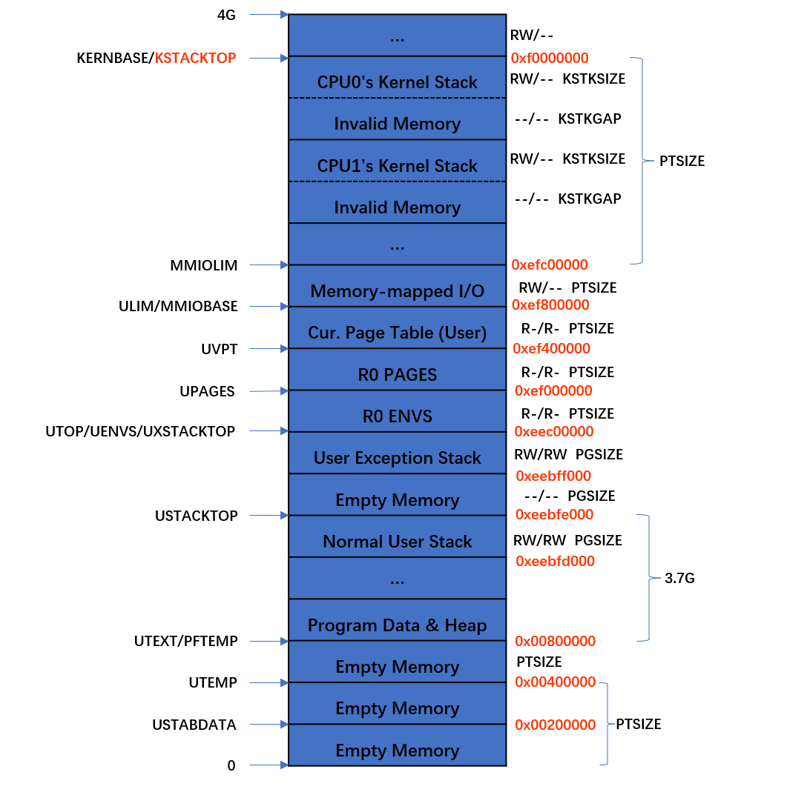

# 1.多处理器

## 1.1 多处理器支持

## 1.2 AP启动流程

## 1.3 cpu初始化

## 1.4 内核锁

## 1.5 轮转调度

## 1.6 创建进程的系统调用

# 2.写时复制(Copy-on-Write Fork)

## 2.1 用户程序页面错误处理

## 2.2 用户程序页面错误处理流程

## 2.3 用户进程异常栈和常规栈

## 2.4 调用用户页面错误处理函数

## 2.5 写时复制总流程

# 3.抢占式调度和进程间通信

## 3.1 时钟中断

## 3.2 进程间通信

1. https://pdos.csail.mit.edu/6.828/2018/labs/lab5/
2. https://www.jianshu.com/p/e894b3660d75
3. https://github.com/shishujuan/mit6.828-2017/blob/master/docs/lab5-exercize.md
4. https://blog.csdn.net/a747979985/article/details/99712515
5. https://blog.csdn.net/a747979985/article/details/99551678
6. https://blog.csdn.net/bysui/article/details/51868917