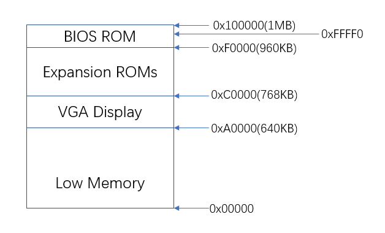

>mit6.828的系统启动分为两个部分，分别是BIOS和Boot Loader的启动。主机通电时，首先启动BIOS，BIOS将带领CPU识别并加载主板上的重要硬件和集成元件，如硬盘、显卡、声卡以及各种接口，然后按照预设顺序读取存储器上操作系统的引导文件Boot Loader。在我们的实验中，Boot Loader程序会在编译成可执行文件后被放在模拟硬盘的第一个扇区。

# 1.BIOS启动流程

BIOS(Basic Input Output System)"基本输入输出系统"，它是一组固化到主板上一个ROM芯片上的程序，使用汇编语言编写。PC通电后，CPU马上就从地址0xFFFF0处开始执行指令，这个地址在系统BIOS的地址范围内，将BIOS程序加载到内存中执行，BIOS接下来的作用包括机器自检，对系统进行初始化，识别并加载主板上的重要硬件和集成元件，如硬盘、显卡、声卡以及各种接口，然后按照**预设顺序**读取存储器上操作系统的引导文件Boot Loader，储存Boot Loader的存储器可以是软盘、硬盘、CD-ROM甚至是网络输入，可以在BIOS的设置页面更改读取Boot Loader的搜索顺序。

那么在这其中就有一个问题，那就是，BIOS程序是固化到自己的ROM芯片中的，那CPU是如何在刚通电的情况下就能读取到BIOS程序并且运行的？再者，上段的说法也有些问题，“CPU马上就从地址0xFFFF0处开始执行指令，这个地址在系统BIOS的地址范围内”，那地址0xFFFF0指的是什么地址？是外加内存条RAM的内存地址还是储存BIOS程序的ROM地址？这又涉及到现代PC的内存地址是如何编排的。我也是查了很多资料才摸到一些门道，下面的说法糅合了我从网上搜索的资料和自己的整合以及猜测，**不保证正确**，仅为缕清自己的思路。

在计算机通电完成之后，CPU会自动将其CS寄存器设定为0xFFFF，IP寄存器设定为0x0000。关于CS寄存器和IP寄存器的介绍可以看文末的链接6，简单来说CS是代码段寄存器，IP是指令指针寄存器(相当于偏移地址)，而CPU在访问内存的时候访问的是物理内存地址，而这个物理地址就是由CS和IP这两个寄存器中的值合成的(物理地址=段地址X16+偏移地址)。所以如果将CS寄存器设定为0xFFFF，IP寄存器设定为0x0000，那么这时的物理地址就=0xFFFF*16+0x0000=0xFFFF0，而在0xFFFF0存放的是什么呢？其实是一条无条件转移指令JMP，这个JMP会将程序跳转到BIOS真正的入口点。至于跳转到哪里，那么不同的BIOS会有不同的跳转地址。



上图为8086的内存架构，我们来详细讨论一下：早期基于16位英特尔8086处理器的个人电脑，只能寻址1MB的物理内存。因此，早期计算机的物理地址空间将从0x00000000开始，以0x000FFFFF结束。用户能够使用的内存地址只有标记为“低内存”的640KB区域(Low Memory)，而之后从0x000A0000到0x00100000的384KB空间则被预留为硬件以及ROM的地址，用户不可用。具体可以看下图:


从上图可以看到，0xF0000到0x100000的地址范围便进入到了真正的BIOS的区域，而在这个区域中，BIOS又是以何种方式存在的呢？我们上面说到，计算机通电后，CPU会到0xFFFF0的位置执行，而0xFFFF0这个位置处在BIOS地址范围中，它只占0xFFFF0到0x100000短短的16B。这个地址处存放的只是一个跳转指令，它会将CPU跳转至真正的BIOS程序开始的位置，这个位置在不同的BIOS中是不同的。这里引用一个比较清晰的描述：

8086是16位的CPU，但是却有20根地址线。也就是说它可以寻址1MB内存空间。这段内存空间由RAM、ROM组成。ROM是随机只读存储器，里面的程序是在计算机出厂的时候直接烧录在里面的，完成一些主机自检等操作，并提供一些访问磁盘等基本输入输出服务，因而这段程序常被称为BIOS(Basic Input/Ouput Service)。由于不同的计算机厂商生产的计算机所带的外设不一样，因此，这段程序大小也限机型的不同而不一样，有可能A厂出产的计算机所带的这段程序的大小为1K，而B厂出产的这段程序的大小为2K。如果将这段程序放在0x0000处，那么用户写的程序就可能从0x0400处开始也可能从0x0800处开始，非常不统一。故而，将此段程序放在1M内存的顶部，那么用户写的程序就都可以从0x0000处开始了。

但将BIOS这段程序放在1M内存的顶部，如果这段程序大小为1K，那么应当从0xFFC00开始放。如果这段程序的大小为2K，那应当从0xFF800开始放，对于CPU而言，到底是应当从0xFFC00开始执行还是应当从0xFF800开始执行呢？为了解决这个问题，8086规定，CPU均从0xFFFF0处开始执行，而在0xFFFF0处，放一条无条件转移指令JMP。如果A厂的BIOS是从0xFFC00开始放的，那么这条转移指令就跳转到0xFFC00处开始执行。如果B厂的BIOS是从0xFF800开始放的，那么这条转移指令就跳转到0xFF800处开始执行，各个厂家可以根据自己所生产的BIOS程序的大小，来决定此转移指令具体跳转到的位置。

这里有一点需要清楚的是，通常认为，内存编址是连续的，不会出现空洞，其实完全不是这样。比如，假设BIOS的编址是从 0xF0000开始，而RAM，即通常讲的内存编址是从0x00000开始，那么，如果用户只安装了32K内存，那么内存的编址范围就是0x00000~0x07FFF，那么从0x08000至0xEFFFF处就没有安装内存，这就是一个内存空洞。


原文在[这里](https://www.cnblogs.com/wsw-seu/p/10475956.html)

>## 位数，地址总线以及寻址范围
>这里还需要解释一下处理器的位数，地址总线以及寻址范围的关系：处理器的位数指的是处理器能够一次性处理的数据大小，比如早期的16位Intel 8086处理器，它能够一次性处理的最大数据为$2^{16} = 65536$以内的数，而超过这个大小的数则需要分高低位来进行处理。还比如后来的32位Intel Pentium 4处理器，它能够一次性处理的最大数据为$2^{32}$以内的数，而现在大多数处理器已经是64位的了，这意味这它们能处理的最大数更大，运行速度更快；而地址总线便决定了寻址范围，比如8086是20为地址总线，则它的最大寻址地址便是$2^{20}B = 1MB$，目前大多数个人电脑的地址总线都是32位的，这意味着它们的最大寻址范围达到了$2^32B = 4GB$，下表是这三者之间的关系：

|           | Intel 8086  | Intel Pentium 4     | 新兴64位处理器  |
| :---:     |    :----:   |      :----:         |     :----:     |
| 字长      |      16     |         32          |        64      |
|数据总线    |      16     |         32          |        64      |
|地址总线    |      20     |         32          |        32      |
|寻址范围    |     1MB     |        4GB          |       4GB      |
>需要清楚的是，不管是8、16、32、64CPU，RAM存储器的地址分配永远是以字节为单位，也就是给每一个字节的存储单元分配一个地址。如果MCU有32条地址线，则最多有$2^{32} = 4G$个地址编码，给存储器中的每个字节单元一个地址编码，则最多可以支持$2^{32}Byte=4GB$。如果MCU的数据线是32位，则一次读写操作可以同时传送4个字节(一个字，32位机一个字是32位，也就是4个字节)，也就是4个连续地址的存储器空间(对齐，4倍数开始的连续的4个地址)。


# 2.Boot Loader
个人电脑的软盘和硬盘被分为一个个512B的区域，称为扇区。扇区是磁盘的最小传输粒度：每个读写操作必须是一个或多个扇区，并在扇区边界上对齐。Boot Loader程序代码所在的磁盘称为引导磁盘，它的第一个扇区称为引导扇区，因为这是引导加载程序代码所在的位置。而存放在第一个扇区的Boot Loader加载程序的大小不能超过510个字节，由于磁盘的一个扇区的大小为512字节，这样便保证了bootloader仅仅只占据磁盘的第一个扇区。

在经过BIOS对系统进行初始化之后，它会按照**预设顺序**读取存储器上操作系统的引导文件Boot Loader，将其加载到内存中进行读取。那么BIOS是如何寻找并且判断Boot Loader的位置呢？BIOS按顺序检查磁盘的第一个扇区，如果该扇区的最后两个字节是"55 aa"，那么这就是一个引导扇区，这个磁盘也就是一块可引导盘。通常这个大小为512B的程序就称为引导程序(Boot Loader)。如果最后两个字节不是"55 aa"，那么BIOS就检查下一个磁盘驱动器，这个检查顺序也是可以在BIOS中设置的。当BIOS找到可引导软盘或硬盘时，它将512字节的引导扇区加载到物理地址0x7c00到0x7dff的内存中，然后使用jmp指令将CS：IP设置为0000：7c00，将控制传递给引导加载程序。

至于为什么要将Boot Loader放到0x7c00处，是出于历史原因，IBM最早的个人电脑IBM PC 5150用的是Intel最早的个人电脑芯片8088，当时，搭配的操作系统是86-DOS。这个操作系统需要的内存最少是32KB。内存地址从0x0000开始编号，32KB的内存就是0x0000～0x7FFF。8088芯片本身预留了地址空间0x0000～0x03FF用来保存各种中断向量的储存位置。所以，内存只剩下0x0400～0x7FFF可以使用。为了把尽量多的连续内存留给操作系统，Boot Loader就被放到了内存地址的尾部。由于Boot Loader所在的这个扇区是512字节，另外Boot Loader数据和栈需要预留512字节。所以，Boot Loader加载位置是0x7FFF - 512 - 512 + 1 = 0x7c00，而且因为操作系统加载完成后Boot Loader不需要再使用，这部分内存之后操作系统是可以重复利用的。

在6.282实验中，我们所用的Boot Loader由一个程序集语言源文件boot/boot.S，和一个C源文件boot/main.c组成。实验中编译好的Boot Loader位于obj/boot/boot，我们可以使用vim打开它然后转换到16进制视图进行查看。
```JavaScript
00000000: fafc 31c0 8ed8 8ec0 8ed0 e464 a802 75fa  
00000010: b0d1 e664 e464 a802 75fa b0df e660 0f01 
........
000001e0: 0000 0000 0000 0000 0000 0000 0000 0000
000001f0: 0000 0000 0000 0000 0000 0000 0000 55aa 
```
可以看到，boot文件确实是以"55 aa"结尾的。

boot.S主要是将处理器从实模式转换到32位的保护模式，因为只有在保护模式中我们才能访问到物理内存高于1MB的空间。main.c的主要作用是将内核的可执行代码从硬盘镜像中读入到内存中，具体的方式是运用x86专门的I/O指令读取。

>## 实模式和保护模式
>实模式采用 16 位寻址模式，在该模式中，最大寻址空间为 1MB 。由于处理器的设计需要考虑到兼容问题，8086处理器地址总线扩展到 20 位，但 CPU 的数据总线却只有 16 位，也就是说直接参与运算的数值都是16位的。为支持 1MB 寻址空间，8086处理器在实模式下引入了分段方法。在处理器中设置了四个 16 位的段寄存器:CS、DS、SS、ES，对应于地址总线中的高 16 位。寻址时，采用以下公式计算实际访问的物理内存地址，这样，便实现了 16 位内存地址到 20 位物理地址的转换。例如，我想寻址 0xfe05b 的内存地址，但是我的 16 位 CPU 最大只能接受 0xffff 的数值，于是我就采用两个 16 位的段寄存器，一个存高位 0xf000 ，另一个存低位 0xe05b ，这样我就可以寻址到 16 * 0xf000 + 0xe05b = 0xfe05b 的内存地址。
```
实际物理地址 = (段寄存器 << 4) + 偏移地址 
```
>在保护模式下，段式寻址可用 xxxx:yyyyyyyy 表示。其中xxxx表示索引，也就是段选择子，是 16 位的。 yyyyyyyy 是偏移量，是 32 位的.分段机制是利用一个称作段选择子的偏移量到全局描述符表中找到需要的段描述符，而这个段描述符中就存放着真正的段的物理首地址，然后再加上偏移地址量便得到了最后的物理地址。需要指出的是，在 32 位平台上，段物理首地址和偏移址都是 32 位的，实际物理地址的计算不再需要将段首地址左移 4 位了，直接相加即可，如果发生溢出的情况，则将溢出位舍弃。


1. https://www.jianshu.com/p/af9d7eee635e
2. https://blog.csdn.net/rongwenbin/article/details/18962057
3. https://baike.baidu.com/item/BIOS%E5%BD%B1%E5%AD%90%E5%86%85%E5%AD%98
4. https://blog.csdn.net/hwxlovezy/article/details/53454305
5. https://www.cnblogs.com/wsw-seu/p/10475956.html
6. https://blog.csdn.net/weixin_37924880/article/details/78644659
7. https://www.zhihu.com/question/311449926
8. https://www.cnblogs.com/chanchan/p/7648490.html