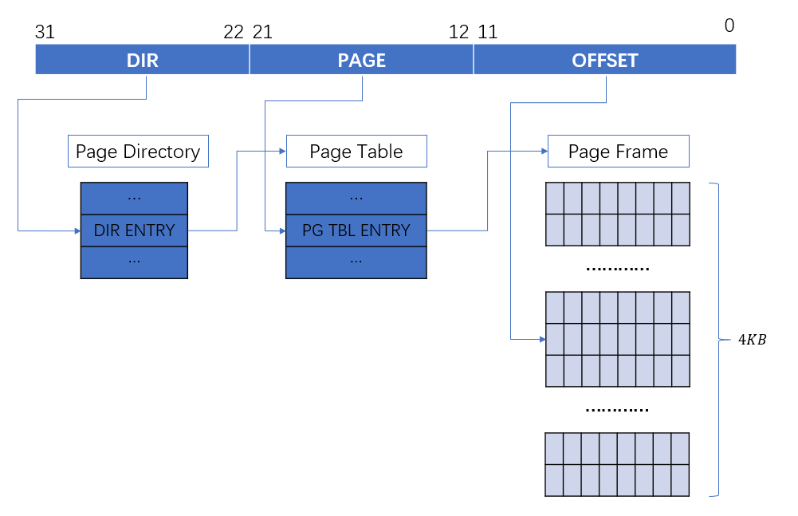

# 1.函数回顾

在lab1和lab2中，我们实现了很多函数，在进行lab3之前，我们先对这些函数进行一下总结。

```JavaScript
宏
KERNBASE 0xF0000000 //被映射的基准地址，即物理地址+KERNBASE=虚拟地址
KADDR(pa)           //宏函数，将物理地址pa转换为虚拟地址，即pa+KERNBASE
PADDR(kva)          //宏函数，将虚拟地址kva转换为物理地址，即kva-KERNBASE
PTE_ADDR(pte)       //取出page table entry或者page directory entry中的地址
PDX(la)             //取出虚拟地址la中包含的page directory index

函数
//将pp转换为物理地址
static inline phtsaddr_t page2pa(struct PageInfo *pp)
//将pp转换为虚拟地址
static inline phtsaddr_t page2kva(struct PageInfo *pp)
//将物理地址pa转换为页指针
static inline struct PageInfo* pa2page(physaddr_t pa)
//初始的内存分配器，返回n字节的虚拟内存地址，不初始化内存；n为0时，返回下一可用页的地址
static void* boot_alloc(uint32_t n)   
//正式的页分配器，分配一页的内存，如果(alloc_flags & ALLOC_ZERO)，则初始化分配的空间
struct PageInfo* page_alloc(int alloc_flags)
//释放pp指向的页
void page_free(struct PageInfo *pp)
//给定虚拟地址va和page directory pgdir，返回虚拟地址在这个pgdir下的page table entry
//若page table不存在且create == true，则新建page table
pte_t* pgdir_walk(pde_t *pgdir, const void *va, int create)
//将虚拟地址[va, va + size] 映射至物理地址[pa, pa + size]上，pgdir为使用的page directory
static void boot_map_region(pde_t *pgdir, uintptr_t va, size_t size, physaddr_t pa, int perm)
//返回虚拟地址va所对应的页指针
//若pte_store不为0，将va对应的page table entry储存至其中
struct PageInfo* page_lookup(pde_t *pgdir, void *va, pte_t **pte_store)
//删除虚拟地址va的映射
void page_remove(pde_t *pgdir, void *va)
//将虚拟地址va映射至物理页地址pp
int page_insert(pde_t *pgdir, struct PageInfo *pp, void *va, int perm)
```


完成part1后，我们的内存使用情况如下：


我们接着看`mem_init`函数，part1我们已经分析到了`check_page`函数。接下来执行到了`check_kern_pgdir`函数：


# 2.内存分配

在之后的实验中，我们将会经常遇到一种情况，多个不同的虚拟地址被同时映射到相同的物理页上面。这时我们需要记录一下每一个物理页上存在着多少不同的虚拟地址来引用它，这个值存放在这个物理页的`PageInfo`结构体的`pp_ref`成员变量中。当这个值变为0时，这个物理页才可以被释放。

`check_page`函数是一个测试页面表管理例程，要使这个函数成功运行，我们首先需要完成 exercise4 中的几个函数，下面我们来详细分析一下这几个函数。

## `pgdir_walk()`

这个函数的原型是 `pgdir_walk(pde_t *pgdir, const void *va, int create)`，该函数的功能:给定一个页目录表指针 `pgdir` ，该函数应该返回线性地址`va`所对应的页表项指针。这个`pgdir`其实就是part1中我们初始化的`kern_pgdir`指针，它指向JOS中惟一的页目录表。所以在这里我们应该完成以下几个步骤：
* 通过页目录表求得这个虚拟地址页目录项地址 `pg_dir_entry`；
* 判断这个页目录项对应的页表是否已经在内存中；
* 如果在，计算这个页表的基地址`page_table`，然后返回`va`所对应页表项的地址 `&page_table[PTX(va)]``;
* 如果不在则分配新的页，并且把这个页的信息添加到页目录项`pg_dir_entry`中;
* 如果create为false，则返回NULL。


这个lab的核心就是要搞清楚 `x86` 的内存管理机制，强烈建议大家阅读Lab讲义、Lab搭配的[指导书](https://pdos.csail.mit.edu/6.828/2018/readings/i386/c05.htm) 和Lab已经提供的代码，对照着本文来进行理解。

先来看看 `x86` 的内存管理架构：

```

           Selector  +--------------+         +-----------+
          ---------->|              |         |           |
                     | Segmentation |         |  Paging   |
Software             |              |-------->|           |---------->  RAM
            Offset   |  Mechanism   |         | Mechanism |
          ---------->|              |         |           |
                     +--------------+         +-----------+
        Virtual(Logical)              Linear                 Physical
```
我们代码中的 C 指针就是虚拟地址(virtual address，也称逻辑地址logical address)中的 offset，通过描述符表和段选择子(selector)，通过分段机制转换为线性地址(linear address)，因为JOS中设置的段基址为0，所以线性地址就等于offset，也就是我们代码中的c指针。在未开启分页之前，线性地址就是物理地址。而在我们开启分页之后，线性地址经过 CPU 的MMU部件的页式转换得到物理地址(physical address)，而物理地址就是数据真正存在内存上的地址。

从现实上来看，一个线性地址就是一个32位的 `uint32_t` 类型。具体组成如下图：


开启分页后，当处理器碰到一个线性地址后，它的MMU部件会把这个地址分成 3 部分，分别是页目录索引(DIR)、页表索引(PAGE)和页内偏移(OFFSET)， 这 3 个部分把原本 32 位的线性地址分成了 10+10+12 的 3 个片段，虚拟地址向物理地址转换的过程如下：



我们来详述上图的流程：如何通过一个32位的线性地址找到它所对应的物理地址呢？首先，我们需要一个 `pgdir` 指针，这个指针指向上图中的页目录表 Page Directory 的首地址。而线性地址的 DIR 部分又指向了这个 Page Directory 中的一个页目录表项 DIR ENTRY，这个 DIR ENTRY 又指向了一个页表 Page Table 的首地址，同样，PAGE 部分又指向了这个 Page Table 中的一个页表项 ENTRY，而这个 ENTRY 就指向了一块物理地址，这块物理地址的大小是 4KB，称为页帧(page frame，也称页面，更具体地，和这块物理地址相对应的虚拟地址称为虚拟页Virtual Page，这块物理地址称为物理页Physical Page)，OFFSET最终指向了这个页帧中的一个地址。以上就完成了线性地址向物理地址的转换。由于 DIR 和 PAGE 长度为10，所以一个32位的线性地址最终能表示的物理地址最大为 $2^{10} \times 2^{10} \times 4KB = 4GB$。而通常我们说每个用户进程虚拟地址空间为4GB，其实就是每个进程都有一个页目录表  `pgdir` ，进程运行时将页目录地址装载到CR3寄存器中，从而每个进程最大可以用4GB内存。在JOS中，为了简单起见，只用了一个页目录表，整个系统的线性地址空间4GB是被内核和所有其他的用户程序所共用的。

>## entry格式


ENTRY不仅包含了地址信息，还包含了很多其他有用的信息。DIR ENTRY 和 PG TBL ENTRY 的格式相同，除了前20位包含地址信息，它们还包含：

* P：Present，判断对应物理页面是否存在，存在为1，否则为0；
* W：Write，判断对应的物理页面是否可写，可写为1，不可写为0；
* U：User，定义页面的访问者所需要的权限，为1则所有user都可访问，为0则需要特权用户才能访问；
* WT：Write-though，定义对应物理页面的写方式，为1则为直写，为0则为回写
* CD：Cache-disabled，1为禁用缓存，0为不禁用；
* D：Ditry，数据是否被修改，1为是，0为否；
* A：Accessed，数据最近是否被访问；
* AVL：Available，是否可以被系统程序所使用


# 3.页面管理

通过页表和虚拟地址我们找到了相对应的物理地址，现在我们来看看JOS在形式上是怎么来管理这块内存的。在lab1中我们通过一个手写的页表实现了将 0xf0000000:0xf0400000 这4MB虚拟地址映射至物理地址 0x00000000:0x00400000，在lab2中我们需要将映射拓展至256MB。

JOS在 *kern/pmap.h* 中提供了两个宏函数 `KADDR(pa)` 和 `PADDR(va)`，前者将物理地址转换为虚拟地址，后者将虚拟地址转换为物理地址。不过注意，我们之前只完成了4MB的内存映射，所以这里的虚拟地址 `va` 的有效范围是 0xf0000000:0xf0400000，物理地址 `pa` 的有效范围是 0x00000000:0x00400000，除此之外的地址会报错。

```JavaScript
/* This macro takes a kernel virtual address -- an address that points above
 * KERNBASE, where the machine's maximum 256MB of physical memory is mapped --
 * and returns the corresponding physical address.  It panics if you pass it a
 * non-kernel virtual address.
 */
#define PADDR(kva) _paddr(__FILE__, __LINE__, kva)

/* This macro takes a physical address and returns the corresponding kernel
 * virtual address.  It panics if you pass an invalid physical address. */
#define KADDR(pa) _kaddr(__FILE__, __LINE__, pa)
```

上面代码注释中的 `KERNBASE` 定义在 *inc/memlayout.h* 中：

```JavaScript
// All physical memory mapped at this address
#define	KERNBASE	0xF0000000
```

操作系统必须要追踪记录哪些内存区域是空闲的，哪些是被占用的。JOS内核是以页(page)为最小粒度来管理内存的，它使用MMU来映射，保护每一块被分配出去的内存。JOS是通过链表来管理空闲物理内存块-->页帧(page frame)的，这个链表结构为 `struct PageInfo`，其定义在：

```JavaScript
struct PageInfo {
	// Next page on the free list.
	struct PageInfo *pp_link;

	// pp_ref is the count of pointers (usually in page table entries)
	// to this page, for pages allocated using page_alloc.
	// Pages allocated at boot time using pmap.c's
	// boot_alloc do not have valid reference count fields.

	uint16_t pp_ref;
};
```

这个 `PageInfo` 将所有未使用的页帧连起来，当需要分配内存时，将链表头部返回，并将链表头部更新为链表中的下一个元素。 `PageInfo` 中的 pp_ref 保存的是 `PageInfo` 对应物理页面的引用次数，当这个 pp_ref 为0时，就说明没有程序在使用这个页帧，所以这个物理页帧就应该被回收。

## 页面操作相关的宏

这些宏定义在 *inc/mmu.h* 中：

```JavaScript
// 线性地址分为如下三部分
//
// +--------10------+-------10-------+---------12----------+
// | Page Directory |   Page Table   | Offset within Page  |
// |      Index     |      Index     |                     |
// +----------------+----------------+---------------------+
//  \--- PDX(la) --/ \--- PTX(la) --/ \---- PGOFF(la) ----/
//  \---------- PGNUM(la) ----------/

// 页号
#define PGNUM(la)   (((uintptr_t) (la)) >> PTXSHIFT)

// 页目录项索引(高10位)
#define PDX(la)     ((((uintptr_t) (la)) >> PDXSHIFT) & 0x3FF)

// 页表项索引（中间10位）
#define PTX(la)     ((((uintptr_t) (la)) >> PTXSHIFT) & 0x3FF)

// 页内偏移
#define PGOFF(la)   (((uintptr_t) (la)) & 0xFFF)

// 构造线性地址
#define PGADDR(d, t, o) ((void*) ((d) << PDXSHIFT | (t) << PTXSHIFT | (o)))

// 页目录和页表的一些常量定义
#define NPDENTRIES  1024   //每个页目录的页目录项数目为1024
#define NPTENTRIES  1024   //每个页表的页表项数目也为1024

#define PGSIZE      4096   // 页大小为4096B，即4KB
#define PGSHIFT     12      // log2(PGSIZE)

#define PTSIZE      (PGSIZE*NPTENTRIES) // 一个页目录项映射内存大小，4MB
#define PTSHIFT     22      // log2(PTSIZE)

#define PTXSHIFT    12       
#define PDXSHIFT    22  

```

# 4.分页管理开启流程

回到启动内核的函数`i386_init`函数(在*kern/init.c*中)，在初始化控制台后进行内存管理初始化，即`mem_init`函数，所以`mem_init`函数是我们这次练习的入口。在内核刚开始运行时就会调用`mem_init`函数(在*kern/pmap.c*中)，对整个操作系统的内存管理系统进行一些初始化的设置，比如设定页表等等操作。

```JavaScript
void
mem_init(void)
{
	uint32_t cr0;
	size_t n;

	// Find out how much memory the machine has (npages & npages_basemem).
	i386_detect_memory();

	kern_pgdir = (pde_t *) boot_alloc(PGSIZE);
	memset(kern_pgdir, 0, PGSIZE);

	kern_pgdir[PDX(UVPT)] = PADDR(kern_pgdir) | PTE_U | PTE_P;

	pages = (struct PageInfo *)boot_alloc(npages * sizeof(struct PageInfo));
	memset(pages, 0, npages * sizeof(struct PageInfo));

	page_init();

	check_page_free_list(1);
	check_page_alloc();
	check_page();

	check_kern_pgdir();


	lcr3(PADDR(kern_pgdir));

	check_page_free_list(0);


	cr0 = rcr0();
	cr0 |= CR0_PE|CR0_PG|CR0_AM|CR0_WP|CR0_NE|CR0_MP;
	cr0 &= ~(CR0_TS|CR0_EM);
	lcr0(cr0);

	check_page_installed_pgdir();
}

```

下面进入这个函数，首先这个函数调用 `i386_detect_memory` 子函数，这个子函数会调用硬件，检测现在系统中有多少可用的内存空间。然后初始化2个变量 `npages` 和 `npages_basemem`，前者表示的是整个物理内存空间的页数，后者表示的是 0x00000~0xA0000 这部分内存空间的页数。

接着执行的代码为：

```JavaScript
	kern_pgdir = (pde_t *) boot_alloc(PGSIZE);
	memset(kern_pgdir, 0, PGSIZE);
```

其中`kern_pgdir`是一个指针，它是指向操作系统的页目录表的指针，操作系统之后工作在虚拟内存模式下时，就需要这个页目录表进行地址转换。我们为这个页目录表分配的内存大小空间为PGSIZE，即一个页的大小，并且首先把这部分内存清0。我们上面提到过，在JOS中，只用了一个页目录表，且一个页目录表的大小为 $1024 \times 4B = 4KB$(这个等式怎么来的？我们回顾一下页目录表和页表的组成，一个页目录表page directory包含1024个页目录项DIR ENTRY，而一个页目录项是一个4字节的变量)。

接着调用`boot_alloc`函数，这个函数是我们要首先实现的函数，在注释中有提到，它只是被用来暂时当做页分配器，之后我们使用的真实页分配器是`page_alloc`函数。而这个函数的核心思想就是维护一个静态变量`nextfree`，里面存放着下一个可以使用的空闲内存空间的**虚拟地址**，所以每次当我们想要分配n个字节的内存时，我们都需要修改这个变量的值。`nextfree` 的起始地址是紧挨着 Kernel Code 之后的一个页帧。执行完这两行代码后，内存布局变成了这样：


由于 Boot Loader 和 ELF header 占据的空间是可以重用的，所以我把它们标成了蓝色，`boot_alloc`函数的实现我们放在exercise中来讲。这里接着来看下一条命令：

```JavaScript
	kern_pgdir[PDX(UVPT)] = PADDR(kern_pgdir) | PTE_U | PTE_P;
```

这指令就是在为页目录表添加第一个页目录表项。通过查看*memlayout.h*文件，我们可以看到，`UVPT`的定义是一个虚拟地址(线性地址) 0xef400000，从这个虚拟地址开始，存放的就是这个操作系统的页表`kern_pgdir`，所以我们必须把这个虚拟地址和页表的物理地址映射起来，`PADDR(kern_pgdir)`就是在计算`kern_pgdir`所对应的真实物理地址。具体可看下图：


下一条命令需要我们去补充，这条命令要完成的功能是分配一块内存，用来存放一个`struct PageInfo`的数组，数组中的每一个`PageInfo`代表内存当中的一页。操作系统内核就是通过这个数组来追踪所有内存页的使用情况的。

```JavaScript
  	pages = (struct PageInfo *)boot_alloc(npages * sizeof(struct PageInfo));
	memset(pages, 0, npages * sizeof(struct PageInfo));
```

一个`PageInfo`的大小是 8B，所以执行完上述代码后，内存布局变成了下图：


下一条指令我们将运行一个子函数`page_init()`，这个子函数的功能包括初始化`pages`数组和`pages_free_list`链表，这个链表中存放着所有空闲页的信息。我们可以到这个函数的定义处具体查看，整个函数是由一个循环构成，它会遍历所有内存页所对应的在`npages`数组中的`PageInfo`结构体，并且根据这个页当前的状态来修改这个结构体的状态，如果页已被占用，那么要把`PageInfo`结构体中的`pp_ref`属性置一；如果是空闲页，则要把这个页加入`pages_free_list`链表中。现在我们再来看一下我们内存的使用情况：


红色块是已经使用的内存，所以在它们相对应的`PageInof`中的`pp_ref`需要置一，并且这些`PageInfo`也不会被添加到`pages_free_list`链表中；而蓝色块相对应的`PageInof`中的`pp_ref`为0，因为它们是可用内存，并且需要添加到`pages_free_list`链表中。`page_init()`将会在exercise篇中实现。

初始化关于所有物理内存页的相关数据结构后，接下来的`check_page_free_list(1)`函数就是检查`page_free_list`链表的实现是否正确。`check_page_alloc()`用来检查`page_alloc()`和`page_free()`两个子函数是否能够正确运行，所以我们接下来要实现这两个子函数。

`page_alloc()`函数功能是分配一个物理页，然后返回这个物理页所对应的`PageInfo`结构体。而`page_free()`函数的功能就是把一个页的`PageInfo`结构体插入回`page_free_list`空闲页链表，代表回收了这个页。两个函数将会在exercise篇中实现。

至此，lab2的part1已经完成。


1. https://www.jianshu.com/p/752b7735a65b
2. https://pdos.csail.mit.edu/6.828/2018/readings/i386/c05.htm