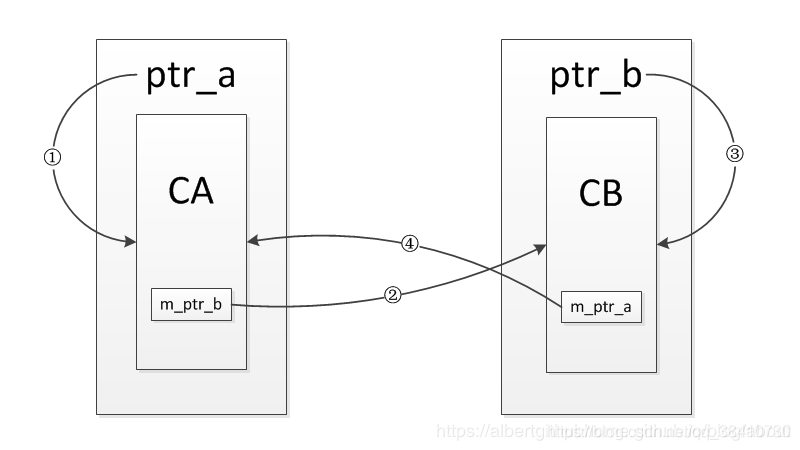

# 1. 前置++与后置++

```Javascript
// 前缀形式：增加然后取回值
UPInt& UPInt::operator++()
{
    *this += 1; // 增加
    return *this; // 取回值
}
// postfix form: fetch and increment
const UPInt UPInt::operator++(int)
{
    UPInt oldValue = *this; // 取回值
    ++(*this); // 增加
    return oldValue; // 返回被取回的值
}
```

前缀形式返回一个引用，后缀形式返回一个const类型

重载函数间的区别决定于它们的参数类型上的差异，但是不论是increment或decrement的前缀还是后缀都只有一个参数。为了解决这个语言问题，C++规定后缀形式有一个int类型参数，当函数被调用时，编译器传递一个0做为int参数的值给该函数。

## 为什么后置返回对象，而不是引用

因为后置为了返回旧值创建了⼀个临时对象，在函数结束的时候这个对象就会被销毁，函数不可以返回临时变量的引用！！！

## 为什么后置前面也要加const

为了防⽌你使⽤i++++,连续两次的调⽤后置++重载符。它与内置类型⾏为不⼀致：你⽆法取得你所期望的结果，因为第⼀次返回的是旧值，⽽不是原对象，你调⽤两次后置++，结果只累加了⼀次，所以我们必须⼿动禁⽌其合法化，就要在前⾯加上const。

## 处理用户的自定义类型

最好使⽤前置++，因为他不会创建临时对象，进⽽不会带来构造和析构⽽造成的额外开销。


# 2. a++ 和 int a = b 在C++中是否是线程安全的？

不是

## a++

从C/C++语法的级别来看，这是⼀条语句，应该是原⼦的；但从编译器得到的汇编指令来看，其实不是原⼦的。

```javascript
mov eax, dword ptr [a] # (1)
inc eax # (2)
mov dword ptr [a], eax # (3)
```

其⼀般对应三条指令，⾸先将变量a对应的内存值搬运到某个寄存器（如eax）中，然后将该寄存器中的值⾃增1，再将该寄存器中的值搬运回a代表的内存中

现在假设i的值是0，有两个线程，每个线程对变量a的值都递增1，预想⼀下，其结果应该是2，可实际运⾏结果可能是1！

分析：我们预想的结果是线程1和线程2的三条指令各⾃执⾏，最终a的值变为2，但是由于操作系统线程调度的不确定性，线程1执⾏完指令(1)和(2)后，eax寄存器中的值变为1，此时操作系统切换到线程2执⾏，执⾏指令(1)(2)(3)，此时eax的值变为1；接着操作系统切回线程1继续执⾏，执⾏指令(3)，得到a的最终结果1。

## int a = b

从C/C++语法的级别来看，这是条语句应该是原⼦的；但从编译器得到的汇编指令来看，由于现在计算机CPU架构体系的限制，**数据不能直接从内存某处搬运到内存另外⼀处，必须借助寄存器中转**，因此这条语句⼀般对应两条计算机指令，即将变量b的值搬运到某个寄存器（如eax）中，再从该寄存器搬运到变量a的内存地址中：

```javascript
mov eax, dword ptr [b]
mov dword prt [a], eax
```

既然是两条指令，那么多个线程在执⾏这两条指令时，某个线程可能会在第⼀条指令执⾏完毕后被剥夺CPU时间⽚，切换到另⼀个线程⽽出现不确定的情况。

## 解决方法

C++11新标准发布后改变了这种困境，新标准提供了对整形变量原⼦操作的相关库，即std::atomic，这是⼀个模板类型：

```javascript
template<class T>
struct atomic:
```

我们可以传⼊具体的整型类型对模板进⾏实例化，实际上stl库也提供了这些实例化的模板类型

```javascript
std::atomic<int> value;
value = 99;
```


# 3. C++类的三大特性

## 1.继承

让某种类型对象获得另⼀个类型对象的属性和⽅法，它可以使⽤现有类的所有功能，并在⽆需新编写原来的类的情况下对这些功能进⾏扩展

常⻅的继承有三种⽅式：
1. 实现继承：指使⽤基类的属性和⽅法⽽⽆需额外编码的能⼒
2. 接⼝继承：指仅使⽤属性和⽅法的名称、但是⼦类必须提供实现的能⼒
3. ~~可视继承：指⼦窗体（类）使⽤基窗体（类）的外观和实现代码的能⼒~~

## 2.封装

数据和代码捆绑在⼀起，避免外界⼲扰和不确定性访问;

把客观事物封装成抽象的类，并且类可以把⾃⼰的数据和⽅法只让可信的类或者对象操作，对不可信的进⾏信息隐藏，例如：将公共的数据或⽅法使⽤public修饰，⽽不希望被访问的数据或⽅法采⽤private修饰。

## 3.多态

同⼀事物表现出不同事物的能⼒，即向不同对象发送同⼀消息，不同的对象在接收时会产⽣不同的⾏为（重载实现编译时多态，虚函数实现运⾏时多态）

关于多态，简而言之就是用父类型的指针指向其子类的实例，然后通过父类的指针调用实际子类的成员函数。这种技术可以让父类的指针有“多种形态”，这是一种泛型技术。所谓泛型技术，说白了就是试图使用不变的代码来实现可变的算法。比如：模板技术，RTTI技术，虚函数技术，要么是试图做到在编译时决议，要么试图做到运行时决议。

实现多态有两种⽅式
1. 覆盖（override）： 是指⼦类重新定义⽗类的虚函数
2. 重载（overload）： 是指允许存在多个同名函数，⽽这些函数的参数表不同（或许参数个数不同，或许参数类型不同，或许两者都不同）


# 4. 虚函数

用来实现运行时动态绑定

```javascript
class A {
public:
	virtual void funcA();
	void funcB();
};
class B : public A {
public:
	virtual void funcA();
	void funcB();
};

void A::funcA () {
	cout << "A's funcA" << endl;
}
void A::funcB () {
	cout << "A's funcB" << endl;
}
void B::funcA () {
	cout << "B's funcA" << endl;
}
void B::funcB () {
	cout << "B's funcB" << endl;
}
 

int main(int argc,char* argv[])
{
	A *a = new B();
	a->funcA();          // run out : B's funcA
	a->funcB();          // run out : A's funcB
	return 1;
}
```

当基类希望派⽣类定义适合自己的版本，就将这些函数声明成虚函数（virtual）

虚函数依赖虚函数表工作，表来保存虚函数地址，当我们⽤基类指针指向派⽣类时，虚表指针指向派⽣类的虚函数表

这个机制可以保证派生类中的虚函数被调用到

## 4.1 虚函数是动态绑定的

也就是说，使⽤虚函数的指针和引⽤能够正确找到实际类的对应函数，⽽不是执⾏定义类的函数，发生在运行期。

## 4.2 条件

* 调⽤函数的对象必须是指针或者引⽤

* 被调⽤的函数必须是虚函数（virtual），且完成了虚函数的重写（派⽣类中有⼀个跟基类的完全相同虚函数）

## 4.3 构造函数不能是虚函数

原因1：没有意义，要创建⼀个对象，你需要知道对象的完整信息。 特别是，你需要知道你想要创建的确切类型。 

原因2：⽽且，构造对象是会先调用父类构造函数，多态会失效。

## 4.4 虚函数的工作⽅式

依赖虚函数表工作的，表来保存虚函数地址，当我们⽤基类指针指向派⽣类时，虚表指针vptr指向派⽣类的虚函数表，这个机制可以保证派⽣类中的虚函数被调⽤到。

## 4.5 析构函数可以是虚函数，⽽且，在⼀个复杂类结构中，这往往是必须的

子类调用的资源往往比父类多，所以需要在析构函数中释放。

## 4.6 虚函数必须实现么

不是的，可以只提供声明而不做定义，这样这个虚函数称为纯虚函数。纯虚函数是通过在声明中使⽤ "= 0" 来指定的(virtual ReturnType Function()= 0)。包含纯虚函数的类称作虚类或者抽象类，不能定义对象

## 4.7 子类必须要重写父类的虚函数么

不是的，父类的虚函数只是希望子类重写自己的版本，如果没有重写，那么运行时调用的就是父类的函数。同时，子类的子类依旧可以选择重写这个虚函数

## 4.8 inline, static, ~~constructor~~三种函数都不能带有virtual关键字

inline是在编译时展开，必须要有实体。内联函数是指在编译期间⽤被调⽤函数体本身来代替函数的调⽤指令，但虚函数的多态特性需要在运⾏时根据对象类型才知道调⽤哪个虚函数，所以没法在编译时进⾏内联函数展开。

static属于class自己的类，必须有实体；static成员没有this指针。virtual函数⼀定要通过对象来调⽤，有隐藏的this指针，实例相关。

## 4.9 析构函数可以是纯虚的

但纯虚析构函数必须要定义（实现），因为子类的析构函数要调用父类的析构函数。

在这里要明确一点，纯虚函数是可以没有定义，不是必须没有定义。纯虚函数的作用有两个，一个是不想在父类中实现这个函数，一个是让父类成为抽象类，不能构造对象。

有时候我们想让父类成为抽象类，又没有找到合适的纯虚函数时，就可以把析构函数定义为纯虚的，但同时要保留析构函数的实现。

## 4.10 派⽣类的override虚函数定义(返回值，函数名和形参)必须和⽗类完全⼀致

除了⼀个特例，如果⽗类中返回值是⼀个指针或引⽤，⼦类override时可以返回这个指针（或引⽤）的派生。

# 5. 虚继承

```javascript
/*******************************多重继承****************************************/
class A { void func(){}; };
class B : public A {};
class C : public A {};
class D : public B , public C {};

D d;                 // A称作间接基类 构造函数调用流程为：A-B-A-C-D  A的构造函数会调用两次
D.func();           // 错误 会出现歧义
D.B::func();         // 正确
D.C::func();         // 正确

/*******************************虚拟继承****************************************/
class A { void func(){}; };
class B : virtual public A {};
class C : virtual public A {};
class D : public B , public C {};

D d;                 // 构造函数调用流程为：A-B-C-D      A的构造函数会调用一次
D.func();           // 正确
D.B::func();         // 正确
D.C::func();         // 正确
```

## 5.1 虚继承是为了解决多继承时的命名冲突和冗余数据问题

C++ 提出了虚继承，使得在派⽣类中只保留⼀份间接基类的成员。其中多继承（Multiple
Inheritance）是指一个派生类继承了多个直接基类，多继承的派⽣类继承了所有⽗类的成员。

## 4.2 虚继承的目的是让某个类做出声明，承诺愿意共享它的基类

其中，这个被共享的基类就称为虚基类（Virtual Base Class），其中上面代码中A就是⼀个虚基类。在这种机制下，不论虚基类在继承体系中出现了多少次，在派⽣类中都只包含⼀份虚基类的成员。

类 A 有⼀个成员变量a，不使⽤虚继承，那么在类 D 中直接访问 a 就会产⽣歧义。编译器不知道它究竟来⾃ A-->B-->D 这条路径，还是来⾃ A-->C-->D 这条路径。

C++标准库中的 iostream 类就是⼀个虚继承的实际应⽤案例。iostream 从 istream 和 ostream 直接继承⽽来，⽽ istream 和 ostream ⼜都继承⾃⼀个共同的名为 baseios 的类。此时 istream 和 ostream 必须采⽤虚继承，否则将导致 iostream 类中保留两份 baseios 类的成员。

使⽤多继承经常出现二义性，必须⼗分⼩⼼；⼀般只有在比较简单和不易出现二义性或者在必要情况下才使⽤多继承，能⽤单⼀继承解决问题就不要⽤多继承。

# 6. 抽象类与接口

接口描述了类的⾏为和功能，⽽不需要完成类的特定实现；C++ 接⼝是使⽤抽象类来实现的

1. 类中⾄少有⼀个函数被声明为纯虚函数，则这个类就是抽象类。

2. 如果一个类里面只有纯虚函数，没有其他成员函数和数据成员，就是接口类。

2. 接口属于抽象类，设计抽象类的⽬的，是为了给其他类提供⼀个可以继承的适当的基类。抽象类不能被⽤于实例化对象。

# 7. 空类：为何空类的大小不是0？

为了确保两个不同对象的地址不同。

类的实例化是在内存中分配⼀块地址，每个实例在内存中都有独一无二的地址。同样，空类也会实例化，所以编译器会给空类隐含的添加⼀个字节，这样空类实例化后就有独一无二的地址了。

所以，空类的sizeof为1，⽽不是0。

```javascript
 // 类A和类B都不是空类，其sizeof都是4，因为它们都具有虚函数表的地址。
class A{ virtual void f(){} };
class B:public A{};     

// A是空类，其⼤⼩为1；B不是空类，其⼤⼩为4.因为含有指向虚基类的指针
class A{};
class B:public virtual A{};

// 多重继承的空类的⼤⼩也是1。下面三个类的sizeof都是1
class Father1{}; class Father2{};
class Child:Father1, Father2{};

// 多重继承的其他例子
class X{}; //sizeof(X):1
class Y : public virtual X {}; //sizeof(Y):4
class Z : public virtual X {}; //sizeof(Z):4
class A : public virtual Y {}; //sizeof(A):8
class B : public Y, public Z{}; //sizeof(B):8
class C : public virtual Y, public virtual Z {}; //sizeof(C):12
class D : public virtual C{}; //sizeof(D):16
```

# 8. 智能指针

对象需要严格的生存期，全局对象在程序启动时分配，在程序结束时销毁。对于局部自动对象，当我们进入其定义所在的程序块时被创建，在离开块时销毁。C++还支持动态分配对象，动态分配的对象的生存期与它们在哪里创建是无关的，只有当显示地被释放时，这些对象才会被销毁。

动态对象的正确释放被证明是编程中极易容易出错的地方。为了更安全的使用动态对象，标准库定义了两个智能指针类型来管理动态分配的对象。当一个对象应该被释放时，指向它的智能指针可以确保自动地释放它。C11标准中放在< memory>头文件中。

## 8.1 shared_ptr

shared_ptr的实现机制是在拷贝构造时使⽤同⼀份引⽤计数

* 重载operator*和operator->，使得能像指针⼀样使⽤shared_ptr

* 重载copy constructor，使其引⽤次数加⼀（拷贝构造函数)
  
* 重载operator=（赋值运算符），如果原来的shared_ptr已经有对象，则让其引⽤次数减⼀并判断引⽤是否为零(是否调⽤delete)，然后将新的对象引⽤次数加一

* 重载析构函数，使引⽤次数减⼀并判断引⽤是否为零(是否调⽤delete)

* make_shared函数在动态内存中分配一个对象并初始化，返回指向此对象的shared_ptr。

智能指针包括一个实际数据指针和一个引用计数指针，这两个操作不是一个指令可以完成的，因此多线程环境下，势必有问题。

* 同一个shared_ptr被多个线程读，是线程安全的；
* 同一个shared_ptr被多个线程写，不是线程安全的；
* 共享引用计数的不同的shared_ptr被多个线程写，是线程安全的。

## 8.2 unique_ptr

* unique_ptr”唯⼀”拥有其所指对象,同⼀时刻只能有⼀个unique_ptr指向给定对象，离开作⽤域时，若其指向对象，则将其所指对象销毁（默认delete）。

* 与shared_ptr不同，没有类似make_shared的标准库函数返回一个unique_ptr,定义unique_ptr时,需要将其绑定到⼀个new返回的指针上。

* unique_ptr不⽀持普通的拷⻉和赋值（因为拥有指向的对象）,但是可以拷⻉和赋值⼀个将要被销毁的unique_ptr，例如可以从函数返回一个unique_ptr；可以通过release或者reset将指针所有权从⼀个（⾮const）unique_ptr转移到另⼀个unique。

## 8.3 weak_ptr

* weak_ptr是为了配合shared_ptr⽽引⼊的⼀种智能指针,它的最⼤作⽤在于协助shared_ptr⼯作，像旁观者那样观测资源的使⽤情况，但weak_ptr没有共享资源，它的构造不会引起指针引⽤计数的增加。
  
* weak_ptr 模板类中没有重载 * 和 -> 运算符，这也就意味着，weak_ptr 类型指针只能访问所指的堆内存，而无法修改它

* 和shared_ptr指向相同内存，由于对象可能不存在，不能直接使用weak_ptr直接访问对象，而必须使用lock，此函数检查weak_ptr指向的对象是否存在，存在则返回一个指向对象的shared_ptr。

### weak_ptr的使用场景

1. 解决循环引用



如上图所示，CA 和 CB 两个对象永远不会被析构，因为它们的引用计数不会为0。


而将其中一个智能指针改为 weak_ptr 后，当 ptr_a 被释放后，CA 的引用计数为0，CA 将会被析构，同时指向 CB 的 m_ptr_b 也会被释放，导致 CB 也会被析构。

2. 共享对象的线程安全问题

线程A和线程B访问一个共享的对象，如果线程A正在析构这个对象的时候，线程B又要调用该共享对象的成员方法，此时可能线程A已经把对象析构完了，线程B再去访问该对象，就会发生不可预期的错误。

# 9. C++强制类型转换

关键字：static_cast、dynamic_cast、const_cast 和 reinterpret_cast 

## 9.1 static_cast

主要在以下几种场合中使用：

* 用于类层次结构中，父类和子类之间指针和引用的转换；进行上行转换，把子类对象的指针/引用转换为父类指针/引用，这种转换是安全的；进行下行转换，把父类对象的指针/引用转换成子类指针/引用，这种转换是不安全的，需要编写程序时来确认；

* 用于基本数据类型之间的转换，例如把int转char，int转enum等，需要编写程序时来确认安全性；

* 把void指针转换成目标类型的指针（这是极其不安全的）；

static_cast没有运行时类型检查来确保转换的安全性，所以进行下行转换是不安全的。

## 9.2 dynamic_cast

相比static_cast，dynamic_cast会在运行时检查类型转换是否合法，具有一定的安全性。由于运行时的检查，所以会额外消耗一些性能。dynamic_cast使用场景与static_cast相似，在类层次结构中使用时，上行转换和static_cast没有区别，都是安全的；下行转换时，dynamic_cast会检查转换的类型，相比static_cast更安全。

1. dynamic_cast转换仅适用于指针或引用。

2. 只能⽤于存在虚函数的⽗⼦关系的强制类型转换，由于运行时类型检查需要运行时类型信息，而这个信息存储在类的虚函数表中，只有定义了虚函数的类才有虚函数表。

3. 对于指针，转换失败则返回nullptr；对于引⽤，转换失败会抛出异常。

4. 棱形转换

```javascript
class A { virtual void f() {}; };
class B :public A { void f() {}; };
class C :public A { void f() {}; };
class D :public B, public C { virtual void f() {}; };
```
B继承A，C继承A，D继承B和C，那么D类型指针能否转换成A类型呢？

如果尝试这样的转换，只能得到一个空指针。因为B和C都继承了A，并且都实现了虚函数f()，导致在进行转换时，无法选择一条转换路径。一种可行的方法是，自行指定一条转换路径。

```javascript
	// 失败的转换
    D *pD = new D;
    A *pA = dynamic_cast<A *>(pD); // pA = NULL

	// 自行制定转换路径
	D *pD = new D;
    B *pB = dynamic_cast<B *>(pD);
    A *pA = dynamic_cast<A *>(pB);
```

## 9.3 const_cast

常量指针转换为⾮常量指针，并且仍然指向原来的对象。常量引⽤被转换为⾮常量引⽤，并且仍然指向原来的对象。去掉类型的const或volatile属性。

## 9.4 reinterpret_cast

可以将整型转换为指针，也可以把指针转换为数组；可以在指针和引⽤⾥进⾏肆⽆忌惮的转换，平台移植性⽐价差，所以极不安全。非极端情况不要使用。

# 10. 内存泄漏

## 10.1 什么是内存泄漏

内存泄漏(memory leak)是指由于疏忽或错误造成了程序未能释放掉不再使⽤的内存的情况。内存泄漏并⾮指内存在物理上的消失，⽽是应⽤程序分配某段内存后，由于设计错误，失去了对该段内存的控制，因⽽造成了内存的浪费。

## 10.2 内存泄漏分类

* 堆内存泄漏 （Heap leak）：堆内存指的是程序运行中根据需要通过malloc,realloc,new等从堆中分配的一块内存，使用完成后必须通过调用对应的free或者delete释放掉。如果程序设计的错误使得这部分内存没有被释放掉，那么此后这块内存将不会被使用，就会产生Heap Leak。
* 系统资源泄露（Resource Leak）：主要指程序使⽤系统分配的资源⽐如 SOCKET 没有使用相应的函数释放掉，导致系统资源的浪费，严重可导致系统效能降低，系统运⾏不稳定。
* 没有将基类的析构函数定义为虚函数：当基类指针指向⼦类对象时，如果基类的析构函数不是 virtual，那么⼦类的析构函数将不会被调⽤，⼦类的资源没有正确释放，因此造成内存泄露。
  
## 10.3 什么操作会导致内存泄露?

指针指向改变，未释放动态分配内存。

## 10.4 如何防⽌内存泄露?

将内存的分配封装在类中，构造函数分配内存，析构函数释放内存；使⽤智能指针


