# 1. 网络层（IP)与数据链路层(MAC)有什么关系呢？

MAC的作用：实现【直连】的两个设备之间通信。

IP的作用：负责在【没有直连】的两个网络之间进⾏通信传输。

在网络数据包传输中，源IP地址和目标IP地址在传输过程中是不会变的，只有源MAC地址和目标MAC⼀直在变化。

# 2. IP地址分类

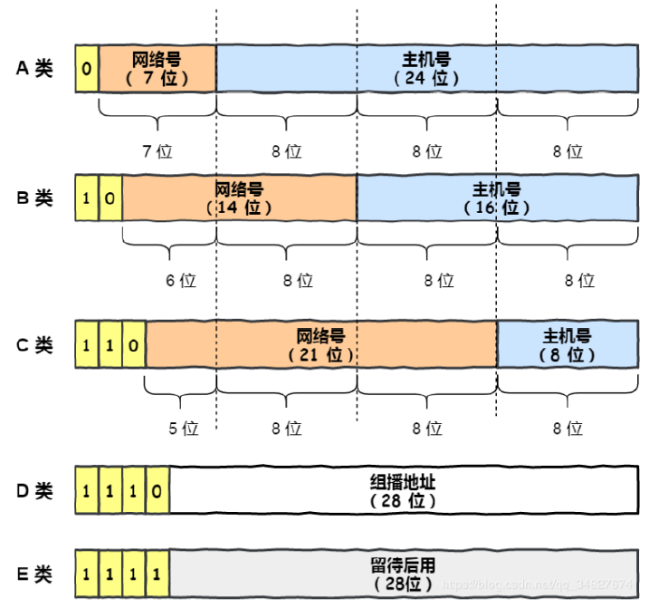

## A、B、C类地址

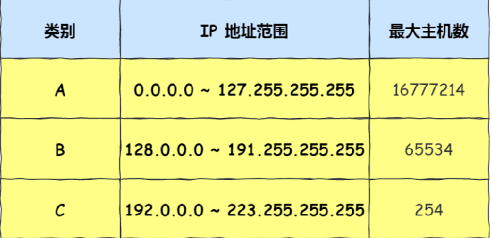

最⼤主机数=2^主机号位数-2，其中有两个地址，全0和全1是⽐较特殊的：

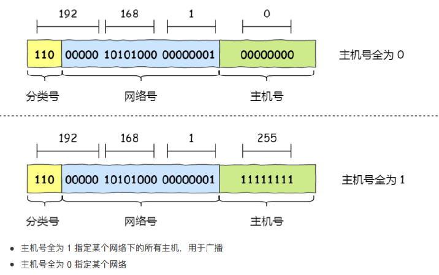

## 网络地址和广播地址

网络地址是用来标识网段的，网络地址就表示整个网段，无法分配给主机，只需要记住网络地址是在路由寻址中使用的。

⼴播地址用于在同⼀个链路中相互连接的主机之间发送数据包。⼴播地址可以分为本地⼴播和直接⼴播两种。

在本网络内⼴播的叫做本地⼴播。例如网络地址为 192.168.0.0/24 的情况下，广播地址是192.168.0.255。

因为这个⼴播地址的 IP 包会被路由器屏蔽，所以不会到达 192.168.0.0/24 以外的其他链路上。

在不同网络之间的⼴播叫做直接⼴播。例如网络地址为 192.168.0.0/24 的主机向 192.168.1.255/24 的目标地址发送 IP 包。收到这个包的路由器，将数据转发给 192.168.1.0/24，从⽽使得所有 192.168.1.1~192.168.1.254 的主机都能收到这个包（由于直接⼴播有⼀定的安全问题，多数情况下会在路由器上设置为不转发）。
## 什么是D、E类地址？

D 类和 E 类地址是没有主机号的，所以不可用于主机 IP，D 类常被用于多播，E 类是预留的分类，暂时未使用。

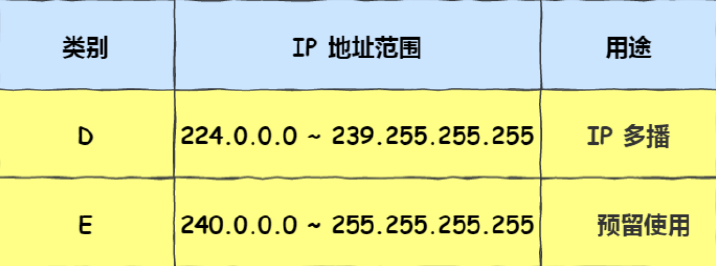

多播地址用于将包发送给特定组内的所有主机。由于⼴播⽆法穿透路由，若想给其他网段发送同样的包，就可以使用可以穿透路由的多播。

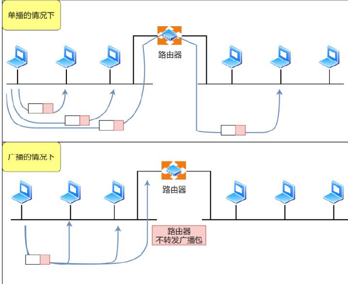

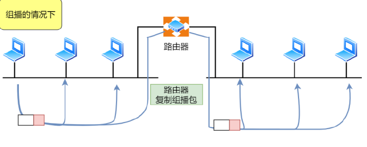

多播使用的 D 类地址，其前四位是 1110 就表示是多播地址，⽽剩下的 28 位是多播的组编号。

从 224.0.0.0 ~ 239.255.255.255 都是多播的可用范围，其划分为以下三类：

224.0.0.0 ~ 224.0.0.255 为预留的组播地址，只能在局域网中，路由器是不会进⾏转发的。

224.0.1.0 ~ 238.255.255.255 为用户可用的组播地址，可以用于 Internet 上。

239.0.0.0 ~ 239.255.255.255 为本地管理组播地址，可供内部网在内部使用，仅在特定的本地范围内有效。

# 3. 传统IP分类的缺点

同⼀网络下没有地址层次，在网络内部不能使用路由。⽐如⼀个公司⾥用了 B 类地址，但是可能需要根据⽣产环境、测试环境、开发环境来划分地址层次，⽽这种 IP 分类是没有地址层次划分的功能，所以这就缺少地址的灵活性。

A、B、C类还有个尴尬处境，就是不能很好的与现实网络匹配。

C 类地址能包含的最⼤主机数实在太少了，只有 254 个，估计⼀个网吧都不够用。⽽ B 类地址能包含的最⼤主机数⼜太多了，6 万多台机器放在⼀个网络下⾯，⼀般的企业基本达不到这个规模，闲着的地址就是浪费。这两个缺点，都可以在 CIDR 无分类地址解决。

# 4. CIDR无分类地址

这种⽅式不再有分类地址的概念，32 ⽐特的 IP 地址被划分为两部分，前⾯是网络号，后⾯是主机号。

## 如何划分网络号和主机号呢？

表示形式 a.b.c.d/x ，其中 /x 表示前 x 位属于网络号， x 的范围是 0 ~ 32 ，这就使得 IP 地址更加具有灵活性。

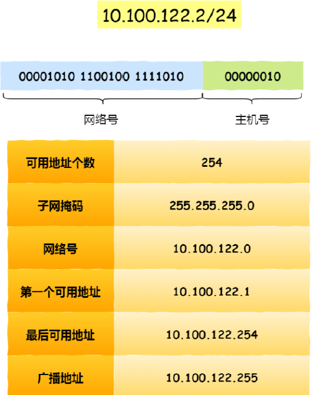

还有另⼀种划分网络号与主机号形式，那就是子网掩码，掩码的意思就是掩盖掉主机号，剩余的就是网络号。

将子网掩码和 IP 地址按位计算 AND，就可得到网络号。

## 为什么要分离网络号和主机号？

因为两台计算机要通讯，⾸先要判断是否处于同⼀个⼴播域内，即网络地址是否相同。如果网络地址相同，表明接受⽅在本网络上，那么可以把数据包直接发送到目标主机。

路由器寻址⼯作中，也就是通过这样的⽅式来找到对应的网络号的，进⽽把数据包转发给对应的网络内。

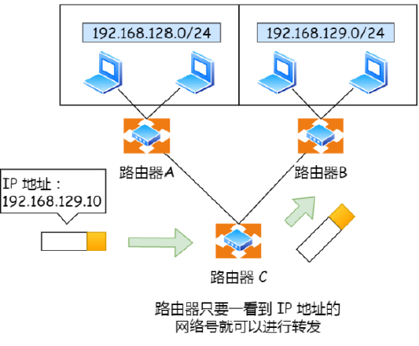

## 如何进行子网划分？

通过子网掩码划分出网络号和主机号，那实际上子网掩码还有⼀个作用，那就是划分子网。

子网划分实际上是将主机地址分为两个部分：子网网络地址和子网主机地址。形式如下：

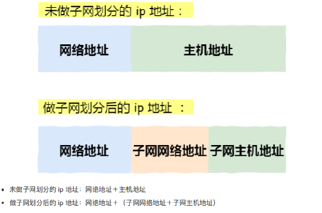

假设对 C 类地址进⾏子网划分，网络地址 192.168.1.0，使用子网掩码 255.255.255.192 对其进⾏子网划分。

C 类地址中前 24 位是网络号，最后 8 位是主机号，根据子网掩码可知从 8 位主机号中借用 2位作为子网号（对应4个子网）。

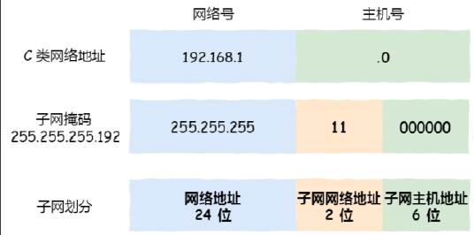

划分后的4个子网如下：

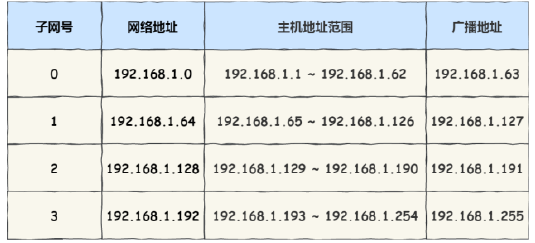

# 5. 公有IP地址与私有IP地址

在A、B、C分类地址，实际⼜分公有IP地址和私有IP地址。

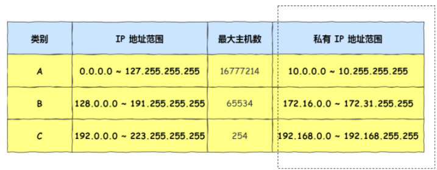

平时我们办公室、家⾥、学校用的 IP 地址，⼀般都是私有 IP 地址。因为这些地址允许组织内部的 IT ⼈员⾃已管理、⾃已分配，⽽且可以重复。

公有 IP 地址是有个组织统⼀分配的，假设你要开⼀个博客网站，那么你就需要去申请购买⼀个公有 IP，这 样全世界的⼈才能访问。并且公有 IP 地址基本上要在整个互联网范围内保持唯⼀

## 那么公有IP地址由谁管理呢？

私有 IP 地址通常是内部的 IT ⼈员管理，公有 IP 地址是由 ICANN 组织管理，中⽂叫「互联网名称与数字地址分配机构」。 IANA 是 ICANN 的其中⼀个机构，它负责分配互联网 IP 地址，是按州的⽅式层层分配。

# 6. IP地址与路由控制

IP地址的网络地址这⼀部分是用于进⾏路由控制。路由控制表中记录着网络地址与下⼀步应该发送⾄路由器的地址。在主机和路由器上都会有各⾃的路由器控制表。

在发送 IP 包时，⾸先要确定 IP 包⾸部中的目标地址，再从路由控制表中找到与该地址具有相同网络地址的记录，根据该记录将 IP 包转发给相应的下⼀个路由器。

如果路由控制表中存在多条相同网络地址的记录，就选择相同位数最多的网络地址，也就是最⻓匹配。例如172.20.100.52的网络地址与172.20/16和172.20.100/24两项都匹配。此时，应该选择匹配度最长的172.20.100/24。

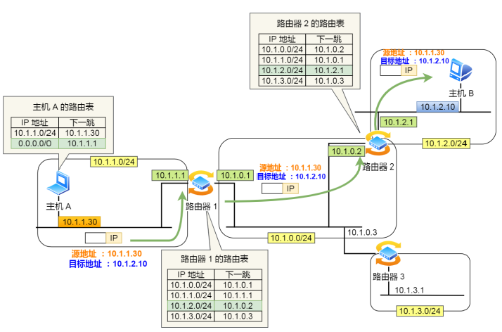

环回地址不会流向网络：环回地址是在同⼀台计算机上的程序之间进⾏网络通信时所使用的⼀个默认地址。 计算机使用⼀个特殊的 IP 地址 127.0.0.1 作为环回地址。

与该地址具有相同意义的是⼀个叫做 localhost 的主机名。使用这个 IP 或主机名时，数据包不会流向网络

## 默认路由

默认路由（Default route），是对IP数据包中的目的地址找不到存在的其他路由时，路由器所选择的路由。

当路由器收到报文发现该报文的目的地址不在路由表中，就会发送到默认路由所定义的下一跳，作为未知地址数据包的一种最后求助方式。

默认路由一般标记为0.0.0.0/0或default。

# 7. IP分片与重组

每种数据链路的最⼤传输单元 MTU 都是不相同的，如 FDDI 数据链路 MTU 4352、以太网的 MTU 是 1500 字节等。

每种数据链路的 MTU 之所以不同，是因为每个不同类型的数据链路的使用目的不同。使用目的不同，可承载的 MTU 也就不同。

其中，我们最常⻅数据链路是以太网，它的 MTU 是 1500 字节。 那么当 IP 数据包⼤⼩⼤于MTU 时， IP 数据包就会被分片，分片是由路由器进行的。 经过分片之后的 IP 数据报在被重组的时候，只能由目标主机进⾏，路由器是不会进⾏重组的。

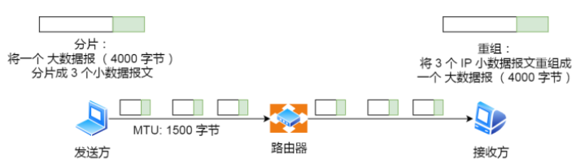

在分片传输中，⼀旦某个分片丢失，则会造成整个 IP 数据报作废，所以 TCP 引⼊了 MSS 也就是在 TCP 层进⾏分片不由 IP 层分片，那么对于 UDP 我们尽量不要发送⼀个⼤于 MTU 的数据报⽂。

## 为什么不能由路由器进行IP分片的重组工作？

1. 现实当中无法保证IP数据报是否经由同一个路径传送；
2. 拆分之后的每个分片有可能会在途中丢失；
3. 即使在途中某一处被重新组装，但如果下一站再经过其他路由时还会面临被分片的可能。这会给路由器带来多余的负担，也会降低网络传送效率。
   

   

# 29. IPV4⾸部与IPV6⾸部

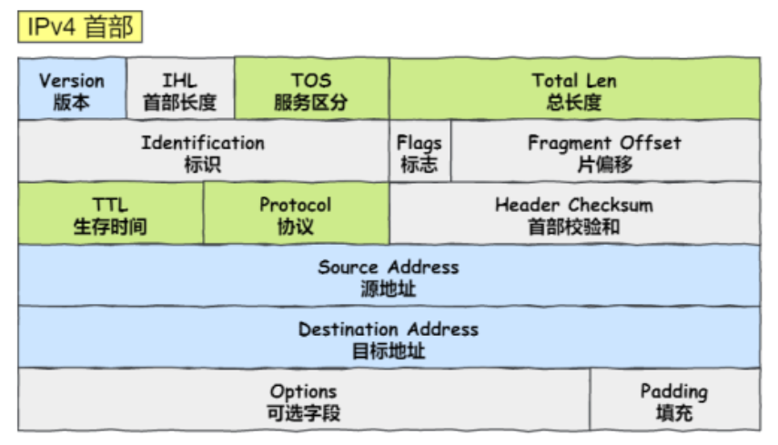

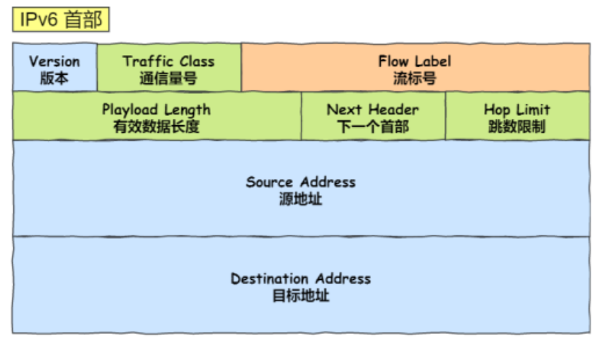

其中：

## IPV6相⽐IPV4的⾸部改进

**取消了⾸部校验和字段**：因为在数据链路层和传输层都会校验，因此 IPv6 直接取消了 IP 的校验。

**取消了分片/重新组装相关字段**：分片与重组是耗时的过程，IPv6 不允许在中间路由器进⾏分片与重组，这 种操作只能在源与目标主机，这将⼤⼤提⾼了路由器转发的速度。

**取消选项字段**：选项字段不再是标准 IP ⾸部的⼀部分了，但它并没有消失，⽽是可能出现在 IPv6 ⾸部中的「下⼀个⾸部」指出的位置上。删除该选项字段使的 IPv6 的⾸部成为固定⻓度的 40 字节。

# 30. ARP与RARP协议

## ARP协议

在传输⼀个 IP 数据报的时候，确定了源 IP 地址和目标 IP 地址后，就会通过主机「路由表」确定 IP 数据包下⼀ 跳。然⽽，网络层的下⼀层是数据链路层，所以我们还要知道「下⼀跳」的 MAC 地址。

由于主机的路由表中可以找到下⼀跳的 IP 地址，所以可以通过 ARP 协议（AddressResolution Protocol，地址解析协议），求得下⼀跳的 MAC 地址。

ARP是如何知道对⽅的MAC地址的呢？ARP 是借助 ARP 请求与 ARP 响应两种类型的包确定MAC 地址的。

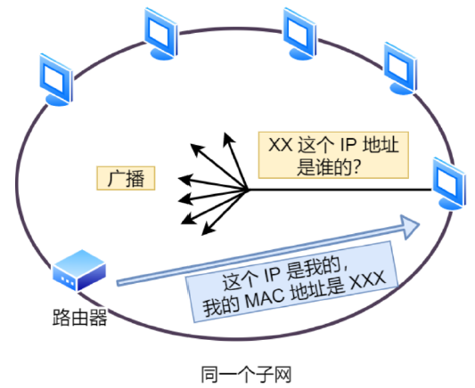

主机会通过⼴播发送 ARP 请求，这个包中包含了想要知道的 MAC 地址的主机 IP 地址。当同个链路中的所有设备收到 ARP 请求时，会去拆开 ARP 请求包⾥的内容，如果 ARP 请求包中的目标 IP 地址与⾃已的 IP 地址⼀致，那么这个设备就将⾃已的 MAC 地址塞⼊ ARP 响应包返回给主机。

操作系统通常会把第⼀次通过 ARP 获取的 MAC 地址缓存起来，以便下次直接从缓存中找到对应 IP 地址的 MAC 地址。 不过，MAC 地址的缓存是有⼀定期限的，超过这个期限，缓存的内容将被清除。

## RARP协议

ARP 协议是已知 IP 地址求 MAC 地址，那 RARP 协议正好相反，它是已知 MAC 地址求 IP 地址。

例如将打印机服务器等⼩型嵌⼊式设备接⼊到网络时就经常会用得到。通常这需要架设⼀台RARP 服务器，在这个服务器上注册设备的 MAC 地址及其 IP 地址。然后再将这个设备接⼊到网络

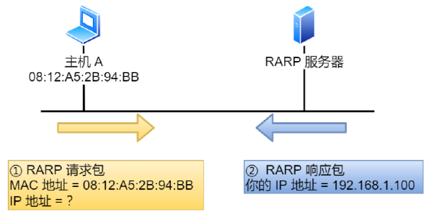

# 31. 为什么有了IP地址，还需要 MAC 地址？

IP 协议本身没有传输包的功能，因此包的实际传输要委托以太网来进⾏。

路由器是基于 IP 设计的，⽽交换机是基于以太网设计的，换句话说，路由器将包的传输⼯作委托给交换机来进⾏。

IP 并不是委托以太网将包传输到最终目的地，⽽是传输到下⼀个路由器。当包到达下⼀个路由器后，下⼀个路由器⼜会􁯿新委托以太网将包传输到再下⼀个路由器。随着这⼀过程反复执⾏，包就会最终到达IP 的目的地，也就是通信的对象。

IP 本身不负责包的传输，⽽是委托各种通信技术将包传输到下⼀个路由器，这样的设计是有重要意义的:

即，可以根据需要灵活运用各种通信技术。这也是 IP 的最⼤特点。正是有了这⼀特点，我们才能够构建出互联网这⼀规模巨⼤的网络。

