# 1. TCP首部格式

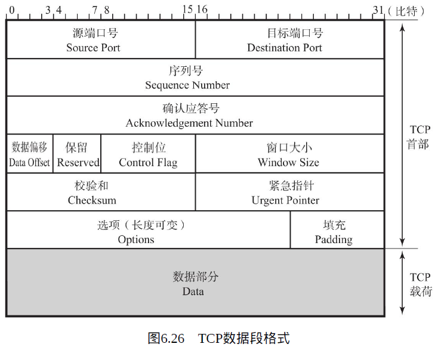


# 1. 三次握手

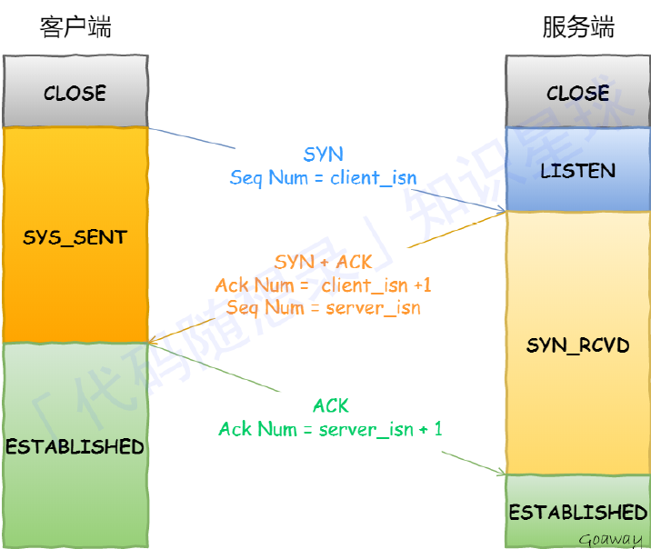

* 第⼀个SYN报⽂：客户端随机初始化序列号client_isn，放进TCP⾸部序列号段，然后把SYN置1。把SYN报⽂发送给服务端，表示发起连接，之后客户端处于SYN-SENT状态。

* 第⼆个报⽂SYN+ACK报⽂：服务端收到客户端的SYN报⽂，把⾃⼰的序号server_isn放进TCP⾸部序列号段，确认应答号填⼊client_ins + 1，把SYN+ACK置1。把SYN+ACK报⽂发送给客户端，然后进⼊SYN-RCVD状态。

* 第三个报⽂ACK：客户端收到服务端报⽂后，还要向服务端回应最后⼀个应答报⽂。⾸先该应答报⽂ TCP ⾸部ACK 标志位置为 1 ，其次「确认应答号」字段填⼊ server_isn + 1 ，最后把报⽂发送给服务端，这次报⽂可以携带客户到服务器的数据，之后客户端处于 ESTABLISHED 状态。服务器收到客户端的应答报⽂后，也进⼊ ESTABLISHED 状态。

## 为什么需要三次握⼿？

1. 三次握⼿才可以阻⽌重复历史连接的初始化(主因)
2. 三次握⼿才可以同步双⽅的初始序列号
3. 三次握⼿才可以避免资源浪费

* 为了阻止历史的重复连接初始化造成的混乱问题，如果通信的双方建立连接使用两次握手，那么发送方一旦发送了建立连接请求之后就无法撤销此次请求，如果在网络状况复杂或者较差的情况下，发送方连续发送多次建立连接的请求，而接收方只能选择接受或者拒绝此次请求，它并不知道此次请求是不是由于网络原因而过期的连接。
  
  所以，TCP 选择使用三次握手来建立连接，并在连接引入 RST 这一控制信息。接收方当收到连接请求时，会将发送方发来的 SEQ + 1 发送回发送方，由发送方判断此次连接是否有效（是否为历史连接）。

  如果当前连接是历史连接，即 SEQ 过期或者超时，那么发送方就会直接发送 RST 控制信息中止这一次连接；如果当前连接不是历史连接，那么发送方就会直接回复 ACK，则建立连接成功。

  使用三次握手和 RST 控制信息将是否建立连接的最终控制权交给发送方，因为只有发送方才有足够的上下文判断当前连接是错误的或者过期的。

* 同步双⽅的初始序列号
  
  TCP 协议的通信双⽅， 都必须维护⼀个「序列号」， 序列号是可靠传输的⼀个关键因素。两次握⼿只保证了⼀⽅的初始序列号能被对⽅成功接收，没办法保证双⽅的初始序列号都能被确认接收。

* 避免资源浪费。由于没有第三次握⼿，服务器不清楚客户端是否收到了⾃⼰发送的建⽴连接的 ACK 确认信号，所以每收到⼀个 SYN 就只能先主动建⽴⼀个连接。

# 2.四次挥手

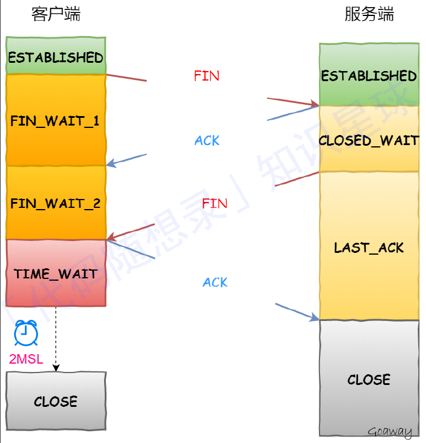

## 2.1 过程

* 假设客户端打算关闭连接，发送⼀个TCP⾸部FIN被置1的FIN报⽂给服务端。
* 服务端收到以后，向客户端发送ACK应答报⽂。
* 等待服务端处理完数据后，向客户端发送FIN报⽂。
* 客户端接收到FIN报⽂后回⼀个ACK应答报⽂。
* 服务器收到ACK报⽂后，进⼊close状态，服务器完成连接关闭。
* 客户端在经过 2MSL ⼀段时间后，⾃动进⼊close状态，客户端也完成连接的关闭。

## 2.2 为什么挥手需要四次

关闭连接时，客户端发送FIN报⽂，表示其不再发送数据，但还可以接收数据。客户端收到FIN报⽂，先回⼀个ACK应答报⽂，服务端可能还要数据需要处理和发送，等到其不再发送数据时，才发送FIN报⽂给客户端表示同意关闭连接。

从上⾯过程可知：

1. 服务端通常需要等待完成数据的发送和处理，所以服务端的ACK和FIN⼀般都会分开发送，从⽽⽐三次握⼿导致多了⼀次。
2. 第⼀次ACK应答报⽂可以省略，因为下⼀个报⽂段携带了ACK信息，ACK是否出现取决于延迟确认特性。
3. 延迟确认：即接收⽅收到包后，如果暂时没有内容回复给发送⽅，则延迟⼀段时间再确认，假如在这个时间范围内刚好有数据需要传输，则和确认包⼀起回复。这种也被称为数据捎带。延迟确认只是减轻⽹络负担，未必可以提升⽹络性能，有些情况下反⽽会影响性能。

## 2.3 为什么 TIME_WAIT 等待的时间是 2MSL？

1. MSL是 Maximum Segment Lifetime，报⽂最⼤⽣存时间，它是任何报⽂在⽹络上存在的最⻓时间，超过这个时间报⽂将被丢弃。
2. 等待MSL两倍：⽹络中可能存在发送⽅的数据包，当这些发送⽅的数据包被接收⽅处理后⼜会向对⽅发送响应，所以⼀来⼀回需要等待 2 倍的时间。
3. 2MSL 的时间是从客户端接收到 FIN 后发送 ACK 开始计时的。一个MSL是确保主动关闭方最后的ACK能够到达对端。一个MSL是确保被动关闭方重发的FIN能够被主动关闭方收到。如果在 TIME-WAIT 时间内，因为客户端的 ACK 没有传输到服务端，客户端⼜接收到了服务端重发的 FIN 报⽂，那么 2MSL 时间将重新计时。

## 2.4 为什么需要 TIME_WAIT 状态？

主动发起关闭连接的⼀⽅，才会有 TIME-WAIT 状态。需要 TIME-WAIT 状态，主要是两个原因：

1. 允许老的重复报文分组在网络中消逝。
	
   在2MSL等待期间，定义这个连接的插口(客户端IP地址和端口号，服务器IP地址和端口号的四元组)将不能再被使用。假如我们建立一个TCP连接，一段时间后我们关闭这个连接，再基于相同插口建立一个新的TCP连接，这个新的连接称为前一个连接的化身。老的报文很有可能由于某些原因迟到了，那么新的TCP连接很有可能会将这个迟到的报文认为是新的连接的报文，而导致数据错乱。为了防止这种情况的发生TCP连接必须让TIME_WAIT状态持续2MSL，在此期间将不能基于这个插口建立新的化身，让它有足够的时间使迟到的报文段被丢弃

2. 保证TCP全双工连接的正确关闭。
   
   如果主动关闭方最终的ACK丢失，那么服务器将会重新发送那个FIN,以允许主动关闭方重新发送那个ACK。要是主动关闭方不维护2MSL状态，那么主动关闭将会不得不响应一个RST报文段，而服务器将会把它解释为一个错误，导致TCP连接没有办法完成全双工的关闭，而进入半关闭状态。

## 2.5 TIME_WAIT 过多有什么危害？

过多的TIME-WAIT 状态主要的危害有两种：

1. 内存资源占⽤；
2. 对端⼝资源的占⽤，⼀个 TCP 连接⾄少消耗⼀个本地端⼝；

如果发起连接⼀⽅的 TIME_WAIT 状态过多，占满了所有端⼝资源，则会导致⽆法创建新连接。


# 3. HTTP

HTTP (HyperText Transfer Protocol)：超文本传输协议，基于TCP协议的应用层传输协议，简单来说就是客户端和服务端进行数据传输的一种规则。

## 特点

⽆状态、明⽂传输、不安全

* HTTP协议本身不会对发送过的请求和相应的通信状态进行持久化处理，所以不需要额外的资源来记录状态信息，这能减轻服务器的负担。但它在完成有关联性的操作时会⾮常麻烦。

* 传输过程中的信息，是可⽅便阅读的，通过浏览器的F12控制台或Wireshark抓包都可以直接⾁眼查看，为我们调试⼯作带来了极⼤的便利性，但信息透明，容易被窃取。

* 通信使⽤明⽂（不加密），内容可能被窃听；
 
  不验证通信⽅的身份，因此有可能遭遇伪装；

  ⽆法证明报⽂的完整性，所以有可能已遭篡改。

# 4. HTTPS

HTTPS：Hyper Text Transfer Protocol Secure：超⽂本安全传输协议，HTTPS就是在HTTP与TCP之间增加了SSL/TSL安全传输层。

SSL：Secure Socket Layer 安全套接字

TSL：Transport Layer Security 安全传输层协议

## 4.1 HTTP与HTTPS的区别

1. HTTPS 解决HTTP 不安全的缺陷，在 TCP 和 HTTP ⽹络层之间加⼊了 SSL/TLS 安全协议，使得报⽂能够加密传输。
2. HTTPS 在 TCP 三次握⼿之后，还需进⾏ SSL/TLS 的握⼿过程，才可进⼊加密报⽂传输。
3. HTTP 的端⼝号是 80，HTTPS 的端⼝号是 443。
4. HTTPS 协议需要向 CA（证书权威机构）申请数字证书，来保证服务器的身份是可信的。

## 4.2 特点(针对于HTTP的三个不安全性)

1. 信息加密：交互信息⽆法被窃取
2. 身份证书：验证通信方身份，防止被伪装
3. 校验机制：⽆法篡改通信内容，篡改了就不能正常显示

## 4.3 缺点

1. 握⼿阶段延时较⾼：在会话前还需进⾏SSL握⼿
2. 部署成本⾼：需要购买CA证书；需要加解密计算，占⽤CPU资源，需要服务器配置⾼

## 4.4 加密方式

1、对称加密：
只使⽤⼀个密钥，运算速度快，密钥必须保密，⽆法做到安全的密钥交换; 

2、⾮对称加密：
使⽤两个密钥，公钥可以任意分发⽽私钥保密，解决密钥交换问题，但速度慢。

3、混合加密：
实现信息的机密性，解决窃听⻛险;

HTTPS采⽤对称加密和⾮对称加密结合的混合加密⽅式。

通信建⽴前：采⽤⾮对称加密的⽅式交换会话密钥，后续不再使⽤⾮对称加密;

通信过程中：全部使⽤对称加密的会话密钥⽅式，加密明⽂数据。

## 4.5 验证流程

1、client发起HTTP请求，连接到server端⼝

2、Server将⾃⼰的信息以数字证书的形式返回给client（证书包含私钥公钥、⽹站地址、证书颁发机构、失效⽇期等）

3、验证证书合法性，Server收到client响应后会先验证证书合法性（地址是否⼀致、是否过期）。

4、⽣成随机密码（RSA签名），验证通过或⽤户接受了不受信任的证书，浏览器会⽣成⼀个随机的对称密钥（session key），并⽤公钥加密，让server⽤私钥解密，解密后⽤这个对称密钥进⾏传输；

# 5. URL和DNS

URL : uniform resolution locator，统⼀资源定位符，定位互联⽹上资源（俗称⽹址）

DNS : domain name system/server，域名解析服务器

## URL

格式： Scheme：//host.domain:port/path/filename
1. Scheme：定义因特⽹服务类型 http/https/ftp/file
2. Host：定义域主机（http默认主机为www）
3. Domain：因特⽹域名。Baidu.com
4. Port：主机上端⼝号（http：80，https：443）
5. Path：服务器上的路径（若省略，则⽂档必位于⽹站根⽬录）
6. Filename：⽂档/资源名称。

## DNS

1. DNS协议⽤来将域名转换为IP地址，也可将IP地址转换为相应的域名地址
2. DNS：⾯向⽤户 IP：⾯向主机
3. 域名服务主要是基于UDP实现的，服务器端⼝号为53

# 6. DNS解析过程

浏览器查询URL对应IP：浏览器缓存→操作系统缓存→路由器缓存;

三种类型的DNS服务器：根DNS服务器、顶级域DNS服务器、权威DNS服务器;


# 7. HTTP报文

## 7.1 当三次握⼿之后，发送HTTP请求报⽂

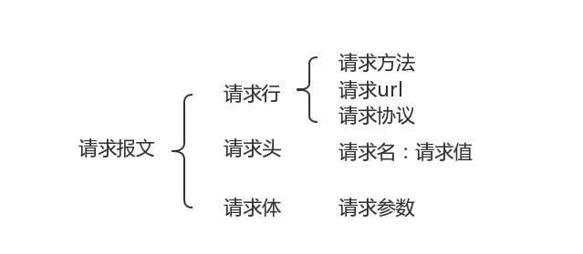

```javascript
---- 请求行 ----
POST /chapter17/user.html HTTP/1.1  // 请求方式 请求资源路径 HTTP协议版本

---- 请求头 -----                 // 包含请求的附加信息，由key：value组成
Host: www.itcast.cn  // 服务器的主机地址和端口号,默认是80
Connection: keep-alive // 和服务端保持长连接
Accept: text/html,application/xml // 指定客户端能够接受的内容类型
Accept-Encoding: gzip,deflate  // 指定客户端浏览器可以支持的web服务器返回内容压缩编码类型
Accept-Language: zh-cn,zh;q=0.5   //  指定http客户端浏览器用来展示返回信息所先选择的语言

---- 请求体 -----         // 承载多个请求参数的数据。
name=Javanx&age=25
```

请求方式：GET、POST、PUT、DELETE等

### 常见请求方式

1. GET：申请获取资源，不对服务器产⽣影响
   
2. POST：客户端向服务器提交数据。会影响服务器，服务器可能动态创建新的资源或更新原有资源
   
3. PUT：上传某个资源
   
4. DELETE：删除某个资源

## 7.2 服务器处理请求并返回HTTP报⽂

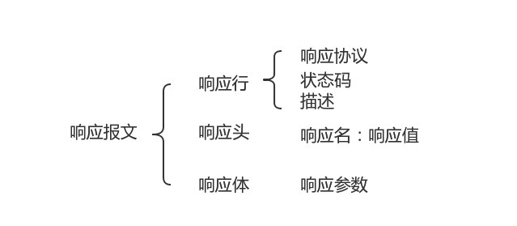

```javascript
---- 响应行 ----
HTTP/1.1 200 OK  // HTTP协议版本 状态码及状态描述

---- 响应头 -----                 // 响应头用于描述服务器的基本信息，以及数据的描述
Server: Apache-Coyote/1.1        // 告诉浏览器服务器的类型
Content-Type: application/json   // 表示后面的文档属于什么类型
Transfer-Encoding: chunked       // 告诉浏览器数据的传送格式
Date: Mon, 12 Sep 2011 12:41:24 GMT  // 当前的GMT时间

---- 响应体 -----         // 响应体就是响应的消息体，如果是纯数据就是返回纯数据，如果请求的是HTML页面，那么返回的就是HTML代码，如果是JS就是JS代码，如此之类
{"password":"1234","userName":"tom"}
```

### 常⻅状态码以及描述

200：客户端请求成功

206：partial content 服务器已经正确处理部分GET请求，实现断点续传或同时分⽚下载，该请求必须包含Range请求头来指示客户端期望得到的范围

301（永久重定向）：该资源已被永久移动到新位置，将来任何对该资源的访问都要使⽤本响应返回的若⼲个URL之⼀

302（临时重定向）：请求的资源现在临时从不同的URI中获得

304：如果客户端发送⼀个待条件的GET请求并且该请求以经被允许，⽽⽂档内容未被改变，则返回304,该响应不包含包体（即可直接使⽤缓存）

400：请求报⽂语法有误，服务器⽆法识别

401：请求需要认证

403：请求的对应资源禁⽌被访问

404：服务器⽆法找到对应资源

500：服务器内部错误

503：服务器正忙

# 8. GET和POST的区别

## 从标准上来看：

GET 用于获取信息，是无副作用的，是幂等的，可缓存；POST 用于修改服务器上的数据，有副作用，非幂等，不可缓存（幂等：多次执⾏相同的操作，结果都相同）

## GET、POST 请求报文上的区别：

GET 和 POST 只是 HTTP 协议中两种请求方式（异曲同工），而 HTTP 协议是基于 TCP/IP 的应用层协议，无论 GET 还是 POST，用的都是同一个传输层协议，所以在传输上，没有区别。

报文格式上，不带参数时，最大区别就是第一行方法名不同, 仅仅是报文的几个字符不同而已

POST 方法请求报文第一行是这样的 POST /url HTTP/1.1

GET 方法请求报文第一行是这样的 GET /url HTTP/1.1

带参数时报文的区别呢？ 在约定中，GET 方法的参数应该放在 url 中，POST 方法参数应该放在 body 中

```javascript
// GET报文
GET /updateInfo?name=Javanx&age=25 HTTP/1.1
Host: localhost

// POST报文、
POST /updateInfo HTTP/1.1
Host: localhost
Content-Type: application/x-www-form-urlencoded

name=Javanx&age=25
```

现在我们知道了两种方法本质上是 TCP 连接，没有区别。但如果不按规范来也是可以的，可以在 URL 上写参数，然后方法使用 POST；也可以在 Body 写参数，然后方法使用 GET。当然，这需要服务端支持。

## GET 方法参数写法是固定的吗？

在约定中，我们的参数是写在 ? 后面，用 & 分割。

我们知道，解析报文的过程是通过获取 TCP 数据，用正则等工具从数据中获取 Header 和 Body，从而提取参数。

也就是说，我们可以自己约定参数的写法，**只要服务端能够解释出来就行**，万变不离其宗。

## GET 方法的长度限制是怎么回事？

网络上都会提到浏览器地址栏输入的参数是有限的。

首先说明一点，HTTP 协议没有 Body 和 URL 的长度限制，对 URL 限制的大多是浏览器和服务器的原因。

因为浏览器要对url进行解析，而解析的时候就要分配内存；而服务器是因为处理长 URL 要消耗比较多的资源，为了性能和安全（防止恶意构造长 URL 来攻击）考虑，会给 URL 长度加限制。

## POST 方法比 GET 方法安全？

有人说POST 比 GET 安全，因为数据在地址栏上不可见。

然而，从传输的角度来说，他们都是不安全的，因为 HTTP 在网络上是明文传输的，只要在网络节点上捉包，就能完整地获取数据报文。

要想安全传输，就只有加密，也就是 HTTPS。

## POST 方法会产生两个 TCP 数据包？

有些文章中提到，post 会将 header 和 body 分开发送，先发送 header，服务端返回 100 状态码再发送 body。

HTTP 协议中没有明确说明 POST 会产生两个 TCP 数据包。所以，header 和 body 分开发送是部分浏览器或框架的请求方法，不属于 post 必然行为。

# 9. 在浏览器中输入URL后的整个过程

1. ⾸先，我们在浏览器地址栏中，输⼊要查找⻚⾯的URL，按下Enter
 
2. 浏览器依次在 浏览器缓存 -->>系统缓存 -->>路由器缓存中去寻找匹配的URL，若有，就会直接在屏幕中显示出⻚⾯内容。若没有，则跳到第三步操作
   
3. 发送HTTP请求前，浏览器需要先进⾏域名解析(即DNS解析)，以获取相应的IP地址;（浏览器DNS缓存、路由器缓存、DNS缓存）
   
4. 获取到IP地址之后，浏览器向服务器发起TCP连接，与浏览器建⽴TCP三次握⼿
   
5. 握⼿成功之后，浏览器就会向服务器发送HTTP请求，来请求服务器端的数据包
   
6. 服务器处理从浏览器端收到的请求，接着将数据返回给浏览器
   
7. 浏览器收到HTTP响应
   
8. 查询状态，状态成功则进⾏下⼀步，不成功则弹出相应指示

9. 再读取⻚⾯内容、进⾏浏览器渲染、解析HTML源码;（⽣成DOM树、解析CCS样式、处理JS交互，客户端和服务器交互）进⾏展示
    
10. 关闭TCP连接（四次挥手）

# 10. HTTP的持久连接

HTTP/1.0需要手动开启，HTTP/1.1默认开启

HTTP/1.0 版的主要缺点是，每个TCP连接只能发送一个请求。发送数据完毕，连接就关闭，如果还要请求其他资源，就必须再新建一个连接。 TCP连接的新建成本很高，因为需要客户端和服务器三次握手，并且开始时发送速率较慢（slow start）。所以，HTTP 1.0版本的性能比较差。随着网页加载的外部资源越来越多，这个问题就愈发突出了。 为了解决这个问题，HTTP/1.1引入了持久连接（persistent connection），即TCP连接默认不关闭，可以被多个请求复用，不用声明Connection: keep-alive。

客户端和服务器发现对方一段时间没有活动，就可以主动关闭连接。不过，规范的做法是，客户端在最后一个请求时，发送Connection: close，明确要求服务器关闭TCP连接。

虽然1.1版允许复用TCP连接，但是同一个TCP连接里面，所有的数据通信是按次序进行的。服务器只有处理完一个回应，才会进行下一个回应。要是前面的回应特别慢，后面就会有许多请求排队等着。这称为“队头堵塞”（Head-of-line blocking）。
 
为了避免这个问题，只有两种方法：一是减少请求数，二是同时多开持久连接。这导致了很多的网页优化技巧，比如合并脚本和样式表、将图片嵌入CSS代码、域名分片（domain sharding）等等。

# 11. cookie和session

## cookie

1. 在第⼀次登录服务器之后，返回⼀些数据（cookie）给浏览器
2. 浏览器将数据保存在本地
3. 两次发送请求时，⾃动把上⼀次请求存储的cookie发送给服务器
4. 服务器通过该数据判断⽤户
5. 可存储的数据量有限，⼀般不会超过4KB

## session

1. 浏览器端第一次发送请求到服务器端，服务器端创建一个Session，同时会创建一个特殊的Cookie，然后将该Cookie发送至浏览器端
2. 浏览器端发送第2次请求到服务器端,浏览器端访问服务器端时就会携带该Cookie对象
3. 服务器端根据该cookie,去查询Session对象，从而区分不同用户。

## 区别

1. cookie数据存放在客户的浏览器上，session数据放在服务器上
2. cookie不是很安全，别人可以分析存放在本地的COOKIE并进行COOKIE欺骗,如果主要考虑到安全应当使用session
3. session会在一定时间内保存在服务器上。当访问增多，会比较占用你服务器的性能，如果主要考虑到减轻服务器性能方面，应当使用COOKIE
4. 所以：将登陆信息等重要信息存放为SESSION;其他信息如果需要保留，可以放在COOKIE中

# 12. HTTP新特性

## 12.1 HTTP1.1新特性

1、默认持久连接：只要客户端任意⼀端没有明确提出断开TCP连接，就⼀直保持连接，可以发送多次HTTP请求

2、管线化：客户端可以同时发送多个HTTP请求，不⽤等待响应

HTTP管线化是将多个HTTP要求（request）整批提交的技术，而在传送过程中不需先等待服务端的回应。管线化机制须通过永久连接（persistent connection）完成，仅HTTP/1.1支持此技术（HTTP/1.0不支持），并且只有GET和HEAD要求可以进行管线化，而POST则有所限制。此外，初次创建连接时也不应启动管线机制，因为对方（服务器）不一定支持HTTP/1.1版本的协议。

浏览器将HTTP要求大批提交可大幅缩短页面的加载时间，特别是在传输延迟（lag/latency）较高的情况下（如卫星连接）。此技术之关键在于多个HTTP的要求消息可以同时塞入一个TCP分组中，所以只提交一个分组即可同时发出多个要求，借此可减少网络上多余的分组并降低线路负载。

3、断点续传：断点续传其实就是在上一次下载断开的位置开始继续下载。HTTP协议中，可以在请求报文头中加入Range段，来表示客户机希望从何处继续下载。

## 12.2 HTTP2.0版本新特性

1. 传输格式变化，采⽤了新的⼆进制格式
   
   HTTP1.X的解析都是基于⽂本，⽂本的表现形式多样，不利于健壮性考虑

   HTTP2.0采⽤⼆进制，只认0/1组合，实现更加快的⽅法，健壮性更加完善

2. 多路复⽤：多路复用允许同时通过单一的 HTTP/2 连接发起多重的请求-响应消息，多路复用代替原来的序列和阻塞机制，所有就是请求的都是通过一个 TCP 连接并发完成，同时也很好的解决了浏览器限制同一个域名下的请求数量的问题。

3. 头压缩：在HTTP1.X中，header带有大量信息，⽽且每次都要重复发送，HTTP2.0通过encoder减少header⼤⼩，通讯双⽅会各⾃缓存⼀份header字段表，既可以避免重复header传输，⼜减⼩了需要传输的⼤⼩

4. 服务端推送：把客户端所需要的资源伴随着index.html⼀起发送到客户端，省去了客户端重复请求的步骤，因为没有发起请求，建⽴连接等操作，所以静态资源通过服务器推送，可以极⼤的提升速度
   
   传统的网页请求方式下，假设一个index.html网页包含一张样式表style.css和一个图片文件example.png。为了渲染这个网页，浏览器会发出三个请求。第一个请求是index.html。服务器收到这个请求，就把index.html发送给浏览器。浏览器发现里面包含了样式表和图片，于是再发出两个请求，请求样式表和图片文件。

# 13. HTTP/1.1中的管线化和Http/2.0中的多路复用

从 Http/0.9 到 Http/2 要发送多个请求，从多个 Tcp 连接=>keep-alive=>管道化=>多路复用不断的减少多次创建 Tcp 等等带来的性能损耗。

## 多个TCP连接

在最早的时候没有keep-alive只能创建多个Tcp连接来做多次请求。一次请求完成就会关闭本次的 Tcp 连接，下个请求又要从新建立 Tcp 连接传输完成数据再关闭，造成很大的性能损耗。


## Keep-Alive

Keep-Alive解决的核心问题是： 一定时间内，同一域名多次请求数据，只建立一次 HTTP 请求，其他请求可复用每一次建立的连接通道，以达到提高请求效率的问题。这里面所说的一定时间是可以配置的。

## 管线化

HTTP 管线化可以克服同域并行请求限制带来的阻塞，它是建立在持久连接之上，是把所有请求一并发给服务器，但是服务器需要按照顺序一个一个响应，而不是等到一个响应回来才能发下一个请求，这样就节省了很多请求到服务器的时间。不过，HTTP 管线化仍旧有阻塞的问题，若上一响应迟迟不回，后面的响应都会被阻塞到。

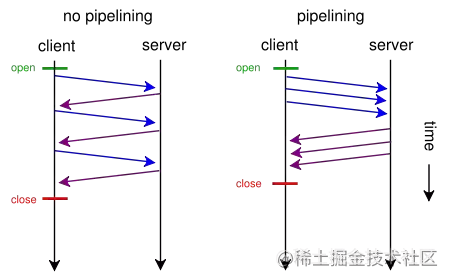

## 多路复用

多路复用代替原来的序列和阻塞机制。所有就是请求的都是通过一个 TCP 连接并发完成。因为在多路复用之前所有的传输是基于基础文本的，在多路复用中是基于二进制数据帧的传输、消息、流，所以可以做到乱序的传输。多路复用对同一域名下所有请求都是基于流，所以不存在同域并行的阻塞。多次请求如下图：

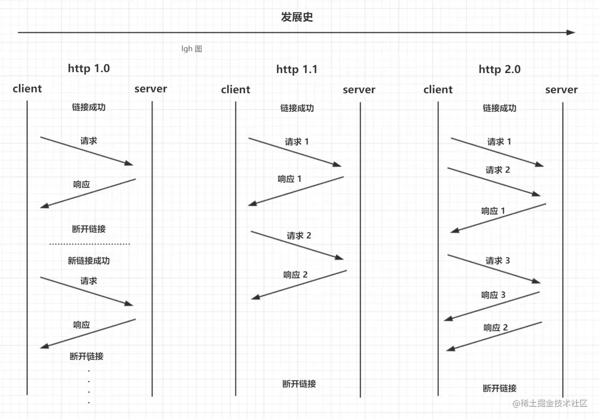

### HTTP2并发是如何实现的呢？

先来理解三个概念，即：Stream、Message、frame。

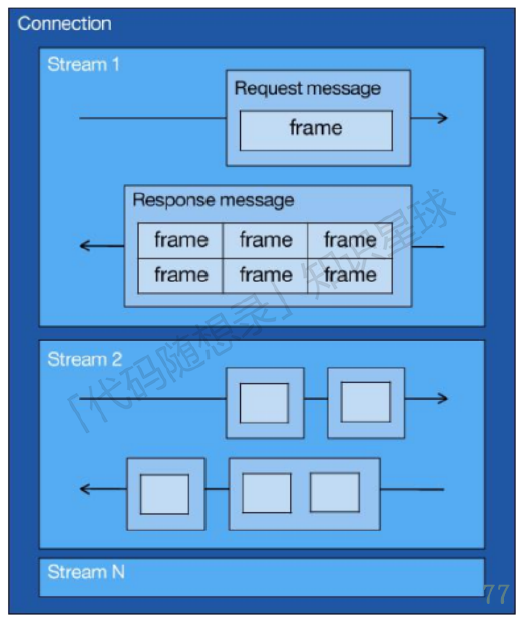

从上图可以看到：

* 1个TCP连接包含一个或者多个Stream，Stream是HTTP/2.0并发的关键技术；
* Stream里可以包含1个或多个Message，Message对应HTTP/1中的请求或者相应，由HTTP头部和包体构成；
* Message里包含1条或者多个Frame，Frame是HTTP/2.0最小单位，以二进制压缩格式存放HTTP/1中的内容（头部和包体）

在HTTP2连接上，不同Stream的帧可以乱序发送（因此可以并发不同的Stream），接收端可以通过Stream ID 有序组装HTTP消息。

# 14. HTTP复用和TCP复用

TCP连接复用是将多个客户端的HTTP请求复用到一个服务器端TCP连接上，而HTTP复用则是一个客户端的多个HTTP请求通过一个TCP连接进行处理。前者是负载均衡设备的独特功能；而后者是HTTP 1.1协议所支持的新功能，目前被大多数浏览器所支持。

# 15. TCP与UDP的区别

1. **连接**：TCP是⾯向连接的，在传输前需要三次握⼿建⽴连接，UDP不需要连接，即刻传输数据。
2. **服务形式**：TCP只能⼀对⼀，点对点服务，UDP⽀持⼀对⼀、⼀对多、多对多通信。
3. **可靠性**：TCP保证数据可靠交付，拥有确认应答和重传机制，⽆重复、不丢失、按序到达;UDP尽可能交付，不保证可靠性。
4. **连接控制机制**：TCP拥有流量控制、拥塞控制，保证传输安全性等，UDP在⽹络拥堵情况下不会降低发送速率。
5. **⾸部⼤⼩**：TCP⾸部⻓度不使用选项字段是20字节，使⽤选项字段⻓度增加(可变)，UDP⾸部固定8字节。
6. **传输⽅式**：TCP基于字节流，没有边界，但是保证传输顺序和可靠性;UDP继承了IP层特性，基于数据包，有边界但可能出现乱序和丢包。
   保护消息边界，就是指传输协议把数据当作一条独立的消息在网上传输,接收端只能接收独立的消息.也就是说存在保护消息边界,接收端一次只能接收发送端发出的一个数据包。而无保护消息保护边界指,如果发送端连续发送数据, 接收端有可能在一次接收动作中,会接收两个或者更多的数据包.
7. **分片方式**：TCP数据⼤于MSS时会在TCP层将数据进⾏分⽚传输，到达⽬的地后同样在传输层进⾏合并，如果有某个⽚丢失则只需要重传丢失的分⽚即可;UDP数据⼤于MTU时会在IP层分⽚，同样也在⽬的IP层合并，如果某个IP分⽚丢失，则需要将所有分⽚都进⾏重传，开销⼤。
   
   MTU：maximum transmission unit，最大传输单元，由硬件规定，如以太网的MTU为1500字节。
   MSS：maximum segment size，最大分节大小，为TCP数据包每次传输的最大数据分段大小，一般由发送端向对端TCP通知对端在每个分节中能发送的最大TCP数据。

# 16. SYN攻击

## 原理

攻击者伪造不同IP地址的SYN报⽂请求连接，服务端收到连接请求后分配资源，回复ACK+SYN包，但是由于IP地址是伪造的，⽆法收到回应，久⽽久之造成服务端半连接队列被占满，⽆法正常⼯作。

## 避免⽅式

1. **修改半连接队列⼤⼩**：使服务端能够容纳更多半连接。此外还可以修改服务端超时􁯿传次数，使服务端尽早丢弃⽆⽤连接

2. **SYN-Cookies**：正常服务端⾏为是收到客户端SYN报⽂后将其加⼊到内核半连接队列，接着发送ACK+SYN报⽂给客户端，当收到客户端ACK报⽂后把连接从半连接队列移动到accept队列。
   
   当半连接队列满时，启动syn cookie,后续连接不进⼊半连接队列，⽽是计算⼀个cookie值，这个cookie是由元组信息(源IP,目的IP,源端口，目的端口)加密而成的，将此cookie作为请求报⽂序列号发送给客户端，服务器巧妙地通过这种方式间接保存了一部分SYN报文的信息，发完报文后释放所有资源。正常的客户端会返回此cookie + 1，如果服务端收到客户端确认报⽂，会检查ack包合法性，如果合法直接加⼊到accept队列。

# 17. TCP保活机制

在⼀个定义的时间段内TCP连接⽆任何活动时，会启动TCP保活机制，每隔⼀定时间间隔发送⼀个探测报⽂，等待响应。

1. 对端正常响应，重置保活时间;
2. 对端程序崩溃，响应⼀个RTS报⽂，将TCP连接重置;
3. 保活报⽂不可达，等待达到保活探测次数后关闭连接。

# 18. TCP为什么需要流量控制

1. 由于通讯双⽅⽹速不同，通讯⽅任意⼀⽅发送过快都会导致对⽅详细处理不过来，所以就需要把数据放到缓冲区中
2. 如果缓冲区满了，发送⽅还在疯狂发送，那接收⽅只能把数据包丢弃。因此我们需要控制发送速率
3. 我们缓冲区剩余⼤⼩称之为接收窗⼝，⽤变量win表示。如果win=0，则发送⽅停⽌发送

# 19. TCP拥塞控制

慢开始、拥塞避免、快速重传、快速恢复

## 慢开始算法

发送方维持一个叫做拥塞窗口cwnd（congestion window）的状态变量。拥塞窗口的大小取决于网络的拥塞程度，并且动态地在变化，发送方让自己的发送窗口等于拥塞窗口，另外考虑到接受方的接收能力，发送窗口可能小于拥塞窗口（受流量控制的限制）。

慢开始算法的思路就是，不要一开始就发送大量的数据，先探测一下网络的拥塞程度，也就是说由小到大逐渐增加拥塞窗口的大小。

一个传输轮次所经历的时间其实就是往返时间RTT，而且每经过一个传输轮次（transmission round），拥塞窗口cwnd就加倍。

为了防止cwnd增长过大引起网络拥塞，还需设置一个慢开始门限ssthresh状态变量。ssthresh的用法如下：当cwnd < ssthresh时，使用慢开始算法。当cwnd > ssthresh时，改用拥塞避免算法。

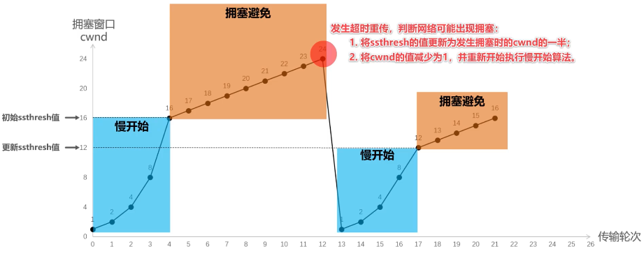

## 拥塞避免

拥塞避免算法让拥塞窗口缓慢增长，即每经过一个往返时间RTT就把发送方的拥塞窗口cwnd加1，而不是加倍。这样拥塞窗口按线性规律缓慢增长。

无论是在慢开始阶段还是在拥塞避免阶段，只要发送方判断网络出现拥塞（其根据就是没有按时收到确认，虽然没有收到确认可能是其他原因的分组丢失，但是因为无法判定，所以都当做拥塞来处理），就把慢开始门限ssthresh设置为出现拥塞时的发送窗口大小的一半（但不能小于2）。然后把拥塞窗口cwnd重新设置为1，执行慢开始算法。

## 快速重传

快重传要求接收方在收到一个失序的报文段后就立即发出重复确认（为的是使发送方及早知道有报文段没有到达对方，可提高网络吞吐量约20%）而不要等到自己发送数据时捎带确认。快重传算法规定，发送方只要一连收到三个重复确认就应当立即重传对方尚未收到的报文段，而不必继续等待设置的重传计时器时间到期。

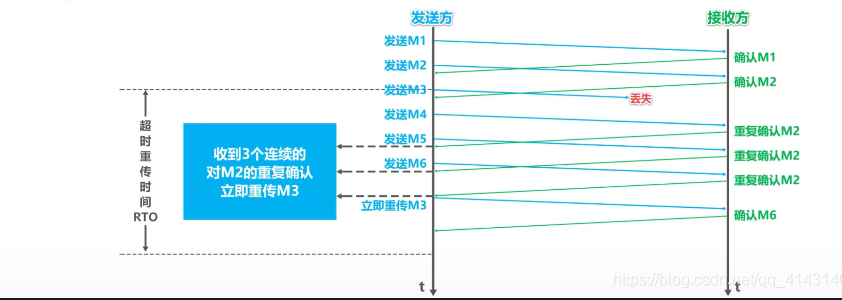

## 快速恢复

快重传配合使用的还有快恢复算法，有以下两个要点：

当发送方连续收到三个重复确认时，就执行“乘法减小”算法，把ssthresh门限减半（为了预防网络发生拥塞）。但是接下去并不执行慢开始算法
考虑到如果网络出现拥塞的话就不会收到好几个重复的确认，所以发送方现在认为网络可能没有出现拥塞，只是丢失了个别的报文段。所以此时不执行慢开始算法，而是将cwnd设置为ssthresh减半后的值，然后执行拥塞避免算法，使cwnd缓慢增大。

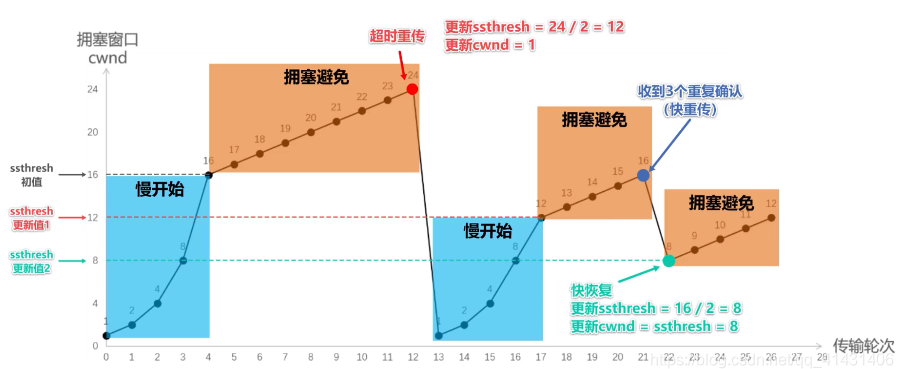

快速重传算法出现后，慢开始算法只在TCP连接建立时和网络出现超时时才使用。

# 20. TCP重传机制

## 20.1 超时重传

设定⼀个计时器，当超过指定的时间后，没有收到对⽅的确认ACK应答报⽂，就会重发该数据。

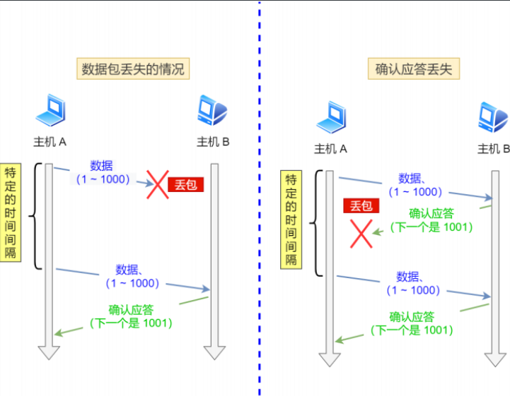

RTO（Retransmission Timeout）：超时重传时间

RTO较⻓或较短可能发⽣的情况如下：

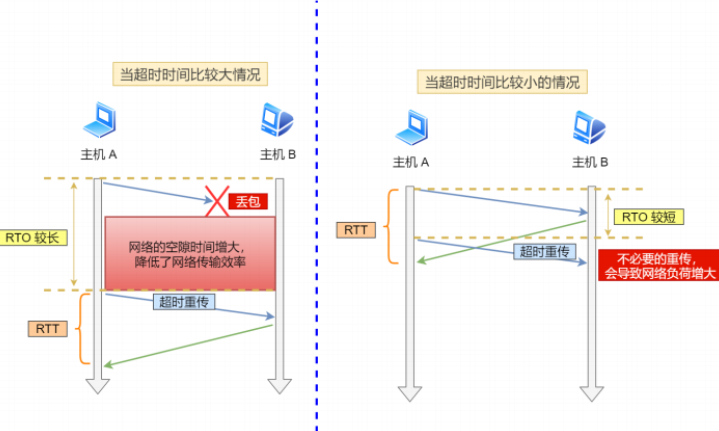

由上图可知：超时重传时间RTO的值 应该略⼤于 报⽂往返RTT的值，且是动态变化的。

如果超时重发的数据，再次超时⼜要重发的时候，TCP的策略是将超时间隔加倍。

## 20.2 快速重传

快速重传解决了超时时间的问题，但还⾯临另外⼀个问题：重传的时候，是重传之前的⼀个，还是重传所有的问题。

## 20.3 SACK（Selective Acknowledgment,选择性确认）

SACK重传其实就是选择性重传，它是为了解决快速重传不知道需要重传哪些包的问题。

TCP的选项字段增加一个SACK字段，接收方会将已经收到数据包序列号范围发送给发送方，这样发送方通过SACK信息就能找到丢失的数据包重传此数据包。

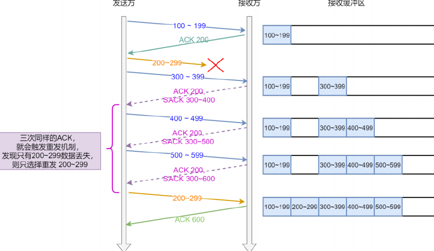

## 20.4 Duplicate SACK(D-SACK)

SACK可以让发送方准确的知道哪些数据包接收方没有收到，而D-SACK可以让发送方知道有哪些数据包被重复接收了。

D-SACK的优点是什么？

* 可以让发送方知道是发出去的包丢了还是接收方回应的ACK包丢了
* 可以知道是不是发送方的数据包被网络延迟

D-SACK如何让发送方知道ACK包丢失：

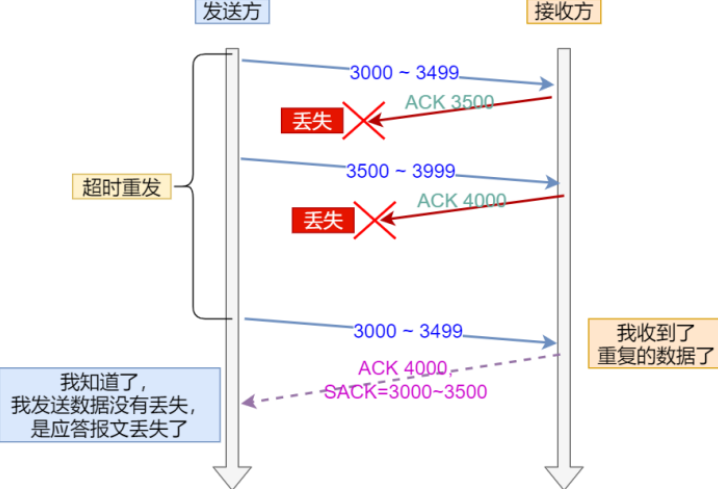

D-SACK如何判断数据包发送延时：

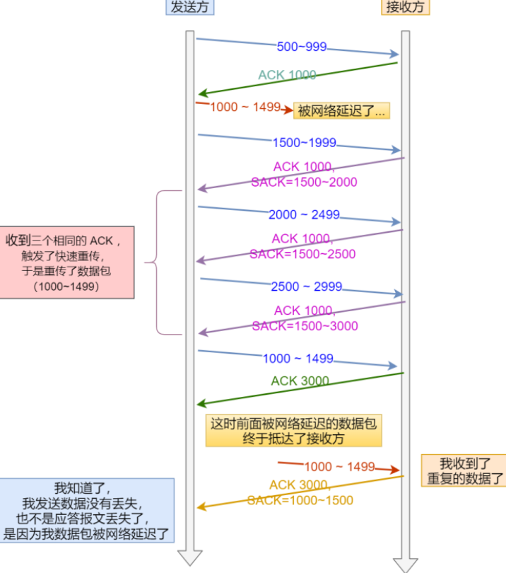

# 21. 滑动窗口

## 21.1 什么是窗口

TCP每发送⼀个数据，都需要⼀次应答，然后继续发送，这样为每个数据包都进⾏确认应答，缺点是：数据往返时间越⻓，⽹络吞吐量越低。

引⼊窗⼝即使往返时间较⻓，也不会降低⽹络通信效率。可以指定窗⼝⼤⼩，窗⼝⼤⼩就是⽆需等待确认应答，继续发送数据的最⼤值。

窗⼝实现就是操作系统开辟的⼀个缓存空间，发送⽅主机在等到确认应答返回之前，必须在缓冲区中保留已发送的数据。如果按期收到确认应答，此时数据就可以从缓存区清除。

## 21.2 什么决定窗口大小

TCP头部有⼀个字段叫window，窗⼝⼤⼩。

这个字段是接收端告诉发送端⾃⼰还有多少缓冲区可以接收数据。于是发送端就可以根据这个接收端的处理能⼒来发送数据，⽽不会导致接收端处理不过来

通常窗⼝的⼤⼩是由接收⽅的窗⼝⼤⼩来决定的。

# 22. ⽹络层（IP)与数据链路层(MAC)有什么关系呢？

MAC的作⽤：实现【直连】的两个设备之间通信。

IP的作⽤：负责在【没有直连】的两个⽹络之间进⾏通信传输。

在⽹络数据包传输中，源IP地址和⽬标IP地址在传输过程中是不会变的，只有源MAC地址和⽬标MAC⼀直在变化。

# 23. IP地址分类

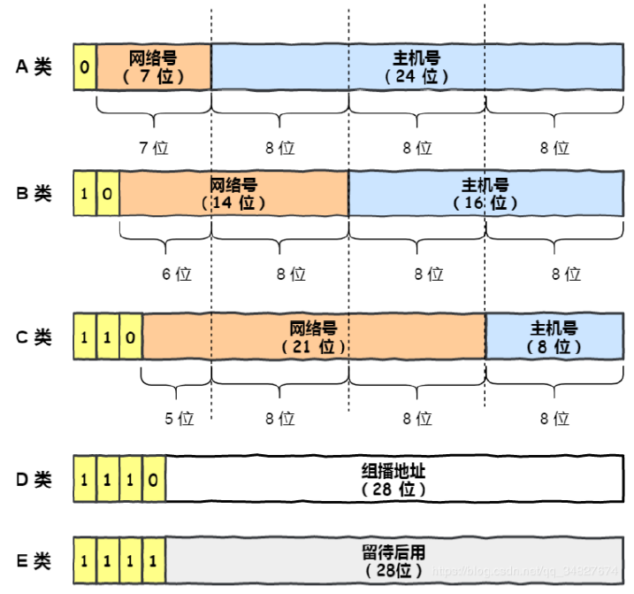

## A、B、C类地址

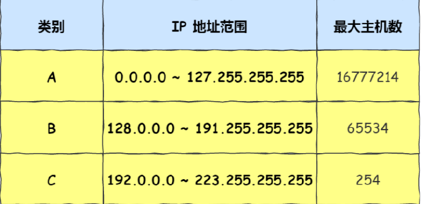

最⼤主机数=2^主机号位数-2，其中有两个地址，全0和全1是⽐较特殊的：

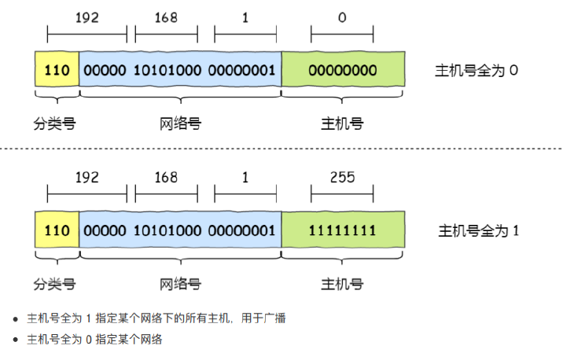

⼴播地址⽤于在同⼀个链路中相互连接的主机之间发送数据包。⼴播地址可以分为本地⼴播和直接⼴播两种。

在本⽹络内⼴播的叫做本地⼴播。例如⽹络地址为 192.168.0.0/24 的情况下，⼴播地址是192.168.0.255。

因为这个⼴播地址的 IP 包会被路由器屏蔽，所以不会到达 192.168.0.0/24 以外的其他链路上。

在不同⽹络之间的⼴播叫做直接⼴播。例如⽹络地址为 192.168.0.0/24 的主机向 192.168.1.255/24 的⽬标地址发送 IP 包。收到这个包的路由器，将数据转发给 192.168.1.0/24，从⽽使得所有 192.168.1.1~192.168.1.254 的主机都能收到这个包（由于直接⼴播有⼀定的安全问题，多数情况下会在路由 器上设置为不转发。）

## 什么是D、E类地址？

D 类和 E 类地址是没有主机号的，所以不可⽤于主机 IP，D 类常被⽤于多播，E 类是预留的分类，暂时未使⽤。

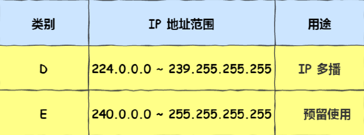

多播地址⽤于将包发送给特定组内的所有主机。由于⼴播⽆法穿透路由，若想给其他⽹段发送同样的包，就可以使⽤可以穿透路由的多播。

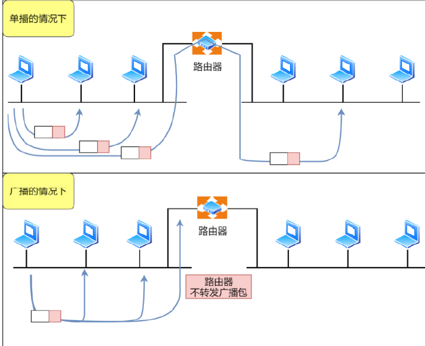

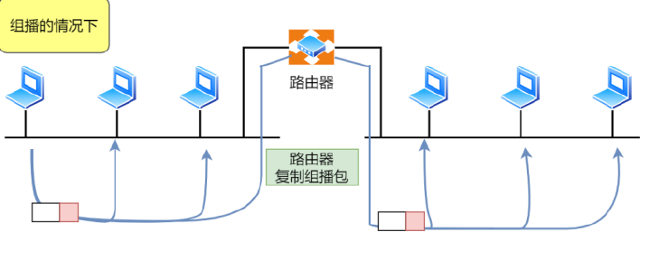

多播使⽤的 D 类地址，其前四位是 1110 就表示是多播地址，⽽剩下的 28 位是多播的组编号。

从 224.0.0.0 ~ 239.255.255.255 都是多播的可⽤范围，其划分为以下三类：

224.0.0.0 ~ 224.0.0.255 为预留的组播地址，只能在局域⽹中，路由器是不会进⾏转发的。

224.0.1.0 ~ 238.255.255.255 为⽤户可⽤的组播地址，可以⽤于 Internet 上。

239.0.0.0 ~ 239.255.255.255 为本地管理组播地址，可供内部⽹在内部使⽤，仅在特定的本地范围内有效。

# 24. IP分类的缺点

同⼀⽹络下没有地址层次，⽐如⼀个公司⾥⽤了 B 类地址，但是可能需要根据⽣产环境、测试环境、开发环境来划分地址层次，⽽这种 IP 分类是没有地址层次划分的功能，所以这就缺少地址的灵活性。

A、B、C类有个尴尬处境，就是不能很好的与现实⽹络匹配。

C 类地址能包含的最⼤主机数􁰁实在太少了，只有 254 个，估计⼀个⽹吧都不够⽤。⽽ B 类地址能包含的最⼤主机数􁰁⼜太多了，6 万多台机器放在⼀个⽹络下⾯，⼀般的企业基本达不到这个规模，闲着的地址就是浪费。这两个缺点，都可以在 CIDR ⽆分类地址解决。

# 25. CIDR⽆分类地址

这种⽅式不再有分类地址的概念，32 ⽐特的 IP 地址被划分为两部分，前⾯是⽹络号，后⾯是主机号。

## 如何划分⽹络号和主机号呢？

表示形式 a.b.c.d/x ，其中 /x 表示前 x 位属于⽹络号， x 的范围是 0 ~ 32 ，这就使得 IP 地址更加具有灵活性。

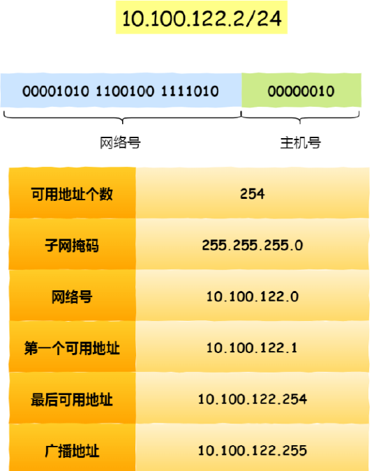

还有另⼀种划分⽹络号与主机号形式，那就是⼦⽹掩码，掩码的意思就是掩盖掉主机号，剩余的就是⽹络号。

将⼦⽹掩码和 IP 地址按位计算 AND，就可得到⽹络号。

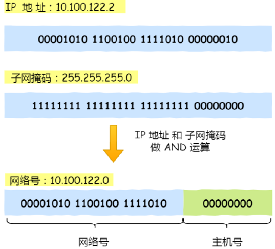

## 为什么要分离⽹络号和主机号？

因为两台计算机要通讯，⾸先要判断是否处于同⼀个⼴播域内，即⽹络地址是否相同。如果⽹络地址相同，表明接受⽅在本⽹络上，那么可以把数据包直接发送到⽬标主机。

路由器寻址⼯作中，也就是通过这样的⽅式来找到对应的⽹络号的，进⽽把数据包转发给对应的⽹络内。

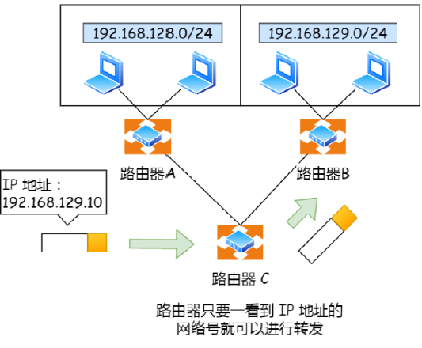

## 如何进⾏⼦⽹划分？

通过⼦⽹掩码划分出⽹络号和主机号，那实际上⼦⽹掩码还有⼀个作⽤，那就是划分⼦⽹。

⼦⽹划分实际上是将主机地址分为两个部分：⼦⽹⽹络地址和⼦⽹主机地址。形式如下：


假设对 C 类地址进⾏⼦⽹划分，⽹络地址 192.168.1.0，使⽤⼦⽹掩码 255.255.255.192 对其进⾏⼦⽹划分。

C 类地址中前 24 位是⽹络号，最后 8 位是主机号，根据⼦⽹掩码可知从 8 位主机号中借⽤ 2位作为⼦⽹号（对应4个⼦⽹）。

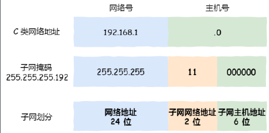

划分后的4个⼦⽹如下：

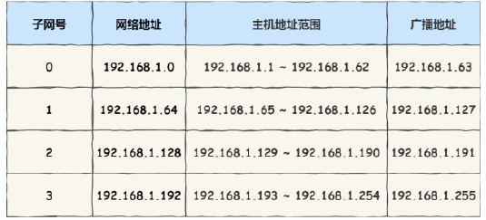

# 26. 公有IP地址与私有IP地址

在A、B、C分类地址，实际⼜分公有IP地址和私有IP地址。

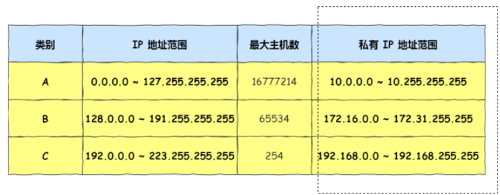

平时我们办公室、家⾥、学校⽤的 IP 地址，⼀般都是私有 IP 地址。因为这些地址允许组织内部的 IT ⼈员⾃⼰管理、⾃⼰分配，⽽且可以重复。

公有 IP 地址是有个组织统⼀分配的，假设你要开⼀个博客⽹站，那么你就需要去申请购买⼀个公有 IP，这 样全世界的⼈才能访问。并且公有 IP 地址基本上要在整个互联⽹范围内保持唯⼀

## 那么公有IP地址由谁管理呢？

私有 IP 地址通常是内部的 IT ⼈员管理，公有 IP 地址是由 ICANN 组织管理，中⽂叫「互联⽹名称与数字地址分配机构」。 IANA 是 ICANN 的其中⼀个机构，它负责分配互联⽹ IP 地址，是按州的⽅式层层分配。

# 27. IP地址与路由控制

IP地址的⽹络地址这⼀部分是⽤于进⾏路由控制。路由控制表中记录着⽹络地址与下⼀步应该发送⾄路由器的地址。在主机和路由器上都会有各⾃的路由器控制表。

在发送 IP 包时，⾸先要确定 IP 包⾸部中的⽬标地址，再从路由控制表中找到与该地址具有相同⽹络地址的记录，根据该记录将 IP 包转发给相应的下⼀个路由器。如果路由控制表中存在多条相同⽹络地址的记录，就选择相同位数最多的⽹络地址，也就是最⻓匹配。

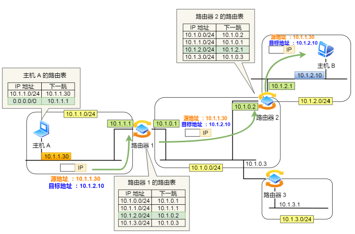

环回地址不会流向⽹络：环回地址是在同⼀台计算机上的程序之间进⾏⽹络通信时所使⽤的⼀个默认地址。 计算机使
⽤⼀个特殊的 IP 地址 127.0.0.1 作为环回地址。

与该地址具有相同意义的是⼀个叫做 localhost 的主机名。使⽤这个 IP 或主机名时，数据包不会流向⽹络

# 28. IP分片与重组

每种数据链路的最⼤传输单元 MTU 都是不相同的，如 FDDI 数据链路 MTU 4352、以太⽹的MTU 是 1500 字节等。

每种数据链路的 MTU 之所以不同，是因为每个不同类型的数据链路的使⽤⽬的不同。使⽤⽬的不同，可承载的 MTU 也就不同。

其中，我们最常⻅数据链路是以太⽹，它的 MTU 是 1500 字节。 那么当 IP 数据包⼤⼩⼤于MTU 时， IP 数据包就会被分⽚。 经过分⽚之后的 IP 数据报在被重组的时候，只能由⽬标主机进⾏，路由器是不会进⾏重组的。

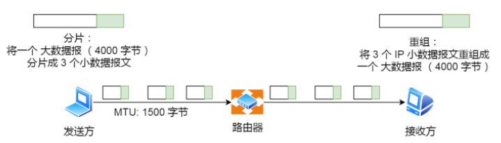

在分⽚传输中，⼀旦某个分⽚丢失，则会造成整个 IP 数据报作废，所以 TCP 引⼊了 MSS 也就是在 TCP 层进⾏分⽚不由 IP 层分⽚，那么对于 UDP 我们尽量不要发送⼀个⼤于 MTU 的数据报⽂。

# 29. IPV4⾸部与IPV6⾸部

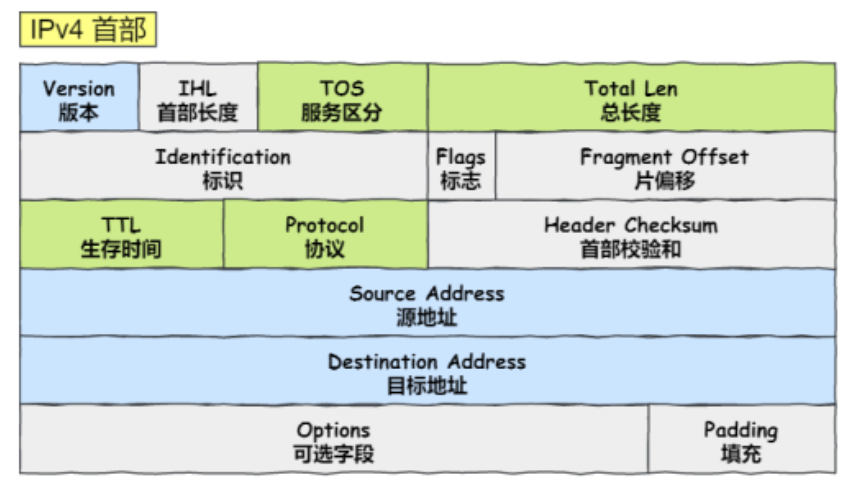

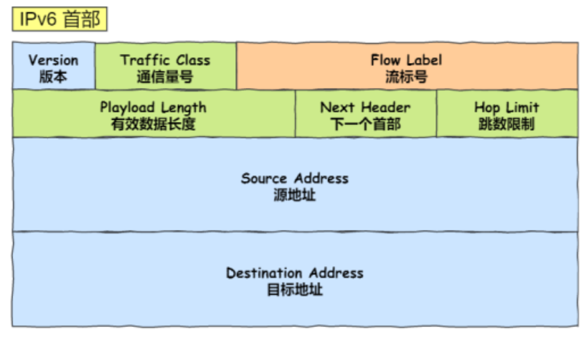

其中：


## IPV6相⽐IPV4的⾸部改进

**取消了⾸部校验和字段**：因为在数据链路层和传输层都会校验，因此 IPv6 直接取消了 IP 的校验。

**取消了分⽚/重新组装相关字段**：分⽚与重组是耗时的过程，IPv6 不允许在中间路由器进⾏分⽚与重组，这 种操作只能在源与⽬标主机，这将⼤⼤提⾼了路由器转发的速度。

**取消选项字段**：选项字段不再是标准 IP ⾸部的⼀部分了，但它并没有消失，⽽是可能出现在 IPv6 ⾸部中的「下⼀个⾸部」指出的位置上。删除该选项字段使的 IPv6 的⾸部成为固定⻓度的 40 字节。

# 30. ARP与RARP协议

## ARP协议

在传输⼀个 IP 数据报的时候，确定了源 IP 地址和⽬标 IP 地址后，就会通过主机「路由表」确定 IP 数据包下⼀ 跳。然⽽，⽹络层的下⼀层是数据链路层，所以我们还要知道「下⼀跳」的 MAC 地址。

由于主机的路由表中可以找到下⼀跳的 IP 地址，所以可以通过 ARP 协议（AddressResolution Protocol，地址解析协议），求得下⼀跳的 MAC 地址。

ARP是如何知道对⽅的MAC地址的呢？ARP 是借助 ARP 请求与 ARP 响应两种类型的包确定MAC 地址的。

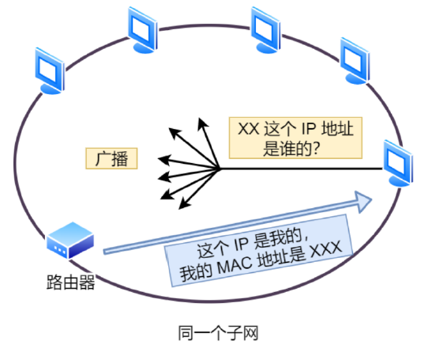

主机会通过⼴播发送 ARP 请求，这个包中包含了想要知道的 MAC 地址的主机 IP 地址。当同个链路中的所有设备收到 ARP 请求时，会去拆开 ARP 请求包⾥的内容，如果 ARP 请求包中的⽬标 IP 地址与⾃⼰的 IP 地址⼀致，那么这个设备就将⾃⼰的 MAC 地址塞⼊ ARP 响应包返回给主机。

操作系统通常会把第⼀次通过 ARP 获取的 MAC 地址缓存起来，以便下次直接从缓存中找到对应 IP 地址的 MAC 地址。 不过，MAC 地址的缓存是有⼀定期限的，超过这个期限，缓存的内容将被清除。

## RARP协议

ARP 协议是已知 IP 地址求 MAC 地址，那 RARP 协议正好相反，它是已知 MAC 地址求 IP 地址。

例如将打印机服务器等⼩型嵌⼊式设备接⼊到⽹络时就经常会⽤得到。通常这需要架设⼀台RARP 服务器，在这个服务器上注册设备的 MAC 地址及其 IP 地址。然后再将这个设备接⼊到⽹络

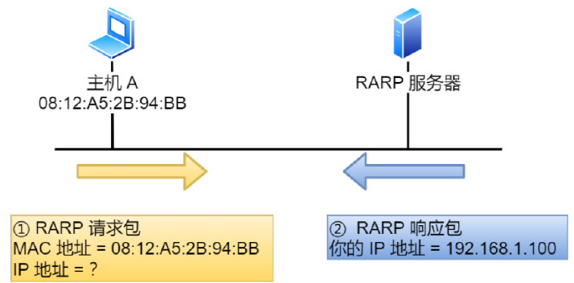

# 31. 为什么有了IP地址，还需要 MAC 地址？

IP 协议本身没有传输包的功能，因此包的实际传输要委托以太⽹来进⾏。

路由器是基于 IP 设计的，⽽交换机是基于以太⽹设计的，换句话说，路由器将包的传输⼯作委托给交换机来进⾏。

IP 并不是委托以太⽹将包传输到最终⽬的地，⽽是传输到下⼀个路由器。当包到达下⼀个路由器后，下⼀个路由器⼜会􁯿新委托以太⽹将包传输到再下⼀个路由器。随着这⼀过程反复执⾏，包就会最终到达IP 的⽬的地，也就是通信的对象。

IP 本身不负责包的传输，⽽是委托各种通信技术将包传输到下⼀个路由器，这样的设计是有重要意义的:

即，可以根据需要灵活运⽤各种通信技术。这也是 IP 的最⼤特点。正是有了这⼀特点，我们才能够构建出互联⽹这⼀规模巨⼤的⽹络。


