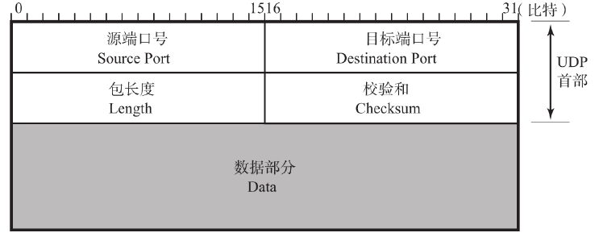
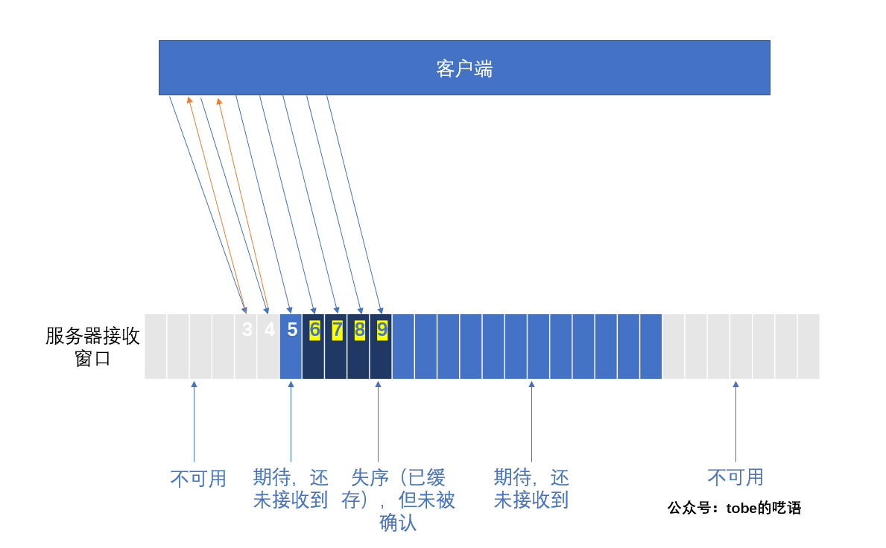

# 1. TCP和UDP首部格式

## 1.1 TCP首部

TCP中没有表示包长度和数据长度的字段。可由IP层获知TCP的包长由TCP的包长可知数据的长度。

**源端口号**

表示发送端端口号，字段长16位。

**目标端口号**

表示目标端端口号，字段长16位。

**序列号**

字段长32位。序列号（有时也叫序号）是指发送数据的位置。每发送一次数据，就累加一次该数据字节数的大小。
序列号不会从0或1开始，而是在建立连接时由计算机生成的随机数作为其初始值，通过SYN包传给接收端主机。然后再将每转发过去的字节数累加到初始值上表示数据的位置。此外，在建立连接和断开连接时发送的SYN包和FIN包虽然并不携带数据，但是也会作为一个字节增加对应的序列号。

**确认应答号**

确认应答号字段长度32位。是指下一次应该收到的数据的序列号。实际上，它是指已收到确认应答号减一为止的数据。发送端收到这个确认应答以后可以认为在这个序号以前的数据都已经被正常接收。

**数据偏移**

该字段表示TCP所传输的数据部分应该从TCP包的哪个位开始计算，当然也可以把它看作TCP首部的长度。
该字段长4位，单位为4字节（即32位）。不包括选项字段的话，TCP的首部为20字节长，因此数据偏移字段可以设置为5。反之，如果该字段的值为5，那说明从TCP包的最一开始到20字节为止都是TCP首部，余下的部分为TCP数据。

**保留**

该字段主要是为了以后扩展时使用，其长度为4位。一般设置为0。

**控制位**

字段长为8 位， 每一位从左至右分别为CWR 、ECE 、URG 、ACK、PSH、RST、SYN、FIN。这些控制标志也叫做控制位。

URG（Urgent Flag）
该位为1时，表示包中有需要紧急处理的数据。对于需要紧急处理的数据，会在后面的紧急指针中再进行解释。

ACK（Acknowledgement Flag）
该位为1时，确认应答的字段变为有效。TCP规定除了最初建立连接时的SYN包之外该位必须设置为1。

PSH（Push Flag）
该位为1时，表示需要将受到的数据立刻传给上层应用协议。PSH为0时，则不需要立即传而是先进行缓存。

RST（Reset Flag）
该位为1时表示TCP连接中出现异常必须强制断开连接。

SYN（Synchronize Flag）
用于建立连接。SYN为1表示希望建立连接，并在其序列号的字段进行序列号初始值的设定（Synchronize本身有同步的意思。也就意味着建立连接的双方，序列号和确认应答号要保持同步）。

FIN（Fin Flag）
该位为1时，表示今后不会再有数据发送，希望断开连接。当通信结束希望断开连接时，通信双方的主机之间就可以相互交换FIN位置为1的TCP段。每个主机又对对方的FIN包进行确认应答以后就可以断开连接。不过，主机收到FIN设置为1的TCP段以后不必马上回复一个FIN包，而是可以等到缓冲区中的所有数据都因已成功发送而被自动删除之后再发。

**窗口大小**

该字段长为16位。用于通知从相同TCP首部的确认应答号所指位置开始能够接收的数据大小（单位为字节）。TCP不允许发送超过此处所示大小的数据。不过，如果窗口为0，则表示可以发送窗口探测，以了解最新的窗口大小。但这个数据必须是1个字节。

**校验和**

TCP的校验和与UDP相似，区别在于TCP的校验和无法关闭。

**紧急指针**

该字段长为16位。只有在URG控制位为1时有效。该字段的数值表示本报文段中紧急数据的指针。正确来讲，从数据部分的首位到紧急指针所指示的位置为止为紧急数据。因此也可以说紧急指针指出了紧急数据的末尾在报文段中的位置。

**选项字段**

选项字段用于提高TCP的传输性能。因为根据数据偏移（首部长度）进行控制，所以其长度最大为40字节。

MSS选项用于在建立连接时决定最大段长度的情况。这选项用于大部分操作系统。

窗口扩大，是一个用来改善TCP吞吐量的选项。TCP首部中窗口字段只有16位。因此在TCP包的往返时间（RTT）内，只能发送最大64K字节的数据。如果采用了该选项，窗口的最大值可以扩展到1G字节。

选择确认应答（SACK ： Selective ACKnowledgement）。TCP的确认应答一般只有1个数字，如果数据段总以“豁牙子状态（这个形象的比喻是指数据段在途中丢失的情况。尤其是时不时丢失的情况。其结果就是在接收方收到的数据段的序号不连续，呈有一个没一个的状态。） ”到达的话会严重影响网络性能。有了这个选项，就可以允许最大4次的“豁牙子状态”确认应答。因此在避免无用重发的同时，还能提高重发的速度，从而也能提高网络的吞吐量。

## 1.2 UDP首部

**源端口号**

表示发送端端口号，字段长16位。该字段是可选项，有时可能不会设置源端口号。没有源端口号的时候该字段的值设置为0。可用于不需要返回的通信中。

**目标端口号**

表示接收端端口，字段长度16位。

**包长度**

该字段保存了UDP 首部的长度跟数据的长度之和，单位为字节。

**校验和**

校验和是为了提供可靠的UDP首部和数据而设计。UDP中也有可能不用校验和。

## 1.3 TCP和UDP的区别

1. **连接**：TCP是面向连接的，在传输前需要三次握手建立连接；UDP不需要连接，即刻传输数据。
2. **服务形式**：TCP只能⼀对⼀，点对点服务（单播）；UDP⽀持⼀对⼀、⼀对多、多对多通信（单播、多播和广播）。
3. **可靠性**：TCP保证数据可靠交付，拥有确认应答和重传机制，无重复、不丢失、按序到达；UDP尽可能交付，不保证可靠性。
4. **连接控制机制**：TCP拥有流量控制、拥塞控制，保证传输安全性等，UDP在网络拥堵情况下不会降低发送速率。
5. **首部大小**：TCP首部长度不使用选项字段是20字节，使用选项字段长度增加(可变)，UDP首部固定8字节。
6. **传输方式**：TCP基于字节流，没有边界，但是保证传输顺序和可靠性；UDP继承了IP层特性，基于数据包，有边界但可能出现乱序和丢包。
   
   保护消息边界，就是指传输协议把数据当作一条独立的消息在网上传输，接收端只能接收独立的消息，也就是说存在保护消息边界，接收端一次只能接收发送端发出的一个数据包。而无消息保护边界指，如果发送端连续发送数据，接收端有可能在一次接收动作中，会接收两个或者更多的数据包。
7. **分片方式**：TCP数据大于MSS时会在TCP层将数据进⾏分片传输，到达⽬的地后同样在传输层进⾏合并，如果有某个片丢失则只需要重传丢失的分片即可；UDP数据大于MTU时会在IP层分片，同样也在⽬的IP层合并，如果某个IP分片丢失，则需要将所有分片都进⾏重传，开销大。
   
   MTU：maximum transmission unit，最大传输单元，由硬件规定，如以太网的MTU为1500字节。

   MSS：maximum segment size，最大分节大小，为TCP数据包每次传输的最大数据分段大小，一般由发送端向对端TCP通知对端在每个分节中能发送的最大TCP数据。

## 1.4 既然 IP 层会分片，为什么 TCP 层还需要 MSS 呢？

* MTU：一个网络包的最大长度，以太网中一般为 1500 字节；
* MSS：除去 IP 和 TCP 头部之后，一个网络包所能容纳的 TCP 数据的最大长度；

如果在 TCP 的整个报文（头部 + 数据）交给 IP 层进行分片，会有什么异常呢？

当 IP 层有一个超过 MTU 大小的数据（TCP 头部 + TCP 数据）要发送，那么 IP 层就要进行分片，把数据分片成若干片，保证每一个分片都小于 MTU。把一份 IP 数据报进行分片以后，由目标主机的 IP 层来进行重新组装后，再交给上一层 TCP 传输层。

这看起来井然有序，但这存在隐患的，那么当如果一个 IP 分片丢失，整个 IP 报文的所有分片都得重传。

# 2. 三次握手

* 第⼀个SYN报文：客户端随机初始化序列号client_isn，放进TCP首部序列号段，然后把SYN置1。把SYN报文发送给服务端，表示发起连接，之后客户端处于SYN-SENT状态。

* 第⼆个报文SYN+ACK报文：服务端收到客户端的SYN报文，随机初始化序号server_isn放进TCP首部序列号段，确认应答号填⼊client_ins + 1，把SYN+ACK置1。把SYN+ACK报文发送给客户端，然后进⼊SYN-RCVD状态。

* 第三个报文ACK：客户端收到服务端报文后，还要向服务端回应最后⼀个应答报文。首先该应答报文 TCP 首部ACK 标志位置为 1 ，其次「确认应答号」字段填⼊ server_isn + 1 ，最后把报文发送给服务端，这次报文可以携带客户到服务器的数据，之后客户端处于 ESTABLISHED 状态。服务器收到客户端的应答报文后，也进⼊ ESTABLISHED 状态。

## 为什么需要三次握手？

1. 三次握手才可以避免历史连接及服务端资源浪费(主因)
2. 三次握手才可以同步双方的初始序列号
3. 三次握手才可以避免资源浪费

* 如果是两次握⼿，那么当客户端接收到服务端请求和确认报文后TCP连接就会建立。如果在客户端请求连接时网络状态拥塞，客户端最先发送的请求连接报文未到达服务端而发生重传。后正常建立连接，传输完毕后断开连接。
  
  但断开后早期的报文又被服务端所接收，那么服务端会误认为客户端再次发起连接，因此向客户端返回确认及请求连接报文，导致错误发生。并且由于此时客户端已断开，服务端无法收到客户端进⼀步的报文信息，造成服务端为为无效连接分配资源，造成浪费。
  
  所以，TCP 选择使用三次握手来建立连接，并在连接引入 RST 这一控制信息。接收方当收到连接请求时，会将发送方发来的 SEQ + 1 发送回发送方，由发送方判断此次连接是否有效（是否为历史连接）。

  如果当前连接是历史连接，即 SEQ 过期或者超时，那么发送方就会直接发送 RST 控制信息中止这一次连接；如果当前连接不是历史连接，那么发送方就会直接回复 ACK，则建立连接成功。

  使用三次握手和 RST 控制信息将是否建立连接的最终控制权交给发送方，因为只有发送方才有足够的上下文判断当前连接是错误的或者过期的。

* 同步双方的初始序列号
  
  TCP 协议的通信双方， 都必须维护⼀个「序列号」， 序列号是可靠传输的⼀个关键因素。两次握手只保证了⼀方的初始序列号能被对方成功接收，没办法保证双方的初始序列号都能被确认接收。

* 避免资源浪费。由于没有第三次握手，服务器不清楚客户端是否收到了自己发送的建立连接的 ACK 确认信号，所以每收到⼀个 SYN 就只能先主动建立⼀个连接。

# 3. 四次挥手

## 3.1 过程

* 假设客户端打算关闭连接，发送⼀个TCP首部FIN被置1的FIN报文给服务端。
* 服务端收到以后，向客户端发送ACK应答报文。
* 等待服务端处理完数据后，向客户端发送FIN报文。
* 客户端接收到FIN报文后回⼀个ACK应答报文。
* 服务器收到ACK报文后，进⼊close状态，服务器完成连接关闭。
* 客户端在经过 2MSL ⼀段时间后，自动进⼊close状态，客户端也完成连接的关闭。

## 3.2 为什么挥手需要四次

关闭连接时，客户端发送FIN报文，表示其不再发送数据，但还可以接收数据。服务端收到FIN报文，先回⼀个ACK应答报文，服务端可能还有数据需要处理和发送，等到其不再发送数据时，才发送FIN报文给客户端表示同意关闭连接。

从上面过程可知：

1. 服务端通常需要等待完成数据的发送和处理，所以服务端的ACK和FIN⼀般都会分开发送，从而⽐三次握手导致多了⼀次。
2. 第⼀次ACK应答报文可以省略，因为下⼀个报文段携带了ACK信息，ACK是否出现取决于延迟确认特性。
3. 延迟确认：即接收方收到包后，如果暂时没有内容回复给发送方，则延迟⼀段时间再确认，假如在这个时间范围内刚好有数据需要传输，则和确认包⼀起回复。这种也被称为数据捎带。延迟确认只是减轻网络负担，未必可以提升网络性能，有些情况下反而会影响性能。

## 3.3 为什么需要 TIME_WAIT 状态？

主动发起关闭连接的⼀方，才会有 TIME-WAIT 状态。需要 TIME-WAIT 状态，主要是两个原因：

1. 允许老的重复报文分组在网络中消逝。
	
   在2MSL等待期间，定义这个连接的插口(客户端IP地址和端口号，服务器IP地址和端口号的四元组)将不能再被使用。假如我们建立一个TCP连接，一段时间后我们关闭这个连接，再基于相同插口建立一个新的TCP连接，这个新的连接称为前一个连接的化身。老的报文很有可能由于某些原因迟到了，那么新的TCP连接很有可能会将这个迟到的报文认为是新的连接的报文，而导致数据错乱。为了防止这种情况的发生TCP连接必须让TIME_WAIT状态持续2MSL，在此期间将不能基于这个插口建立新的化身，让它有足够的时间使迟到的报文段被丢弃

2. 保证TCP全双工连接的正确关闭。
   
   如果主动关闭方最终的ACK丢失，那么服务器将会重新发送那个FIN，以允许主动关闭方重新发送那个ACK。要是主动关闭方不维护2MSL状态，那么主动关闭将会不得不响应一个RST报文段，而服务器将会把它解释为一个错误，导致TCP连接没有办法完成全双工的关闭，而进入半关闭状态。

## 3.4 为什么 TIME_WAIT 等待的时间是 2MSL？

1. MSL是 Maximum Segment Lifetime，报文最大生存时间，它是任何报文在网络上存在的最长时间，超过这个时间报文将被丢弃。
2. 等待MSL两倍：网络中可能存在发送方的数据包，当这些发送方的数据包被接收方处理后又会向对方发送响应，所以⼀来⼀回需要等待 2 倍的时间。
3. 2MSL 的时间是从客户端接收到 FIN 后发送 ACK 开始计时的。一个MSL是确保主动关闭方最后的ACK能够到达对端。一个MSL是确保被动关闭方重发的FIN能够被主动关闭方收到。如果在 TIME-WAIT 时间内，因为客户端的 ACK 没有传输到服务端，客户端又接收到了服务端重发的 FIN 报文，那么 2MSL 时间将重新计时。

## 3.5 TIME_WAIT 过多有什么危害？

过多的TIME-WAIT 状态主要的危害有两种：

1. 内存资源占用；
2. 对端口资源的占用，⼀个 TCP 连接⾄少消耗⼀个本地端口；

如果发起连接⼀方的 TIME_WAIT 状态过多，占满了所有端口资源，则会导致无法创建新连接。

# 4. SYN攻击

## 原理

攻击者伪造不同IP地址的SYN报文请求连接，服务端收到连接请求后分配资源，回复ACK+SYN包，但是由于IP地址是伪造的，无法收到回应，久而久之造成服务端半连接队列被占满，无法正常⼯作。

## 避免方式

1. **修改半连接队列大小**：使服务端能够容纳更多半连接。此外还可以修改服务端超时重传次数，使服务端尽早丢弃无用连接

2. **SYN-Cookies**：正常服务端⾏为是收到客户端SYN报文后将其加⼊到内核半连接队列，接着发送ACK+SYN报文给客户端，当收到客户端ACK报文后把连接从半连接队列移动到accept队列。
   
   当半连接队列满时，启动syn cookie,后续连接不进⼊半连接队列，而是计算⼀个cookie值，这个cookie是由元组信息(源IP,目的IP,源端口，目的端口)加密而成的，将此cookie作为请求报文序列号发送给客户端，服务器巧妙地通过这种方式间接保存了一部分SYN报文的信息，发完报文后释放所有资源。正常的客户端会返回此cookie + 1，如果服务端收到客户端确认报文，会检查ack包合法性，如果合法直接加⼊到accept队列。

# 5. TCP保活机制

在⼀个定义的时间段内TCP连接无任何活动时，会启动TCP保活机制，每隔⼀定时间间隔发送⼀个探测报文，等待响应。

1. 对端正常响应，重置保活时间;
2. 对端程序崩溃，响应⼀个RTS报文，将TCP连接重置;
3. 保活报文不可达，等待达到保活探测次数后关闭连接。

例如，一个服务端只接收数据，一段时间内客户端没有发送数据，但也没有显示要求关闭连接，这时候利用TCP保活机制就可以探测出对端是正常运作还是程序崩溃。

# 6. TCP的流量控制

## 6.1 TCP为什么需要流量控制

1. 由于通讯双方网速不同，通讯方任意⼀方发送过快都会导致对方详细处理不过来，所以就需要把数据放到缓冲区中
2. 如果缓冲区满了，发送方还在疯狂发送，那接收方只能把数据包丢弃。因此我们需要控制发送速率，这就是流量控制；
3. 我们缓冲区剩余大小称之为接收窗口，用变量win表示。如果win=0，则发送方停⽌发送

## 6.2 什么是窗口

TCP每发送⼀个数据，都需要⼀次应答，然后继续发送，这样为每个数据包都进⾏确认应答，缺点是：数据往返时间越长，网络吞吐量越低。

引⼊窗口即使往返时间较长，也不会降低网络通信效率。可以指定窗口大小，窗口大小就是无需等待确认应答，继续发送数据的最大值。

窗口实现就是操作系统开辟的⼀个缓存空间，发送方主机在等到确认应答返回之前，必须在缓冲区中保留已发送的数据。如果按期收到确认应答，此时数据就可以从缓存区清除。

## 6.3 什么决定窗口大小

TCP头部有⼀个字段叫window，窗口大小。

这个字段是接收端告诉发送端自己还有多少缓冲区可以接收数据。于是发送端就可以根据这个接收端的处理能力来发送数据，而不会导致接收端处理不过来

通常窗口的大小是由接收方的窗口大小来决定的。

## 6.4 流量控制引发的死锁？怎么避免死锁的发生？

当发送者收到了一个窗口为0的应答，发送者便停止发送，等待接收者的下一个应答。但是如果下一个窗口不为0的应答在传输过程丢失，发送者一直等待下去，而接收者以为发送者已经收到该应答，等待接收新数据，这样双方就相互等待，从而产生死锁。

为了避免流量控制引发的死锁，TCP使用了持续计时器。每当发送者收到一个零窗口的应答后就启动该计时器。时间一到便主动发送报文询问接收者的窗口大小。若接收者仍然返回零窗口，则重置该计时器继续等待；若窗口不为0，则表示应答报文丢失了，此时重置发送窗口后开始发送，这样就避免了死锁的产生。

# 7. TCP重传机制

在使用窗口控制中，如果出现段丢失该怎么办？

我们先考虑确认应答未能返回的情况。在这种情况下，数据已经到达对端，是不需要再进行重发的。然而，在没有使用窗口控制的时候，没有收到确认应答的数据都会被重发。而使用了窗口控制，如图所示，某些确认应答即便丢失也无需重发。

而当段丢失时，就需要重传，先介绍两个概念：

RTT（Round Trip Time）：往返时延，也就是数据包从发出去到收到对应 ACK 的时间。RTT 是针对连接的，每一个连接都有各自独立的 RTT。

RTO（Retransmission Time Out）：重传超时，也就是前面说的超时时间。

## 7.1 超时重传

这种机制下，每个数据包都有相应的计时器，一旦超过 RTO 而没有收到 ACK，就重发该数据包。没收到 ACK 的数据包都会存在重传缓冲区里，等到 ACK 后，就从缓冲区里删除。

首先明确一点，对 TCP 来说，超时重传是相当重要的事件，一旦发生这种情况，TCP 不仅会重传对应数据段，还会降低当前的数据发送速率，因为TCP会认为当前网络发生了拥塞。

简单的超时重传机制往往比较低效，如下面这种情况：

假设数据包5丢失，数据包 6,7,8,9 都已经到达接收方，这个时候客户端就只能等服务器发送 ACK，注意对于包 6,7,8,9，服务器都不能发送 ACK，这是滑动窗口机制决定的，因此对于客户端来说，他完全不知道丢了几个包，可能就悲观的认为，5 后面的数据包也都丢了，就重传这 5 个数据包，这就比较浪费了。

### RTO较长或较短可能发生的情况

由上图可知：超时重传时间RTO的值 应该略大于 报文往返RTT的值，且是动态变化的。

如果超时重发的数据，再次超时又要重发的时候，TCP的策略是将超时间隔加倍。

## 7.2 快速重传

快速重传机制基于接收端的反馈信息来引发重传，而非重传计时器超时。

刚刚提到过，基于计时器的重传往往要等待很长时间，而快速重传使用了很巧妙的方法来解决这个问题：服务器如果收到乱序的包，也给客户端回复 ACK，只不过是重复的 ACK。一般来说，如果客户端连续三次收到重复的 ACK，就会重传对应包，而不需要等到计时器超时。

快速重传解决了超时时间的问题，但还面临另外⼀个问题：重传的时候，是重传之前的⼀个，还是重传所有的问题。

## 7.3 SACK（Selective Acknowledgment,选择性确认）

SACK重传其实就是选择性重传，它是为了解决快速重传不知道需要重传哪些包的问题。

TCP的选项字段增加一个SACK字段，接收方会将已经收到数据包序列号范围发送给发送方，这样发送方通过SACK信息就能找到丢失的数据包重传此数据包。

还有一种情况是接收方收到了多个连续的分段，比方说上图中400~499这个分段也丢失了，那么在应答包中SACK=300~399, 500~599。因为这种情况下有很多碎片段，所以相应的 Block 段也有很多组，当然，因为选项字段大小限制， Block 也有上限。

## 7.4 Duplicate SACK(D-SACK)

DSACK，即重复 SACK，这个机制是在 SACK 的基础上，额外携带信息，告知发送方有哪些数据包自己重复接收了。DSACK 的目的是帮助发送方判断，是否发生了包失序、ACK 丢失、包重复或伪重传。让 TCP 可以更好的做网络流控。

# 8. TCP拥塞控制

慢开始、拥塞避免、快速重传、快速恢复

## 慢开始算法

发送方维持一个叫做拥塞窗口cwnd（congestion window）的状态变量。拥塞窗口的大小取决于网络的拥塞程度，并且动态地在变化，发送方让自己的发送窗口等于拥塞窗口，另外考虑到接受方的接收能力，发送窗口可能小于拥塞窗口（受流量控制的限制）。

慢开始算法的思路就是，不要一开始就发送大量的数据，先探测一下网络的拥塞程度，也就是说由小到大逐渐增加拥塞窗口的大小。

一个传输轮次所经历的时间其实就是往返时间RTT，而且每经过一个传输轮次（transmission round），拥塞窗口cwnd就加倍。

为了防止cwnd增长过大引起网络拥塞，还需设置一个慢开始门限ssthresh状态变量。ssthresh的用法如下：当cwnd < ssthresh时，使用慢开始算法。当cwnd > ssthresh时，改用拥塞避免算法。

## 拥塞避免

拥塞避免算法让拥塞窗口缓慢增长，即每经过一个往返时间RTT就把发送方的拥塞窗口cwnd加1，而不是加倍。这样拥塞窗口按线性规律缓慢增长。

无论是在慢开始阶段还是在拥塞避免阶段，只要发送方判断网络出现拥塞（其根据就是没有按时收到确认，虽然没有收到确认可能是其他原因的分组丢失，但是因为无法判定，所以都当做拥塞来处理），就把慢开始门限ssthresh设置为出现拥塞时的发送窗口大小的一半（但不能小于2）。然后把拥塞窗口cwnd重新设置为1，执行慢开始算法。

## 快速重传

快重传要求接收方在收到一个失序的报文段后就立即发出重复确认（为的是使发送方及早知道有报文段没有到达对方，可提高网络吞吐量约20%）而不要等到自己发送数据时捎带确认。快重传算法规定，发送方只要一连收到三个重复确认就应当立即重传对方尚未收到的报文段，而不必继续等待设置的重传计时器时间到期。

## 快速恢复

快重传配合使用的还有快恢复算法，有以下两个要点：

当发送方连续收到三个重复确认时，就执行“乘法减小”算法，把ssthresh门限减半（为了预防网络发生拥塞）。但是接下去并不执行慢开始算法
考虑到如果网络出现拥塞的话就不会收到好几个重复的确认，所以发送方现在认为网络可能没有出现拥塞，只是丢失了个别的报文段。所以此时不执行慢开始算法，而是将ssthresh设置为当前窗口cwnd的一半，然后将cwnd设置为ssthresh，然后执行拥塞避免算法，使cwnd缓慢增大。

快速重传算法出现后，慢开始算法只在TCP连接建立时和网络出现超时时才使用。

# 9. 拥塞控制和流量控制的区别

拥塞控制：拥塞控制是作用于网络的，它是防止过多的数据注入到网络中，避免出现网络负载过大的情况；

流量控制：流量控制是作用于接收者的，它是控制发送者的发送速度从而使接收者来得及接收，防止分组丢失的。

