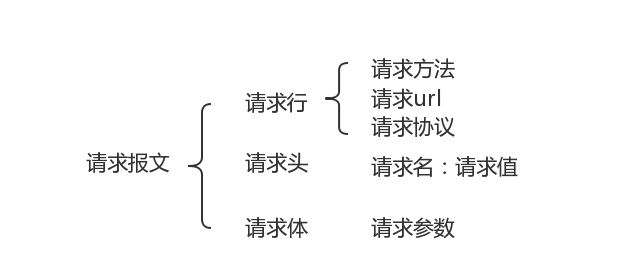
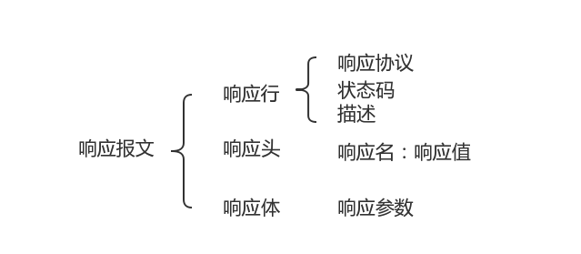
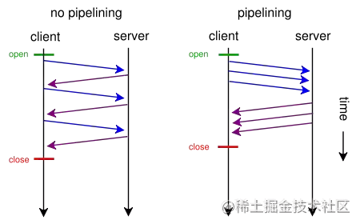
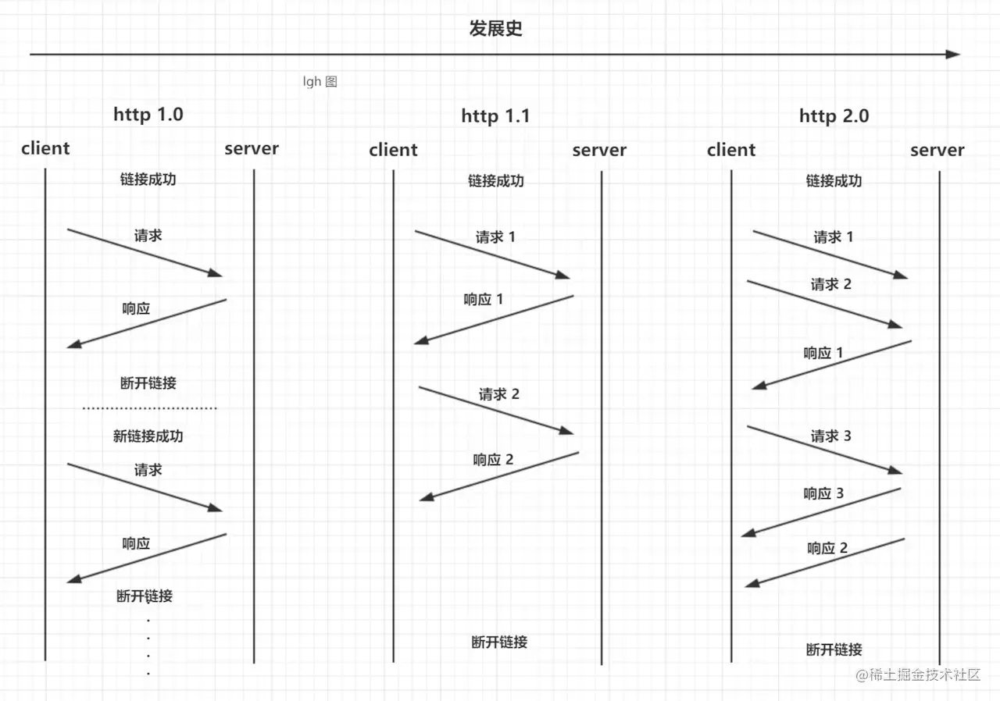
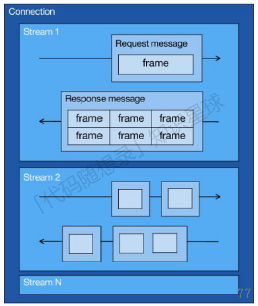

# 1. HTTP

HTTP (HyperText Transfer Protocol)：超文本传输协议，基于TCP协议的应用层传输协议，简单来说就是客户端和服务端进行数据传输的一种规则。

## 特点

无状态、明文传输、不安全

* HTTP协议本身不会对发送过的请求和相应的通信状态进行持久化处理，所以不需要额外的资源来记录状态信息，这能减轻服务器的负担。但它在完成有关联性的操作时会非常麻烦。

* 传输过程中的信息，是可方便阅读的，通过浏览器的F12控制台或Wireshark抓包都可以直接⾁眼查看，为我们调试⼯作带来了极大的便利性，但信息透明，容易被窃取。

* 通信使用明文（不加密），内容可能被窃听；
 
  不验证通信方的身份，因此有可能遭遇伪装；

  无法证明报文的完整性，所以有可能已遭篡改。

## 关于HTTP无状态的理解

这就好比邮政信件是无状态一样，邮局处理每一封信件都是独立的。邮局不会因为来自某个地址的上一封信件没贴够邮票就产生记忆，然后拒绝投递后面所有来自这个地址的信件，直到这个发件地址补够邮资为止。邮局只会拒绝投递邮资不够的那一封信件，这不会影响到其它信件的投递。

尽管信件在邮局这一层是无状态的，写信和收信人之间可以是有状态的。双方可能记得此前的一切通信，可能利用通信之外的其它信息来决定下一封信怎么写。无论是 Cookie 还是其它什么技术手段，在 HTTP 至上搭建有状态的协议并不影响 HTTP 自身无状态。


# 2. HTTPS

HTTPS：Hyper Text Transfer Protocol Secure：超文本安全传输协议，HTTPS就是在HTTP与TCP之间增加了SSL/TSL安全传输层。

SSL：Secure Socket Layer 安全套接字

TSL：Transport Layer Security 安全传输层协议

## TLS和SSL的区别

TLS的产生是为了让SSL更安全，使协议更加精确和完善。TLS在SSL3.0基础上增强了其他内容。它们的最主要的差别是所支持的加密算法不同，TLS和SSL3.0不能互相操作，TLS相当于SSL 3.1

## 2.1 HTTP与HTTPS的区别

1. HTTPS 解决HTTP 不安全的缺陷，在 TCP 和 HTTP ⽹络层之间加⼊了 SSL/TLS 安全协议，使得报文能够加密传输。
2. HTTPS 在 TCP 三次握手之后，还需进行 SSL/TLS 的握手过程，才可进⼊加密报文传输。
3. HTTP 的端口号是 80，HTTPS 的端口号是 443。
4. HTTPS 协议需要向 CA（证书权威机构）申请数字证书，来保证服务器的身份是可信的。

## 2.2 特点(针对于HTTP的三个不安全性)

1. 信息加密：交互信息无法被窃取
2. 身份证书：验证通信方身份，防止被伪装
3. 校验机制：无法篡改通信内容，篡改了就不能正常显示

## 2.3 缺点

1. 握手阶段延时较⾼：在会话前还需进行SSL握手
2. 部署成本⾼：需要购买CA证书；需要加解密计算，占用CPU资源，需要服务器配置⾼

## 2.4 加密方式

1、对称加密：
只使用⼀个密钥，运算速度快，密钥必须保密，无法做到安全的密钥交换; 

2、非对称加密：
使用两个密钥，公钥可以任意分发而私钥保密，解决密钥交换问题，但速度慢。

3、混合加密：
实现信息的机密性，解决窃听⻛险;

HTTPS采用对称加密和非对称加密结合的混合加密方式。

通信建立前：采用非对称加密的方式交换会话密钥，后续不再使用非对称加密;

通信过程中：全部使用对称加密的会话密钥方式，加密明文数据。

## 2.5 验证流程

1、client发起HTTP请求，连接到server端口

2、Server将自己的信息以数字证书的形式返回给client（证书包含私钥公钥、⽹站地址、证书颁发机构、失效⽇期等）

3、验证证书合法性，Server收到client响应后会先验证证书合法性（地址是否⼀致、是否过期）。

4、生成随机密码（RSA签名），验证通过或用户接受了不受信任的证书，浏览器会生成⼀个随机的对称密钥（session key），并用公钥加密，让server用私钥解密，解密后用这个对称密钥进行传输；

# 3. HTTP报文

## 3.1 当三次握手之后，发送HTTP请求报文



```javascript
---- 请求行 ----
POST /chapter17/user.html HTTP/1.1  // 请求方式 请求资源路径 HTTP协议版本

---- 请求头 -----                 // 包含请求的附加信息，由key：value组成
Host: www.itcast.cn  // 服务器的主机地址和端口号,默认是80
Connection: keep-alive // 和服务端保持长连接
Accept: text/html,application/xml // 指定客户端能够接受的内容类型
Accept-Encoding: gzip,deflate  // 指定客户端浏览器可以支持的web服务器返回内容压缩编码类型
Accept-Language: zh-cn,zh;q=0.5   //  指定http客户端浏览器用来展示返回信息所先选择的语言

---- 请求体 -----         // 承载多个请求参数的数据。
name=Javanx&age=25
```

请求方式：GET、POST、PUT、DELETE等

### 常见请求方式

1. GET：申请获取资源，不对服务器产生影响
   
2. POST：客户端向服务器提交数据。会影响服务器，服务器可能动态创建新的资源或更新原有资源
   
3. PUT：上传某个资源
   
4. DELETE：删除某个资源

## 3.2 服务器处理请求并返回HTTP报文



```javascript
---- 响应行 ----
HTTP/1.1 200 OK  // HTTP协议版本 状态码及状态描述

---- 响应头 -----                 // 响应头用于描述服务器的基本信息，以及数据的描述
Server: Apache-Coyote/1.1        // 告诉浏览器服务器的类型
Content-Type: application/json   // 表示后面的文档属于什么类型
Transfer-Encoding: chunked       // 告诉浏览器数据的传送格式
Date: Mon, 12 Sep 2011 12:41:24 GMT  // 当前的GMT时间

---- 响应体 -----         // 响应体就是响应的消息体，如果是纯数据就是返回纯数据，如果请求的是HTML页面，那么返回的就是HTML代码，如果是JS就是JS代码，如此之类
{"password":"1234","userName":"tom"}
```

### 常⻅状态码以及描述

200：客户端请求成功

301（永久重定向）：该资源已被永久移动到新位置，将来任何对该资源的访问都要使用本响应返回的若⼲个URL之⼀

302（临时重定向）：请求的资源现在临时从不同的URL中获得

400：请求报文语法有误，服务器无法识别

401：请求需要认证

403：请求的对应资源禁⽌被访问

404：服务器无法找到对应资源

500：服务器内部错误

503：服务器正忙

# 4. GET和POST的区别

## 从标准上来看：

GET 用于获取信息，是无副作用的，是幂等的，可缓存；POST 用于修改服务器上的数据，有副作用，非幂等，不可缓存（幂等：多次执行相同的操作，结果都相同）

## GET、POST 请求报文上的区别：

GET 和 POST 只是 HTTP 协议中两种请求方式（异曲同工），而 HTTP 协议是基于 TCP/IP 的应用层协议，无论 GET 还是 POST，用的都是同一个传输层协议，所以在传输上，没有区别。

报文格式上，不带参数时，最大区别就是第一行方法名不同, 仅仅是报文的几个字符不同而已

POST 方法请求报文第一行是这样的 POST /url HTTP/1.1

GET 方法请求报文第一行是这样的 GET /url HTTP/1.1

带参数时报文的区别呢？ 在约定中，GET 方法的参数应该放在 url 中，POST 方法参数应该放在 body 中

```javascript
// GET报文
GET /updateInfo?name=Javanx&age=25 HTTP/1.1
Host: localhost

// POST报文、
POST /updateInfo HTTP/1.1
Host: localhost
Content-Type: application/x-www-form-urlencoded

name=Javanx&age=25
```

现在我们知道了两种方法本质上是 TCP 连接，没有区别。但如果不按规范来也是可以的，可以在 URL 上写参数，然后方法使用 POST；也可以在 Body 写参数，然后方法使用 GET。当然，这需要服务端支持。

## GET 方法参数写法是固定的吗？

在约定中，我们的参数是写在 ? 后面，用 & 分割。

我们知道，解析报文的过程是通过获取 TCP 数据，用正则等工具从数据中获取 Header 和 Body，从而提取参数。

也就是说，我们可以自己约定参数的写法，**只要服务端能够解释出来就行**，万变不离其宗。

## GET 方法的长度限制是怎么回事？

网络上都会提到浏览器地址栏输入的参数是有限的。

首先说明一点，HTTP 协议没有 Body 和 URL 的长度限制，对 URL 限制的大多是浏览器和服务器的原因。

因为浏览器要对url进行解析，而解析的时候就要分配内存；而服务器是因为处理长 URL 要消耗比较多的资源，为了性能和安全（防止恶意构造长 URL 来攻击）考虑，会给 URL 长度加限制。

## POST 方法比 GET 方法安全？

有人说POST 比 GET 安全，因为数据在地址栏上不可见。

然而，从传输的角度来说，他们都是不安全的，因为 HTTP 在网络上是明文传输的，只要在网络节点上捉包，就能完整地获取数据报文。

要想安全传输，就只有加密，也就是 HTTPS。

## POST 方法会产生两个 TCP 数据包？

有些文章中提到，post 会将 header 和 body 分开发送，先发送 header，服务端返回 100 状态码再发送 body。

HTTP 协议中没有明确说明 POST 会产生两个 TCP 数据包。所以，header 和 body 分开发送是部分浏览器或框架的请求方法，不属于 post 必然行为。

# 5. 在浏览器中输入URL后的整个过程

1. 首先，我们在浏览器地址栏中，输⼊要查找⻚⾯的URL，按下Enter
 
2. 浏览器依次在 浏览器缓存 -->>系统缓存 -->>路由器缓存中去寻找匹配的URL，若有，就会直接在屏幕中显示出⻚⾯内容。若没有，则跳到第三步操作
   
3. 发送HTTP请求前，浏览器需要先进行域名解析(即DNS解析)，以获取相应的IP地址;（浏览器DNS缓存、路由器缓存、DNS缓存）
   
4. 获取到IP地址之后，浏览器向服务器发起TCP连接，与浏览器建立TCP三次握手
   
5. 握手成功之后，浏览器就会向服务器发送HTTP请求，来请求服务器端的数据包
   
6. 服务器处理从浏览器端收到的请求，接着将数据返回给浏览器
   
7. 浏览器收到HTTP响应
   
8. 查询状态，状态成功则进行下⼀步，不成功则弹出相应指示

9. 再读取⻚⾯内容、进行浏览器渲染、解析HTML源码;（生成DOM树、解析CCS样式、处理JS交互，客户端和服务器交互）进行展示
    
10. 关闭TCP连接（四次挥手）

# 6. HTTP的持久连接

HTTP/1.0需要手动开启，HTTP/1.1默认开启

HTTP/1.0 版的主要缺点是，每个TCP连接只能发送一个请求。发送数据完毕，连接就关闭，如果还要请求其他资源，就必须再新建一个连接。 TCP连接的新建成本很高，因为需要客户端和服务器三次握手，并且开始时发送速率较慢（slow start）。所以，HTTP 1.0版本的性能比较差。随着网页加载的外部资源越来越多，这个问题就愈发突出了。 为了解决这个问题，HTTP/1.1引入了持久连接（persistent connection），即TCP连接默认不关闭，可以被多个请求复用，不用声明Connection: keep-alive。

客户端和服务器发现对方一段时间没有活动，就可以主动关闭连接。不过，规范的做法是，客户端在最后一个请求时，发送Connection: close，明确要求服务器关闭TCP连接。

虽然1.1版允许复用TCP连接，但是同一个TCP连接里面，所有的数据通信是按次序进行的。服务器只有处理完一个回应，才会进行下一个回应。要是前面的回应特别慢，后面就会有许多请求排队等着。这称为“队头堵塞”（Head-of-line blocking）。
 
为了避免这个问题，只有两种方法：一是减少请求数，二是同时多开持久连接。这导致了很多的网页优化技巧，比如合并脚本和样式表、将图片嵌入CSS代码、域名分片（domain sharding）等等。

# 7. cookie和session

## cookie

1. 在第⼀次登录服务器之后，返回⼀些数据（cookie）给浏览器
2. 浏览器将数据保存在本地
3. 两次发送请求时，自动把上⼀次请求存储的cookie发送给服务器
4. 服务器通过该数据判断用户
5. 可存储的数据量有限，⼀般不会超过4KB

## session

1. 浏览器端第一次发送请求到服务器端，服务器端创建一个Session，同时会创建一个特殊的Cookie，然后将该Cookie发送至浏览器端
2. 浏览器端发送第2次请求到服务器端,浏览器端访问服务器端时就会携带该Cookie对象
3. 服务器端根据该cookie,去查询Session对象，从而区分不同用户。

## 区别

1. cookie数据存放在客户的浏览器上，session数据放在服务器上
2. cookie不是很安全，别人可以分析存放在本地的COOKIE并进行COOKIE欺骗,如果主要考虑到安全应当使用session
3. session会在一定时间内保存在服务器上。当访问增多，会比较占用你服务器的性能，如果主要考虑到减轻服务器性能方面，应当使用COOKIE
4. 所以：将登陆信息等重要信息存放为SESSION;其他信息如果需要保留，可以放在COOKIE中

# 8. HTTP新特性

## 8.1 HTTP1.1新特性

1、默认持久连接：只要客户端任意⼀端没有明确提出断开TCP连接，就⼀直保持连接，可以发送多次HTTP请求

2、管线化：客户端可以同时发送多个HTTP请求，不用等待响应

HTTP管线化是将多个HTTP要求（request）整批提交的技术，而在传送过程中不需先等待服务端的回应。管线化机制须通过永久连接（persistent connection）完成，仅HTTP/1.1支持此技术（HTTP/1.0不支持），并且只有GET和HEAD要求可以进行管线化，而POST则有所限制。此外，初次创建连接时也不应启动管线机制，因为对方（服务器）不一定支持HTTP/1.1版本的协议。

浏览器将HTTP要求大批提交可大幅缩短页面的加载时间，特别是在传输延迟（lag/latency）较高的情况下（如卫星连接）。此技术之关键在于多个HTTP的要求消息可以同时塞入一个TCP分组中，所以只提交一个分组即可同时发出多个要求，借此可减少网络上多余的分组并降低线路负载。

3、断点续传：断点续传其实就是在上一次下载断开的位置开始继续下载。HTTP协议中，可以在请求报文头中加入Range段，来表示客户机希望从何处继续下载。

## 8.2 HTTP2.0版本新特性

1. 传输格式变化，采用了新的⼆进制格式
   
   HTTP1.X的解析都是基于文本，文本的表现形式多样，不利于健壮性考虑

   HTTP2.0采用⼆进制，只认0/1组合，实现更加快的方法，健壮性更加完善

2. 多路复用：多路复用允许同时通过单一的 HTTP/2 连接发起多重的请求-响应消息，多路复用代替原来的序列和阻塞机制，所有就是请求的都是通过一个 TCP 连接并发完成，同时也很好的解决了浏览器限制同一个域名下的请求数量的问题。

3. 头压缩：在HTTP1.X中，header带有大量信息，而且每次都要重复发送，HTTP2.0通过encoder减少header大⼩，通讯双方会各自缓存⼀份header字段表，既可以避免重复header传输，⼜减⼩了需要传输的大⼩

4. 服务端推送：把客户端所需要的资源伴随着index.html⼀起发送到客户端，省去了客户端重复请求的步骤，因为没有发起请求，建立连接等操作，所以静态资源通过服务器推送，可以极大的提升速度
   
   传统的网页请求方式下，假设一个index.html网页包含一张样式表style.css和一个图片文件example.png。为了渲染这个网页，浏览器会发出三个请求。第一个请求是index.html。服务器收到这个请求，就把index.html发送给浏览器。浏览器发现里面包含了样式表和图片，于是再发出两个请求，请求样式表和图片文件。

# 9. HTTP/1.1中的管线化和Http/2.0中的多路复用

从 Http/0.9 到 Http/2 要发送多个请求，从多个 Tcp 连接=>keep-alive=>管道化=>多路复用不断的减少多次创建 Tcp 等等带来的性能损耗。

## 多个TCP连接

在最早的时候没有keep-alive只能创建多个Tcp连接来做多次请求。一次请求完成就会关闭本次的 Tcp 连接，下个请求又要从新建立 Tcp 连接传输完成数据再关闭，造成很大的性能损耗。


## Keep-Alive

Keep-Alive解决的核心问题是： 一定时间内，同一域名多次请求数据，只建立一次 HTTP 请求，其他请求可复用每一次建立的连接通道，以达到提高请求效率的问题。这里面所说的一定时间是可以配置的。

## 管线化

HTTP 管线化可以克服同域并行请求限制带来的阻塞，它是建立在持久连接之上，是把所有请求一并发给服务器，但是服务器需要按照顺序一个一个响应，而不是等到一个响应回来才能发下一个请求，这样就节省了很多请求到服务器的时间。不过，HTTP 管线化仍旧有阻塞的问题，若上一响应迟迟不回，后面的响应都会被阻塞到。



## 多路复用

多路复用代替原来的序列和阻塞机制。所有就是请求的都是通过一个 TCP 连接并发完成。因为在多路复用之前所有的传输是基于基础文本的，在多路复用中是基于二进制数据帧的传输、消息、流，所以可以做到乱序的传输。多路复用对同一域名下所有请求都是基于流，所以不存在同域并行的阻塞。多次请求如下图：



### HTTP2并发是如何实现的呢？

先来理解三个概念，即：Stream、Message、frame。



从上图可以看到：

* 1个TCP连接包含一个或者多个Stream，Stream是HTTP/2.0并发的关键技术；
* Stream里可以包含1个或多个Message，Message对应HTTP/1中的请求或者响应，由HTTP头部和包体构成；
* Message里包含1条或者多个Frame，Frame是HTTP/2.0最小单位，以二进制压缩格式存放HTTP/1中的内容（头部和包体）

在HTTP2连接上，不同Stream的帧可以乱序发送（因此可以并发不同的Stream），接收端可以通过Stream ID 有序组装HTTP消息。

## 为什么HTTP1.1不能实现多路复用

HTTP/1.1不是二进制传输，而是通过文本进行传输。由于没有流的概念，在使用并行传输传递数据时，接收端在接收到响应时，并不能区分多个响应分别对应的请求，所以无法将多个响应的结果重新进行组装，也就实现不了多路复用。

首先需要明确的一点就是，多路复用的核心就是流。一个流就代表一个请求/响应，每个流有自己的ID，所以乱序的message可以被有序拼装起来。那么HTTP/1.1为什么不实现流呢，可能有它自己的考虑，事实就是它没有实现，所以不能实现多路复用。

再一个问题，实现流与二进制传输有没有联系。我个人倾向于是没有的，实现多路复用和采用二进制格式传输是2.0的两个改进点，它们没有必然的联系，并不是说只有使用二进制传输才能实现流。

# 14. TCP复用和HTTP复用（长连接）

TCP连接复用是将多个客户端的HTTP请求复用到一个服务器端TCP连接上，而HTTP复用则是一个客户端的多个HTTP请求通过一个TCP连接进行处理。前者是负载均衡设备的独特功能；而后者是HTTP 1.1协议所支持的新功能，目前被大多数浏览器所支持。


