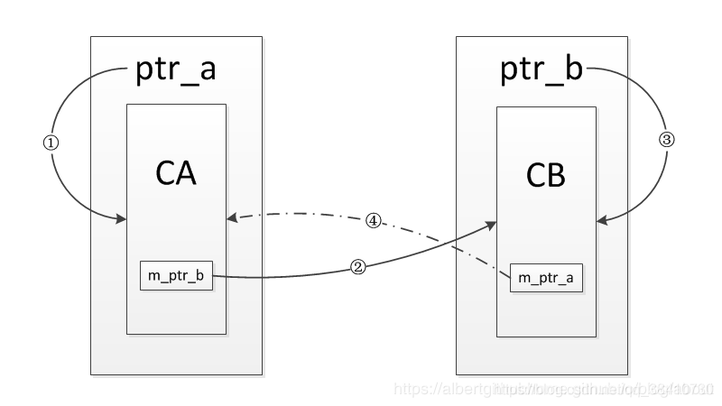
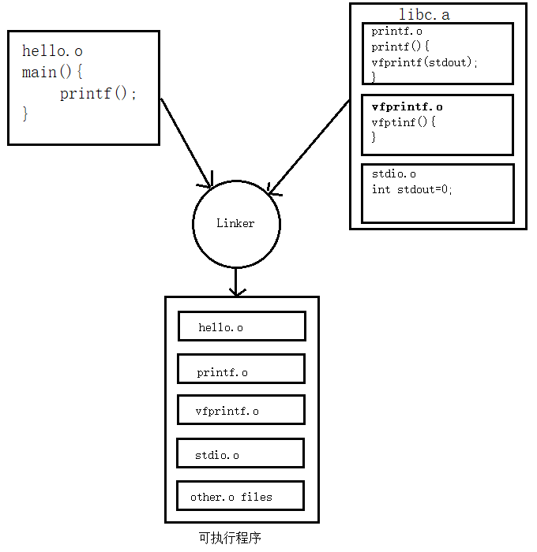

# 1. 三次握手


* 第⼀个SYN报⽂：客户端随机初始化序列号client_isn，放进TCP⾸部序列号段，然后把SYN置1。把SYN报⽂发送给服务端，表示发起连接，之后客户端处于SYN-SENT状态。

* 第⼆个报⽂SYN+ACK报⽂：服务端收到客户端的SYN报⽂，把⾃⼰的序号server_isn放进TCP⾸部序列号段，确认应答号填⼊client_ins + 1，把SYN+ACK置1。把SYN+ACK报⽂发送给客户端，然后进⼊SYN-RCVD状态。

* 第三个报⽂ACK：客户端收到服务端报⽂后，还要向服务端回应最后⼀个应答报⽂。⾸先该应答报⽂ TCP ⾸部ACK 标志位置为 1 ，其次「确认应答号」字段填⼊ server_isn + 1 ，最后把报⽂发送给服务端，这次报⽂可以携带客户到服务器的数据，之后客户端处于 ESTABLISHED 状态。服务器收到客户端的应答报⽂后，也进⼊ ESTABLISHED 状态。

## 为什么需要三次握⼿？

1. 三次握⼿才可以阻⽌重复历史连接的初始化(主因)
2. 三次握⼿才可以同步双⽅的初始序列号
3. 三次握⼿才可以避免资源浪费

* 为了阻止历史的重复连接初始化造成的混乱问题，如果通信的双方建立连接使用两次握手，那么发送方一旦发送了建立连接请求之后就无法撤销此次请求，如果在网络状况复杂或者较差的情况下，发送方连续发送多次建立连接的请求，而接收方只能选择接受或者拒绝此次请求，它并不知道此次请求是不是由于网络原因而过期的连接。
  
  所以，TCP 选择使用三次握手来建立连接，并在连接引入 RST 这一控制信息。接收方当收到连接请求时，会将发送方发来的 SEQ + 1 发送回发送方，由发送方判断此次连接是否有效（是否为历史连接）。

  如果当前连接是历史连接，即 SEQ 过期或者超时，那么发送方就会直接发送 RST 控制信息中止这一次连接；如果当前连接不是历史连接，那么发送方就会直接回复 ACK，则建立连接成功。

  使用三次握手和 RST 控制信息将是否建立连接的最终控制权交给发送方，因为只有发送方才有足够的上下文判断当前连接是错误的或者过期的。

* 同步双⽅的初始序列号
  
  TCP 协议的通信双⽅， 都必须维护⼀个「序列号」， 序列号是可靠传输的⼀个关键因素。两次握⼿只保证了⼀⽅的初始序列号能被对⽅成功接收，没办法保证双⽅的初始序列号都能被确认接收。

* 避免资源浪费。由于没有第三次握⼿，服务器不清楚客户端是否收到了⾃⼰发送的建⽴连接的 ACK 确认信号，所以每收到⼀个 SYN 就只能先主动建⽴⼀个连接。

# 2.四次挥手



## 2.1 过程

* 假设客户端打算关闭连接，发送⼀个TCP⾸部FIN被置1的FIN报⽂给服务端。
* 服务端收到以后，向客户端发送ACK应答报⽂。
* 等待服务端处理完数据后，向客户端发送FIN报⽂。
* 客户端接收到FIN报⽂后回⼀个ACK应答报⽂。
* 服务器收到ACK报⽂后，进⼊close状态，服务器完成连接关闭。
* 客户端在经过 2MSL ⼀段时间后，⾃动进⼊close状态，客户端也完成连接的关闭。

## 2.2 为什么挥手需要四次

关闭连接时，客户端发送FIN报⽂，表示其不再发送数据，但还可以接收数据。客户端收到FIN报⽂，先回⼀个ACK应答报⽂，服务端可能还要数据需要处理和发送，等到其不再发送数据时，才发送FIN报⽂给客户端表示同意关闭连接。

从上⾯过程可知：

1. 服务端通常需要等待完成数据的发送和处理，所以服务端的ACK和FIN⼀般都会分开发送，从⽽⽐三次握⼿导致多了⼀次。
2. 第⼀次ACK应答报⽂可以省略，因为下⼀个报⽂段携带了ACK信息，ACK是否出现取决于延迟确认特性。
3. 延迟确认：即接收⽅收到包后，如果暂时没有内容回复给发送⽅，则延迟⼀段时间再确认，假如在这个时间范围内刚好有数据需要传输，则和确认包⼀起回复。这种也被称为数据捎带。延迟确认只是减轻⽹络负担，未必可以提升⽹络性能，有些情况下反⽽会影响性能。

## 2.3 为什么 TIME_WAIT 等待的时间是 2MSL？

1. MSL是 Maximum Segment Lifetime，报⽂最⼤⽣存时间，它是任何报⽂在⽹络上存在的最⻓时间，超过这个时间报⽂将被丢弃。
2. 等待MSL两倍：⽹络中可能存在发送⽅的数据包，当这些发送⽅的数据包被接收⽅处理后⼜会向对⽅发送响应，所以⼀来⼀回需要等待 2 倍的时间。
3. 2MSL 的时间是从客户端接收到 FIN 后发送 ACK 开始计时的。一个MSL是确保主动关闭方最后的ACK能够到达对端。一个MSL是确保被动关闭方重发的FIN能够被主动关闭方收到。如果在 TIME-WAIT 时间内，因为客户端的 ACK 没有传输到服务端，客户端⼜接收到了服务端重发的 FIN 报⽂，那么 2MSL 时间将重新计时。

## 2.4 为什么需要 TIME_WAIT 状态？

主动发起关闭连接的⼀⽅，才会有 TIME-WAIT 状态。需要 TIME-WAIT 状态，主要是两个原因：

1. 允许老的重复报文分组在网络中消逝。
	
   在2MSL等待期间，定义这个连接的插口(客户端IP地址和端口号，服务器IP地址和端口号的四元组)将不能再被使用。假如我们建立一个TCP连接，一段时间后我们关闭这个连接，再基于相同插口建立一个新的TCP连接，这个新的连接称为前一个连接的化身。老的报文很有可能由于某些原因迟到了，那么新的TCP连接很有可能会将这个迟到的报文认为是新的连接的报文，而导致数据错乱。为了防止这种情况的发生TCP连接必须让TIME_WAIT状态持续2MSL，在此期间将不能基于这个插口建立新的化身，让它有足够的时间使迟到的报文段被丢弃

2. 保证TCP全双工连接的正确关闭。
   
   如果主动关闭方最终的ACK丢失，那么服务器将会重新发送那个FIN,以允许主动关闭方重新发送那个ACK。要是主动关闭方不维护2MSL状态，那么主动关闭将会不得不响应一个RST报文段，而服务器将会把它解释为一个错误，导致TCP连接没有办法完成全双工的关闭，而进入半关闭状态。

## 2.5 TIME_WAIT 过多有什么危害？

过多的TIME-WAIT 状态主要的危害有两种：

1. 内存资源占⽤；
2. 对端⼝资源的占⽤，⼀个 TCP 连接⾄少消耗⼀个本地端⼝；

如果发起连接⼀⽅的 TIME_WAIT 状态过多，占满了所有端⼝资源，则会导致⽆法创建新连接。


# 3. HTTP

HTTP (HyperText Transfer Protocol)：超文本传输协议，基于TCP协议的应用层传输协议，简单来说就是客户端和服务端进行数据传输的一种规则。

## 特点

⽆状态、明⽂传输、不安全

* HTTP协议本身不会对发送过的请求和相应的通信状态进行持久化处理，所以不需要额外的资源来记录状态信息，这能减轻服务器的负担。但它在完成有关联性的操作时会⾮常麻烦。

* 传输过程中的信息，是可⽅便阅读的，通过浏览器的F12控制台或Wireshark抓包都可以直接⾁眼查看，为我们调试⼯作带来了极⼤的便利性，但信息透明，容易被窃取。

* 通信使⽤明⽂（不加密），内容可能被窃听；
 
  不验证通信⽅的身份，因此有可能遭遇伪装；

  ⽆法证明报⽂的完整性，所以有可能已遭篡改。

# 4. HTTPS

HTTPS：Hyper Text Transfer Protocol Secure：超⽂本安全传输协议，HTTPS就是在HTTP与TCP之间增加了SSL/TSL安全传输层。

SSL：Secure Socket Layer 安全套接字

TSL：Transport Layer Security 安全传输层协议

## 4.1 HTTP与HTTPS的区别

1. HTTPS 解决HTTP 不安全的缺陷，在 TCP 和 HTTP ⽹络层之间加⼊了 SSL/TLS 安全协议，使得报⽂能够加密传输。
2. HTTPS 在 TCP 三次握⼿之后，还需进⾏ SSL/TLS 的握⼿过程，才可进⼊加密报⽂传输。
3. HTTP 的端⼝号是 80，HTTPS 的端⼝号是 443。
4. HTTPS 协议需要向 CA（证书权威机构）申请数字证书，来保证服务器的身份是可信的。

## 4.2 特点(针对于HTTP的三个不安全性)

1. 信息加密：交互信息⽆法被窃取
2. 身份证书：验证通信方身份，防止被伪装
3. 校验机制：⽆法篡改通信内容，篡改了就不能正常显示

## 4.3 缺点

1. 握⼿阶段延时较⾼：在会话前还需进⾏SSL握⼿
2. 部署成本⾼：需要购买CA证书；需要加解密计算，占⽤CPU资源，需要服务器配置⾼

## 4.4 加密方式

1、对称加密：
只使⽤⼀个密钥，运算速度快，密钥必须保密，⽆法做到安全的密钥交换; 

2、⾮对称加密：
使⽤两个密钥，公钥可以任意分发⽽私钥保密，解决密钥交换问题，但速度慢。

3、混合加密：
实现信息的机密性，解决窃听⻛险;

HTTPS采⽤对称加密和⾮对称加密结合的混合加密⽅式。

通信建⽴前：采⽤⾮对称加密的⽅式交换会话密钥，后续不再使⽤⾮对称加密;

通信过程中：全部使⽤对称加密的会话密钥⽅式，加密明⽂数据。

## 4.5 验证流程

1、client发起HTTP请求，连接到server端⼝

2、Server将⾃⼰的信息以数字证书的形式返回给client（证书包含私钥公钥、⽹站地址、证书颁发机构、失效⽇期等）

3、验证证书合法性，Server收到client响应后会先验证证书合法性（地址是否⼀致、是否过期）。

4、⽣成随机密码（RSA签名），验证通过或⽤户接受了不受信任的证书，浏览器会⽣成⼀个随机的对称密钥（session key），并⽤公钥加密，让server⽤私钥解密，解密后⽤这个对称密钥进⾏传输；

# 5. URL和DNS

URL : uniform resolution locator，统⼀资源定位符，定位互联⽹上资源（俗称⽹址）

DNS : domain name system/server，域名解析服务器

## URL

格式： Scheme：//host.domain:port/path/filename
1. Scheme：定义因特⽹服务类型 http/https/ftp/file
2. Host：定义域主机（http默认主机为www）
3. Domain：因特⽹域名。Baidu.com
4. Port：主机上端⼝号（http：80，https：443）
5. Path：服务器上的路径（若省略，则⽂档必位于⽹站根⽬录）
6. Filename：⽂档/资源名称。

## DNS

1. DNS协议⽤来将域名转换为IP地址，也可将IP地址转换为相应的域名地址
2. DNS：⾯向⽤户 IP：⾯向主机
3. 域名服务主要是基于UDP实现的，服务器端⼝号为53

# 6. DNS解析过程

浏览器查询URL对应IP：浏览器缓存→操作系统缓存→路由器缓存;

三种类型的DNS服务器：根DNS服务器、顶级域DNS服务器、权威DNS服务器;


# 7. HTTP报文

## 7.1 当三次握⼿之后，发送HTTP请求报⽂



```javascript
---- 请求行 ----
POST /chapter17/user.html HTTP/1.1  // 请求方式 请求资源路径 HTTP协议版本

---- 请求头 -----                 // 包含请求的附加信息，由key：value组成
Host: www.itcast.cn  // 服务器的主机地址和端口号,默认是80
Connection: keep-alive // 和服务端保持长连接
Accept: text/html,application/xml // 指定客户端能够接受的内容类型
Accept-Encoding: gzip,deflate  // 指定客户端浏览器可以支持的web服务器返回内容压缩编码类型
Accept-Language: zh-cn,zh;q=0.5   //  指定http客户端浏览器用来展示返回信息所先选择的语言

---- 请求体 -----         // 承载多个请求参数的数据。
name=Javanx&age=25
```

请求方式：GET、POST、PUT、DELETE等

### 常见请求方式

1. GET：申请获取资源，不对服务器产⽣影响
   
2. POST：客户端向服务器提交数据。会影响服务器，服务器可能动态创建新的资源或更新原有资源
   
3. PUT：上传某个资源
   
4. DELETE：删除某个资源

## 7.2 服务器处理请求并返回HTTP报⽂


```javascript
---- 响应行 ----
HTTP/1.1 200 OK  // HTTP协议版本 状态码及状态描述

---- 响应头 -----                 // 响应头用于描述服务器的基本信息，以及数据的描述
Server: Apache-Coyote/1.1        // 告诉浏览器服务器的类型
Content-Type: application/json   // 表示后面的文档属于什么类型
Transfer-Encoding: chunked       // 告诉浏览器数据的传送格式
Date: Mon, 12 Sep 2011 12:41:24 GMT  // 当前的GMT时间

---- 响应体 -----         // 响应体就是响应的消息体，如果是纯数据就是返回纯数据，如果请求的是HTML页面，那么返回的就是HTML代码，如果是JS就是JS代码，如此之类
{"password":"1234","userName":"tom"}
```

### 常⻅状态码以及描述

200：客户端请求成功

206：partial content 服务器已经正确处理部分GET请求，实现断点续传或同时分⽚下载，该请求必须包含Range请求头来指示客户端期望得到的范围

301（永久重定向）：该资源已被永久移动到新位置，将来任何对该资源的访问都要使⽤本响应返回的若⼲个URL之⼀

302（临时重定向）：请求的资源现在临时从不同的URI中获得

304：如果客户端发送⼀个待条件的GET请求并且该请求以经被允许，⽽⽂档内容未被改变，则返回304,该响应不包含包体（即可直接使⽤缓存）

400：请求报⽂语法有误，服务器⽆法识别

401：请求需要认证

403：请求的对应资源禁⽌被访问

404：服务器⽆法找到对应资源

500：服务器内部错误

503：服务器正忙

# 8. GET和POST的区别

## 从标准上来看：

GET 用于获取信息，是无副作用的，是幂等的，可缓存；POST 用于修改服务器上的数据，有副作用，非幂等，不可缓存（幂等：多次执⾏相同的操作，结果都相同）

## GET、POST 请求报文上的区别：

GET 和 POST 只是 HTTP 协议中两种请求方式（异曲同工），而 HTTP 协议是基于 TCP/IP 的应用层协议，无论 GET 还是 POST，用的都是同一个传输层协议，所以在传输上，没有区别。

报文格式上，不带参数时，最大区别就是第一行方法名不同, 仅仅是报文的几个字符不同而已

POST 方法请求报文第一行是这样的 POST /url HTTP/1.1

GET 方法请求报文第一行是这样的 GET /url HTTP/1.1

带参数时报文的区别呢？ 在约定中，GET 方法的参数应该放在 url 中，POST 方法参数应该放在 body 中

```javascript
// GET报文
GET /updateInfo?name=Javanx&age=25 HTTP/1.1
Host: localhost

// POST报文、
POST /updateInfo HTTP/1.1
Host: localhost
Content-Type: application/x-www-form-urlencoded

name=Javanx&age=25
```

现在我们知道了两种方法本质上是 TCP 连接，没有区别。但如果不按规范来也是可以的，可以在 URL 上写参数，然后方法使用 POST；也可以在 Body 写参数，然后方法使用 GET。当然，这需要服务端支持。

## GET 方法参数写法是固定的吗？

在约定中，我们的参数是写在 ? 后面，用 & 分割。

我们知道，解析报文的过程是通过获取 TCP 数据，用正则等工具从数据中获取 Header 和 Body，从而提取参数。

也就是说，我们可以自己约定参数的写法，**只要服务端能够解释出来就行**，万变不离其宗。

## GET 方法的长度限制是怎么回事？

网络上都会提到浏览器地址栏输入的参数是有限的。

首先说明一点，HTTP 协议没有 Body 和 URL 的长度限制，对 URL 限制的大多是浏览器和服务器的原因。

因为浏览器要对url进行解析，而解析的时候就要分配内存；而服务器是因为处理长 URL 要消耗比较多的资源，为了性能和安全（防止恶意构造长 URL 来攻击）考虑，会给 URL 长度加限制。

## POST 方法比 GET 方法安全？

有人说POST 比 GET 安全，因为数据在地址栏上不可见。

然而，从传输的角度来说，他们都是不安全的，因为 HTTP 在网络上是明文传输的，只要在网络节点上捉包，就能完整地获取数据报文。

要想安全传输，就只有加密，也就是 HTTPS。

## POST 方法会产生两个 TCP 数据包？

有些文章中提到，post 会将 header 和 body 分开发送，先发送 header，服务端返回 100 状态码再发送 body。

HTTP 协议中没有明确说明 POST 会产生两个 TCP 数据包。所以，header 和 body 分开发送是部分浏览器或框架的请求方法，不属于 post 必然行为。

# 9. 在浏览器中输入URL后的整个过程

1. ⾸先，我们在浏览器地址栏中，输⼊要查找⻚⾯的URL，按下Enter
 
2. 浏览器依次在 浏览器缓存 -->>系统缓存 -->>路由器缓存中去寻找匹配的URL，若有，就会直接在屏幕中显示出⻚⾯内容。若没有，则跳到第三步操作
   
3. 发送HTTP请求前，浏览器需要先进⾏域名解析(即DNS解析)，以获取相应的IP地址;（浏览器DNS缓存、路由器缓存、DNS缓存）
   
4. 获取到IP地址之后，浏览器向服务器发起TCP连接，与浏览器建⽴TCP三次握⼿
   
5. 握⼿成功之后，浏览器就会向服务器发送HTTP请求，来请求服务器端的数据包
   
6. 服务器处理从浏览器端收到的请求，接着将数据返回给浏览器
   
7. 浏览器收到HTTP响应
   
8. 查询状态，状态成功则进⾏下⼀步，不成功则弹出相应指示

9. 再读取⻚⾯内容、进⾏浏览器渲染、解析HTML源码;（⽣成DOM树、解析CCS样式、处理JS交互，客户端和服务器交互）进⾏展示
    
10. 关闭TCP连接（四次挥手）

# 10. HTTP的持久连接

HTTP/1.0需要手动开启，HTTP/1.1默认开启

HTTP/1.0 版的主要缺点是，每个TCP连接只能发送一个请求。发送数据完毕，连接就关闭，如果还要请求其他资源，就必须再新建一个连接。 TCP连接的新建成本很高，因为需要客户端和服务器三次握手，并且开始时发送速率较慢（slow start）。所以，HTTP 1.0版本的性能比较差。随着网页加载的外部资源越来越多，这个问题就愈发突出了。 为了解决这个问题，HTTP/1.1引入了持久连接（persistent connection），即TCP连接默认不关闭，可以被多个请求复用，不用声明Connection: keep-alive。

客户端和服务器发现对方一段时间没有活动，就可以主动关闭连接。不过，规范的做法是，客户端在最后一个请求时，发送Connection: close，明确要求服务器关闭TCP连接。

虽然1.1版允许复用TCP连接，但是同一个TCP连接里面，所有的数据通信是按次序进行的。服务器只有处理完一个回应，才会进行下一个回应。要是前面的回应特别慢，后面就会有许多请求排队等着。这称为“队头堵塞”（Head-of-line blocking）。
 
为了避免这个问题，只有两种方法：一是减少请求数，二是同时多开持久连接。这导致了很多的网页优化技巧，比如合并脚本和样式表、将图片嵌入CSS代码、域名分片（domain sharding）等等。

# 11. cookie和session

## cookie

1. 在第⼀次登录服务器之后，返回⼀些数据（cookie）给浏览器
2. 浏览器将数据保存在本地
3. 两次发送请求时，⾃动把上⼀次请求存储的cookie发送给服务器
4. 服务器通过该数据判断⽤户
5. 可存储的数据量有限，⼀般不会超过4KB

## session

1. 浏览器端第一次发送请求到服务器端，服务器端创建一个Session，同时会创建一个特殊的Cookie，然后将该Cookie发送至浏览器端
2. 浏览器端发送第2次请求到服务器端,浏览器端访问服务器端时就会携带该Cookie对象
3. 服务器端根据该cookie,去查询Session对象，从而区分不同用户。

## 区别

1. cookie数据存放在客户的浏览器上，session数据放在服务器上
2. cookie不是很安全，别人可以分析存放在本地的COOKIE并进行COOKIE欺骗,如果主要考虑到安全应当使用session
3. session会在一定时间内保存在服务器上。当访问增多，会比较占用你服务器的性能，如果主要考虑到减轻服务器性能方面，应当使用COOKIE
4. 所以：将登陆信息等重要信息存放为SESSION;其他信息如果需要保留，可以放在COOKIE中

# 12. HTTP新特性

## 12.1 HTTP1.1新特性

1、默认持久连接：只要客户端任意⼀端没有明确提出断开TCP连接，就⼀直保持连接，可以发送多次HTTP请求

2、管线化：客户端可以同时发送多个HTTP请求，不⽤等待响应

HTTP管线化是将多个HTTP要求（request）整批提交的技术，而在传送过程中不需先等待服务端的回应。管线化机制须通过永久连接（persistent connection）完成，仅HTTP/1.1支持此技术（HTTP/1.0不支持），并且只有GET和HEAD要求可以进行管线化，而POST则有所限制。此外，初次创建连接时也不应启动管线机制，因为对方（服务器）不一定支持HTTP/1.1版本的协议。

浏览器将HTTP要求大批提交可大幅缩短页面的加载时间，特别是在传输延迟（lag/latency）较高的情况下（如卫星连接）。此技术之关键在于多个HTTP的要求消息可以同时塞入一个TCP分组中，所以只提交一个分组即可同时发出多个要求，借此可减少网络上多余的分组并降低线路负载。

3、断点续传：断点续传其实就是在上一次下载断开的位置开始继续下载。HTTP协议中，可以在请求报文头中加入Range段，来表示客户机希望从何处继续下载。

## 12.2 HTTP2.0版本新特性

1. 传输格式变化，采⽤了新的⼆进制格式
   
   HTTP1.X的解析都是基于⽂本，⽂本的表现形式多样，不利于健壮性考虑

   HTTP2.0采⽤⼆进制，只认0/1组合，实现更加快的⽅法，健壮性更加完善

2. 多路复⽤：多路复用允许同时通过单一的 HTTP/2 连接发起多重的请求-响应消息，多路复用代替原来的序列和阻塞机制，所有就是请求的都是通过一个 TCP 连接并发完成，同时也很好的解决了浏览器限制同一个域名下的请求数量的问题。

3. 头压缩：在HTTP1.X中，header带有大量信息，⽽且每次都要重复发送，HTTP2.0通过encoder减少header⼤⼩，通讯双⽅会各⾃缓存⼀份header字段表，既可以避免重复header传输，⼜减⼩了需要传输的⼤⼩

4. 服务端推送：把客户端所需要的资源伴随着index.html⼀起发送到客户端，省去了客户端重复请求的步骤，因为没有发起请求，建⽴连接等操作，所以静态资源通过服务器推送，可以极⼤的提升速度
   
   传统的网页请求方式下，假设一个index.html网页包含一张样式表style.css和一个图片文件example.png。为了渲染这个网页，浏览器会发出三个请求。第一个请求是index.html。服务器收到这个请求，就把index.html发送给浏览器。浏览器发现里面包含了样式表和图片，于是再发出两个请求，请求样式表和图片文件。

# 13. HTTP/1.1中的管线化和Http/2.0中的多路复用

从 Http/0.9 到 Http/2 要发送多个请求，从多个 Tcp 连接=>keep-alive=>管道化=>多路复用不断的减少多次创建 Tcp 等等带来的性能损耗。

## 多个TCP连接

在最早的时候没有keep-alive只能创建多个Tcp连接来做多次请求。一次请求完成就会关闭本次的 Tcp 连接，下个请求又要从新建立 Tcp 连接传输完成数据再关闭，造成很大的性能损耗。


## Keep-Alive

Keep-Alive解决的核心问题是： 一定时间内，同一域名多次请求数据，只建立一次 HTTP 请求，其他请求可复用每一次建立的连接通道，以达到提高请求效率的问题。这里面所说的一定时间是可以配置的。

## 管线化

HTTP 管线化可以克服同域并行请求限制带来的阻塞，它是建立在持久连接之上，是把所有请求一并发给服务器，但是服务器需要按照顺序一个一个响应，而不是等到一个响应回来才能发下一个请求，这样就节省了很多请求到服务器的时间。不过，HTTP 管线化仍旧有阻塞的问题，若上一响应迟迟不回，后面的响应都会被阻塞到。


## 多路复用

多路复用代替原来的序列和阻塞机制。所有就是请求的都是通过一个 TCP 连接并发完成。因为在多路复用之前所有的传输是基于基础文本的，在多路复用中是基于二进制数据帧的传输、消息、流，所以可以做到乱序的传输。多路复用对同一域名下所有请求都是基于流，所以不存在同域并行的阻塞。多次请求如下图：


### HTTP2并发是如何实现的呢？

先来理解三个概念，即：Stream、Message、frame。


从上图可以看到：

* 1个TCP连接包含一个或者多个Stream，Stream是HTTP/2.0并发的关键技术；
* Stream里可以包含1个或多个Message，Message对应HTTP/1中的请求或者相应，由HTTP头部和包体构成；
* Message里包含1条或者多个Frame，Frame是HTTP/2.0最小单位，以二进制压缩格式存放HTTP/1中的内容（头部和包体）

在HTTP2连接上，不同Stream的帧可以乱序发送（因此可以并发不同的Stream），接收端可以通过Stream ID 有序组装HTTP消息。

# 14. HTTP复用和TCP复用

TCP连接复用是将多个客户端的HTTP请求复用到一个服务器端TCP连接上，而HTTP复用则是一个客户端的多个HTTP请求通过一个TCP连接进行处理。前者是负载均衡设备的独特功能；而后者是HTTP 1.1协议所支持的新功能，目前被大多数浏览器所支持。


