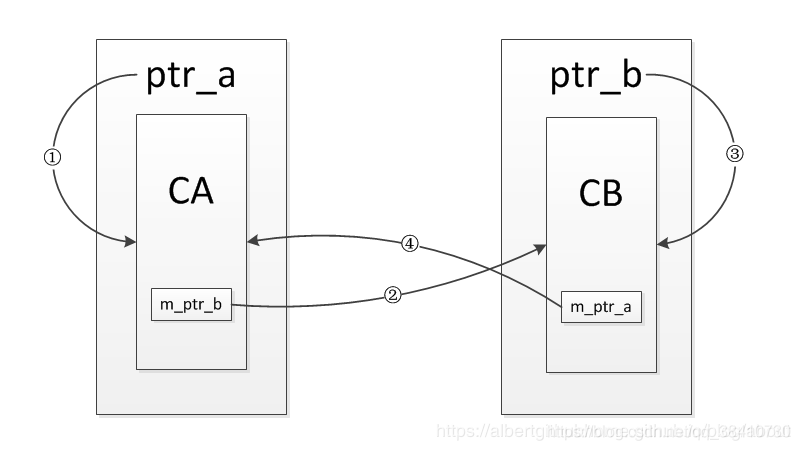
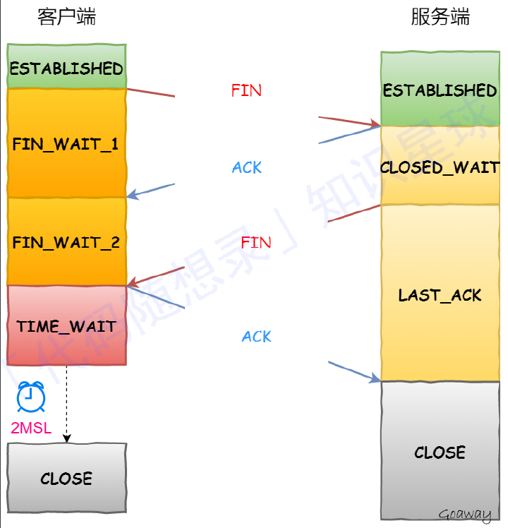

# 1. 三次握手

* 第⼀个SYN报⽂：客户端随机初始化序列号client_isn，放进TCP⾸部序列号段，然后把SYN置1。把SYN报⽂发送给服务端，表示发起连接，之后客户端处于SYN-SENT状态。

* 第⼆个报⽂SYN+ACK报⽂：服务端收到客户端的SYN报⽂，把⾃⼰的序号server_isn放进TCP⾸部序列号段，确认应答号填⼊client_ins + 1，把SYN+ACK置1。把SYN+ACK报⽂发送给客户端，然后进⼊SYN-RCVD状态。

* 第三个报⽂ACK：客户端收到服务端报⽂后，还要向服务端回应最后⼀个应答报⽂。⾸先该应答报⽂ TCP ⾸部ACK 标志位置为 1 ，其次「确认应答号」字段填⼊ server_isn + 1 ，最后把报⽂发送给服务端，这次报⽂可以携带客户到服务器的数据，之后客户端处于 ESTABLISHED 状态。服务器收到客户端的应答报⽂后，也进⼊ ESTABLISHED 状态。

## 为什么需要三次握⼿？

1. 三次握⼿才可以阻⽌重复历史连接的初始化(主因)
2. 三次握⼿才可以同步双⽅的初始序列号
3. 三次握⼿才可以避免资源浪费

* 为了阻止历史的重复连接初始化造成的混乱问题，如果通信的双方建立连接使用两次握手，那么发送方一旦发送了建立连接请求之后就无法撤销此次请求，如果在网络状况复杂或者较差的情况下，发送方连续发送多次建立连接的请求，而接收方只能选择接受或者拒绝此次请求，它并不知道此次请求是不是由于网络原因而过期的连接。
  
  所以，TCP 选择使用三次握手来建立连接，并在连接引入 RST 这一控制信息。接收方当收到连接请求时，会将发送方发来的 SEQ + 1 发送回发送方，由发送方判断此次连接是否有效（是否为历史连接）。

  如果当前连接是历史连接，即 SEQ 过期或者超时，那么发送方就会直接发送 RST 控制信息中止这一次连接；如果当前连接不是历史连接，那么发送方就会直接回复 ACK，则建立连接成功。

  使用三次握手和 RST 控制信息将是否建立连接的最终控制权交给发送方，因为只有发送方才有足够的上下文判断当前连接是错误的或者过期的。

* 同步双⽅的初始序列号
  
  TCP 协议的通信双⽅， 都必须维护⼀个「序列号」， 序列号是可靠传输的⼀个关键因素。两次握⼿只保证了⼀⽅的初始序列号能被对⽅成功接收，没办法保证双⽅的初始序列号都能被确认接收。

* 避免资源浪费。由于没有第三次握⼿，服务器不清楚客户端是否收到了⾃⼰发送的建⽴连接的 ACK 确认信号，所以每收到⼀个 SYN 就只能先主动建⽴⼀个连接。

# 2.四次挥手

## 2.1 过程

* 假设客户端打算关闭连接，发送⼀个TCP⾸部FIN被置1的FIN报⽂给服务端。
* 服务端收到以后，向客户端发送ACK应答报⽂。
* 等待服务端处理完数据后，向客户端发送FIN报⽂。
* 客户端接收到FIN报⽂后回⼀个ACK应答报⽂。
* 服务器收到ACK报⽂后，进⼊close状态，服务器完成连接关闭。
* 客户端在经过 2MSL ⼀段时间后，⾃动进⼊close状态，客户端也完成连接的关闭。

## 2.2 为什么挥手需要四次

关闭连接时，客户端发送FIN报⽂，表示其不再发送数据，但还可以接收数据。客户端收到FIN报⽂，先回⼀个ACK应答报⽂，服务端可能还要数据需要处理和发送，等到其不再发送数据时，才发送FIN报⽂给客户端表示同意关闭连接。

从上⾯过程可知：

1. 服务端通常需要等待完成数据的发送和处理，所以服务端的ACK和FIN⼀般都会分开发送，从⽽⽐三次握⼿导致多了⼀次。
2. 第⼀次ACK应答报⽂可以省略，因为下⼀个报⽂段携带了ACK信息，ACK是否出现取决于延迟确认特性。
3. 延迟确认：即接收⽅收到包后，如果暂时没有内容回复给发送⽅，则延迟⼀段时间再确认，假如在这个时间范围内刚好有数据需要传输，则和确认包⼀起回复。这种也被称为数据捎带。延迟确认只是减轻⽹络负担，未必可以提升⽹络性能，有些情况下反⽽会影响性能。

## 2.3 为什么 TIME_WAIT 等待的时间是 2MSL？

1. MSL是 Maximum Segment Lifetime，报⽂最⼤⽣存时间，它是任何报⽂在⽹络上存在的最⻓时间，超过这个时间报⽂将被丢弃。
2. 等待MSL两倍：⽹络中可能存在发送⽅的数据包，当这些发送⽅的数据包被接收⽅处理后⼜会向对⽅发送响应，所以⼀来⼀回需要等待 2 倍的时间。
3. 2MSL 的时间是从客户端接收到 FIN 后发送 ACK 开始计时的。一个MSL是确保主动关闭方最后的ACK能够到达对端。一个MSL是确保被动关闭方重发的FIN能够被主动关闭方收到。如果在 TIME-WAIT 时间内，因为客户端的 ACK 没有传输到服务端，客户端⼜接收到了服务端重发的 FIN 报⽂，那么 2MSL 时间将重新计时。

## 2.4 为什么需要 TIME_WAIT 状态？

主动发起关闭连接的⼀⽅，才会有 TIME-WAIT 状态。需要 TIME-WAIT 状态，主要是两个原因：

1. 允许老的重复报文分组在网络中消逝。
	
   在2MSL等待期间，定义这个连接的插口(客户端IP地址和端口号，服务器IP地址和端口号的四元组)将不能再被使用。假如我们建立一个TCP连接，一段时间后我们关闭这个连接，再基于相同插口建立一个新的TCP连接，这个新的连接称为前一个连接的化身。老的报文很有可能由于某些原因迟到了，那么新的TCP连接很有可能会将这个迟到的报文认为是新的连接的报文，而导致数据错乱。为了防止这种情况的发生TCP连接必须让TIME_WAIT状态持续2MSL，在此期间将不能基于这个插口建立新的化身，让它有足够的时间使迟到的报文段被丢弃

2. 保证TCP全双工连接的正确关闭。
   
   如果主动关闭方最终的ACK丢失，那么服务器将会重新发送那个FIN,以允许主动关闭方重新发送那个ACK。要是主动关闭方不维护2MSL状态，那么主动关闭将会不得不响应一个RST报文段，而服务器将会把它解释为一个错误，导致TCP连接没有办法完成全双工的关闭，而进入半关闭状态。

## 2.5 TIME_WAIT 过多有什么危害？

过多的TIME-WAIT 状态主要的危害有两种：

1. 内存资源占⽤；
2. 对端⼝资源的占⽤，⼀个 TCP 连接⾄少消耗⼀个本地端⼝；

如果发起连接⼀⽅的 TIME_WAIT 状态过多，占满了所有端⼝资源，则会导致⽆法创建新连接。

