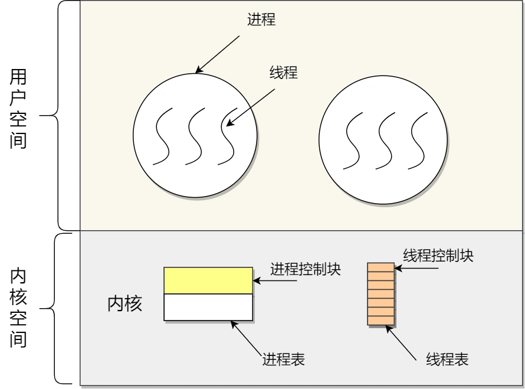

先明确一点，操作系统是一个抽象的概念，就像C++中的类一样。操作系统中各种细分的概念（进程、线程和文件系统等）都是一个general的概念，具体的实现可以有很多不同的方式。在复习这块内容的时候要把抽象的概念和xv6中具体的实现结合起来。

# 1. 什么是操作系统

操作系统位于硬件资源之上，管理硬件资源; 应用程序之下，为应用程序提供服务，同时管理应用程序

## 1. 资源分配，资源回收

计算机必要的硬件资源无非就是 CPU、内存、硬盘、I/O设备。而这些资源总是有限的，因此需要有效管理，资源管理最终只有两个问题：资源分配、资源回收。

资源分配： 体现在CPU上，比如进程调度，多个进程同时请求CPU下，应该给哪⼀个进程呢？再比如内存分配，内存不够了怎么办？A进程非法访问了B进程的内存地址怎么办？内存内、外碎片问题等。

资源回收： 考虑内存回收后的合并等等。

## 2. 为应用程序提供服务

操作系统将硬件资源的操作封装起来，提供相对统⼀的接⼝（系统调用）供开发者调用。如果没有操作系统，应用程序将直接面对硬件，除去给开发者带来的编程困难不说，直接访问硬件，使用不当极有可能直接损坏硬件资源。

## 3. 管理应用程序

即控制进程的生命周期：进程开始时的环境配置和资源分配、进程结束后的资源回收、进程调度等。

# 2. 进程

## 2.1 进程的概念

我们编译的代码可执行文件只是储存在硬盘的静态文件，运行时被加载到内存，CPU执行内存中指令，这个运行的程序被称为进程。

进程是对运行时程序的封装，操作系统进行资源调度和分配的基本单位。

各个进程之间是共享 CPU 资源的，在不同的时候进程之间需要切换，让不同的进程可以在 CPU 执行，那么这个一个进程切换到另一个进程运行，称为进程的上下文切换。

## 2.2 进程的实现--进程表(就是xv6中的ENV结构体)

为了实现进程模型，操作系统维护着⼀张表格(⼀个结构数组)，即进程表。

每个进程占有⼀个进程表项。(有些著作称这些为进程控制块)，该表项包含了⼀个进程状态的重要信息

包括程序计数器、堆栈指针、内存分配状况、所打开文件的状态、账号的调度信息，以及其他在进程由运行态转换到就绪态或阻塞态时必须保存的信息，从而保证该进程随后能再次启动，就像从未中断过⼀样

进程表项是进程存在的唯⼀标识，其包括以下信息：
1. 进程描述信息： 进程标识符、用户标识符等;
2. 进程控制和管理信息： 进程状态，进程优先级等;
3. 进程资源分配清单： 虚拟内存地址空间信息，打开文件列表，IO设备信息等;
4. CPU相关信息：当进程切换时，CPU寄存器的值都被保存在相应PCB中，以便CPU重新执行该进程时能从断点处继续执行;

## 2.3 并发与并行

1. 单个核⼼在很短时间内分别执行多个进程，称为并发
2. 多个核⼼同时执行多个进程称为并行
3. 对于并发来说，CPU需要从⼀个进程切换到另⼀个进程，这个过程需要保存进程的状态信息

## 2.4 进程的状态

除了创建和结束，程序基本有三个状态：（三状态和五状态）

运行态： 该时刻进程占用CPU

就绪态： 可运行，由于其他进程处于运行状态而暂时停止运行

阻塞态： 该进程正在等待某⼀事件发生（如等待输入/输出操作的完成）而暂时停止运行

特点：

1. 就绪态和运行态可以相互转换，其它的都是单向转换。就绪态的进程通过调度算法从而获得CPU 时间，转为运行状态；
2. 运行态的进程，在分配给它的 CPU 时间片用完之后就会转为就绪状态，等待下⼀次调度。
3. 阻塞态是缺少需要的资源从而由运行态转换而来，但是该资源不包括 CPU 时间，缺少CPU 时间会从运行态转换为就绪态。
   
其中就绪态和阻塞态还可以细分：

比如read系统调用阻塞，进程会占用内存空间，这是⼀种浪费行为，于是操作系统会跟内存管理中物理页置换到磁盘⼀样的行为，把阻塞的进程置换到磁盘中，此时进程未占用物理内存，我们称之为挂起;


# 3. 线程

进程用于把资源集中到一起，而线程则是在CPU上被调度执行的实体。每个线程拥有自己的程序计数器、寄存器、堆栈和状态。

和传统进程一样（即只有一个线程的进程），线程可以处于若干种状态的任何一个：运行、阻塞、就绪或终止。

## 3.1 为什么需要线程

人们需要多线程的主要原因是，在许多应用中同时发生着多种活动。其中某些活动随着时间的推移会被阻塞。通过将这些应用程序分解成可以准并行运行的多个顺序线程，程序设计模型会变得更简单。

第二个关于需要多线程的理由是，由于线程比进程更轻量级，所以它们比进程更容易（即更快）创建，也更容易撤销。

## 3.2 线程为什么需要自己的堆栈

通常每个线程会调用不同的过程（函数），从而有一个各自不同的执行历史。这就是为什么每个线程需要有自己的堆栈的原因。

## 3.3 线程的优缺点

**线程的优点**

* 一个进程中可以同时存在多个线程；
* 各个线程之间可以并发执行；
* 各个线程之间可以共享地址空间和文件等资源；

**线程的缺点**

当进程中的一个线程崩溃时，会导致其所属进程的所有线程崩溃。

举个例子，对于游戏的用户设计，则不应该使用多线程的方式，否则一个用户挂了，会影响其他同个进程的线程

## 3.4 线程与进程的比较

线程与进程的比较如下：

* 进程是资源（包括内存、打开的文件等）分配的单位，线程是 CPU 调度的单位；
* 进程拥有一个完整的资源平台，而线程只独享必不可少的资源，如寄存器和栈；
* 线程同样具有就绪、阻塞、执行三种基本状态，同样具有状态之间的转换关系；
* 线程能减少并发执行的时间和空间开销；

   线程的创建时间比进程快，因为进程在创建的过程中，还需要资源管理信息，比如内存管理信息、文件管理信息，而线程在创建的过程中，不会涉及这些资源管理信息，而是共享它们；

   线程的终止时间比进程快，因为线程释放的资源相比进程少很多；

   同一个进程内的线程切换比进程切换快，因为线程具有相同的地址空间（虚拟内存共享），这意味着同一个进程的线程都具有同一个页表，那么在切换的时候不需要切换页表。而对于进程之间的切换，切换的时候要把页表给切换掉，而页表的切换过程开销是比较大的；

   由于同一进程的各线程间共享内存和文件资源，那么在线程之间数据传递的时候，就不需要经过内核了，这就使得线程之间的数据交互效率更高了；

   所以，不管是时间效率，还是空间效率线程比进程都要高。

## 3.5 线程的实现方式

### 3.5.1 用户线程

用户线程是基于用户态的线程管理库来实现的，那么线程控制块（Thread Control Block, TCB） 也是在库里面来实现的，对于操作系统而言是看不到这个 TCB 的，它只能看到整个进程的 PCB。

所以，用户线程的整个线程管理和调度，操作系统是不直接参与的，而是由用户级线程库函数来完成线程的管理，包括线程的创建、终止、同步和调度等。


用户线程的优点：

* 每个进程都需要有它私有的线程控制块（TCB）列表，用来跟踪记录它各个线程状态信息（PC、栈指针、寄存器），TCB 由用户级线程库函数来维护，可用于不支持线程技术的操作系统；
* 用户线程的切换也是由线程库函数来完成的，无需用户态与内核态的切换，所以速度特别快；
  
用户线程的缺点：

* 由于操作系统不参与线程的调度，如果一个线程发起了系统调用而阻塞，那进程所包含的用户线程都不能执行了。
* 当一个线程开始运行后，除非它主动地交出 CPU 的使用权，否则它所在的进程当中的其他线程无法运行，因为用户态的线程没法打断当前运行中的线程，它没有这个特权，只有操作系统才有，但是用户线程不是由操作系统管理的。
* 由于时间片分配给进程，故与其他进程比，在多线程执行时，每个线程得到的时间片较少，执行会比较慢；

> 以上说的是线程的抽象概念，所谓的实现方法也只是起指导作用，这里看一个具体的实现——协程
> 
> 协程是一个用户线程概念的具体实现，协程是用户视角的一种抽象，操作系统并没有这个概念，其主要思想是在用户态实现调度算法，用少量线程完成大量任务的调度。

## 3.5.2 内核线程

内核线程是由操作系统管理的，线程对应的 TCB 自然是放在操作系统里的，这样线程的创建、终止和管理都是由操作系统负责。

内核线程的模型，也就类似前面提到的一对一的关系，即一个用户线程对应一个内核线程。Linux采用这种实现方式，现在general意义上的线程其实指的就是内核线程，而用户线程一般称作协程。



内核线程的优点：

* 在一个进程当中，如果某个内核线程发起系统调用而被阻塞，并不会影响其他内核线程的运行；
* 分配给线程，多线程的进程获得更多的 CPU 运行时间；
  
内核线程的缺点：

* 在支持内核线程的操作系统中，由内核来维护进程和线程的上下文信息，如 PCB 和 TCB；
* 线程的创建、终止和切换都是通过系统调用的方式来进行，因此对于系统来说，系统开销比较大；

## 3.5.3 混合实现（轻量级进程）

轻量级进程（Light-weight process，LWP）是内核支持的用户线程，一个进程可有一个或多个 LWP，每个 LWP 是跟内核线程一对一映射的，也就是 LWP 都是由一个内核线程支持，而且 LWP 是由内核管理并像普通进程一样被调度。

在大多数系统中，LWP与普通进程的区别也在于它只有一个最小的执行上下文和调度程序所需的统计信息。一般来说，一个进程代表程序的一个实例，而 LWP 代表程序的执行线程，因为一个执行线程不像进程那样需要那么多状态信息，所以 LWP 也不带有这样的信息。

在 LWP 之上也是可以使用用户线程的，那么 LWP 与用户线程的对应关系就有三种：

* 1 : 1，即一个 LWP 对应 一个用户线程；
* N : 1，即一个 LWP 对应多个用户线程；
* M : N，即多个 LWP 对应多个用户线程；


# 4. 进程切换为何比线程慢

涉及到虚拟内存的问题，进程切换涉及虚拟地址空间的切换而线程不会。因为每个进程都有自己的虚拟地址空间，而线程是共享所在进程的虚拟地址空间的，所以同⼀个进程中的线程进行线程切换时不涉及虚拟地址空间的转换。

把虚拟地址转换为物理地址需要查找页表，页表查找是⼀个很慢的过程（至少访问2次内存），因此通常使用Cache来缓存常用的地址映射，这样可以加速页表查找，这个cache就是TLB（快表）。

由于每个进程都有自己的虚拟地址空间，那么显然每个进程都有自己的页表，那么当进程切换后页表也要进行切换，页表切换后TLB就失效了，cache失效导致命中率降低，那么虚拟地址转换为物理地址就会变慢，表现出来的就是程序运行会变慢，而线程切换则不会导致TLB失效，因为线程无需切换地址空间，这也就是进程切换要比同进程下线程切换慢的原因。

# 5. 为什么一个用户级线程被阻塞就相当于整个进程被阻塞？

操作系统定义的线程（即内核线程）之所以能在阻塞的时候进行调度是因为操作系统拥有一个上帝级别的硬件概念帮助操作系统强行夺走程序的运行权来是实现操作系统调度，这个概念就是中断。利用硬件的时钟中断不论当前执行权在谁手里，操作系统都有权夺走你的执行能力，将执行权交给另外一个线程，因此同一个进程中一个线程的阻塞不会影响另一个线程。

而纯粹在用户态实现的协程，并没有硬件能够帮助用户级的调度代码夺走用户级下正在运行中的协程代码的执行权。因此这非常依赖于各个协程在自己阻塞时主动让出自己的执行权，需要不同协程有协作意识，所以被称为“协程”。

从个人角度来说，我觉得操作系统理论只是起一个指导作用，但是具体的实现要看写代码的人是怎么想的。比如说我就觉得内核线程其实就是有“亲戚”关系的进程，只不过内核在切换进程的时候会额外查看这两个进程是否具有“亲戚”关系，有的话就可以少更换一些资源，从而节约时间。

# 6. 守护进程

守护进程与上述理论有所区别，它是一种实际存在的东西。实际上，守护进程就是进程，只不过在实践中有些进程有共同的特点，所以把它们归为一个种类——守护进程。

守护进程是指在后台运行的，没有控制终端与它相连的进程。它独⽴于控制终端，周期性地执行某种任务。

Linux的大多数服务器就是用守护进程的方式实现的，如web服务器进程http等。

守护进程的实现方式会在后面补充......

# 7. 僵尸进程

多进程程序，父进程⼀般需要跟踪子进程的退出状态，当子进程退出，父进程在运行，子进程必须等到父进程捕获到了子进程的退出状态才真正结束。在子进程结束后，父进程读取状态前，此时子进程为僵尸进程。

设置僵尸进程的目的是维护子进程的信息，以便父进程在以后某个时候获取。这些信息至少包括进程ID，进程的终止状态，以及该进程使用的CPU时间。

所以当终止子进程的父进程调用wait或waitpid时就可以得到这些信息。但是子进程停止在僵尸态会占据内核资源，所以需要避免僵尸进程的产生或⽴即结束子进程的僵尸态。

## 如何避免僵尸进程

1. 最简单的方法:父进程通过 wait() 和 waitpid() 等函数等待子进程结束，但是，这会导致父进程挂起;
2. 如果父进程要处理的事情很多，不能够挂起，通过 signal() 函数⼈为处理信号SIGCHLD:只要有子进程退出自动调用指定好的回调函数，因为子进程结束后， 父进程会收到该信号SIGCHLD ，可以在其回调函数⾥调用 wait() 或 waitpid() 回收;
3. 如果父进程不关⼼子进程什么时候结束，那么可以用signal（SIGCHLD, SIG_IGN）通知内核:自己对子进程的结束不感兴趣，父进程忽略此信号，那么子进程结束后，内核会回收，并不再给父进程发送信号；这常用于并发服务器的性能的⼀个技巧因为并发服务器常常fork很多
子进程，子进程终结之后需要服务器进程去wait清理资源。如果将此信号的处理方式设为忽略，可让内核把僵⼫子进程转交给init进程去处理，省去了大量僵⼫进程占用系统资源。

# 8. 进程调度算法

## 8.1 先来先服务

非抢占式的调度算法，按照请求的顺序进行调度。有利于长作业，但不利于短作业，因为短作业必须⼀直等待前面的长作业执行完毕才能执行，而长作业⼜需要执行很长时间，造成了短作业等待时间过长。


## 8.2 最短作业优先

非抢占式的调度算法，按估计运行时间最短的顺序进行调度。长作业有可能会饿死，处于⼀直等待短作业执行完毕的状态。因为如果⼀直有短作业到来，那么长作业永远得不到调度。


## 8.3 高响应比优先算法

前面的「先来先服务调度算法」和「最短作业优先调度算法」都没有很好的权衡短作业和长作业。

那么，高响应比优先 （Highest Response Ratio Next, HRRN）调度算法主要是权衡了短作业和长作业。

每次进行进程调度时，先计算「响应比优先级」，然后把「响应比优先级」最高的进程投入运行，「响应比优先级」的计算公式：


很多人问怎么才能知道一个进程要求服务的时间？这不是不可预知的吗？

对的，这是不可预估的。所以，高响应比优先调度算法是「理想型」的调度算法，现实中是实现不了的。

## 8.4 时间片轮转调度

将所有就绪进程按 先来先服务（FCFS） 的原则排成⼀个队列，每次调度时，把 CPU 时间分配给队首进程，该进程可以执行⼀个时间片。当时间片用完时，由计时器发出时钟中断，调度程序便停止该进程的执行，并将它送往就绪队列的末尾，同时继续把 CPU 时间分配给队首的进程。


## 8.5 优先级调度

前面的「时间片轮转算法」做了个假设，即让所有的进程同等重要，也不偏袒谁，大家的运行时间都一样。

但是，对于多用户计算机系统就有不同的看法了，它们希望调度是有优先级的，即希望调度程序能从就绪队列中选择最高优先级的进程进行运行，这称为最高优先级（Highest Priority First，HPF）调度算法。

为了防止低优先级的进程永远等不到调度，可以随着时间的推移增加等待进程的优先级

## 8.6 多级队列

* 设置了多个队列，赋予每个队列不同的优先级，每个队列优先级从高到低，同时优先级越高时间片越短；
* 新的进程会被放入到第一级队列的末尾，按先来先服务的原则排队等待被调度，如果在第一级队列规定的时间片没运行完成，则将其转入到第二级队列的末尾，以此类推，直至完成；
* 当较高优先级的队列为空，才调度较低优先级的队列中的进程运行。如果进程运行时，有新进程进入较高优先级的队列，则停止当前运行的进程并将其移入到原队列末尾，接着让较高优先级的进程运行；

可以将这种调度算法看成是时间片轮转调度算法和优先级调度算法的结合。


# 9. 进程通信

进程间通信的方式主要有：管道、消息队列、共享内存、信号量、信号和Socket。

每个进程的用户地址空间都是独立的，一般而言是不能互相访问的，但内核空间是每个进程都共享的，所以进程之间要通信必须通过内核。

## 9.1 管道

### 9.1.1 匿名管道

**特点**

1. 半双⼯，数据在同⼀时刻只能在⼀个方向上流动
2. 数据只能从管道的⼀端写入，从另⼀端读出
3. 写入管道中的数据遵循先入先出的规则
4. 管道所传送的数据是无格式的，这要求管道的读出方与写入方必须事先约定好数据的格式，如多少字节算⼀个消息等
5. 管道不是普通的文件，不属于某个文件系统，其只存在于内存中
6. 管道在内存中对应⼀个缓冲区。不同的系统其大小不⼀定相同
7. 从管道读数据是⼀次性操作，数据⼀旦被读⾛，它就从管道中被抛弃，释放空间以便写更多的数据
8. 管道没有名字，只能在具有公共祖先的进程（父进程与子进程，或者两个兄弟进程，具有亲缘关系）之间使用
9. 存在阻塞方式

**pipe函数**

```javascript
#include <unistd.h>
/**
* 创建无名管道
* @param pipefd 为int型数组的首地址，其存放了管道的文件描述符
* pipefd[0]、pipefd[1]
* @return 创建成功返回0，创建失败返回-1
*/
int pipe(int pipefd[2]);
/**
* 当一个管道建立时，它会创建两个文件描述符 fd[0] 和 fd[1]. 其中
* fd[0] 固定用于读管道，而 fd[1] 固定用于写管道。
* 一般文件 I/O 的函数都可以用来操作管道(lseek() 除外)
*/
```


这两个描述符都是在一个进程里面，并没有起到进程间通信的作用，怎么样才能使得管道是跨过两个进程的呢？

我们可以使用 fork 创建子进程，创建的子进程会复制父进程的文件描述符，这样就做到了两个进程各有两个「 fd[0] 与 fd[1]」，两个进程就可以通过各自的 fd 写入和读取同一个管道文件实现跨进程通信了。


管道只能一端写入，另一端读出，所以上面这种模式容易造成混乱，因为父进程和子进程都可以同时写入，也都可以读出。那么，为了避免这种情况，通常的做法是：

* 父进程关闭读取的 fd[0]，只保留写入的 fd[1]；
* 子进程关闭写入的 fd[1]，只保留读取的 fd[0]；


所以说如果需要双向通信，则应该创建两个管道。

到这里，我们仅仅解析了使用管道进行父进程与子进程之间的通信，但是在我们 shell 里面并不是这样的。

在 shell 里面执行 A | B命令的时候，A 进程和 B 进程都是 shell 创建出来的子进程，A 和 B 之间不存在父子关系，它俩的父进程都是 shell。

所以说，在 shell 里通过「|」匿名管道将多个命令连接在一起，实际上也就是创建了多个子进程，那么在我们编写 shell 脚本时，能使用一个管道搞定的事情，就不要多用一个管道，这样可以减少创建子进程的系统开销。

我们可以得知，对于匿名管道，它的通信范围是存在父子关系的进程。因为管道没有实体，也就是没有管道文件，只能通过 fork 来复制父进程 fd 文件描述符，来达到通信的目的。


**读写管道四种进程情况**

第一种：

1. 如果写端没有关闭，管道中没有数据，这个时候读管道进程去读管道会阻塞;
2. 如果写端没有关闭，管道中有数据，这个时候读管道进程就会将数据读出来，下⼀次读没有数据就会阻塞;

第二种：

管道所有的写端关闭，读进程去读管道的内容，读取全部内容，最后返回0;

第三种：

所有读端没有关闭，如果管道被写满了，写管道进程写管道会被阻塞;

第四种：

所有的读端被关闭，写管道进程写管道会收到⼀个信号，然后退出。

**查看管道缓冲区**

```javascript
/**
 * 该函数可以通过 name 参数查看不同的属性值
 * @param fd 文件描述符
 * @param name _PC_PIPE_BUF, 查看管道缓冲区大小
 * _PC_NAME_MAX, 文件名字字节数的上限
 * @return 成功：name 的值决定返回值的意义；失败：返回-1

long fpathconf(int fd, int name);
```

**设置为非阻塞的方法**

```javascript
// 获取原来的flags
int flags = fcntl(fd[0], F_GETFL);

// 设置新的flags
flag |= O_NONBLOCK;

// flags = flags | O_NONBLOCK
fcntl(fd[0], F_SETFL, flags);
```
非阻塞读和非阻塞写，是无须等待另一个操作的，直接执行read()或者write()能读就读，能写就写，不能就返回-1,非阻塞读写主要是用于自己循环读取，去判断读写的长度

### 9.1.2 命名管道

命名管道（FIFO）不同于无名管道之处在于它提供了⼀个路径名与之关联，以 FIFO 的文件形式存在于文件系统中，这样，即使与 FIFO 的创建进程不存在亲缘关系的进程，只要可以访问该路径，就能够彼此通过 FIFO 相互通信，因此，通过 FIFO 不相关的进程也能交换数据.

**与无名管道不同**

1. FIFO 在文件系统中作为⼀个特殊的文件而存在，但 FIFO 中的内容却存放在内存中;
2. 当使用 FIFO 的进程退出后，FIFO 文件将继续保存在文件系统中以便以后使用;
3. FIFO 有名字，不相关的进程可以通过打开命名管道进行通信.

**创建命名管道**

```javascript
#include <sys/types.h>
#include <sys/stat.h>

/**
 * 命名创建的管道
 * @param pathname 普通的路径名，也就是创建后 FIFO 的名字
 * @param mode 文件的权限，与打开普通文件的 open() 函数中的 mode 参数相同（0666）
 * @return 成功：0；失败：如果文件已经存在，则会返回-1
 */
int mkfifo(const char *pathname, mode_t mode);
```

## 9.2 消息队列

**基本原理**

A 进程要给 B 进程发送消息，A 进程把数据放在对应的消息队列后就可以正常返回了，B 进程需要的时候再去读取数据就可以了。

**特点**

1. 消息队列是保存在内核中的消息链表，每个消息体都是固定大小的存储块。如果进程从消息队列中读取了消息体，内核就会把这个消息体删除。
2. 如果没有释放消息队列或者没有关闭操作系统，消息队列会⼀直存在。
   
**缺点**

1. 通信不及时，附件也有大小限制。
2. 消息队列不适合比较大数据的传输，每个消息体都有⼀个最大长度的限制，同时所有队列所包含的全部消息体的总长度也是有上限
3. 消息队列通信过程中，存在用户态与内核态之间的数据拷贝开销
   

## 9.3 共享内存

消息队列的读取和写入的过程，都会有发生**用户态与内核态之间的消息拷贝**过程。那共享内存的方式，就很好的解决了这一问题。

现代操作系统，对于内存管理，采用的是虚拟内存技术，也就是每个进程都有自己独立的虚拟内存空间，不同进程的虚拟内存映射到不同的物理内存中。所以，即使进程 A 和 进程 B 的虚拟地址是一样的，其实访问的是不同的物理内存地址，对于数据的增删查改互不影响。

共享内存的机制，就是拿出一块虚拟地址空间来，映射到相同的物理内存中。这样这个进程写入的东西，另外一个进程马上就能看到了，都不需要拷贝来拷贝去，传来传去，大大提高了进程间通信的速度。

这样，就可在不使用read和write函数的情况下，使用地址（指针）完成I/O操作，进程就可以直接通过读写内存来操作文件.

共享内存可以说是最有用的进程间通信方式，也是最快的IPC形式, 因为进程可以直接读写内存，而不需要任何数据的拷贝.


## 9.4 信号量

信号量其实是一个整型的计数器，主要用于实现进程间的互斥与同步，而不是用于缓存进程间通信的数据。

信号量表示资源的数量，控制信号量的方式有两种原子操作：

* 一个是 P 操作，这个操作会把信号量减去 1，相减后如果信号量 < 0，则表明资源已被占用，进程需阻塞等待；相减后如果信号量 >= 0，则表明还有资源可使用，进程可正常继续执行。
* 另一个是 V 操作，这个操作会把信号量加上 1，相加后如果信号量 <= 0，则表明当前有阻塞中的进程，于是会将该进程唤醒运行；相加后如果信号量 > 0，则表明当前没有阻塞中的进程；
  
P 操作是用在进入共享资源之前，V 操作是用在离开共享资源之后，这两个操作是必须成对出现的。

信号量数据结构与 PV 操作的算法描述如下图：

```javascript
// 信号量数据结构

typedef struct sem_t {
   int sem;   // 资源个数
   queue_t *q;  // 等待队列
} sem_t;

// 初始化信号量
void init(sem_t *s, int sem) {
   s->sem = sem;
   queue_init(s->q);
}

// P操作
void P(sem_t *s) {
   s->sem--;
   if(s->sem < 0) {
      /*
       * 保留调用线程 CPU 现场
       * 将该线程的 TCB 插入到 s 的等待队列
       * 设置该线程为等待状态
       * 执行调度程序
       */
   }
}

// V操作
void V(sem_t *s) {
   s->sem++;
   if(s->sem <= 0) {
      /*
       * 移出 s 等待队列队首元素
       * 将该线程的 TCB 插入就绪队列
       * 设置该线程为就绪状态
      */
   }
}
```
### 9.4.1 进程之间的互斥


如果要使得两个进程互斥访问共享内存，我们可以初始化信号量为 1。

具体的过程如下：

* 进程 A 在访问共享内存前，先执行了 P 操作，由于信号量的初始值为 1，故在进程 A 执行 P 操作后信号量变为 0，表示共享资源可用，于是进程 A 就可以访问共享内存。
* 若此时，进程 B 也想访问共享内存，执行了 P 操作，结果信号量变为了 -1，这就意味着临界资源已被占用，因此进程 B 被阻塞。
* 直到进程 A 访问完共享内存，才会执行 V 操作，使得信号量恢复为 0，接着就会唤醒阻塞中的线程 B，使得进程 B 可以访问共享内存，最后完成共享内存的访问后，执行 V 操作，使信号量恢复到初始值 1。
  
可以发现，信号初始化为 1，就代表着是互斥信号量，它可以保证共享内存在任何时刻只有一个进程在访问，这就很好的保护了共享内存

### 9.4.1 进程之间的同步


在多进程里，每个进程并不一定是顺序执行的，它们基本是以各自独立的、不可预知的速度向前推进，但有时候我们又希望多个进程能密切合作，以实现一个共同的任务。

例如，进程 A 是负责生产数据，而进程 B 是负责读取数据，这两个进程是相互合作、相互依赖的，进程 A 必须先生产了数据，进程 B 才能读取到数据，所以执行是有前后顺序的。

那么这时候，就可以用信号量来实现多进程同步的方式，我们可以初始化信号量为 0。

具体过程：

* 如果进程 B 比进程 A 先执行了，那么执行到 P 操作时，由于信号量初始值为 0，故信号量会变为 -1，表示进程 A 还没生产数据，于是进程 B 就阻塞等待；
* 接着，当进程 A 生产完数据后，执行了 V 操作，就会使得信号量变为 0，于是就会唤醒阻塞在 P 操作的进程 B；
* 最后，进程 B 被唤醒后，意味着进程 A 已经生产了数据，于是进程 B 就可以正常读取数据了。

可以发现，信号初始化为 0，就代表着是同步信号量，它可以保证进程 A 应在进程 B 之前执行。

## 9.5 信号

信号是linux进程通信的最古老的方式;

信号是软件中断，它是在软件层次上对中断机制的⼀种模拟，信号是进程间通信机制中**唯一的**异步通信机制。信号可以导致⼀个正在运行的进程被另⼀个正在运行的异步进程中断，转而处理某⼀个突发事件;

信号可以直接进行用户空间进程和内核空间进程的交互，内核进程可以利用它来通知用户空间进程发生了哪些系统事件.

**信号的特点**

1. 简单
2. 不能携带大量信息
3. 满⾜某个特定条件才发送

**信号编号**

不存在编号为0的信号：

1. 其中1-31号信号称之为常规信号（也叫普通信号或标准信号）
2. 34-64称之为实时信号，驱动编程与硬件相关。名字上区别不大。而前32个名字各不相同
   
比较重要的⼀些，需要记住的⼏个信号：

1. SIGINT 当用户按下了<Ctrl+C>组合键时，用户终端向正在运行中的由该终端启动的程序发出此信号，终止进程
2. SIGQUIT 用户按下<ctrl+\\>组合键时产生该信号，用户终端向正在运行中的由该终端启动的程序发出些信号,终止进程
3. SIGSEGV 指示进程进行了无效内存访问(段错误), 终止进程并产生core文件
4. SIGPIPE Broken pipe向⼀个没有读端的管道写数据,终止进程
5. SIGCHLD 子进程结束时，父进程会收到这个信号

**信号的产生**

硬件来源：
1. 当用户按某些终端键时，将产生信号
2. 硬件异常将产生信号
   
软件来源：

1. 软件异常将产生信号
2. 调用系统函数(如：kill、raise、abort)将发送信号
   
**用户进程对信号的处理方式**

1. 执行默认操作。Linux 对每种信号都规定了默认操作，例如，上面列表中的 SIGTERM 信号，就是终止进程的意思。

2. 捕捉信号。我们可以为信号定义一个信号处理函数。当信号发生时，我们就执行相应的信号处理函数。

3. 忽略信号。当我们不希望处理某些信号的时候，就可以忽略该信号，不做任何处理。有两个信号是应用进程无法捕捉和忽略的，即 SIGKILL 和 SEGSTOP，它们用于在任何时候中断或结束某一进程。

# 9.6 Socket

前面提到的管道、消息队列、共享内存、信号量和信号都是在同一台主机上进行进程间通信，那要想跨网络与不同主机上的进程之间通信，就需要 Socket 通信了。

实际上，Socket 通信不仅可以跨网络与不同主机的进程间通信，还可以在同主机上进程间通信。

创建 socket 的系统调用：

```javascript
int socket(int domain, int type, int protocal)
```
三个参数分别代表：

* domain 参数用来指定协议族，比如 AF_INET 用于 IPV4、AF_INET6 用于 IPV6、AF_LOCAL/AF_UNIX 用于本机；
* type 参数用来指定通信特性，比如 SOCK_STREAM 表示的是字节流，对应 TCP、SOCK_DGRAM 表示的是数据报，对应 UDP、SOCK_RAW 表示的是原始套接字；
* protocal 参数原本是用来指定通信协议的，但现在基本废弃。因为协议已经通过前面两个参数指定完成，protocol 目前一般写成 0 即可；

根据创建 socket 类型的不同，通信的方式也就不同：

* 实现 TCP 字节流通信： socket 类型是 AF_INET 和 SOCK_STREAM；
* 实现 UDP 数据报通信：socket 类型是 AF_INET 和 SOCK_DGRAM；
* 实现本地进程间通信： 「本地字节流 socket 」类型是 AF_LOCAL 和 SOCK_STREAM，「本地数据报 socket 」类型是 AF_LOCAL 和 SOCK_DGRAM。另外，AF_UNIX 和 AF_LOCAL 是等价的，所以 AF_UNIX 也属于本地 socket；

### 9.6.1 针对 TCP 协议通信的 socket 编程模型


流程为：

* 服务端和客户端初始化 socket，得到文件描述符；
* 服务端调用 bind，将绑定在 IP 地址和端口;
* 服务端调用 listen，进行监听；
* 服务端调用 accept，等待客户端连接；
* 客户端调用 connect，向服务器端的地址和端口发起连接请求；
* 服务端 accept 返回用于传输的 socket 的文件描述符；
* 客户端调用 write 写入数据；服务端调用 read 读取数据；
* 客户端断开连接时，会调用 close，那么服务端 read 读取数据的时候，就会读取到了 EOF，待处理完数据后，服务端调用 close，表示连接关闭。

这里需要注意的是，服务端调用 accept 时，连接成功了会返回一个已完成连接的 socket，后续用来传输数据。

所以，监听的 socket 和真正用来传送数据的 socket，是「两个」 socket，一个叫作监听 socket，一个叫作已完成连接 socket。

成功连接建立之后，双方开始通过 read 和 write 函数来读写数据，就像往一个文件流里面写东西一样。

### 9.6.2 针对 UDP 协议通信的 socket 编程模型


UDP 是没有连接的，所以不需要三次握手，也就不需要像 TCP 调用 listen 和 connect，但是 UDP 的交互仍然需要 IP 地址和端口号，因此也需要 bind。

对于 UDP 来说，不需要要维护连接，那么也就没有所谓的发送方和接收方，甚至都不存在客户端和服务端的概念，只要有一个 socket 多台机器就可以任意通信，因此每一个 UDP 的 socket 都需要 bind。

另外，每次通信时，调用 sendto 和 recvfrom，都要传入目标主机的 IP 地址和端口

### 9.6.3 针对本地进程间通信的 socket 编程模型

本地 socket 被用于在同一台主机上进程间通信的场景：

* 本地 socket 的编程接口和 IPv4 、IPv6 套接字编程接口是一致的，可以支持「字节流」和「数据报」两种协议；
* 本地 socket 的实现效率大大高于 IPv4 和 IPv6 的字节流、数据报 socket 实现；
  
对于本地字节流 socket，其 socket 类型是 AF_LOCAL 和 SOCK_STREAM。

对于本地数据报 socket，其 socket 类型是 AF_LOCAL 和 SOCK_DGRAM。

本地字节流 socket 和 本地数据报 socket 在 bind 的时候，不像 TCP 和 UDP 要绑定 IP 地址和端口，而是绑定一个本地文件，这也就是它们之间的最大区别。

# 10. 线程通信

线程间的通信目的主要是用于线程同步。所以线程没有像进程通信中的用于数据交换的通信机制。

同⼀进程的不同线程共享同⼀份内存区域，所以线程之间可以方便、快速地共享信息。只需要将数据复制到共享（全局或堆）变量中即可。但是需要避免出现多个线程试图同时修改同⼀份信息。


