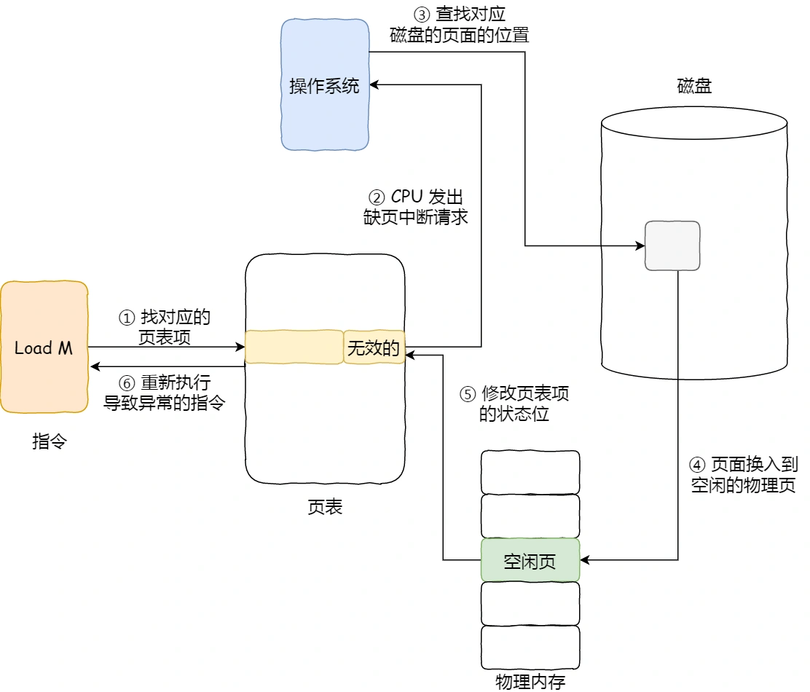

# 1. 为什么需要虚拟内存：（摘自 为什么Linux需要虚拟内存⼀文)

1. 高速缓存
   
   虚拟内存可以结合磁盘和物理内存的优势为进程提供看起来速度足够快并且容量足够大的存储；

2. 内存管理
   
   虚拟内存可以为进程提供独立的内存空间并引入多层的页表结构将虚拟内存翻译成物理内存，进程之间可以共享物理内存减少开销，也能简化程序的链接、装载以及内存分配过程；

3. 内存保护
   
   虚拟内存可以控制进程对物理内存的访问，隔离不同进程的访问权限，提高系统的安全性。

# 2. 虚拟内存

属于计算机系统内存管理的⼀种技术，虚拟地址空间构成虚拟内存，它使得应用程序认为自己拥有连续的可用内存空间，但实际上是被分隔的多个物理内存、以及部分暂时存储在磁盘上的交换分区所构成的。虚拟内存的实现通过硬件异常、硬件地址翻译、主存、磁盘以及内核软件共同完成

虚拟内存实现方式有三种，分别是分段、分页、段页式。

## 2.1 内存分段

程序是由若干个逻辑分段组成的，如可由代码分段、数据分段、栈段、堆段组成。不同的段是有不同的属性的，所以就用分段（Segmentation）的形式把这些段分离出来。

在上面，知道了虚拟地址是通过段表与物理地址进行映射的，分段机制会把程序的虚拟地址分成 4 个段，每个段在段表中有一个项，在这一项找到段的基地址，再加上偏移量，于是就能找到物理内存中的地址，如下图：

分段的办法很好，解决了程序本身不需要关心具体的物理内存地址的问题，但它也有一些不足之处：

* 第一个就是内存碎片的问题。
* 第二个就是内存交换的效率低的问题。

### 2.1.1 内存碎片

假设有 1G 的物理内存，用户执行了多个程序，其中：

* 游戏占用了 512MB 内存
* 浏览器占用了 128MB 内存
* 音乐占用了 256 MB 内存。

这个时候，如果我们关闭了浏览器，则空闲内存还有 1024 - 512 - 256 = 256MB。

如果这个 256MB 不是连续的，被分成了两段 128 MB 内存，这就会导致没有空间再打开一个 200MB 的程序。

解决「外部内存碎片」的问题就是内存交换。

可以把音乐程序占用的那 256MB 内存写到硬盘上，然后再从硬盘上读回来到内存里。不过再读回的时候，我们不能装载回原来的位置，而是紧紧跟着那已经被占用了的 512MB 内存后面。这样就能空缺出连续的 256MB 空间，于是新的 200MB 程序就可以装载进来。

这个内存交换空间，在 Linux 系统里，也就是我们常看到的 Swap 空间，这块空间是从硬盘划分出来的，用于内存与硬盘的空间交换。

### 2.1.2 内存交换效率低

对于多进程的系统来说，用分段的方式，外部内存碎片是很容易产生的，产生了外部内存碎片，那不得不重新 Swap 内存区域，这个过程会产生性能瓶颈。

因为硬盘的访问速度要比内存慢太多了，每一次内存交换，我们都需要把一大段连续的内存数据写到硬盘上。

所以，如果内存交换的时候，交换的是一个占内存空间很大的程序，这样整个机器都会显得卡顿。

为了解决内存分段的「外部内存碎片和内存交换效率低」的问题，就出现了内存分页。

## 2.2 内存分页

地址空间被分割成多个块，每⼀块称作⼀页或页面(Page)。每⼀页有连续的地址范围，这些页被映射到连续的物理内存(页框)。

页表的目的是把虚拟页面(虚拟地址)映射为页框(物理地址)。页表给出了虚拟地址与物理地址的映射关系。从数学的⻆度说页表是⼀个函数，他的参数是虚拟页号，结果是物理页页框号。

如果某个一级页表的页表项没有被用到，也就不需要创建这个页表项对应的二级页表了，即可以在需要时才创建二级页表。做个简单的计算，假设只有 20% 的一级页表项被用到了，那么页表占用的内存空间就只有 4KB（一级页表） + 20% * 4MB（二级页表）= 0.804MB。

分页可以使得连续的虚拟页映射到不连续的物理页，这样能减少外部碎片。由于分配是按页的颗粒度，分页会有内部碎片。

### 2.2.1 TLB加速分页

将虚拟地址直接映射到物理地址，而不必再访问页表，这种设备被称为转换检测缓冲区（TLB）、相联存储器或快表。

⼯作过程：将⼀个虚拟地址放入MMU中进行转换时，硬件首先通过将该虚拟页号与TLB中所有表项同时进行匹配，判断虚拟页面是否在其中：

1. 虚拟页号在TLB中。如果MMU检测⼀个有效的匹配并且访问操作并不违反保护位，则将页框号直接从TLB中取出而不必访问页表。
2. 虚拟页号不在TLB中。如果MMU检测到没有有效的匹配项就会进行正常的页表查询。接着从TLB中淘汰⼀个表项，然后用新的页表项替换它。

## 2.3 段页式内存管理

段页式内存管理实现的方式：

* 先将程序划分为多个有逻辑意义的段，也就是前面提到的分段机制；
* 接着再把每个段划分为多个页，也就是对分段划分出来的连续空间，再划分固定大小的页；
  
这样，地址结构就由段号、段内页号和页内位移三部分组成。

用于段页式地址变换的数据结构是每一个程序一张段表，每个段又建立一张页表，段表中的地址是页表的起始地址，而页表中的地址则为某页的物理页号，如图所示：

段页式地址变换中要得到物理地址须经过三次内存访问：

* 第一次访问段表，得到页表起始地址；
* 第二次访问页表，得到物理页号；
* 第三次将物理页号与页内位移组合，得到物理地址。

可用软、硬件相结合的方法实现段页式地址变换，这样虽然增加了硬件成本和系统开销，但提高了内存的利用率。（但同时也引入了外部碎片和内部碎片的问题）

## 2.3 Linux内存管理

Linux 内存主要采用的是页式内存管理，但同时也不可避免地涉及了段机制。

这主要是上面 Intel 处理器发展历史导致的，因为 Intel X86 CPU 一律对程序中使用的地址先进行段式映射，然后才能进行页式映射。既然 CPU 的硬件结构是这样，Linux 内核也只好服从 Intel 的选择。

但是事实上，Linux 内核所采取的办法是使段式映射的过程实际上不起什么作用。也就是说，“上有政策，下有对策”，若惹不起就躲着走。

Linux 系统中的每个段都是从 0 地址开始的整个 4GB 虚拟空间（32 位环境下），也就是所有的段的起始地址都是一样的。这意味着，Linux 系统中的代码，包括操作系统本身的代码和应用程序代码，所面对的地址空间都是线性地址空间（虚拟地址），这种做法相当于屏蔽了处理器中的逻辑地址概念，段只被用于访问控制和内存保护。

# 3. 用户态和内核态

为了使操作系统内核提供⼀个无懈可击的进程抽象，处理器必须提供⼀种机制，限制⼀个应用可以执行的指令以及他可以用来访问的地址空间范围。

处理器通常是用某个控制寄存器中的⼀个模式位来提供这种功能的，该寄存器描述了进程当前享有的特权。

当设置了模式位时：进程就运行在内核态中。

运行在内核态中的进程可以执行指令集中的任何指令，并且可以访问系统中的任何内存位置。

没有设置模式位时：

进程就运行在用户态。用户模式中的进程不允许执行特权指令。

比如：停止处理器、改变模式位、或者发起⼀个I/O操作。同时也不允许用户态下的进程直接引用地址空间中内核空间的代码和数据。

任何这样的尝试都会导致致命的保护故障。用户态下的程序必须通过系统调用接口间接的访问内核代码和数据。

# 4. 页面置换算法

## 4.1 缺页中断
当 CPU 访问的页面不在物理内存时，便会产生一个**缺页中断**，请求操作系统将所缺页调入到物理内存。那它与一般中断的主要区别在于：

* 缺页中断在指令执行「期间」产生和处理中断信号，而一般中断在一条指令执行「完成」后检查和处理中断信号。
* 缺页中断返回到该指令的开始重新执行「该指令」，而一般中断返回回到该指令的「下一个指令」执行。

1. 在 CPU 里访问一条 Load M 指令，然后 CPU 会去找 M 所对应的页表项。
2. 如果该页表项的状态位是「有效的」，那 CPU 就可以直接去访问物理内存了，如果状态位是「无效的」，则 CPU 则会发送缺页中断请求。
3. 操作系统收到了缺页中断，则会执行缺页中断处理函数，先会查找该页面在磁盘中的页面的位置。
4. 找到磁盘中对应的页面后，需要把该页面换入到物理内存中，但是在换入前，需要在物理内存中找空闲页，如果找到空闲页，就把页面换入到物理内存中。
5. 页面从磁盘换入到物理内存完成后，则把页表项中的状态位修改为「有效的」。
最后，CPU 重新执行导致缺页异常的指令。

上面所说的过程，第 4 步是能在物理内存找到空闲页的情况，那如果找不到呢？

找不到空闲页的话，就说明此时内存已满了，这时候，就需要「页面置换算法」选择一个物理页，如果该物理页有被修改过（脏页），则把它换出到磁盘，然后把该被置换出去的页表项的状态改成「无效的」，最后把正在访问的页面装入到这个物理页中。

这里提一下，页表项除了页号和物理页号外有如下图的字段：

* 状态位：用于表示该页是否有效，也就是说是否在物理内存中，供程序访问时参考。
* 访问字段：用于记录该页在一段时间被访问的次数，供页面置换算法选择出页面时参考。
* 修改位：表示该页在调入内存后是否有被修改过，由于内存中的每一页都在磁盘上保留一份副本，因此，如果没有修改，在置换该页时就不需要将该页写回到磁盘上，以减少系统的开销；如果已经被修改，则将该页重写到磁盘上，以保证磁盘中所保留的始终是最新的副本。
* 硬盘地址：用于指出该页在硬盘上的地址，通常是物理块号，供调入该页时使用。

所以，页面置换算法的功能是，当出现缺页异常，需调入新页面而内存已满时，选择被置换的物理页面，也就是说选择一个物理页面换出到磁盘，然后把需要访问的页面换入到物理页。

那其算法目标则是，尽可能减少页面的换入换出的次数，常见的页面置换算法有如下几种：

* 最佳页面置换算法（OPT）
* 先进先出置换算法（FIFO）
* 最近最久未使用的置换算法（LRU）
* 时钟页面置换算法（Lock）
* 最不常用置换算法（LFU）

## 4.2 最佳置换算法(OPT)

算法思想：每次选择淘汰的页面将是以后永不使用，或者在最长时间内不再被访问的页面，这样可以保证最低的缺页率。

最佳置换算法可以保证最低的缺页率，但是实际上，只有进程执行的过程中才能知道接下来会访问到的是哪个页面。操作系统无法提前预判页面的访问序列。因此，最佳置换算法是无法实现的。

## 4.3 先进先出置换算法(FIFO)

算法思想：每次选择淘汰的页面是最早进入内存的页面。

当为进程分配的物理块数增大时，缺页次数不减反增的异常现象称为贝莱迪（Belay）异常。只有FIFO算法会产生Belay异常。

FIFO算法虽然实现简单，但是该算法与进程实际运行时的规律不适应。因为先进入的页面也有可能最经常被访问。因此，算法性能差。

## 4.4 最近最久未使用的置换算法（LRU）

算法思想：选择最长时间没有被访问的页面进行置换。

实现方法：需要在内存中维护一个所有页面的链表，最近最多使用的页面在表头，最近最少使用的页面在表尾。

困难的是，在每次访问内存时都必须要更新「整个链表」。在链表中找到一个页面，删除它，然后把它移动到表头是一个非常费时的操作。

所以，LRU 虽然看上去不错，但是由于开销比较大，实际应用中比较少使用。

## 4.5 时钟页面置换算法

最佳置换算法那性能最好，但无法实现。先进先出置换算法实现简单，但是算法性能差。最近最久未使用置换算法性能好，是最接近OPT算法性能的，但是算法开销大。时钟置换算法是一种性能和开销均平衡的算法。又称CLOCK算法，或最近未用算法（NRU，Not Recently Used）

简单CLOCK算法算法思想：为每个页面设置一个访问位，再将内存中的页面都通过链接指针链接成一个循环队列。当某个页被访问时，其访问位置1。当需要淘汰一个页面时，只需检查页的访问位。如果是0，就选择该页换出；如果是1，暂不换出，将访问位改为0，继续检查下一个页面，若第一轮扫描中所有的页面都是1，则将这些页面的访问位依次置为0后，再进行第二轮扫描（第二轮扫描中一定会有访问位为0的页面，因此简单的CLOCK算法选择一个淘汰页面最多会经过两轮扫描）。

## 4.6 最不常用算法

记录每个页面访问次数，当发生缺页中断时候，将访问次数最少的页面置换出去，此方法需要对每个页面访问次数统计，额外开销。

还有个问题，LFU 算法只考虑了频率问题，没考虑时间的问题，比如有些页面在过去时间里访问的频率很高，但是现在已经没有访问了，而当前频繁访问的页面由于没有这些页面访问的次数高，在发生缺页中断时，就会可能会误伤当前刚开始频繁访问，但访问次数还不高的页面。

