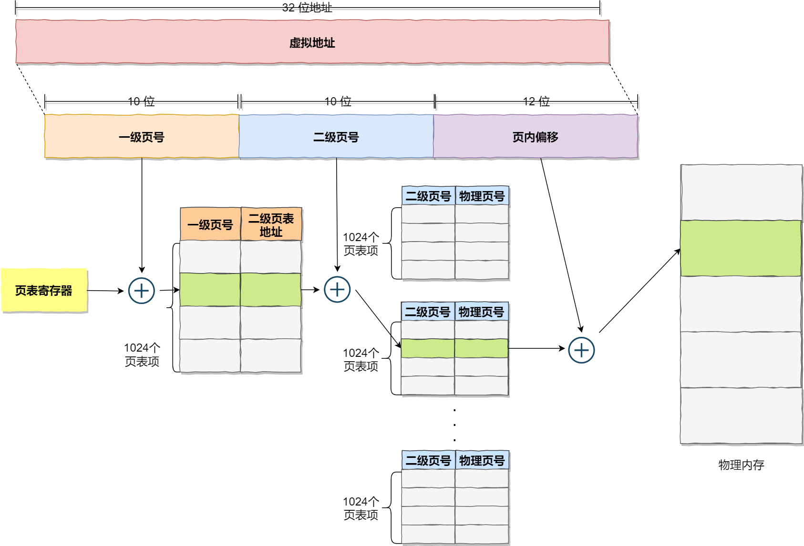

# 1. 为什么需要虚拟内存：（摘自 为什么Linux需要虚拟内存⼀文)

1. 高速缓存
   
   虚拟内存可以结合磁盘和物理内存的优势为进程提供看起来速度足够快并且容量足够大的存储；

2. 内存管理
   
   虚拟内存可以为进程提供独立的内存空间并引入多层的页表结构将虚拟内存翻译成物理内存，进程之间可以共享物理内存减少开销，也能简化程序的链接、装载以及内存分配过程；

3. 内存保护
   
   虚拟内存可以控制进程对物理内存的访问，隔离不同进程的访问权限，提高系统的安全性。

# 2. 虚拟内存

属于计算机系统内存管理的⼀种技术，虚拟地址空间构成虚拟内存，它使得应用程序认为自己拥有连续的可用内存空间，但实际上是被分隔的多个物理内存、以及部分暂时存储在磁盘上的交换分区所构成的。虚拟内存的实现通过硬件异常、硬件地址翻译、主存、磁盘以及内核软件共同完成

虚拟内存实现方式有三种，分别是分段、分页、段页式。

## 2.1 内存分段

程序是由若干个逻辑分段组成的，如可由代码分段、数据分段、栈段、堆段组成。不同的段是有不同的属性的，所以就用分段（Segmentation）的形式把这些段分离出来。


在上面，知道了虚拟地址是通过段表与物理地址进行映射的，分段机制会把程序的虚拟地址分成 4 个段，每个段在段表中有一个项，在这一项找到段的基地址，再加上偏移量，于是就能找到物理内存中的地址，如下图：


分段的办法很好，解决了程序本身不需要关心具体的物理内存地址的问题，但它也有一些不足之处：

* 第一个就是内存碎片的问题。
* 第二个就是内存交换的效率低的问题。

### 2.1.1 内存碎片

假设有 1G 的物理内存，用户执行了多个程序，其中：

* 游戏占用了 512MB 内存
* 浏览器占用了 128MB 内存
* 音乐占用了 256 MB 内存。

这个时候，如果我们关闭了浏览器，则空闲内存还有 1024 - 512 - 256 = 256MB。

如果这个 256MB 不是连续的，被分成了两段 128 MB 内存，这就会导致没有空间再打开一个 200MB 的程序。


解决「外部内存碎片」的问题就是内存交换。

可以把音乐程序占用的那 256MB 内存写到硬盘上，然后再从硬盘上读回来到内存里。不过再读回的时候，我们不能装载回原来的位置，而是紧紧跟着那已经被占用了的 512MB 内存后面。这样就能空缺出连续的 256MB 空间，于是新的 200MB 程序就可以装载进来。

这个内存交换空间，在 Linux 系统里，也就是我们常看到的 Swap 空间，这块空间是从硬盘划分出来的，用于内存与硬盘的空间交换。

### 2.1.2 内存交换效率低

对于多进程的系统来说，用分段的方式，外部内存碎片是很容易产生的，产生了外部内存碎片，那不得不重新 Swap 内存区域，这个过程会产生性能瓶颈。

因为硬盘的访问速度要比内存慢太多了，每一次内存交换，我们都需要把一大段连续的内存数据写到硬盘上。

所以，如果内存交换的时候，交换的是一个占内存空间很大的程序，这样整个机器都会显得卡顿。

为了解决内存分段的「外部内存碎片和内存交换效率低」的问题，就出现了内存分页。

## 2.2 内存分页



地址空间被分割成多个块，每⼀块称作⼀页或页面(Page)。每⼀页有连续的地址范围，这些页被映射到连续的物理内存(页框)。

页表的目的是把虚拟页面(虚拟地址)映射为页框(物理地址)。页表给出了虚拟地址与物理地址的映射关系。从数学的⻆度说页表是⼀个函数，他的参数是虚拟页号，结果是物理页页框号。

如果某个一级页表的页表项没有被用到，也就不需要创建这个页表项对应的二级页表了，即可以在需要时才创建二级页表。做个简单的计算，假设只有 20% 的一级页表项被用到了，那么页表占用的内存空间就只有 4KB（一级页表） + 20% * 4MB（二级页表）= 0.804MB。

分页可以使得连续的虚拟页映射到不连续的物理页，这样能减少外部碎片。由于分配是按页的颗粒度，分页会有内部碎片。

### 2.2.1 TLB加速分页

将虚拟地址直接映射到物理地址，而不必再访问页表，这种设备被称为转换检测缓冲区（TLB）、相联存储器或快表。

⼯作过程：将⼀个虚拟地址放入MMU中进行转换时，硬件首先通过将该虚拟页号与TLB中所有表项同时进行匹配，判断虚拟页面是否在其中：

1. 虚拟页号在TLB中。如果MMU检测⼀个有效的匹配并且访问操作并不违反保护位，则将页框号直接从TLB中取出而不必访问页表。
2. 虚拟页号不在TLB中。如果MMU检测到没有有效的匹配项就会进行正常的页表查询。接着从TLB中淘汰⼀个表项，然后用新的页表项替换它。

## 2.3 段页式内存管理

段页式内存管理实现的方式：

* 先将程序划分为多个有逻辑意义的段，也就是前面提到的分段机制；
* 接着再把每个段划分为多个页，也就是对分段划分出来的连续空间，再划分固定大小的页；
  
这样，地址结构就由段号、段内页号和页内位移三部分组成。

用于段页式地址变换的数据结构是每一个程序一张段表，每个段又建立一张页表，段表中的地址是页表的起始地址，而页表中的地址则为某页的物理页号，如图所示：


段页式地址变换中要得到物理地址须经过三次内存访问：

* 第一次访问段表，得到页表起始地址；
* 第二次访问页表，得到物理页号；
* 第三次将物理页号与页内位移组合，得到物理地址。

可用软、硬件相结合的方法实现段页式地址变换，这样虽然增加了硬件成本和系统开销，但提高了内存的利用率。（但同时也引入了外部碎片和内部碎片的问题）

## 2.3 Linux内存管理


Linux 内存主要采用的是页式内存管理，但同时也不可避免地涉及了段机制。

这主要是上面 Intel 处理器发展历史导致的，因为 Intel X86 CPU 一律对程序中使用的地址先进行段式映射，然后才能进行页式映射。既然 CPU 的硬件结构是这样，Linux 内核也只好服从 Intel 的选择。

但是事实上，Linux 内核所采取的办法是使段式映射的过程实际上不起什么作用。也就是说，“上有政策，下有对策”，若惹不起就躲着走。

Linux 系统中的每个段都是从 0 地址开始的整个 4GB 虚拟空间（32 位环境下），也就是所有的段的起始地址都是一样的。这意味着，Linux 系统中的代码，包括操作系统本身的代码和应用程序代码，所面对的地址空间都是线性地址空间（虚拟地址），这种做法相当于屏蔽了处理器中的逻辑地址概念，段只被用于访问控制和内存保护。


# 3. 用户态和内核态

为了使操作系统内核提供⼀个无懈可击的进程抽象，处理器必须提供⼀种机制，限制⼀个应用可以执行的指令以及他可以用来访问的地址空间范围。

处理器通常是用某个控制寄存器中的⼀个模式位来提供这种功能的，该寄存器描述了进程当前享有的特权。

当设置了模式位时：进程就运行在内核态中。

运行在内核态中的进程可以执行指令集中的任何指令，并且可以访问系统中的任何内存位置。

没有设置模式位时：

进程就运行在用户态。用户模式中的进程不允许执行特权指令。

比如：停止处理器、改变模式位、或者发起⼀个I/O操作。同时也不允许用户态下的进程直接引用地址空间中内核空间的代码和数据。

任何这样的尝试都会导致致命的保护故障。用户态下的程序必须通过系统调用接口间接的访问内核代码和数据。


# 11. 页面置换算法

请求分页管理方式中，当需要调入页面到内存中，但此时内存已满，就需要从内存中按照一定的置换算法决定将哪个页面取出将内存给调入的页面。本文将介绍几种页面置换算方法。

## 11.1 最佳置换算法(OPT)

算法思想：每次选择淘汰的页面将是以后永不使用，或者在最长时间内不再被访问的页面，这样可以保证最低的缺页率。

最佳置换算法可以保证最低的缺页率，但是实际上，只有进程执行的过程中才能知道接下来会访问到的是哪个页面。操作系统无法提前预判页面的访问序列。因此，最佳置换算法是无法实现的。

## 11.2 先进先出置换算法(FIFO)

算法思想：每次选择淘汰的页面是最早进入内存的页面。

当为进程分配的物理块数增大时，缺页次数不减反增的异常现象称为贝莱迪（Belay）异常。

只有FIFO算法会产生Belay异常。另外，FIFO算法虽然实现简单，但是该算法与进程实际运行时的规律不适应。因为先进入的页面也有可能最经常被访问。因此，算法性能差。

## 11.3 最近最久未使用的置换算法（LRU）

算法思想：每次淘汰的页面是最近最久未使用的页面。

实现方法：赋予每个页面对应的页表项中，用访问字段记录该页面自上次被访问以来所经历的时间t。当需要淘汰一个页面时，选择现有页面中t最大的页面，即最近最久未使用。

## 11.4 时钟页面置换算法

最佳置换算法那性能最好，但无法实现。先进先出置换算法实现简单，但是算法性能差。最近最久未使用置换算法性能好，是最接近OPT算法性能的，但是实现起来需要专门的硬件支持，算法开销大。时钟置换算法是一种性能和开销均平衡的算法。又称CLOCK算法，或最近未用算法（NRU，Not Recently Used）

简单CLOCK算法算法思想：为每个页面设置一个访问位，再将内存中的页面都通过链接指针链接成一个循环队列。当某个页被访问时，其访问位置1.当需要淘汰一个页面时，只需检查页的访问位。如果是0，就选择该页换出；如果是1，暂不换出，将访问位改为0，继续检查下一个页面，若第一轮扫描中所有的页面都是1，则将这些页面的访问位一次置为0后，再进行第二轮扫描（第二轮扫描中一定会有访问位为0的页面，因此简单的CLOCK算法选择一个淘汰页面最多会经过两轮扫描）。

## 11.5 最不常用算法

记录每个页面访问次数，当发生缺页中断时候，将访问次数最少的页面置换出去，此方法需要对每个页面访问次数统计，额外开销。

# 12. 分段

虚拟内存采用的是分页技术，也就是将地址空间划分成固定大小的页，每⼀页再与内存进行映射。

如果使用分页系统的⼀维地址空间，动态增长的特点会导致覆盖问题的出现。

分段的做法是把每个表分成段，⼀个段构成⼀个独立的地址空间。每个段的长度可以不同，并且可以动态增长。

## 12.1 纯分段
分段和分页本质上是不同的，页面是定长的而段不是。

优点：
1. 共享：有助于⼏个进程之间共享过程和数据。 比如共享库
2. 保护：每个段都可以独立地增大或减小而不会影响其他的段

## 12.2 分段和分页结合

程序的地址空间划分成多个拥有独立地址空间的段，每个段上的地址空间划分成大小相同的页。

这样既拥有分段系统的共享和保护，⼜拥有分页系统的虚拟内存功能.

## 12.3 分段与分页的比较

**对程序员的透明性**

分页透明，但是分段需要程序员显式划分每个段。

**地址空间的维度**

分页是⼀维地址空间，分段是⼆维的。

**大小是否可以改变**

页的大小不可变，段的大小可以动态改变。

**出现的原因**

分页主要用于实现虚拟内存，从而获得更大的地址空间；分段主要是为了使程序和数据可以被划分为逻辑上独立的地址空间并且有助于共享和保护。

# 16. 互斥锁

也叫互斥量，互斥锁是⼀种简单的加锁的方法来控制对共享资源的访问，互斥锁只有两种状态,即加锁( lock )和解锁( unlock )

1. 在访问共享资源后临界区域前，对互斥锁进行加锁。
2. 在访问完成后释放互斥锁导上的锁。
3. 对互斥锁进行加锁后，任何其他试图再次对互斥锁加锁的线程将会被阻塞，直到锁被释放。

# 17. 死锁（DeadLock）

如果⼀个进程集合中的每⼀个进程都在等待只能由该进程集合中的其他进程才能引发的事件，那么，该进程集合就是死锁

## 17.1 资源

可抢占资源：可以从拥有它的进程中抢占而不会产生任何副作用，存储器就是⼀类可抢占资源

不可抢占资源：是指在不引起相关计算失败的情况下，无法把它从占有它的进程处抢占过来

## 17.2 必要条件

1. 互斥：每个资源要么已经分配给⼀个进程，要么就是可用的
2. 占有和等待：已经得到了某个资源的进程可以再请求新的资源
3. 不可抢占：已经分配给⼀个进程的资源不能强制性地被抢占，它只能被占有它的进程显式地释放
4. 环路等待：死锁发生时，系统中⼀定有由两个或两个以上的进程组成的⼀条环路，该环路中的每个进程都在等待着下⼀个进程所占有的资源。

## 17.3 处理方法

### 17.3.1 鸵⻦算法

把头埋在沙子⾥，假装根本没发生问题。

因为解决死锁问题的代价很高，因此鸵⻦算法这种不采取任务措施的方案会获得更高的性能。当发生死锁时不会对用户造成多大影响，或发生死锁的概率很低，可以采用鸵⻦算法。

### 17.3.2 死锁检测

**每种类型⼀个资源的死锁检测**

通过检测有向图中是否存在环来实现，从⼀个节点出发进行深度优先搜索，对访问过的节点进行标记，如果访问了已经标记的节点，就表示有向图存在环，也就是检测到死锁发生

**每种类型多个资源的死锁检测**

每个进程最开始时都不被标记，执行过程有可能被标记。当算法结束时，任何没有被标记的进程都是死锁进程。

1. 寻找⼀个没有标记的进程Pi，它所请求的资源小于或等于A
2. 如果真找到这样⼀个进程，那么将C矩阵的第i行向量加到A中，标记该进程，并转回第1步
3. 如果没有这样的进程，那么算法终止

### 17.3.3 死锁恢复

**利用抢占恢复**

将进程挂起，强行取⾛资源给另⼀个进程使用，用完再放回

**利用回滚恢复**

复位到更早的状态，那时它还没有取得所需的资源

**通过杀死进程恢复**

杀掉环中的⼀个进程或多个，牺牲掉⼀个环外进程

### 17.3.4 死锁预防

**破坏互斥条件**

例如假脱机打印机技术允许若⼲个进程同时输出，唯⼀真正请求物理打印机的进程是打印机守护进程。

**破坏占有等待条件**

1. 规定所有进程在开始执行前请求所需要的全部资源。
2. 要求当⼀个进程请求资源时，先暂时释放其当前占用的所有资源，然后在尝试⼀次获得所需的全部资源。

**破坏不可抢占条件**

1. 保证每⼀个进程在任何时刻只能占用⼀个资源，如果请求另⼀个资源必须先释放第⼀个资源
2. 将所有的资源统⼀编号，进程可以在任何时刻提出资源请求，但是所有请求必须按照资源编号的顺序(升序)提出
   
**破坏环路等待**

### 17.3.5 死锁避免

**安全状态**

如果没有死锁发生，并且即使所有进程突然请求对资源的最大需求，也仍然存在某种调度次序能够使得每⼀个进程运行完毕，则称该状态是安全的。

**单个资源的银行家算法**

⼀个小城镇的银行家，他向⼀群客户分别承诺了⼀定的贷款额度，算法要做的是判断对请求的满足是否会进入不安全状态，如果是，就拒绝请求；否则予以分配。

**多个资源的银行家算法**

检查⼀个状态是否安全的算法

1. 查找右边的矩阵是否存在⼀行小于等于向量 A。如果不存在这样的行，那么系统将会发生死锁，状态是不安全的。
2. 假若找到这样⼀行，将该进程标记为终止，并将其已分配资源加到 A 中。
3. 重复以上两步，直到所有进程都标记为终止，则状态是安全的。
   
如果⼀个状态不是安全的，需要拒绝进入这个状态。

# 10. 不可重入、可重入函数

如果有⼀个函数不幸被设计成为这样：不同任务调用这个函数时可能修改其他任务调用这个函数的数据，从而导致不可预料的后果。

这样的函数是不安全的函数，也叫不可重入函数;

**不可重入函数**

1. 函数体内使用了静态的数据结构;
2. 函数体内调用了malloc() 或者 free() 函数(谨慎使用堆);
3. 函数体内调用了标准 I/O 函数;

**可重入函数**

1. 所谓可重入是指⼀个可以被多个任务调用的过程，任务在调用时不必担⼼数据是否会出错;
2. 在写函数时候尽量使用局部变量（例如寄存器、栈中的变量）;
3. 对于要使用的全局变量要加以保护（如采取关中断、信号量等互斥方法），这样构成的函数就⼀定是⼀个可重入的函数.

# 18. 读写锁

在对数据的读写操作中，更多的是读操作，写操作较少，例如对数据库数据的读写应用。为了满足当前能够允许多个读出，但只允许⼀个写入的需求，线程提供了读写锁来实现。

**读写锁的特点**
1、如果有其它线程读数据，则允许其它线程执行读操作，但不允许写操作
2、如果有其它线程写数据，则其它线程都不允许读、写操作

读写锁分为读锁和写锁，规则如下

1. 如果某线程申请了读锁，其它线程可以再申请读锁，但不能申请写锁。
2. 如果某线程申请了写锁，其它线程不能申请读锁，也不能申请写锁。

# 19. 条件变量

与互斥锁不同，条件变量是用来等待而不是用来上锁的，条件变量本身不是锁！

条件变量用来自动阻塞⼀个线程，直到某特殊情况发生为止。通常条件变量和互斥锁同时使用。

条件变量的两个动作：
1. 条件不满, 阻塞线程
2. 当条件满足, 通知阻塞的线程开始⼯作

**条件变量的优缺点**

相较于mutex而⾔，条件变量可以减少竞争。

如直接使用mutex，除了生产者、消费者之间要竞争互斥􁰁以外，消费者之间也需要竞争互斥量;

但如果汇聚（链表）中没有数据，消费者之间竞争互斥锁是无意义的。有了条件变量机制以后，只有生产者完成生产，才会引起消费者之间的竞争。提高了程序效率。

**条件变量流程分析**

场景: 你是个老板，招聘了三个员⼯，但是你不是有了活才去招聘员⼯，而是先把员⼯招来，没有活的时候员⼯需要在那⾥等着，⼀旦有了活，你要去通知他们，他们要去抢活⼲，⼲完了再等待，你再有活，再通知他们

# 20. 信号量

信号量⼴泛用于进程或线程间的同步和互斥，信号􁰁本质上是⼀个非负的整数计数器，它被用来控制对公共资源的访问。

编程时可根据操作信号􁰁值的结果判断是否对公共资源具有访问的权限，当信号量值大于 0时，则可以访问，否则将阻塞。

PV 原语是对信号量的操作，⼀次 P 操作使信号量减１，⼀次 V 操作使信号量加１。

# 21. 经典的IPC问题

## 21.1 哲学家进餐问题

下面是⼀种错误的解法，如果所有哲学家同时拿起左⼿边的筷子，那么所有哲学家都在等待其它哲学家吃完并释放自己⼿中的筷子，导致死锁。

为了防止死锁的发生，可以设置两个条件：

1. 必须同时拿起左右两根筷子
2. 只有在两个邻居都没有进餐的情况下才允许进餐

## 21.2 读者-写者问题

允许多个进程同时对数据进行读操作，但是不允许读和写以及写和写操作同时发生。

# 22. 文件系统

## 22.1 文件

文件是⼀种抽象机制，它提供了⼀种在磁上保存信息而且方便以后读取的方法。这种方法可以使用户不必了解存储信息的方法、位置和实际磁盘⼯作方式等有关细节

## 22.2 文件命名

win95、win98用的都是MS-DOS的文件系统，即FAT-16， win98扩展了FAT-16成为FAT-32。

较新版的操作系统NTFS,win8配备ReFS。微软优化FAT,叫作exFAT。prog.c，圆点后面的部分称为文件扩展名。

## 22.3 文件结构

**字节结构**

把文件看成字节序列为操作系统提供了最大的灵活度

**记录序列**

文件结构上的第⼀步改进，这种模型中，文件是具有固定长度记录的序列

**树**

文件在这种结构中由⼀棵记录树构成，每个记录不必具有相同的长度，记录的固定位置上有⼀个键字段。这棵树按“键”字段进行排序，从而可以对特定“键”进行快速查找。

## 22.4 文件类型

1. 普通文件
2. 目录
3. 字符特殊文件（UNIX）
4. 块特殊文件（UNIX）

## 22.5 文件访问

**顺序访问**

按顺序读取文件的全部字节，早期操作系统只有这种访问方式

**随机访问文件**

当用磁盘存储文件时，可以以任何次序读取其中字节或记录的文件。许多应用程序需要这种类型文件

## 22.6 文件属性

除了文件名和数据外，所有操作系统还会保存其他的文件相关信息，如创建⽇期、时间和大小等，这些附加的信息称为文件属性

## 22.7 文件操作

使用文件的目的是存储信息并方便以后检索。对于存储和检索，不同系统提供了不同的操作。

常⻅的文件操作（系统调用）:

1. create：创建不包含任何数据的文件
2. delete：当不再需要某个文件时，必须删除该文件以释放磁盘空间
3. open：在使用文件之前，必须先打开文件
4. close：访问结束后，不再需要文件属性和磁盘地址，这时应该关闭文件以释放内部表空间
5. read：在文件中读取数据
6. write：向文件写数据，写操作⼀般也是从文件当前位置开始
7. append：此调用是write的限制形式，他只能在文件末尾添加数据
8. seek：对于随机访问文件，要指定从何处开始获取数据，通常的方法是用seek系统调用把当前位置指针指向文件中特定的位置。
9. get attributes：进程运行常需要读取文件属性
10. set attributes：某些属性是可由用户设置的，甚至在文件创建之后
11. rename：用户尝尝要改变已有的名字，rename系统调用用于这⼀目的

## 22.8 目录

文件系统通常提供目录或文件夹用于记录文件的位置，在很多操作系统中目录本身也是文件

1. ⼀级目录系统：在⼀个目录中包含所有文件，这有时称为根目录
2. 层级目录系统：当用户有着数以千计的文件，为了寻找方便。需要层次结构（即⼀个目录树）
3. 路径名
   
   **绝对路径名**：它由从根目录到文件的路径组成。

   Windows ： \usr\ast\maibox

   UNIX ： /usr/ast/mailbox

   路径名的第⼀个字符是分隔符，则这个路径是绝对路径

   **相对路径名**：它常和⼯作目录(working directory)(也和当前目录(acurrent directory))⼀起使用

   **特殊目录项**：

   . dot ：指当前目录
   
   .. dotdot 指其父目录

4. 目录操作
   
```javascript
create # 创建目录
delete # 删除目录
opendir # 目录内容可被读取
closedir # 读目录结束
readdir # 返回打开目录下一个目录项
rename # 改变目录名
link # 链接技术允许在多个目录中出现同一个文件
unlink # 删除目录项
```

# 23. 文件系统的实现

文件存储实现的关键问题是记录各个文件分别用到哪些磁盘块。不同的操作系统用到不同的方法

## 23.1 文件系统布局

文件系统存放在磁盘上。多数磁盘划分为⼀个或多个分区，每个分区中国有⼀个独立的文件系统。

磁盘0号扇区称为主引导记录(MBR)，用来引导计算机。在MBR结尾是分区表。该表给出每个分区的起始结束地址。

表中的⼀个分区被标记为活动区。在计算机被引导时，BIOS读入并执行MBR。MBR做的第⼀件事是确定活动分区，读入它的第⼀个块，称为引导块，并执行之。

引导块中的程序将装载该分区中的操作系统。

## 23.2 文件的实现

**连续分配**

最简单的分配是把每个文件作为⼀连串连续数据块存储在磁盘

优势：

1. 实现简单：记录每个文件用到磁盘块简化为只需记住两个数字即可：第⼀块的磁盘地址和文件的块数。给定了第⼀块编号，⼀个简单的加法就可以找到任何其他块的编号

2. 操作性能较好：因为单个操作中就能从磁盘上读出整个文件。只需⼀次寻找。

**链表分配**

为每个文件构造磁盘块链表。每⼀块的第⼀个字作为指向下⼀块的指针，块的其他部分存放数据。

优势：

1. 可以充分利用磁盘块，不会因为磁盘碎片浪费存储内存
2. 随机访问快。
   
缺点：

指针占用⼀些字节，每个磁盘块存储数据的字节数不再是2的整数次幂。怪异的大小降低了系统的运行效率，每个块前⼏个字节被指向下⼀个块的指针所占据，需要从两个磁盘中获取拼接信息，这就因复制而引发额外的开销。

**采用内存中的表进行链表分配**

取出每个磁盘块的指针字，把他放在内存的⼀个表中，解决链表分配的不足。内存中这样的表格称为文件分配表(File Allocation Table，FAT)

**i节点**

最后⼀个记录各文件分别包含哪些磁盘块的方法是给每个文件赋予⼀个称为i节点的数据结构，其中列出了文件属性和文件的磁盘地址。

## 23.3 目录的实现

在读文件之前，必须先打开文件。打开文件时，操作系统利用用户给出的路径名找到相应的目录项。

简单目录：包含固定大小的目录，在目录项中有磁盘地址和属性

采用i节点的系统：把文件属性存放在i节点中而不是目录项中。这种情形下，目录项会更短。

## 23.4 共享文件

当⼏个用户同在⼀个项目⾥⼯作时，他们常常需要共享文件。

共享文件与目录的联系称为⼀个链接（link）。这样文件系统本身就是⼀个有向无环图（DAG），而不是⼀棵树。

## 23.5 ⽇志结构文件系统

CPU运行速度越来越快，磁盘容􁰁越来越大，价格越来越便宜（但磁盘速度并没有增快多少），同时内存容􁰁也以指数形式增长。

而没有得到快速发展的参数是磁道的寻道时间。这些成为了文件系统性能的瓶颈，为了解决这⼀问题设计了全新的文件系统即⽇志结构文件系统（LFS）。

虽然是⼀个很吸引⼈的想法，由于它们和文件系统不匹配，该文件系统并没有被⼴泛应用。

## 23.6 ⽇志文件系统

基本的想法是保存⼀个用于记录系统下⼀步将要做什么的⽇志。

这样当系统在完成他们即将完成的任务前崩溃时，􁯿新启动后，可以通过查看⽇志，获取崩溃前计划完成的任务，并完成它们。

这样的文件⽇志系统，并已经被实际应用。微软的NTFS、Linux的 ext3和ReiserFS文件系统都使用⽇志。

## 23.7 虚拟文件系统

将多个文件系统整合到⼀个统⼀的结构中。

⼀个Linux系统可以用ext2作为根文件系统，ext3分区装载在/usr下，另⼀块采用ReiserFS文件系统的硬盘装载在/home下，以及⼀个ISO 9660的CD-ROM临时装载在/mnt下。从用户的观点来看，只有⼀个文件系统层级。

它们事实上是多种文件系统，对于用户和进程是不可⻅的。绝大多数Unix操作系统都在使用虚拟文件系统（Virtual File System, VFS）

# 24. 文件系统的管理和优化

## 24.1 磁盘空间管理

⼏乎所有文件系统都把文件分割成固定大小的块来存储，各块之间不⼀定相邻

1、块大小

从历史的观点上来说，文件系统将大小设在1~4KB之间，但现在随着磁盘超过了1TB，还是将块的大小提升到64KB并且接受浪费的磁盘孔空间，这样也许更好。磁盘空间⼏乎不再会短缺。

2、记录空闲块

**磁盘块链表**

链表的每个块中包含尽可能多的空闲磁盘块号。

通常情况下，采用空闲块存放空闲表，这样不会影响存储器

**位图**

在位图中，空闲块用1表示，已分配块用0表示。

**磁盘配额**

为防止⼈们贪⼼而占有太多的磁盘空间，用户操作系统常常提供⼀种强制性磁盘配额机制。

其思想是系统管理员分给每个用户拥有文件和块的最大数􁰁，操作系统确保每个用户不超过分给他们的配额。（配额表、打开文件表）

## 24.2 文件系统备份

做磁盘备份主要是处理好两个潜在问题中的⼀个

1. 从意外的灾难中恢复
2. 从错误的操作中恢复

## 24.3 文件系统的⼀致性

很多文件系统读取磁盘块，进行修改后，再写回磁盘。

如果在修改过的磁盘块全部写回之前系统崩溃，则文件系统有可能处于不⼀致状态。

如果⼀些未被写回的块是i节点块、目录块或者是包含有空闲表的块时，这个问题尤为严重

## 24.4 文件系统性能

1、高速缓存

减少磁盘访问次数技术是块高速缓存（block cache）或者缓冲区高速缓存（buffer cache）。

本书中，高速缓存指的是⼀系列的块，它们在逻辑上属于磁盘，但实际上基于性能的考虑被保存在内存中。

2、块提取读

在需要用到块之前，试图提前将其写入高速缓存，从而提高命中率。

块提前读策略只适用于实际顺序读取的文件。对随机访问文件，提前读丝毫不起作用。

3、减少磁盘臂运动

把可能顺序访问的块放⼀起，当然最好是同⼀柱面上，从而减少磁盘臂的移动次数。

## 24.5 磁盘碎片整理

移动文件使它们相邻，并把所有的空闲空间放在⼀个或多个大的连续区域内。


