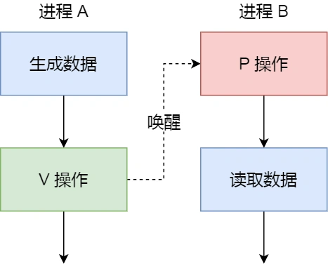

# 1. 互斥与同步

同步与互斥是两种不同的概念：

* 同步就好比：「操作 A 应在操作 B 之前执行」，「操作 C 必须在操作 A 和操作 B 都完成之后才能执行」等；
* 互斥就好比：「操作 A 和操作 B 不能在同一时刻执行」。

## 1.1 互斥

由于多线程执行操作共享变量的这段代码可能会导致竞争状态，因此我们将此段代码称为临界区（critical section），它是访问共享资源的代码片段，一定不能给多线程同时执行。

我们希望这段代码是互斥（mutualexclusion）的，也就说保证一个线程在临界区执行时，其他线程应该被阻止进入临界区，说白了，就是这段代码执行过程中，最多只能出现一个线程。

## 1.2 同步

我们都知道在多线程里，每个线程并不一定是顺序执行的，它们基本是以各自独立的、不可预知的速度向前推进，但有时候我们又希望多个线程能密切合作，以实现一个共同的任务。

例子，线程 1 是负责读入数据的，而线程 2 是负责处理数据的，这两个线程是相互合作、相互依赖的。线程 2 在没有收到线程 1 的唤醒通知时，就会一直阻塞等待，当线程 1 读完数据需要把数据传给线程 2 时，线程 1 会唤醒线程 2，并把数据交给线程 2 处理。

所谓同步，就是并发进程/线程在一些关键点上可能需要互相等待与互通消息，这种相互制约的等待与互通信息称为进程/线程同步。

# 2. 互斥和同步的实现

使用锁可以解决并发线程/进程的互斥问题；使用信号量可以解决并发线程/进程的互斥和同步问题。

## 2.1 锁

使用加锁操作和解锁操作可以解决并发线程/进程的互斥问题。

任何想进入临界区的线程，必须先执行加锁操作。若加锁操作顺利通过，则线程可进入临界区；在完成对临界资源的访问后再执行解锁操作，以释放该临界资源。

## 2.1.1 忙等待锁（自旋锁）

在说明「忙等待锁」的实现之前，先介绍现代 CPU 体系结构提供的特殊原子操作指令 —— **测试和置位（Test-and-Set）指令**。

如果用 C 代码表示 TAS 指令，形式如下：

```javascript
// 伪代码  实际是由硬件支持 不可重入
int TestAndSet(int *old_ptr, int new) {
   int old = *old_ptr;
   *old_ptr = new;
   return old;
}
```
测试并设置指令做了下述事情:

* 把 old_ptr 更新为 new 的新值；
* 返回 old_ptr 的旧值；

当然，关键是这些代码是原子执行。因为既可以测试旧值，又可以设置新值，所以我们把这条指令叫作「测试并设置」。

那什么是原子操作呢？原子操作就是要么全部执行，要么都不执行，不能出现执行到一半的中间状态。

我们可以运用 TAS 指令来实现「忙等待锁」，代码如下：

```javascript
typedef struct lock_t {
   int flag;
} lock_t;

void init(lock_t *lock) {
   lock->flag = 0;
}

void lock(lock_t *lock) {
   while (TestAndSet(&lock->flag, 1) == 1);
}

void unlock(lock_t *lock) {
   lock->flag = 0;
}
```

我们来确保理解为什么这个锁能工作：

* 第一个场景是，首先假设一个线程在运行，调用 lock()，没有其他线程持有锁，所以 flag 是 0。当调用 TestAndSet(flag, 1) 方法，返回 0，线程会跳出 while 循环，获取锁。同时也会原子的设置 flag 为1，标志锁已经被持有。当线程离开临界区，调用 unlock() 将 flag 清理为 0。

* 第二种场景是，当某一个线程已经持有锁（即 flag 为1）。本线程调用 lock()，然后调用 TestAndSet(flag, 1)，这一次返回 1。只要另一个线程一直持有锁，TestAndSet() 会重复返回 1，本线程会一直忙等。当 flag 终于被改为 0，本线程会调用 TestAndSet()，返回 0 并且原子地设置为 1，从而获得锁，进入临界区。

很明显，当获取不到锁时，线程就会一直 while 循环，不做任何事情，所以就被称为「忙等待锁」，也被称为自旋锁（spin lock）。

这是最简单的一种锁，一直自旋，利用 CPU 周期，直到锁可用。在单处理器上，需要抢占式的调度器（即不断通过时钟中断一个线程，运行其他线程）。否则，自旋锁在单 CPU 上无法使用，因为一个自旋的线程永远不会放弃 CPU。

## 2.1.2 无等待锁（互斥锁）

无等待锁顾明思议就是获取不到锁的时候，不用自旋。

既然不想自旋，那当没获取到锁的时候，就把当前线程放入到锁的等待队列，然后执行调度程序，把 CPU 让给其他线程执行。

```javascript
typedef struct lock_t {
   int flag;
   queue_t *q;  // 等待队列
} lock_t;

void init(lock_t *lock) {
   lock->flag = 0;
   queue_init(lock->q);
}

void lock(lock_t *lock) {
   while(TestAndSet(&lock->flag, 1) == 1) {
      /*
       * 保存现在运行线程 TCB（Thread Control Block）线程控制模块
       * 将现在运行的线程 TCB 插入到等待队列
       * 设置该线程为等待状态
       * 调度程序
       */
   }
}

void unlock(lock_t *lock) {
   if(lock->q != NULL) {
      /*
       * 移出等待队列的队头元素
       * 将该线程的 TCB 插入到就绪队列
       * 设置该线程为就绪状态
       */
   }
   lock->flag = 0;
}
```

## 2.2 信号量

信号量其实是一个整型的计数器，主要用于实现进程间的互斥与同步，而不是用于缓存进程间通信的数据。

信号量表示资源的数量，控制信号量的方式有两种原子操作：

* 一个是 P 操作，这个操作会把信号量减去 1，相减后如果信号量 < 0，则表明资源已被占用，进程需阻塞等待；相减后如果信号量 >= 0，则表明还有资源可使用，进程可正常继续执行。
* 另一个是 V 操作，这个操作会把信号量加上 1，相加后如果信号量 <= 0，则表明当前有阻塞中的进程，于是会将该进程唤醒运行；相加后如果信号量 > 0，则表明当前没有阻塞中的进程；
  
P 操作是用在进入共享资源之前，V 操作是用在离开共享资源之后，这两个操作是必须成对出现的。

信号量数据结构与 PV 操作的算法描述如下图：

```javascript
// 信号量数据结构

typedef struct sem_t {
   int sem;   // 资源个数
   queue_t *q;  // 等待队列
} sem_t;

// 初始化信号量
void init(sem_t *s, int sem) {
   s->sem = sem;
   queue_init(s->q);
}

// P操作
void P(sem_t *s) {
   s->sem--;
   if(s->sem < 0) {
      /*
       * 保留调用线程 CPU 现场
       * 将该线程的 TCB 插入到 s 的等待队列
       * 设置该线程为等待状态
       * 执行调度程序
       */
   }
}

// V操作
void V(sem_t *s) {
   s->sem++;
   if(s->sem <= 0) {
      /*
       * 移出 s 等待队列队首元素
       * 将该线程的 TCB 插入就绪队列
       * 设置该线程为就绪状态
      */
   }
}
```
### 2.2.1 进程之间的互斥


如果要使得两个进程互斥访问共享内存，我们可以初始化信号量为 1。

具体的过程如下：

* 进程 A 在访问共享内存前，先执行了 P 操作，由于信号量的初始值为 1，故在进程 A 执行 P 操作后信号量变为 0，表示共享资源可用，于是进程 A 就可以访问共享内存。
* 若此时，进程 B 也想访问共享内存，执行了 P 操作，结果信号量变为了 -1，这就意味着临界资源已被占用，因此进程 B 被阻塞。
* 直到进程 A 访问完共享内存，才会执行 V 操作，使得信号量恢复为 0，接着就会唤醒阻塞中的线程 B，使得进程 B 可以访问共享内存，最后完成共享内存的访问后，执行 V 操作，使信号量恢复到初始值 1。
  
可以发现，信号初始化为 1，就代表着是互斥信号量，它可以保证共享内存在任何时刻只有一个进程在访问，这就很好的保护了共享内存

### 2.2.2 进程之间的同步



在多进程里，每个进程并不一定是顺序执行的，它们基本是以各自独立的、不可预知的速度向前推进，但有时候我们又希望多个进程能密切合作，以实现一个共同的任务。

例如，进程 A 是负责生产数据，而进程 B 是负责读取数据，这两个进程是相互合作、相互依赖的，进程 A 必须先生产了数据，进程 B 才能读取到数据，所以执行是有前后顺序的。

那么这时候，就可以用信号量来实现多进程同步的方式，我们可以初始化信号量为 0。

具体过程：

* 如果进程 B 比进程 A 先执行了，那么执行到 P 操作时，由于信号量初始值为 0，故信号量会变为 -1，表示进程 A 还没生产数据，于是进程 B 就阻塞等待；
* 接着，当进程 A 生产完数据后，执行了 V 操作，就会使得信号量变为 0，于是就会唤醒阻塞在 P 操作的进程 B；
* 最后，进程 B 被唤醒后，意味着进程 A 已经生产了数据，于是进程 B 就可以正常读取数据了。

可以发现，信号初始化为 0，就代表着是同步信号量，它可以保证进程 A 应在进程 B 之前执行。

# 3. 经典的IPC问题

## 3.1 哲学家进餐问题

先来看看哲学家就餐的问题描述：

* 5 个老大哥哲学家，闲着没事做，围绕着一张圆桌吃面；
* 巧就巧在，这个桌子只有 5 支叉子，每两个哲学家之间放一支叉子；
* 哲学家围在一起先思考，思考中途饿了就会想进餐；
* 奇葩的是，这些哲学家要两支叉子才愿意吃面，也就是需要拿到左右两边的叉子才进餐；
* 吃完后，会把两支叉子放回原处，继续思考；

下面是⼀种错误的解法，如果所有哲学家同时拿起左手边的叉子，那么所有哲学家都在等待其它哲学家吃完并释放自己手中的叉子，导致死锁。

```javascript
#define N 5                 // 哲学家个数
semaphore fork[5];          // 信号量初值为1 也就是叉子的个数

void smart_person(int i) {  // i 为哲学家编号 0-4
   while(TRUE) {
      think();              // 哲学家思考
      P(fork[i]);           // 去拿左边的叉子
      P(fork[(i + 1) % N]); // 去拿右边的叉子
      eat();                // 进餐
      V(fork[i]);           // 放下左边的叉子
      V(fork[(i + 1) % N]); // 放下右边的叉子
   }
}
```

### 3.1.1 解法一

上述解法的问题在于，会出现所有哲学家同时拿左边刀叉的可能性，那我们就避免哲学家可以同时拿左边的刀叉，采用分支结构，根据哲学家的编号的不同，而采取不同的动作。

即让偶数编号的哲学家「先拿左边的叉子后拿右边的叉子」，奇数编号的哲学家「先拿右边的叉子后拿左边的叉子」。

```javascript
#define N 5                 // 哲学家个数
semaphore fork[5];          // 信号量初值为1 也就是叉子的个数

void smart_person(int i) {  // i 为哲学家编号 0-4
   while(TRUE) {
      think();              // 哲学家思考

      if (i % 2 == 0) {
         P(fork[i]);           // 去拿左边的叉子
         P(fork[(i + 1) % N]); // 去拿右边的叉子
      } else {
         P(fork[(i + 1) % N]); // 去拿右边的叉子
         P(fork[i]);           // 去拿左边的叉子
      }
      
      eat();                // 进餐
      V(fork[i]);           // 放下左边的叉子
      V(fork[(i + 1) % N]); // 放下右边的叉子
   }
}
```

### 3.1.2 解法二

我们用一个数组 state 来记录每一位哲学家的三个状态，分别是在进餐状态、思考状态、饥饿状态（正在试图拿叉子）。

为了防止死锁的发生，可以设置两个条件：

1. 必须同时拿起左右两根筷子
2. 只有在两个邻居都没有进餐的情况下才允许进餐
   
```javascript
#define N 5                 // 哲学家个数
#define LEFT (i + N - 1) % N// i 的左边邻居编号
#define RIGHT (i + 1) % N   // i 的右边邻居编号

#define THINKING 0          // 思考状态
#define HUNGRY   1          // 饥饿状态
#define EATING   2          // 进餐状态

int state[N];               // 数组记录每个哲学家的状态

semaphore s[5];          // 每个哲学家一个信号量 用来同步 初值为0
semaphore mutex;          // 互斥信号量 初值为1

void test(int i) {
   // 如果 i 的左右两边哲学家都不是进餐状态，把 i 号哲学家标记为进餐状态
   if (state[i] == HUNGRY && 
       state[LEFT] != EATING && 
       state[RIGHT] != EATING) {
      state[i] = EATING;        // 两把叉子到手 开始进餐
      V[s[i]];                  // 通知 i 哲学家可以进餐了
   }
}

// 功能：拿到两把叉子，拿不到则阻塞
void takeForks(int i) {
   P(mutex);             // 进入临界区
   state[i] = HUNGRY;    // 标记哲学家处于饥饿状态
   test(i);              // 尝试获取两只叉子
   V(mutex);             // 离开临界区
   P(s[i]);              // 没有叉子则阻塞  有叉子则开始进餐
}

// 功能：把两把叉子放回原处，并在需要的时候，去唤醒左邻右舍
void putForks(int i) {
   P(mutex);               // 进入临界区
   state[i] = THINKING;    // 进入思考状态
   test(LEFT);             // 检查左边的邻居是否需要进餐
   test(RIGHT);            // 检查右边的邻居是否需要进餐
   V(mutex);               // 离开临界区
}

// 哲学家主代码
void smart_person(int i) {  // i 为哲学家编号 0-4
   while(TRUE) {
      think();              // 哲学家思考
      takeForks(i);         // 准备拿叉子吃饭
      eat();                // 进餐
      putForks(i);          // 放回叉子
   }
}
```

上面的程序使用了一个信号量数组，每个信号量对应一位哲学家，这样在所需的叉子被占用时，想进餐的哲学家就被阻塞。

## 3.2 读者-写者问题

前面的「哲学家进餐问题」对于互斥访问有限的竞争问题（如 I/O 设备）一类的建模过程十分有用。

另外，还有个著名的问题是「读者-写者」，它为数据库访问建立了一个模型。

读者只会读取数据，不会修改数据，而写者即可以读也可以修改数据。

读者-写者的问题描述：

* 「读-读」允许：同一时刻，允许多个读者同时读
* 「读-写」互斥：没有写者时读者才能读，没有读者时写者才能写
* 「写-写」互斥：没有其他写者时，写者才能写

三种解决方案：

* 读者优先的策略，只要有读者正在读的状态，后来的读者都可以直接进入，如果读者持续不断进入，则写者会处于饥饿状态；
* 写者优先策略：只要有写者准备要写入，写者应尽快执行写操作，后来的读者就必须阻塞；如果有写者持续不断写入，则读者就处于饥饿；
* 公平策略：优先级相同；写者、读者互斥访问；只能一个写者访问临界区；可以有多个读者同时访问临界资源；

# 4. 死锁（DeadLock）

如果⼀个进程集合中的每⼀个进程都在等待只能由该进程集合中的其他进程才能引发的事件，那么，该进程集合就是死锁。

## 4.1 必要条件

1. 互斥：多个线程不能同时使用同一个资源。
2. 占有和等待：已经得到了某个资源的进程可以再请求新的资源
3. 不可抢占：已经分配给⼀个进程的资源不能强制性地被抢占，它只能被占有它的进程显式地释放
4. 环路等待：死锁发生时，系统中⼀定有由两个或两个以上的进程组成的⼀条环路，该环路中的每个进程都在等待着下⼀个进程所占有的资源。

## 4.2 死锁恢复

**利用抢占恢复**

将进程挂起，强行取⾛资源给另⼀个进程使用，用完再放回

**利用回滚恢复**

复位到更早的状态，那时它还没有取得所需的资源

**通过杀死进程恢复**

杀掉环中的⼀个进程或多个，牺牲掉⼀个环外进程

## 4.3 死锁预防

**破坏占有等待条件**

1. 规定所有进程在开始执行前请求所需要的全部资源。
2. 要求当⼀个进程请求资源时，先暂时释放其当前占用的所有资源，然后在尝试⼀次获得所需的全部资源。
   
**破坏环路等待**

使用资源有序分配法，来破环环路等待条件。

线程 A 和 线程 B 获取资源的顺序要一样，当线程 A 是先尝试获取资源 A，然后尝试获取资源 B 的时候，线程 B 同样也是先尝试获取资源 A，然后尝试获取资源 B。也就是说，线程 A 和 线程 B 总是以相同的顺序申请自己想要的资源。

# 5. 不可重入、可重入函数

如果有⼀个函数不幸被设计成为这样：不同任务调用这个函数时可能修改其他任务调用这个函数的数据，从而导致不可预料的后果。

这样的函数是不安全的函数，也叫不可重入函数;

**不可重入函数**

1. 函数体内使用了静态的数据结构;
2. 函数体内调用了malloc() 或者 free() 函数(谨慎使用堆);
3. 函数体内调用了标准 I/O 函数;

**可重入函数**

1. 所谓可重入是指⼀个可以被多个任务调用的过程，任务在调用时不必担⼼数据是否会出错;
2. 在写函数时候尽量使用局部变量（例如寄存器、栈中的变量）;
3. 对于要使用的全局变量要加以保护（如采取关中断、信号量等互斥方法），这样构成的函数就⼀定是⼀个可重入的函数.

# 6. 互斥锁与自旋锁


最底层的两种锁就是「互斥锁和自旋锁」，有很多高级的锁都是基于它们实现的，你可以认为它们是各种锁的地基，所以我们必须清楚它俩之间的区别和应用。

当已经有一个线程加锁后，其他线程加锁则就会失败，互斥锁和自旋锁对于加锁失败后的处理方式是不一样的：

* 互斥锁加锁失败后，线程会释放 CPU ，给其他线程；
* 自旋锁加锁失败后，线程会忙等待，直到它拿到锁；

## 6.1 互斥锁

对于互斥锁加锁失败而阻塞的现象，是由操作系统内核实现的。当加锁失败时，内核会将线程置为「睡眠」状态，等到锁被释放后，内核会在合适的时机唤醒线程，当这个线程成功获取到锁后，于是就可以继续执行。如下图：


所以，互斥锁加锁失败时，会从用户态陷入到内核态，让内核帮我们切换线程，虽然简化了使用锁的难度，但是存在一定的性能开销成本。

那这个开销成本是什么呢？会有两次线程上下文切换的成本：

* 当线程加锁失败时，内核会把线程的状态从「运行」状态设置为「睡眠」状态，然后把 CPU 切换给其他线程运行；
* 接着，当锁被释放时，之前「睡眠」状态的线程会变为「就绪」状态，然后内核会在合适的时间，把 CPU 切换给该线程运行。

上下切换的耗时有大佬统计过，大概在几十纳秒到几微秒之间，如果你锁住的代码执行时间比较短，那可能上下文切换的时间都比你锁住的代码执行时间还要长。

所以，如果你能确定被锁住的代码执行时间很短，就不应该用互斥锁，而应该选用自旋锁。

## 6.2 自旋锁

自旋锁是通过 CPU 提供的 CAS 函数（Compare And Swap），在「用户态」完成加锁和解锁操作，不会主动产生线程上下文切换，所以相比互斥锁来说，会快一些，开销也小一些。

一般加锁的过程，包含两个步骤：

* 第一步，查看锁的状态，如果锁是空闲的，则执行第二步；
* 第二步，将锁设置为当前线程持有；

CAS 函数就把这两个步骤合并成一条硬件级指令，形成原子指令，这样就保证了这两个步骤是不可分割的，要么一次性执行完两个步骤，要么两个步骤都不执行。

自旋锁是最简单的一种锁，一直自旋，利用 CPU 周期，直到锁可用。需要注意，在单核 CPU 上，需要抢占式的调度器（即不断通过时钟中断一个线程，运行其他线程）。否则，自旋锁在单 CPU 上无法使用，因为一个自旋的线程永远不会放弃 CPU。

它俩是锁的最基本处理方式，更高级的锁都会选择其中一个来实现，比如读写锁既可以选择互斥锁实现，也可以基于自旋锁实现

> 什么是CAS机制
>
> CAS是英文单词Compare And Swap的缩写，翻译过来就是比较并替换。
>
> CAS机制当中使用了3个基本操作数：内存地址V，旧的预期值A，要修改的新值B。
>
> 更新一个变量的时候，只有当变量的预期值A和内存地址V当中的实际值相同时，才会将内存地址V对应的值修改为B。
>
> CAS是英文单词Compare And Swap的缩写，翻译过来就是比较并替换。
>
> CAS机制当中使用了3个基本操作数：内存地址V，旧的预期值A，要修改的新值B。
>
>更新一个变量的时候，只有当变量的预期值A和内存地址V当中的实际值相同时，才会将内存地址V对应的值修改为B。

# 7. 读写锁

读写锁从字面意思我们也可以知道，它由「读锁」和「写锁」两部分构成，如果只读取共享资源用「读锁」加锁，如果要修改共享资源则用「写锁」加锁。

所以，读写锁适用于能明确区分读操作和写操作的场景。

读写锁的工作原理是：

* 当「写锁」没有被线程持有时，多个线程能够并发地持有读锁，这大大提高了共享资源的访问效率，因为「读锁」是用于读取共享资源的场景，所以多个线程同时持有读锁也不会破坏共享资源的数据。
* 但是，一旦「写锁」被线程持有后，读线程的获取读锁的操作会被阻塞，而且其他写线程的获取写锁的操作也会被阻塞。
  
所以说，写锁是独占锁，因为任何时刻只能有一个线程持有写锁，类似互斥锁和自旋锁，而读锁是共享锁，因为读锁可以被多个线程同时持有。

知道了读写锁的工作原理后，我们可以发现，读写锁在读多写少的场景，能发挥出优势。

## 7.1 读优先锁

读优先锁期望的是，读锁能被更多的线程持有，以便提高读线程的并发性，它的工作方式是：当读线程 A 先持有了读锁，写线程 B 在获取写锁的时候，会被阻塞，并且在阻塞过程中，后续来的读线程 C 仍然可以成功获取读锁，最后直到读线程 A 和 C 释放读锁后，写线程 B 才可以成功获取写锁。如下图：


读优先锁对于读线程并发性更好，但也不是没有问题。我们试想一下，如果一直有读线程获取读锁，那么写线程将永远获取不到写锁，这就造成了写线程「饥饿」的现象。

## 7.2 写优先锁

而「写优先锁」是优先服务写线程，其工作方式是：当读线程 A 先持有了读锁，写线程 B 在获取写锁的时候，会被阻塞，并且在阻塞过程中，后续来的读线程 C 获取读锁时会失败，于是读线程 C 将被阻塞在获取读锁的操作，这样只要读线程 A 释放读锁后，写线程 B 就可以成功获取写锁。如下图：


写优先锁可以保证写线程不会饿死，但是如果一直有写线程获取写锁，读线程也会被「饿死」。

## 7.3 公平锁

既然不管优先读锁还是写锁，对方可能会出现饿死问题，那么我们就不偏袒任何一方，搞个「公平读写锁」。

公平读写锁比较简单的一种方式是：用队列把获取锁的线程排队，不管是写线程还是读线程都按照先进先出的原则加锁即可，这样读线程仍然可以并发，也不会出现「饥饿」的现象。

# 8. 乐观锁与悲观锁

## 8.1 悲观锁

悲观锁做事比较悲观，它认为多线程同时修改共享资源的概率比较高，于是很容易出现冲突，所以访问共享资源前，先要上锁。

前面提到的互斥锁、自旋锁、读写锁，都是属于悲观锁。

## 8.2 乐观锁

那相反的，如果多线程同时修改共享资源的概率比较低，就可以采用乐观锁。

乐观锁做事比较乐观，它假定冲突的概率很低，它的工作方式是：先修改完共享资源，再验证这段时间内有没有发生冲突，如果没有其他线程在修改资源，那么操作完成，如果发现有其他线程已经修改过这个资源，就放弃本次操作。

放弃后如何重试，这跟业务场景息息相关，虽然重试的成本很高，但是冲突的概率足够低的话，还是可以接受的。

我们常见的 Git 就是用了乐观锁的思想，先让用户编辑代码，然后提交的时候，通过版本号来判断是否产生了冲突，发生了冲突的地方，需要我们自己修改后，再重新提交。

乐观锁全程并没有加锁，所以它也叫无锁编程。

### 实现方式

**版本号机制**

一般是在数据表中加上版本号字段 version，表示数据被修改的次数。当数据被修改时，这个字段值会加1。

**CAS 算法**

即 compare and swap（比较与交换），是一种有名的无锁算法。无锁编程，即不使用锁（没有线程被阻塞）的情况下实现多线程之间的变量同步，所以也叫非阻塞同步（Non-blocking Synchronization）。CAS 算法涉及到三个操作数：

* 需要读写的内存值 V
* 进行比较的值 A
* 拟写入的新值 B
  
当且仅当 V 的值等于 A 时，CAS 通过原子方式用新值 B 来更新 V 的值，否则不会执行任何操作（比较和替换是一个 native 原子操作）。一般情况下，这是一个自旋操作，即不断的重试。

CAS的缺点：ABA问题、只能保证单个变量（或者说单个内存值）操作的原子性。


