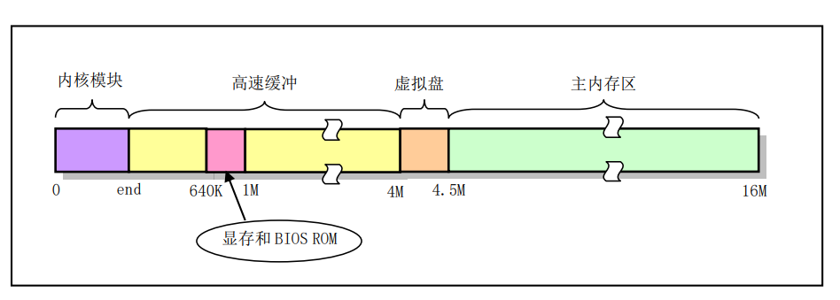
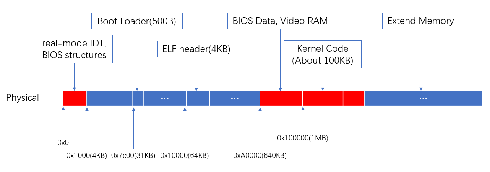
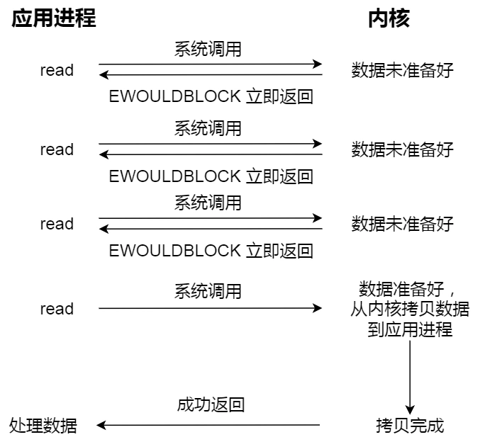
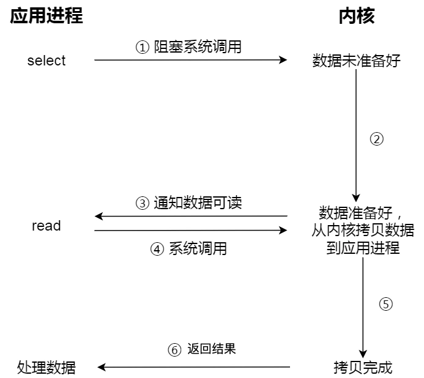
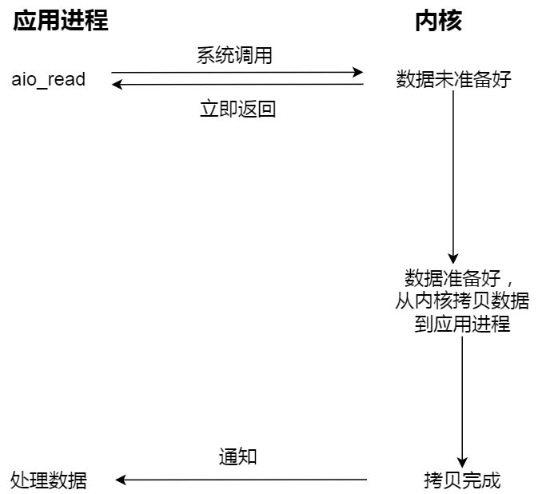
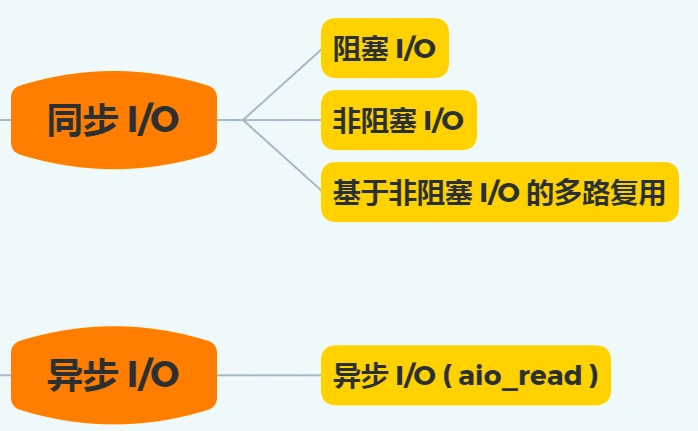
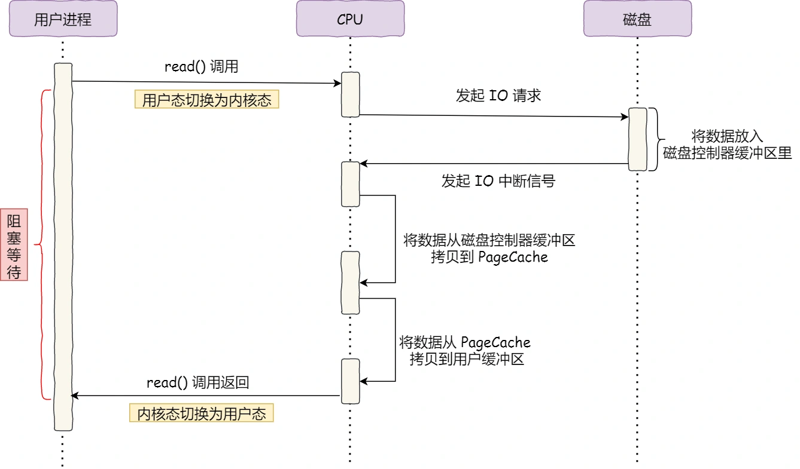
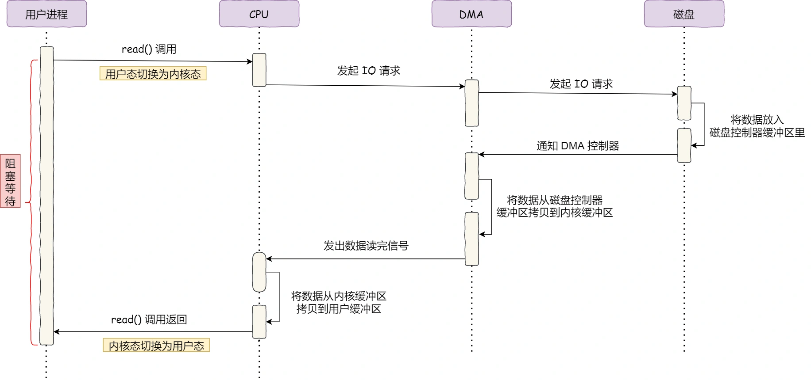

# 1. 磁盘高速缓冲区（内核缓存 Page Cache）

Page Cache 在操作系统的逻辑架构上是位于内核和其他IO设备之间的，为了访问块设备上文件系统中的数据，内核可以每次都访问块设备，进行读或写操作。但是每次 I/O 操作的时间与内存和 CPU 的处理速度相比是非常慢的。为了提高系统的性能，内核就在内存中开辟了一个高速数据缓冲区（池）（Page Cache），并将其划分成一个个与磁盘数据块大小相等的缓冲块来使用和管理，以期减少访问块设备的次数。

所以在实际物理结构中，Page Cache 存在于物理内存中，而具体的位置不清楚，不过我在网上找到了一张图：

这张图应该是早期Linux0.11的内存布局图，对比我自己实现的xv6系统：

上图中红色为已使用内存，蓝色为未使用内存。所以我猜测实现了磁盘高速缓冲区的系统应该会在加载完内核后，按顺序从空闲的内存块中截取一定量的内存作为Page Cache，并且在内核中实现相应的数据结构来管理它。

现在的问题是，选择哪些磁盘数据拷贝到内存呢？

我们都知道程序运行的时候，具有「局部性」，所以通常，刚被访问的数据在短时间内再次被访问的概率很高，于是我们可以用 PageCache 来缓存最近被访问的数据，当空间不足时淘汰最久未被访问的缓存。

所以，读磁盘数据的时候，优先在 PageCache 找，如果数据存在则可以直接返回；如果没有，则从磁盘中读取，然后缓存 PageCache 中。

还有一点，读取磁盘数据的时候，需要找到数据所在的位置，但是对于机械磁盘来说，就是通过磁头旋转到数据所在的扇区，再开始「顺序」读取数据，但是旋转磁头这个物理动作是非常耗时的，为了降低它的影响，PageCache 使用了「预读功能」。

比如，假设 read 方法每次只会读 32 KB 的字节，虽然 read 刚开始只会读 0 ～ 32 KB 的字节，但内核会把其后面的 32～64 KB 也读取到 PageCache，这样后面读取 32～64 KB 的成本就很低，如果在 32～64 KB 淘汰出 PageCache 前，进程读取到它了，收益就非常大。

所以，PageCache 的优点主要是两个：

* 缓存最近被访问的数据；
* 预读功能；

这两个做法，将大大提高读写磁盘的性能。

## 1.1 读写大文件

在读取大文件（GB 级别的文件）的时候，PageCache 会不起作用。这是因为如果你有很多 GB 级别文件需要读取，每当用户访问这些大文件的时候，内核就会把它们载入 PageCache 中，于是 PageCache 空间很快被这些大文件占满。

另外，由于文件太大，可能某些部分的文件数据被再次访问的概率比较低，这样就会带来 2 个问题：

* PageCache 由于长时间被大文件占据，其他「热点」的小文件可能就无法充分使用到 PageCache，于是这样磁盘读写的性能就会下降了；（考虑一个场景，一个进程在读取大文件的过程中其他进程读取了一个小文件，虽然这个小文件被缓存到了Page Cache中，但是会很快被置换出去。等短时间内再次读取这个小文件时还是得去磁盘中找。）
* PageCache 中的大文件数据，由于没有享受到缓存带来的好处，但却多拷贝到 PageCache 一次；（因为可以直接拷贝到磁盘的，有了Page Cache反而多拷贝到了内存中一次。）

所以，针对大文件的传输，不应该使用 PageCache，而应该使用没有缓冲区的异步 IO 。（有一个说法是，大部分异步 IO 都是直接 IO，不会使用 Page Cache）

# 2. 文件I/O

文件的读写方式各有千秋，对于文件的 I/O 分类也非常多，常见的有

* 缓冲与非缓冲 I/O
* 直接与非直接 I/O
* 阻塞与非阻塞 I/O VS 同步与异步 I/O

接下来，分别对这些分类讨论讨论。

## 2.1 缓冲与非缓冲I/O

文件操作的标准库是可以实现数据的缓存，那么根据「是否利用标准库缓冲」，可以把文件 I/O 分为缓冲 I/O 和非缓冲 I/O：

* 缓冲 I/O，利用的是标准库的缓存实现文件的加速访问，而标准库再通过系统调用访问文件。
* 非缓冲 I/O，直接通过系统调用访问文件，不经过标准库缓存。

这里所说的「缓冲」特指**标准库内部**实现的缓冲（也就是用户层面下实现的缓冲区，区别前面的Page Cache，Page Cache 是内核层面实现的缓存）。

无缓存IO操作数据流向路径：数据——内核缓存区——磁盘

标准IO操作数据流向路径：数据——流缓存区——内核缓存区——磁盘

举个例子：如果你要写入数据到文件上时（就是写入磁盘上），内核先将数据写入到内核中所设的缓冲储存器，假如这个缓冲储存器的长度是100个字节，你调用系统函 write 写操作时，设每次写入长 10 个字节，那么你要调用10次这个函数才能把这个缓冲区写满，此时数据还是在缓冲区，并没有写入到磁盘，缓冲区满时才进行实际上的IO操作，把数据写入到磁盘上，这个就是非缓冲IO；

而缓冲IO是在用户层建立另一个缓存区（用户层缓存区或者叫流缓存），假设流缓存的长度是 50 字节，我们用标准C库函数的 fwrite() 将数据写入到这个流缓存区里面，流缓存区满 50 字节后再调用系统函数 write 将数据写入到内核缓冲区里，这里只调用了 2 次系统函数，省去了很多上下文切换。

## 2.2 直接与非直接 I/O （Page Cache）

我们都知道磁盘 I/O 是非常慢的，所以 Linux 内核为了减少磁盘 I/O 次数，在系统调用后，会把用户数据拷贝到内核中缓存起来，这个内核缓存空间也就是「页缓存」（Page Cache，也称磁盘高速缓存）。

那么，根据「是否利用操作系统的缓存」，可以把文件 I/O 分为直接 I/O 与非直接 I/O：

* 直接 I/O，不会发生内核缓存和用户程序之间数据复制，而是直接经过文件系统访问磁盘。
* 非直接 I/O，读操作时，数据从内核缓存中拷贝给用户程序，写操作时，数据从用户程序拷贝给内核缓存，再由内核决定什么时候写入数据到磁盘。

如果你在使用文件操作类的系统调用函数时，指定了 O_DIRECT 标志，则表示使用直接 I/O。如果没有设置过，默认使用的是非直接 I/O。

如果用了非直接 I/O 进行写数据操作，内核什么情况下才会把缓存数据写入到磁盘？

以下几种场景会触发内核缓存的数据写入磁盘：

* 在调用 write 的最后，当发现内核缓存的数据太多的时候，内核会把数据写到磁盘上；
* 用户主动调用 sync，内核缓存会刷到磁盘上；
* 当内存十分紧张，无法再分配页面时，也会把内核缓存的数据刷到磁盘上；
* 内核缓存的数据的缓存时间超过某个时间时，也会把数据刷到磁盘上；

## 2.3 阻塞与非阻塞 I/O VS 同步与异步 I/O

为什么把阻塞 / 非阻塞与同步与异步放一起说的呢？因为它们确实非常相似，也非常容易混淆，不过它们之间的关系还是有点微妙的。

先来看看阻塞 I/O，当用户程序执行 read ，线程会被阻塞，一直等到内核数据准备好，并把数据从内核缓冲区拷贝到应用程序的缓冲区中，当拷贝过程完成，read 才会返回。

注意，阻塞等待的是「内核数据准备好」和「数据从内核态拷贝到用户态」这两个过程。过程如下图：

知道了阻塞 I/O ，来看看非阻塞 I/O，非阻塞的 read 请求在数据未准备好的情况下立即返回，可以继续往下执行，此时应用程序不断轮询内核，直到数据准备好，内核将数据拷贝到应用程序缓冲区，read 调用才可以获取到结果。过程如下图：

注意，这里最后一次 read 调用，获取数据的过程，是一个同步的过程，是需要等待的过程。这里的同步指的是内核态的数据拷贝到用户程序的缓存区这个过程。

举个例子，访问管道或 socket 时，如果设置了 O_NONBLOCK 标志，那么就表示使用的是非阻塞 I/O 的方式访问，而不做任何设置的话，默认是阻塞 I/O。

应用程序每次轮询内核的 I/O 是否准备好，感觉有点傻乎乎，因为轮询的过程中，应用程序啥也做不了，只是在循环。

为了解决这种傻乎乎轮询方式，于是 I/O 多路复用技术就出来了，如 select、poll，它是通过 I/O 事件分发，当内核数据准备好时，再以事件通知应用程序进行操作。

这个做法大大改善了应用进程对 CPU 的利用率，在没有被通知的情况下，应用进程可以使用 CPU 做其他的事情。

下图是使用 select I/O 多路复用过程。注意，read 获取数据的过程（数据从内核态拷贝到用户态的过程），也是一个同步的过程，需要等待：

实际上，无论是阻塞 I/O、非阻塞 I/O，还是基于非阻塞 I/O 的多路复用都是同步调用。因为它们在 read 调用时，内核将数据从内核空间拷贝到应用程序空间，过程都是需要等待的，也就是说这个过程是同步的，如果内核实现的拷贝效率不高，read 调用就会在这个同步过程中等待比较长的时间。

而真正的异步 I/O 是「内核数据准备好」和「数据从内核态拷贝到用户态」这两个过程都不用等待。

当我们发起 aio_read 之后，就立即返回，内核自动将数据从内核空间拷贝到应用程序空间，这个拷贝过程同样是异步的，内核自动完成的，和前面的同步操作不一样，应用程序并不需要主动发起拷贝动作。过程如下图：

下面这张图，总结了以上几种 I/O 模型：

在前面我们知道了，I/O 是分为两个过程的：

数据准备的过程
数据从内核空间拷贝到用户进程缓冲区的过程
阻塞 I/O 会阻塞在「过程 1 」和「过程 2」，而非阻塞 I/O 和基于非阻塞 I/O 的多路复用只会阻塞在「过程 2」，所以这三个都可以认为是同步 I/O。

异步 I/O 则不同，「过程 1 」和「过程 2 」都不会阻塞。

思考一下，那如果内核没有实现缓冲区呢？

内核没有实现缓冲区，也就是使用直接 IO，调用 read 时内核会直接把数据从磁盘拷贝到用户进程缓冲区。所以，上述中的过程 1 就不再存在，阻塞 IO 和非阻塞 IO 都会阻塞在过程 2 ，而异步 IO 不会阻塞。

# 3. 直接内存访问（Direct Memory Access DMA）

磁盘可以说是计算机系统最慢的硬件之一，读写速度相差内存 10 倍以上，所以针对优化磁盘的技术非常的多，比如零拷贝、直接 I/O、异步 I/O 等等，这些优化的目的就是为了提高系统的吞吐量，另外操作系统内核中的磁盘高速缓存区，可以有效的减少磁盘的访问次数。

在没有 DMA 技术前，I/O 的过程是这样的：

* CPU 发出对应的指令给磁盘控制器，然后返回；
* 磁盘控制器收到指令后，于是就开始准备数据，会把数据放入到磁盘控制器的内部缓冲区中，然后产生一个中断；
* CPU 收到中断信号后，停下手头的工作，接着把磁盘控制器的缓冲区的数据一次一个字节地读进自己的寄存器，然后再把寄存器里的数据写入到内存，**而在数据传输的期间 CPU 是无法执行其他任务的**。

可以看到，整个数据的传输过程，都要需要 CPU 亲自参与搬运数据的过程，而且这个过程，CPU 是不能做其他事情的。

简单的搬运几个字符数据那没问题，但是如果我们用千兆网卡或者硬盘传输大量数据的时候，都用 CPU 来搬运的话，肯定忙不过来。

计算机科学家们发现了事情的严重性后，于是就发明了 DMA 技术，也就是直接内存访问（Direct Memory Access） 技术。

什么是 DMA 技术？简单理解就是，在进行 I/O 设备和内存的数据传输的时候，数据搬运的工作全部交给 DMA 控制器，而 CPU 不再参与任何与数据搬运相关的事情，这样 CPU 就可以去处理别的事务。

那使用 DMA 控制器进行数据传输的过程究竟是什么样的呢？下面我们来具体看看。

具体过程：

* 用户进程调用 read 方法，向操作系统发出 I/O 请求，请求读取数据到自己的内存缓冲区中，进程进入阻塞状态；
* 操作系统收到请求后，进一步将 I/O 请求发送 DMA，然后让 CPU 执行其他任务；
* DMA 进一步将 I/O 请求发送给磁盘；
* 磁盘收到 DMA 的 I/O 请求，把数据从磁盘读取到磁盘控制器的缓冲区中，当磁盘控制器的缓冲区被读满后，向 DMA 发起中断信号，告知自己缓冲区已满；
* DMA 收到磁盘的信号，将磁盘控制器缓冲区中的数据拷贝到内核缓冲区中，此时不占用 CPU，CPU 可以执行其他任务；
* 当 DMA 读取了足够多的数据，就会发送中断信号给 CPU；
* CPU 收到 DMA 的信号，知道数据已经准备好，于是将数据从内核拷贝到用户空间，系统调用返回；

可以看到， 整个数据传输的过程，CPU 不再参与数据搬运的工作，而是全程由 DMA 完成，但是 CPU 在这个过程中也是必不可少的，因为传输什么数据，从哪里传输到哪里，都需要 CPU 来告诉 DMA 控制器。

早期 DMA 只存在在主板上，如今由于 I/O 设备越来越多，数据传输的需求也不尽相同，所以每个 I/O 设备里面都有自己的 DMA 控制器。

发表一点看法：以上说的都是基于非直接IO

