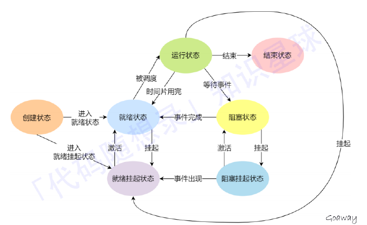

先明确一点，操作系统是一个抽象的概念，就像C++中的类一样。操作系统中各种细分的概念（进程、线程和文件系统等）都是一个general的概念，具体的实现可以有很多不同的方式。在复习这块内容的时候要把抽象的概念和xv6中具体的实现结合起来。

# 1. 什么是操作系统

操作系统位于硬件资源之上，管理硬件资源; 应⽤程序之下，为应⽤程序提供服务，同时管理应⽤程序

## 1、资源分配，资源回收

计算机必要的硬件资源⽆⾮就是 CPU、内存、硬盘、I/O设备。⽽这些资源总是有限的，因此需要有效管理，资源管理最终只有两个问题：资源分配、资源回收。

资源分配： 体现在CPU上，⽐如进程调度，多个进程同时请求CPU下，应该给哪⼀个进程呢？再⽐如内存分配，内存不够了怎么办？A进程⾮法访问了B进程的内存地址怎么办？内存内、外碎⽚问题等。

资源回收： 考虑内存回收后的合并等等。

## 2、为应⽤程序提供服务

操作系统将硬件资源的操作封装起来，提供相对统⼀的接⼝（系统调⽤）供开发者调⽤。如果没有操作系统，应⽤程序将直接⾯对硬件，除去给开发者带来的编程困难不说，直接访问硬件，使⽤不当极有可能直接损坏硬件资源。

## 3、管理应⽤程序

即控制进程的⽣命周期：进程开始时的环境配置和资源分配、进程结束后的资源回收、进程调度等。

# 2. 进程

## 2.1 进程的概念

我们编译的代码可执⾏⽂件只是储存在硬盘的静态⽂件，运⾏时被加载到内存，CPU执⾏内存中指令，这个运⾏的程序被称为进程。

进程是对运⾏时程序的封装，操作系统进⾏资源调度和分配的基本单位。

## 2.2 进程的实现--进程表(就是xv6中的ENV结构体)

为了实现进程模型，操作系统维护着⼀张表格(⼀个结构数组)，即进程表。

每个进程占有⼀个进程表项。(有些著作称这些为进程控制块)，该表项包含了⼀个进程状态的重要信息

包括程序计数器、堆栈指针、内存分配状况、所打开⽂件的状态、账号的调度信息，以及其他在进程由运⾏态转换到就绪态或阻塞态时必须保存的信息，从⽽保证该进程随后能再次启动，就像从未中断过⼀样

进程表项是进程存在的唯⼀标识，其包括以下信息：
1. 进程描述信息： 进程标识符、⽤户标识符等;
2. 进程控制和管理信息： 进程状态，进程优先级等;
3. 进程资源分配清单： 虚拟内存地址空间信息，打开⽂件列表，IO设备信息等;
4. CPU相关信息： 当进程切换时，CPU寄存器的值都被保存在相应PCB中，以便CPU重新执⾏该进程时能从断点处继续执⾏;

## 2.3 并发与并行

1. 单个核⼼在很短时间内分别执⾏多个进程，称为并发
2. 多个核⼼同时执⾏多个进程称为并⾏
3. 对于并发来说，CPU需要从⼀个进程切换到另⼀个进程，这个过程需要保存进程的状态信息

## 2.4 进程的状态

除了创建和结束，程序基本有三个状态：（三状态和五状态）

运⾏态： 该时刻进程占⽤CPU

就绪态： 可运⾏，由于其他进程处于运⾏状态⽽暂时停⽌运⾏

阻塞态： 该进程正在等待某⼀事件发⽣（如等待输⼊/输出操作的完成）⽽暂时停⽌运⾏

特点：

1. 就绪态和运⾏态可以相互转换，其它的都是单向转换。就绪态的进程通过调度算法从⽽获得CPU 时间，转为运⾏状态；
2. 运⾏态的进程，在分配给它的 CPU 时间⽚⽤完之后就会转为就绪状态，等待下⼀次调度。
3. 阻塞态是缺少需要的资源从⽽由运⾏态转换⽽来，但是该资源不包括 CPU 时间，缺少CPU 时间会从运⾏态转换为就绪态。
   
其中就绪态和阻塞态还可以细分：

⽐如read系统调⽤阻塞，进程会占⽤内存空间，这是⼀种浪费⾏为，于是操作系统会跟内存管理中物理⻚置换到磁盘⼀样的⾏为，把阻塞的进程置换到磁盘中，此时进程未占⽤物理内存，我们称之为挂起;



# 3. 进程切换为何⽐线程慢

涉及到虚拟内存的问题，进程切换涉及虚拟地址空间的切换⽽线程不会。因为每个进程都有⾃⼰的虚拟地址空间，⽽线程是共享所在进程的虚拟地址空间的，所以同⼀个进程中的线程进⾏线程切换时不涉及虚拟地址空间的转换。

把虚拟地址转换为物理地址需要查找⻚表，⻚表查找是⼀个很慢的过程（⾄少访问2次内存），因此通常使⽤Cache来缓存常⽤的地址映射，这样可以加速⻚表查找，这个cache就是TLB（快表）。

由于每个进程都有⾃⼰的虚拟地址空间，那么显然每个进程都有⾃⼰的⻚表，那么当进程切换后⻚表也要进⾏切换，⻚表切换后TLB就失效了，cache失效导致命中率降低，那么虚拟地址转换为物理地址就会变慢，表现出来的就是程序运⾏会变慢，⽽线程切换则不会导致TLB失效，因为线程线程⽆需切换地址空间，这也就是进程切换要⽐同进程下线程切换慢的原因。

# 4. 守护进程

守护进程是指在后台运⾏的，没有控制终端与它相连的进程。它独⽴于控制终端，周期性地执⾏某种任务。

Linux的⼤多数服务器就是⽤守护进程的⽅式实现的，如web服务器进程http等。

# 5. 僵尸进程

多进程程序，⽗进程⼀般需要跟踪⼦进程的退出状态，当⼦进程退出，⽗进程在运⾏，⼦进程必须等到⽗进程捕获到了⼦进程的退出状态才真正结束。在⼦进程结束后，⽗进程读取状态前，此时⼦进程为僵⼫进程。

设置僵⼫进程的⽬的是维护⼦进程的信息，以便⽗进程在以后某个时候获取。这些信息⾄少包括进程ID，进程的终⽌状态，以及该进程使⽤的CPU时间。

所以当终⽌⼦进程的⽗进程调⽤wait或waitpid时就可以得到这些信息。但是⼦进程停⽌在僵⼫态会占据内核资源，所以需要避免僵⼫进程的产⽣或⽴即结束⼦进程的僵⼫态。

## 如何避免僵尸进程

1. 最简单的⽅法:⽗进程通过 wait() 和 waitpid() 等函数等待⼦进程结束，但是，这会导致⽗进程挂起;
2. 如果⽗进程要处理的事情很多，不能够挂起，通过 signal() 函数⼈为处理信号SIGCHLD:只要有⼦进程退出⾃动调⽤指定好的回调函数，因为⼦进程结束后， ⽗进程会收到该信号SIGCHLD ，可以在其回调函数⾥调⽤ wait() 或 waitpid() 回收;
3. 如果⽗进程不关⼼⼦进程什么时候结束，那么可以⽤signal（SIGCHLD, SIG_IGN）通知内核:⾃⼰对⼦进程的结束不感兴趣，⽗进程忽略此信号，那么⼦进程结束后，内核会回收，并不再给⽗进程发送信号;

# 6. 多进程

进程结构由以下⼏个部分组成：代码段、堆栈段、数据段。代码段是静态的⼆进制代码，多个程序可以共享。

⽗进程创建⼦进程之后，⽗、⼦进程除了pid外，⼏乎所有的部分⼏乎⼀样。⽗、⼦进程共享全部数据，⼦进程在写数据时会使⽤写时复制技术将公共的数据重新拷⻉⼀份，之后在拷⻉出的数据上进⾏操作；不是对同⼀块数据进⾏操作；

如果⼦进程想要运⾏⾃⼰的代码段，还可以通过调⽤execv()函数重新加载新的代码段，之后就和⽗进程独⽴开了。

# 7. 进程调度算法

## 批处理系统中的调度

**先来先服务**

⾮抢占式的调度算法，按照请求的顺序进⾏调度。有利于⻓作业，但不利于短作业，因为短作业必须⼀直等待前⾯的⻓作业执⾏完毕才能执⾏，⽽⻓作业⼜需要执⾏很⻓时间，造成了短作业等待时间过⻓。

**最短作业优先**

⾮抢占式的调度算法，按估计运⾏时间最短的顺序进⾏调度。⻓作业有可能会饿死，处于⼀直等待短作业执⾏完毕的状态。因为如果⼀直有短作业到来，那么⻓作业永远得不到调度。

**最短剩余时间优先**

最短作业优先的抢占式版本，按剩余运⾏时间的顺序进⾏调度。当⼀个新的作业到达时，其整个运⾏时间与当前进程的剩余时间作⽐较。如果新的进程需要的时间更少，则挂起当前进程，运⾏新的进程。否则新的进程等待。

## 交互式系统中的调度

**时间片轮转调度**

将所有就绪进程按 先来先服务（FCFS） 的原则排成⼀个队列，每次调度时，把 CPU 时间分配给队⾸进程，该进程可以执⾏⼀个时间⽚。当时间⽚⽤完时，由计时器发出时钟中断，调度程序便停⽌该进程的执⾏，并将它送往就绪队列的末尾，同时继续把 CPU 时间分配给队⾸的进程。

**优先级调度**

为每个进程分配⼀个优先级，按优先级进⾏调度。为了防⽌低优先级的进程永远等不到调度，可以随着时间的推移增加等待进程的优先级

**多级队列**

⼀个进程需要执⾏ 100 个时间⽚，如果采⽤时间⽚轮转调度算法，那么需要交换 100 次。多级队列是为这种需要连续执⾏多个时间⽚的进程考虑，它设置了多个队列，每个队列时间⽚⼤⼩都不同，例如 1,2,4,8,..。进程在第⼀个队列没执⾏完，就会被移到下⼀个队列。这种⽅式下，之前的进程只需要交换 7 次。

每个队列优先权也不同，最上⾯的优先权最⾼。因此只有上⼀个队列没有进程在排队，才能调度当前队列上的进程。

可以将这种调度算法看成是时间⽚轮转调度算法和优先级调度算法的结合。

**最短进程优先**

如果我们将每⼀条命令的执⾏看作是⼀个独⽴的“作业”，则我们可以通过⾸先运⾏最短的作业来使响应事件最短

# 8. 进程通信

⽆名管道、有名管道、信号、消息队列、共享内存、信号量

## 8.1 无名管道

**特点**

1. 半双⼯，数据在同⼀时刻只能在⼀个⽅向上流动
2. 数据只能从管道的⼀端写⼊，从另⼀端读出
3. 写⼊管道中的数据遵循先⼊先出的规则
4. 管道所传送的数据是⽆格式的，这要求管道的读出⽅与写⼊⽅必须事先约定好数据的格式，如多少字节算⼀个消息等
5. 管道不是普通的⽂件，不属于某个⽂件系统，其只存在于内存中
6. 管道在内存中对应⼀个缓冲区。不同的系统其⼤⼩不⼀定相同
7. 从管道读数据是⼀次性操作，数据⼀旦被读⾛，它就从管道中被抛弃，释放空间以便写更多的数据
8. 管道没有名字，只能在具有公共祖先的进程（⽗进程与⼦进程，或者两个兄弟进程，具有亲缘关系）之间使⽤
9. 存在阻塞⽅式

**pipe函数**

```javascript
#include <unistd.h>
/**
* 创建无名管道
* @param pipefd 为int型数组的首地址，其存放了管道的文件描述符
* pipefd[0]、pipefd[1]
* @return 创建成功返回0，创建失败返回-1
*/
int pipe(int pipefd[2]);
/**
* 当一个管道建立时，它会创建两个文件描述符 fd[0] 和 fd[1]. 其中
* fd[0] 固定用于读管道，而 fd[1] 固定用于写管道。
* 一般文件 I/O 的函数都可以用来操作管道(lseek() 除外)
*/
```

**读写管道四种进程情况**

第一种：

1. 如果写端没有关闭，管道中没有数据，这个时候读管道进程去读管道会阻塞;
2. 如果写段没有关闭，管道中有数据，这个时候读管道进程就会将数据读出来，下⼀次读没有数据就会阻塞;

第二种：

管道所有的写端关闭，读进程去读管道的内容，读取全部内容，最后返回0;

第三种：

所有读端没有关闭，如果管道被写满了，写管道进程写管道会被阻塞;

第四种：

所有的读端被关闭，写管道进程写管道会收到⼀个信号，然后退出。

**读管道**

管道中有数据：read返回实际读到的字节数

管道中⽆数据:
1. 管道写端被全部关闭，read返回0 (相当于读到⽂件结尾)
2. 写端没有全部被关闭，read阻塞等待(不久的将来可能有数据递达，此时会让出cpu)

**写管道**

管道读端全部被关闭：进程异常终⽌(也可使⽤捕捉SIGPIPE信号，使进程终⽌);

管道读端没有全部关闭：
1. 管道已满，write阻塞
2. 管道未满，write将数据写⼊，并返回实际写⼊的字节数

**查看管道缓冲区**

```javascript
/**
 * 该函数可以通过 name 参数查看不同的属性值
 * @param fd 文件描述符
 * @param name _PC_PIPE_BUF, 查看管道缓冲区大小
 * _PC_NAME_MAX, 文件名字字节数的上限
 * @return 成功：name 的值决定返回值的意义；失败：返回-1

long fpathconf(int fd, int name);
```

**设置为非阻塞的方法**

```javascript
// 获取原来的flags
int flags = fcntl(fd[0], F_GETFL);

// 设置新的flags
flag |= O_NONBLOCK;

// flags = flags | O_NONBLOCK
fcntl(fd[0], F_SETFL, flags);
```

## 8.2 命名管道

命名管道（FIFO）不同于⽆名管道之处在于它提供了⼀个路径名与之关联，以 FIFO 的⽂件形式存在于⽂件系统中，这样，即使与 FIFO 的创建进程不存在亲缘关系的进程，只要可以访问该路径，就能够彼此通过 FIFO 相互通信，因此，通过 FIFO 不相关的进程也能交换数据.

**与无名管道不同**

1. FIFO 在⽂件系统中作为⼀个特殊的⽂件⽽存在，但 FIFO 中的内容却存放在内存中;
2. 当使⽤ FIFO 的进程退出后，FIFO ⽂件将继续保存在⽂件系统中以便以后使⽤;
3. FIFO 有名字，不相关的进程可以通过打开命名管道进⾏通信.

**创建有名管道**

```javascript
#include <sys/types.h>
#include <sys/stat.h>

/**
 * 命名创建的管道
 * @param pathname 普通的路径名，也就是创建后 FIFO 的名字
 * @param mode 文件的权限，与打开普通文件的 open() 函数中的 mode 参数相同（0666）
 * @return 成功：0；失败：如果文件已经存在，则会返回-1
 */
int mkfifo(const char *pathname, mode_t mode);
```

**读写管道**

⼀个为只读⽽打开⼀个管道的进程会阻塞直到另外⼀个进程为只写打开该管道;

⼀个为只写⽽打开⼀个管道的进程会阻塞直到另外⼀个进程为只读打开该管道.

读管道：

1. 管道中有数据，read返回实际读到的字节数
2. 管道中⽆数据：
   
   管道写端被全部关闭，read返回0 (相当于读到⽂件结尾);

   写端没有全部被关闭，read阻塞等待.

写管道：

1. 管道读端全部被关闭， 进程异常终⽌(也可使⽤捕捉SIGPIPE信号，使进程终⽌);
2. 管道读端没有全部关闭：
   
   管道已满，write阻塞;
   管道未满，write将数据写⼊，并返回实际写⼊的字节数。

## 8.3 共享存储映射

存储映射I/O (Memory-mapped I/O) 使⼀个磁盘⽂件与存储空间中的⼀个缓冲区相映射.于是当从缓冲区中取数据，就相当于读⽂件中的相应字节。于此类似，将数据存⼊缓冲区，则相应的字节就⾃动写⼊⽂件。

这样，就可在不适⽤read和write函数的情况下，使⽤地址（指针）完成I/O操作，进程就可以直接通过读写内存来操作⽂件.

共享内存可以说是最有⽤的进程间通信⽅式，也是最快的IPC形式, 因为进程可以直接读写内存，⽽不需要任何数据的拷⻉.

## 8.4 消息队列

**基本原理**

A 进程要给 B 进程发送消息，A 进程把数据放在对应的消息队列后就可以正常返回了，B 进程需要的时候再去读取数据就可以了。

**特点**

1. 消息队列是保存在内核中的消息链表，每个消息体都是固定⼤⼩的存储块。如果进程从消息队列中读取了消息体，内核就会把这个消息体删除。
2. 如果没有释放消息队列或者没有关闭操作系统，消息队列会⼀直存在。
   
**缺点**

1. 通信不及时，附件也有⼤⼩限制。
2. 消息队列不适合⽐较⼤数据的传输，每个消息体都有⼀个最⼤⻓度的限制，同时所有队列所包含的全部消息体的总⻓度也是有上限
3. 消息队列通信过程中，存在⽤户态与内核态之间的数据拷⻉开销

## 8.5 信号

信号是linux进程通信的最古⽼的⽅式;

信号是软件中断，它是在软件层次上对中断机制的⼀种模拟，是⼀种异步通信的⽅式 。信号可以导致⼀个正在运⾏的进程被另⼀个正在运⾏的异步进程中断，转⽽处理某⼀个突发事件;

信号可以直接进⾏⽤户空间进程和内核空间进程的交互，内核进程可以利⽤它来通知⽤户空间进程发⽣了哪些系统事件.

**信号的特点**

1. 简单
2. 不能携带大量信息
3. 满⾜某个特定条件才发送

**信号编号**

不存在编号为0的信号：

1. 其中1-31号信号称之为常规信号（也叫普通信号或标准信号）
2. 34-64称之为实时信号，驱动编程与硬件相关。名字上区别不⼤。⽽前32个名字各不相同
   
⽐较重要的⼀些，需要记住的⼏个信号：

1. SIGINT 当⽤户按下了<Ctrl+C>组合键时，⽤户终端向正在运⾏中的由该终端启动的程序发出此信号，终⽌进程
2. SIGQUIT ⽤户按下<ctrl+>组合键时产⽣该信号，⽤户终端向正在运⾏中的由该终端启动的程序发出些信号,终⽌进程
3. SIGSEGV 指示进程进⾏了⽆效内存访问(段错误), 终⽌进程并产⽣core⽂件
4. SIGPIPE Broken pipe向⼀个没有读端的管道写数据,终⽌进程
5. SIGCHLD ⼦进程结束时，⽗进程会收到这个信号,忽略这个信号

**信号的状态**

产⽣：
1. 当⽤户按某些终端键时，将产⽣信号
2. 硬件异常将产⽣信号
3. 软件异常将产⽣信号
4. 调⽤系统函数(如：kill、raise、abort)将发送信号
5. 运⾏ kill /killall命令将发送信号
   
未决状态：没有被处理

递达状态：信号被处理了

**阻塞信号集和未决信号集**

阻塞信号集：

将某些信号加⼊集合，对他们设置屏蔽，当屏蔽x信号后，再收到该信号，该信号的处理将推后(处理发⽣在解除屏蔽后)

未决信号集合：

信号产⽣，未决信号集中描述该信号的位⽴刻翻转为1，表示信号处于未决状态。当信号被处理对应位翻转回为0。这⼀时刻往往⾮常短暂.

# 9. 不可重⼊、可重⼊函数

如果有⼀个函数不幸被设计成为这样：不同任务调⽤这个函数时可能修改其他任务调⽤这个函数的数据，从⽽导致不可预料的后果。

这样的函数是不安全的函数，也叫不可重入函数;

**不可重⼊函数**

1. 函数体内使⽤了静态的数据结构;
2. 函数体内调⽤了malloc() 或者 free() 函数(谨慎使⽤堆);
3. 函数体内调⽤了标准 I/O 函数;

**可重入函数**

1. 所谓可重入是指⼀个可以被多个任务调⽤的过程，任务在调⽤时不必担⼼数据是否会出错;
2. 在写函数时候尽量使⽤局部变量（例如寄存器、栈中的变量）;
3. 对于要使⽤的全局变量要加以保护（如采取关中断、信号量等互斥⽅法），这样构成的函数就⼀定是⼀个可重入的函数.


