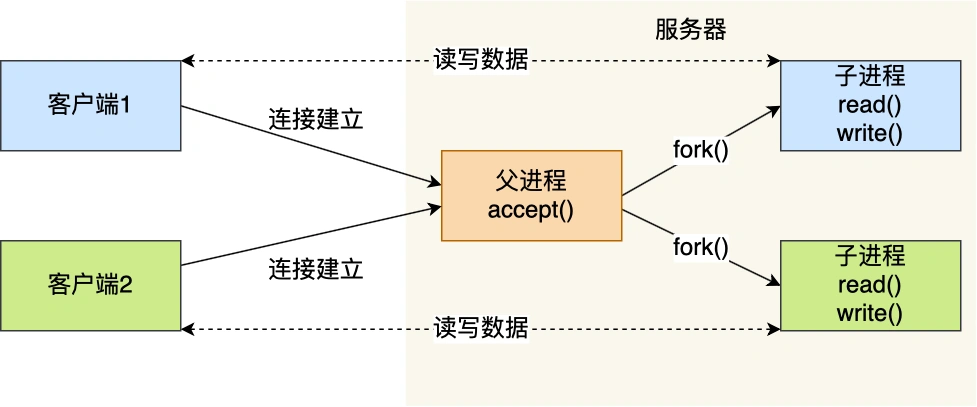

# 1. 

通过这张图你可以看到，用户空间内存，从低到高分别是 6 种不同的内存段：

程序文件段（.text），包括二进制可执行代码；
已初始化数据段（.data），包括静态常量；
未初始化数据段（.bss），包括未初始化的静态变量；
堆段，包括动态分配的内存，从低地址开始向上增长；
文件映射段，包括动态库、共享内存等，从低地址开始向上增长（跟硬件和内核版本有关 (opens new window)）；
栈段，包括局部变量和函数调用的上下文等。栈的大小是固定的，一般是 8 MB。当然系统也提供了参数，以便我们自定义大小；
在这 7 个内存段中，堆和文件映射段的内存是动态分配的。比如说，使用 C 标准库的 malloc() 或者 mmap() ，就可以分别在堆和文件映射段动态分配内存。

